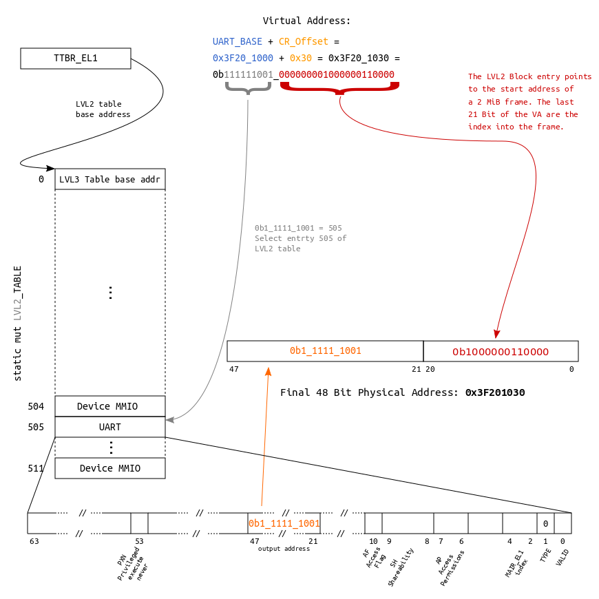

# Tutorial 0D - Virtual Memory

Virtual memory is an immensely complex, but exciting topic. In this first
lesson, we start slow and switch on the MMU and use static page tables. We will
only be concerned about the first `1 GiB` of address space. That is the amount
of `DRAM` the usual Raspberry Pi 3 has. As we already know, the upper `16 MiB`
of this gigabyte-window are occupied by the Raspberry's peripherals such as the
UART.

## MMU and paging theory

At this point, we will not reinvent the wheel again and go into detailed
descriptions of how paging in modern application processors works. The internet
is full of great resources regarding this topic, and we encourage you to read
some of it to get a high-level understanding of the topic.

To follow the rest of this `AArch64` specific tutorial, we strongly recommend
that you stop right here and first read `Chapter 12` of the [ARM Cortex-A Series
Programmer's Guide for
ARMv8-A](http://infocenter.arm.com/help/topic/com.arm.doc.den0024a/DEN0024A_v8_architecture_PG.pdf)
before you continue. This will set you up with all the `AArch64`-specific
knowledge needed to follow along.

Back from reading `Chapter 12` already? Good job :+1:!

## Approach

The following partitioning will be used for the static page tables:
- The first `2 MiB` will be mapped using a Level 3 table with `4 KiB` granule.
  - This aperture includes, among others, the kernel's code, read-only data, and
    mutable data. All of which will be `identity mapped` to make our life easy
    for now.
  - In the past, we already made sure that the linker script aligns the
    respective regions to `4 KiB` boundaries.
    - This way, we can conveniently flag corresponding regions in distinct page
      table entries. E.g. marking the code regions executable, while the mutable
      data regions are not.
- All the rest will be mapped using `2 MiB` granule.

The actual code is divided into two files: `memory.rs` and `memory/mmu.rs`.

### memory.rs

This file is used to describe our kernel's memory layout in a high-level
abstraction using our own descriptor format. We can define ranges of arbitrary
length and set respective attributes, for example if the bits and bytes in this
range should be executable or not.

The descriptors we use here are agnostic of the hardware `MMU`'s actual
descriptors, and we are also agnostic of the paging granule the `MMU` will use.
Having this distinction is less of a technical need and more a convenience
feature for us in order to easily describe the kernels memory layout, and
hopefully it makes the whole concept a bit more graspable for the reader.

The file contains a global `static KERNEL_VIRTUAL_LAYOUT` array which
stores these descriptors. The policy is to only store regions that are **not**
ordinary, normal chacheable DRAM. However, nothing prevents you from defining
those too if you wish to. Here is an example for the device MMIO region:

```rust
// Device MMIO
Descriptor {
    virtual_range: || RangeInclusive::new(map::physical::MMIO_BASE, map::physical::MMIO_END),
    translation: Translation::Identity,
    attribute_fields: AttributeFields {
        mem_attributes: MemAttributes::Device,
        acc_perms: AccessPermissions::ReadWrite,
        execute_never: true,
    },
},
```

Finally, the file contains the following function:

```rust
fn get_virt_addr_properties(virt_addr: usize) -> Result<(usize, AttributeFields), &'static str>
```

It will be used by code in `mmu.rs` to request attributes for a virtual address
and the translation of the address. The function scans `KERNEL_VIRTUAL_LAYOUT`
for a descriptor that contains the queried address, and returns the respective
findings for the first entry that is a hit. If no entry is found, it returns
default attributes for normal chacheable DRAM and the input address, hence
telling the `MMU` code that the requested address should be `identity mapped`.

Due to this default return, it is not needed to define normal cacheable DRAM
regions in `KERNEL_VIRTUAL_LAYOUT`.

### mmu.rs

This file contains the `AArch64` specific code. It is a driver, if you like, and
the split in paging granule mentioned before is hardcoded here (`4 KiB` page
descriptors for the first `2 MiB` and `2 MiB` block descriptors for everything
else).

Two static page table arrays are instantiated, `LVL2_TABLE` and `LVL3_TABLE`,
and they are populated using `get_virt_addr_properties()` and a bunch of utility
functions that convert our own descriptors to the actual `64 bit` descriptor
entries needed by the MMU hardware for the page table arrays.

Each page table has an entry (`AttrIndex`) that indexes into the
[MAIR_EL1](http://infocenter.arm.com/help/index.jsp?topic=/com.arm.doc.ddi0500d/CIHDHJBB.html)
register, which holds information about the cacheability of the respective
page. We currently define normal cacheable memory and device memory (which is
not cached).

```rust
/// Setup function for the MAIR_EL1 register.
fn set_up_mair() {
    // Define the memory types that we will map. Cacheable normal DRAM and
    // device.
    MAIR_EL1.write(
        // Attribute 1
        MAIR_EL1::Attr1_HIGH::Memory_OuterWriteBack_NonTransient_ReadAlloc_WriteAlloc
            + MAIR_EL1::Attr1_LOW_MEMORY::InnerWriteBack_NonTransient_ReadAlloc_WriteAlloc

            // Attribute 0
            + MAIR_EL1::Attr0_HIGH::Device
            + MAIR_EL1::Attr0_LOW_DEVICE::Device_nGnRE,
    );
}
```

Afterwards, the [Translation Table Base Register 0 - EL1](https://docs.rs/crate/cortex-a/2.4.0/source/src/regs/ttbr0_el1.rs) is set up with the base address of the `LVL3_TABLE` and
the [Translation Control Register - EL1](https://docs.rs/crate/cortex-a/2.4.0/source/src/regs/tcr_el1.rs) is
configured.

Finally, the MMU is turned on through the [System Control Register - EL1](https://docs.rs/crate/cortex-a/2.4.0/source/src/regs/sctlr_el1.rs). The last step also enables caching for data and instructions.

## Address translation examples

For educational purposes, in `memory.rs`, a layout is defined which allows to
access the `UART` via two different virtual addresses:
- Since we identity map the whole `Device MMIO` region, it is accessible by
asserting its physical base address (`0x3F20_1000`) after the `MMU` is turned
on.
- Additionally, it is also mapped into the last `4 KiB` entry of the `LVL3`
table, making it accessible through base address `0x001F_F000`.

The following two block diagrams visualize the underlying translations for the
two mappings, accessing the UART's Control Register (`CR`, offset `0x30`).

### Adress translation using a 2 MiB block descriptor



### Adress translation using a 4 KiB page descriptor


## Zero-cost abstraction

The MMU init code is also a good example to see the great potential of Rust's
zero-cost abstractions[[1]](https://blog.rust-lang.org/2015/05/11/traits.html)[[2]](https://ruudvanasseldonk.com/2016/11/30/zero-cost-abstractions) for embedded programming.

Take this piece of code for setting up the `MAIR_EL1` register using the
[cortex-a](https://crates.io/crates/cortex-a) crate:


```rust
/// Setup function for the MAIR_EL1 register.
fn set_up_mair() {
    // Define the memory types that we will map. Cacheable normal DRAM and
    // device.
    MAIR_EL1.write(
        // Attribute 1
        MAIR_EL1::Attr1_HIGH::Memory_OuterWriteBack_NonTransient_ReadAlloc_WriteAlloc
            + MAIR_EL1::Attr1_LOW_MEMORY::InnerWriteBack_NonTransient_ReadAlloc_WriteAlloc

            // Attribute 0
            + MAIR_EL1::Attr0_HIGH::Device
            + MAIR_EL1::Attr0_LOW_DEVICE::Device_nGnRE,
    );
}
```

This piece of code is super expressive, and it makes use of `traits`, different
`types` and `constants` to provide type-safe register manipulation.

In the end, this code sets the first four bytes of the register to certain
values according to the data sheet. Looking at the generated code, we can see
that despite all the type-safety and abstractions, we get super lean code:

```text
00000000000803ac kernel8::memory::mmu::init::h7ef502c5548c1a62:
   ...
   803cc:       88 e0 9f 52     mov     w8, #0xff04
   ...
   803d8:       08 a2 18 d5     msr     MAIR_EL1, x8
```

## Output

```console
ferris@box:~$ make raspboot

[0] UART is live!
[1] Press a key to continue booting... Greetings fellow Rustacean!
[i] MMU: 4 KiB granule supported!
[i] MMU: Up to 40 Bit physical address range supported!
[2] MMU online.

Writing through the virtual mapping at base address 0x00000000001FF000.
```
