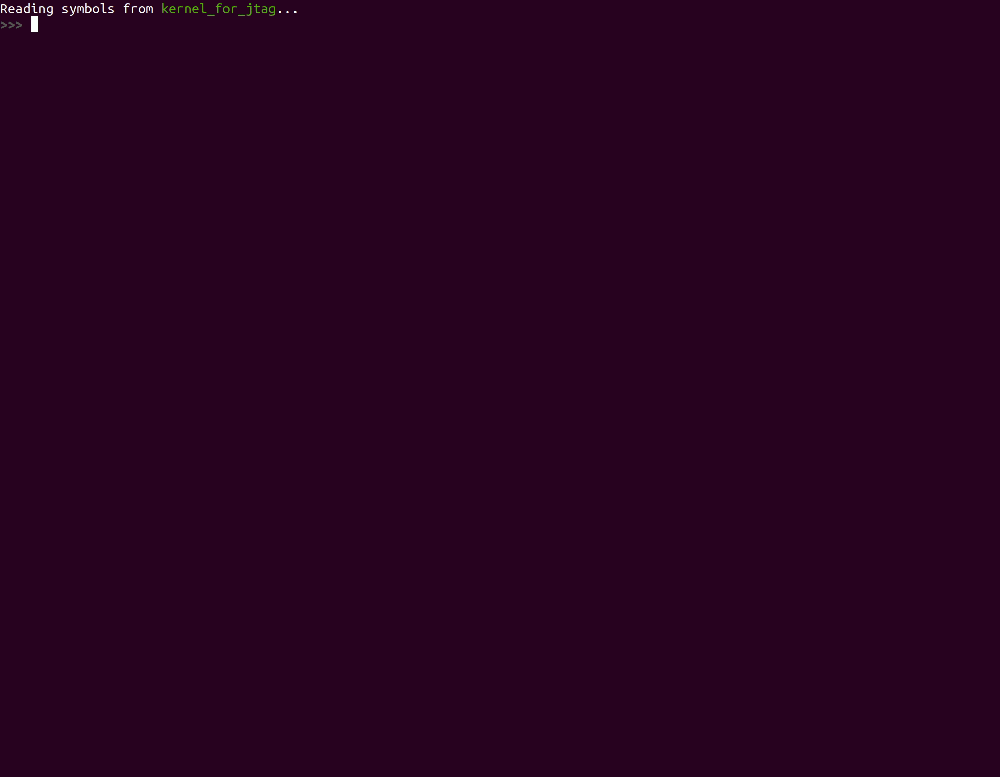

# Tutorial 08 - Hardware Debugging using JTAG

## tl;dr

In the exact order as listed:

1. `make jtagboot` and keep terminal open.
2. Connect USB serial device.
3. Connect `JTAG` debugger USB device.
4. In new terminal, `make openocd` and keep terminal open.
5. In new terminal, `make gdb` or make `make gdb-opt0`.



## Table of Contents

- [Introduction](#introduction)
- [Outline](#outline)
- [Software Setup](#software-setup)
- [Hardware Setup](#hardware-setup)
  * [Wiring](#wiring)
- [Getting ready to connect](#getting-ready-to-connect)
- [OpenOCD](#openocd)
- [GDB](#gdb)
  * [Remarks](#remarks)
    + [Optimization](#optimization)
    + [GDB control](#gdb-control)
- [Notes on USB connection constraints](#notes-on-usb-connection-constraints)
- [Additional resources](#additional-resources)
- [Acknowledgments](#acknowledgments)
- [Diff to previous](#diff-to-previous)

## Introduction

In the upcoming tutorials, we are going to touch sensitive areas of the RPi's SoC that can make our
debugging life very hard. For example, changing the processor's `Privilege Level` or introducing
`Virtual Memory`.

A hardware based debugger can sometimes be the last resort when searching for a tricky bug.
Especially for debugging intricate, architecture-specific HW issues, it will be handy, because in
this area `QEMU` sometimes can not help, since it abstracts certain features of the HW and doesn't
simulate down to the very last bit.

So lets introduce `JTAG` debugging. Once set up, it will allow us to single-step through our kernel
on the real HW. How cool is that?!

## Outline

From kernel perspective, this tutorial is the same as the previous one. We are just wrapping
infrastructure for JTAG debugging around it.

## Software Setup

We need to add another line to the `config.txt` file from the SD Card:

```toml
arm_64bit=1
init_uart_clock=48000000
enable_jtag_gpio=1
```

## Hardware Setup

Unlike microcontroller boards like the `STM32F3DISCOVERY`, which is used in our WG's [Embedded Rust
Book], the Raspberry Pi does not have an embedded debugger on its board. Hence, you need to buy one.

For this tutorial, we will use the [ARM-USB-TINY-H] from OLIMEX. It has a standard [ARM JTAG 20
connector]. Unfortunately, the RPi does not, so we have to connect it via jumper wires.

[Embedded Rust Book]: https://rust-embedded.github.io/book/start/hardware.html
[ARM-USB-TINY-H]: https://www.olimex.com/Products/ARM/JTAG/ARM-USB-TINY-H
[ARM JTAG 20 connector]: http://infocenter.arm.com/help/index.jsp?topic=/com.arm.doc.dui0499dj/BEHEIHCE.html

### Wiring

<table>
    <thead>
        <tr>
            <th>GPIO #</th>
			<th>Name</th>
			<th>JTAG #</th>
			<th>Note</th>
			<th width="60%">Diagram</th>
        </tr>
    </thead>
    <tbody>
        <tr>
            <td></td>
            <td>VTREF</td>
            <td>1</td>
            <td>to 3.3V</td>
            <td rowspan="8"></td>
        </tr>
        <tr>
            <td></td>
            <td>GND</td>
            <td>4</td>
            <td>to GND</td>
        </tr>
        <tr>
            <td>22</td>
            <td>TRST</td>
            <td>3</td>
            <td></td>
        </tr>
        <tr>
            <td>26</td>
            <td>TDI</td>
            <td>5</td>
            <td></td>
        </tr>
        <tr>
            <td>27</td>
            <td>TMS</td>
            <td>7</td>
            <td></td>
        </tr>
        <tr>
            <td>25</td>
            <td>TCK</td>
            <td>9</td>
            <td></td>
        </tr>
        <tr>
            <td>23</td>
            <td>RTCK</td>
            <td>11</td>
            <td></td>
        </tr>
        <tr>
            <td>24</td>
            <td>TDO</td>
            <td>13</td>
            <td></td>
        </tr>
    </tbody>
</table>

<p align="center"></p>

## Getting ready to connect

Upon booting, thanks to the changes we made to `config.txt`, the RPi's firmware will configure the
respective GPIO pins for `JTAG` functionality.

What is left to do now is to pause the execution of the RPi and then connect
over `JTAG`. Therefore, we add a new `Makefile` target, `make jtagboot`, which
uses the `chainboot` approach to load a tiny helper binary onto the RPi that
just parks the executing core into a waiting state.

The helper binary is maintained separately in this repository's [X1_JTAG_boot] folder, and is a
modified version of the kernel we used in our tutorials so far.

[X1_JTAG_boot]: ../X1_JTAG_boot

```console
$ make jtagboot
Minipush 1.0

[MP] ⏳ Waiting for /dev/ttyUSB0
[MP] ✅ Serial connected
[MP] 🔌 Please power the target now
 __  __ _      _ _                 _
|  \/  (_)_ _ (_) |   ___  __ _ __| |
| |\/| | | ' \| | |__/ _ \/ _` / _` |
|_|  |_|_|_||_|_|____\___/\__,_\__,_|

           Raspberry Pi 3

[ML] Requesting binary
[MP] ⏩ Pushing 7 KiB ==========================================🦀 100% 0 KiB/s Time: 00:00:00
[ML] Loaded! Executing the payload now

[    0.394532] Parking CPU core. Please connect over JTAG now.
```

It is important to keep the USB serial connected and the terminal with the `jtagboot` open and
running. When we load the actual kernel later, `UART` output will appear here.

## OpenOCD

Next, we need to launch the [Open On-Chip Debugger], aka `OpenOCD` to actually connect the `JTAG`.

[Open On-Chip Debugger]: http://openocd.org

As always, our tutorials try to be as painless as possible regarding dev-tools, which is why we have
packaged everything into the [dedicated Docker container] that is already used for chainbooting and
`QEMU`.

[dedicated Docker container]: ../docker/rustembedded-osdev-utils

Connect the Olimex USB JTAG debugger, open a new terminal and in the same folder, type `make
openocd` (in that order!). You will see some initial output:

```console
$ make openocd
[...]
Open On-Chip Debugger 0.10.0
[...]
Info : Listening on port 6666 for tcl connections
Info : Listening on port 4444 for telnet connections
Info : clock speed 1000 kHz
Info : JTAG tap: rpi3.tap tap/device found: 0x4ba00477 (mfg: 0x23b (ARM Ltd.), part: 0xba00, ver: 0x4)
Info : rpi3.core0: hardware has 6 breakpoints, 4 watchpoints
Info : rpi3.core1: hardware has 6 breakpoints, 4 watchpoints
Info : rpi3.core2: hardware has 6 breakpoints, 4 watchpoints
Info : rpi3.core3: hardware has 6 breakpoints, 4 watchpoints
Info : Listening on port 3333 for gdb connections
Info : Listening on port 3334 for gdb connections
Info : Listening on port 3335 for gdb connections
Info : Listening on port 3336 for gdb connections
```

`OpenOCD` has detected the four cores of the RPi, and opened four network ports to which `gdb` can
now connect to debug the respective core.

## GDB

Finally, we need an `AArch64`-capable version of `gdb`. You guessed right, it's already packaged in
the osdev container. It can be launched via `make gdb`.

This Makefile target actually does a little more. It builds a special version of our kernel with
debug information included. This enables `gdb` to show the `Rust` source code line we are currently
debugging. It also launches `gdb` such that it already loads this debug build (`kernel_for_jtag`).

We can now use the `gdb` commandline to
  1. Set breakpoints in our kernel
  2. Load the kernel via JTAG into memory (remember that currently, the RPi is still executing the
     minimal JTAG boot binary).
  3. Manipulate the program counter of the RPi to start execution at our kernel's entry point.
  4. Single-step through its execution.

```console
$ make gdb
[...]
>>> target remote :3333                          # Connect to OpenOCD, core0
>>> load                                         # Load the kernel into the RPi's DRAM over JTAG.
Loading section .text, size 0x2454 lma 0x80000
Loading section .rodata, size 0xa1d lma 0x82460
Loading section .got, size 0x10 lma 0x82e80
Loading section .data, size 0x20 lma 0x82e90
Start address 0x0000000000080000, load size 11937
Transfer rate: 63 KB/sec, 2984 bytes/write.
>>> set $pc = 0x80000                            # Set RPI's program counter to the start of the
                                                 # kernel binary.
>>> break main.rs:158
Breakpoint 1 at 0x8025c: file src/main.rs, line 158.
>>> cont
>>> step                                         # Single-step through the kernel
>>> step
>>> ...
```

### Remarks

#### Optimization

When debugging an OS binary, you have to make a trade-off between the granularity at which you can
step through your Rust source-code and the optimization level of the generated binary. The `make`
and `make gdb` targets produce a `--release` binary, which includes an optimization level of three
(`-opt-level=3`). However, in this case, the compiler will inline very aggressively and pack
together reads and writes where possible. As a result, it will not always be possible to hit
breakpoints exactly where you want to regarding the line of source code file.

For this reason, the Makefile also provides the `make gdb-opt0` target, which uses `-opt-level=0`.
Hence, it will allow you to have finer debugging granularity. However, please keep in mind that when
debugging code that closely deals with HW, a compiler optimization that squashes reads or writes to
volatile registers can make all the difference in execution. FYI, the demo gif above has been
recorded with `gdb-opt0`.

#### GDB control

At some point, you may reach delay loops or code that waits on user input from the serial. Here,
single stepping might not be feasible or work anymore. You can jump over these roadblocks by setting
other breakpoints beyond these areas, and reach them using the `cont` command.

Pressing `ctrl+c` in `gdb` will stop execution of the RPi again in case you continued it without
further breakpoints.

## Notes on USB connection constraints

If you followed the tutorial from top to bottom, everything should be fine regarding USB
connections.

Still, please note that in its current form, our `Makefile` makes implicit assumptions about the
naming of the connected USB devices. It expects `/dev/ttyUSB0` to be the `UART` device.

Hence, please ensure the following order of connecting the devices to your box:
  1. Connect the USB serial.
  2. Afterwards, the Olimex debugger.

This way, the host OS enumerates the devices accordingly. This has to be done only once. It is fine
to disconnect and connect the serial multiple times, e.g. for kicking off different `make jtagboot`
runs, while keeping the debugger connected.

## Additional resources

- https://metebalci.com/blog/bare-metal-raspberry-pi-3b-jtag
- https://www.suse.com/c/debugging-raspberry-pi-3-with-jtag

## Acknowledgments

Thanks to [@naotaco](https://github.com/naotaco) for laying the groundwork for this tutorial.

## Diff to previous
```diff

diff -uNr 07_timestamps/Cargo.toml 08_hw_debug_JTAG/Cargo.toml
--- 07_timestamps/Cargo.toml
+++ 08_hw_debug_JTAG/Cargo.toml
@@ -1,6 +1,6 @@
 [package]
 name = "mingo"
-version = "0.7.0"
+version = "0.8.0"
 authors = ["Andre Richter <andre.o.richter@gmail.com>"]
 edition = "2018"


diff -uNr 07_timestamps/Makefile 08_hw_debug_JTAG/Makefile
--- 07_timestamps/Makefile
+++ 08_hw_debug_JTAG/Makefile
@@ -23,6 +23,8 @@
     OBJDUMP_BINARY    = aarch64-none-elf-objdump
     NM_BINARY         = aarch64-none-elf-nm
     READELF_BINARY    = aarch64-none-elf-readelf
+    OPENOCD_ARG       = -f /openocd/tcl/interface/ftdi/olimex-arm-usb-tiny-h.cfg -f /openocd/rpi3.cfg
+    JTAG_BOOT_IMAGE   = ../X1_JTAG_boot/jtag_boot_rpi3.img
     LINKER_FILE       = src/bsp/raspberrypi/link.ld
     RUSTC_MISC_ARGS   = -C target-cpu=cortex-a53
 else ifeq ($(BSP),rpi4)
@@ -34,6 +36,8 @@
     OBJDUMP_BINARY    = aarch64-none-elf-objdump
     NM_BINARY         = aarch64-none-elf-nm
     READELF_BINARY    = aarch64-none-elf-readelf
+    OPENOCD_ARG       = -f /openocd/tcl/interface/ftdi/olimex-arm-usb-tiny-h.cfg -f /openocd/rpi4.cfg
+    JTAG_BOOT_IMAGE   = ../X1_JTAG_boot/jtag_boot_rpi4.img
     LINKER_FILE       = src/bsp/raspberrypi/link.ld
     RUSTC_MISC_ARGS   = -C target-cpu=cortex-a72
 endif
@@ -65,9 +69,12 @@
 DOCKER_CMD           = docker run --rm -v $(shell pwd):/work/tutorial -w /work/tutorial
 DOCKER_CMD_INTERACT  = $(DOCKER_CMD) -i -t
 DOCKER_ARG_DIR_UTILS = -v $(shell pwd)/../utils:/work/utils
+DOCKER_ARG_DIR_JTAG  = -v $(shell pwd)/../X1_JTAG_boot:/work/X1_JTAG_boot
 DOCKER_ARG_DEV       = --privileged -v /dev:/dev
+DOCKER_ARG_NET       = --network host

 DOCKER_QEMU  = $(DOCKER_CMD_INTERACT) $(DOCKER_IMAGE)
+DOCKER_GDB   = $(DOCKER_CMD_INTERACT) $(DOCKER_ARG_NET) $(DOCKER_IMAGE)
 DOCKER_TOOLS = $(DOCKER_CMD) $(DOCKER_IMAGE)

 # Dockerize commands that require USB device passthrough only on Linux
@@ -75,12 +82,17 @@
     DOCKER_CMD_DEV = $(DOCKER_CMD_INTERACT) $(DOCKER_ARG_DEV)

     DOCKER_CHAINBOOT = $(DOCKER_CMD_DEV) $(DOCKER_ARG_DIR_UTILS) $(DOCKER_IMAGE)
+    DOCKER_JTAGBOOT  = $(DOCKER_CMD_DEV) $(DOCKER_ARG_DIR_UTILS) $(DOCKER_ARG_DIR_JTAG) $(DOCKER_IMAGE)
+    DOCKER_OPENOCD   = $(DOCKER_CMD_DEV) $(DOCKER_ARG_NET) $(DOCKER_IMAGE)
+else
+    DOCKER_OPENOCD   = echo "Not yet supported on non-Linux systems."; \#
 endif

 EXEC_QEMU     = $(QEMU_BINARY) -M $(QEMU_MACHINE_TYPE)
 EXEC_MINIPUSH = ruby ../utils/minipush.rb

-.PHONY: all $(KERNEL_ELF) $(KERNEL_BIN) doc qemu chainboot clippy clean readelf objdump nm check
+.PHONY: all $(KERNEL_ELF) $(KERNEL_BIN) doc qemu chainboot jtagboot openocd gdb gdb-opt0  clippy \
+    clean readelf objdump nm check

 all: $(KERNEL_BIN)

@@ -107,6 +119,19 @@
 chainboot: $(KERNEL_BIN)
 	@$(DOCKER_CHAINBOOT) $(EXEC_MINIPUSH) $(DEV_SERIAL) $(KERNEL_BIN)

+jtagboot:
+	@$(DOCKER_JTAGBOOT) $(EXEC_MINIPUSH) $(DEV_SERIAL) $(JTAG_BOOT_IMAGE)
+
+openocd:
+	$(call colorecho, "\nLaunching OpenOCD")
+	@$(DOCKER_OPENOCD) openocd $(OPENOCD_ARG)
+
+gdb: RUSTC_MISC_ARGS += -C debuginfo=2
+gdb-opt0: RUSTC_MISC_ARGS += -C debuginfo=2 -C opt-level=0
+gdb gdb-opt0: $(KERNEL_ELF)
+	$(call colorecho, "\nLaunching GDB")
+	@$(DOCKER_GDB) gdb-multiarch -q $(KERNEL_ELF)
+
 clippy:
 	@RUSTFLAGS="$(RUSTFLAGS_PEDANTIC)" $(CLIPPY_CMD)

```
