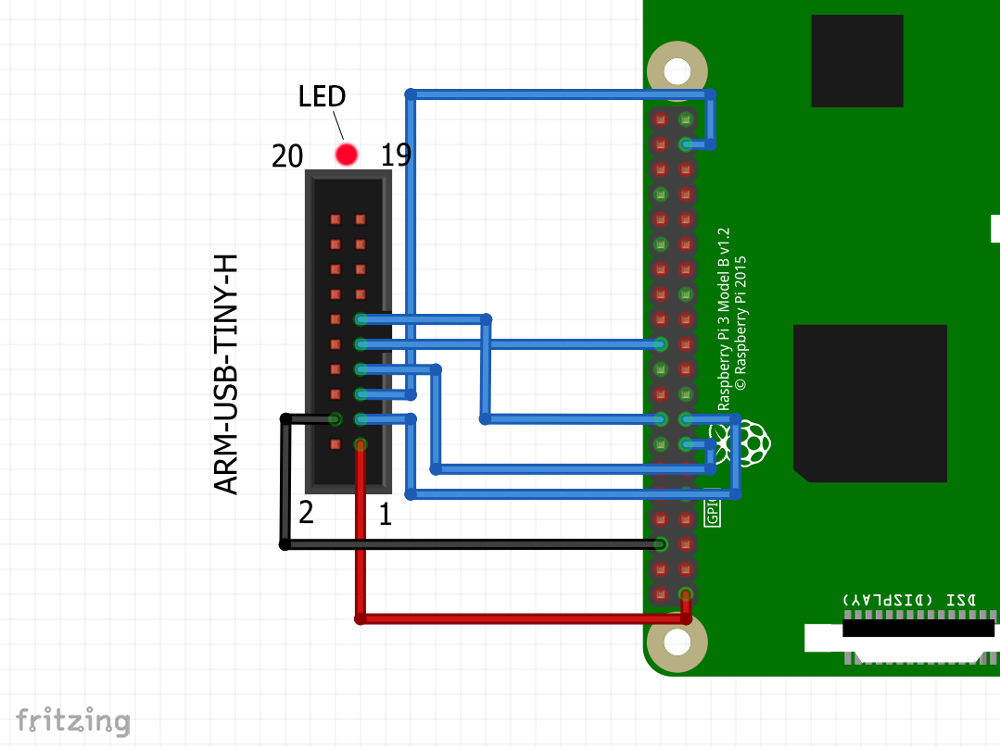
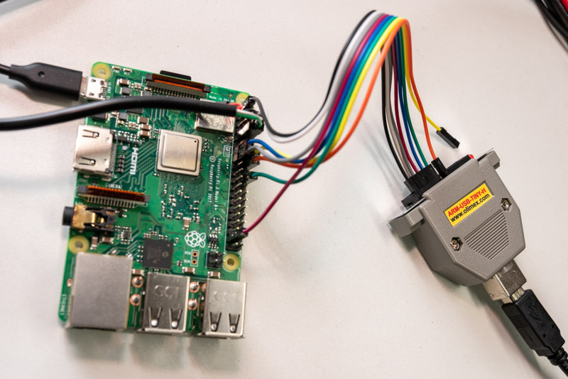

# Tutorial 0B - Hardware Debugging using JTAG

In the upcoming tutorials, we are going to touch sensitive areas of the RPi's
SoC that can make our debugging life very hard. For example, changing the
processor's `Exception Level` or introducing `virtual memory`.

A hardware based debugger can sometimes be the last resort when searching for a
tricky bug. Especially for debugging intricate, architecture-specific HW issues,
it will be handy, because in this area `QEMU` sometimes can not help, since it
abstracts certain features of our RPi's HW and doesn't simulate down to the very
last bit.

So lets introduce `JTAG` debugging. Once set up, it will allow us to single-step
through our kernel on the real HW. How cool is that?!


## Outline

Functionally, this tutorial is the same as the previous one, where we reset or
power down the RPi. Around that, we add infrastructure for JTAG debugging.

## Hardware

Unlike microcontroller boards like the `STM32F3DISCOVERY`, which is used in our
WG's [Embedded Rust Book](https://rust-embedded.github.io/book/start/hardware.html),
the RPi does not have an embedded debugger on it's board. Hence, you need to buy one.

For this tutorial, we will use the
[ARM-USB-TINY-H](https://www.olimex.com/Products/ARM/JTAG/ARM-USB-TINY-H/) by
OLIMEX. It has a standard
[ARM JTAG 20 connector](http://infocenter.arm.com/help/index.jsp?topic=/com.arm.doc.dui0499dj/BEHEIHCE.html).
Unfortunately, the RPi does not, so we have to connect it via jumper wires.

### Wiring


```
 GPIO Name  JTAG Note
----------------------
 1    VTREF 1    3.3v
 6    GND   4    Gnd
 22   TRST  3
 26   TDI   5
 27   TMS   7
 25   TCK   9
 23   RTCK  11
 24   TDO   13
```
<p align="center"></p>

<p align="center"></p>

## Configuring GPIO for JTAG

Before it is possible to connect, we additionally have to configure the
respective GPIO pins for `JTAG` functionality from software. Our approach is as
allows:

Via `raspboot`, we load a tiny helper binary onto the RPi which configures the
pins respectively and then parks the executing core in an endless loop, waiting
for the `JTAG` debugger to connect. The helper binary is maintained separately
in this repository's [X1_JTAG_boot](../X1_JTAG_boot) folder, and is a
stripped-down version of the code we use in our tutorials.

This functionality is provided by the new `Makefile` target `make jtagboot`.

```console
ferris@box:~$ make jtagboot
Raspbootcom V1.0
### Listening on /dev/ttyUSB0
RBIN64
### sending kernel /jtag/jtag_boot.img [759 byte]
### finished sending


[i] JTAG is live. Please connect.
```

It is important to keep the USB serial connected and the terminal open with
`raspboot` running. When we load the actual kernel later, `UART` output will
appear here.

## OpenOCD

Next, we need to launch the [Open On-Chip Debugger](http://openocd.org/), aka
`OpenOCD` to actually connect the `JTAG`.

As always, our tutorials try to be as painless as possible regarding dev-tools,
which is why we have packaged everything into a [dedicated Docker container](../docker/raspi3-openocd) that will be provisioned automagically on the first run.


Now connect the Olimex USB JTAG debugger, open a new terminal and in the same
folder, type `make openocd` (in that order!). You will see some initial output:

```console
ferris@box:~$ make openocd
Open On-Chip Debugger 0.10.0+dev-ge243075 (2019-03-07-19:07)
Licensed under GNU GPL v2
For bug reports, read
	http://openocd.org/doc/doxygen/bugs.html
trst_and_srst separate srst_gates_jtag trst_push_pull srst_open_drain connect_deassert_srst
adapter speed: 1000 kHz
jtag_ntrst_delay: 500
Info : Listening on port 6666 for tcl connections
Info : Listening on port 4444 for telnet connections
Info : clock speed 1000 kHz
Info : JTAG tap: rpi3.tap tap/device found: 0x4ba00477 (mfg: 0x23b (ARM Ltd.), part: 0xba00, ver: 0x4)
Info : rpi3.core0: hardware has 6 breakpoints, 4 watchpoints
Info : rpi3.core1: hardware has 6 breakpoints, 4 watchpoints
Info : rpi3.core2: hardware has 6 breakpoints, 4 watchpoints
Info : rpi3.core3: hardware has 6 breakpoints, 4 watchpoints
Info : Listening on port 3333 for gdb connections
Info : Listening on port 3334 for gdb connections
Info : Listening on port 3335 for gdb connections
Info : Listening on port 3336 for gdb connections
```

`OpenOCD` has detected the four cores of the RPi, and opened four network ports
to which `gdb` can now connect to debug the respective core.

## GDB

Finally, we need an `AArch64`-capable version of `gdb`. You guessed right, we
packaged [another container for you](../docker/raspi3-gdb). It can be launched
via `make gdb`.

This Makefile target actually does a little more. It builds a special version of
our kernel with debug information included. This enables `gdb` to show the `Rust`
source code line we are currently debugging. It also launches `gdb` such
that it already loads this debug build (`kernel8_for_jtag`).

We can now use the `gdb` commandline to
  1. Set breakpoints in our kernel
  2. Load the kernel via JTAG in memory (remember that currently, the RPi is still executing
the minimal JTAG pin enablement binary).
  3. Manipulate the program counter of the RPi to start execution at our kernel's entry point.
  4. Single-step through its execution.

```shell
>>> break _boot_cores
Breakpoint 1 at 0x80000
>>> target remote :3333   # Connect to OpenOCD, raspi3.core0
>>> load                  # Load the kernel into the Raspi's DRAM over JTAG.
Loading section .text, size 0x6cc lma 0x80000
Loading section .rodata, size 0x9a lma 0x806cc
Start address 0x80000, load size 1894
Transfer rate: 66 KB/sec, 947 bytes/write.
>>> set $pc = 0x80000 # Set RPI's program counter to the start of the kernel binary.
>>> cont
Breakpoint 1, 0x0000000000080000 in _boot_cores ()
>>> step
>>> step # Single-step through the kernel
>>> ...
```

### Remarks

#### Optimization

When debugging an OS binary, you have to make a trade-off between the
granularity at which you can step through your Rust source-code and the
optimization level of the generated binary. The `make` and `make gdb` targets
produce a `--release` binary, which includes an optimization level of three
(`-opt-level=3`). However, in this case, the compiler will inline very
aggressively and pack together reads and writes where possible. As a result, it
will not always be possible to hit breakpoints exactly where you want to
regarding the line of source code file.

For this reason, the Makefile also provides the `make gdb-opt0` target, which
uses `-opt-level=0`. Hence, it will allow you to have finer debugging
granularity. However, please keep in mind that when debugging code that closely
deals with HW, a compiler optimization that squashes reads or writes to volatile
registers can make all the difference in execution. FYI, the demo gif above has
been recorded with `gdb-opt0`.

#### GDB control

At some point, you may reach delay loops or code that waits on user input from
the serial. Here, single stepping might not be feasible or work anymore. You can
jump over these roadblocks by setting other breakpoints beyond these areas, and
reach them using the `cont` command.

Pressing `ctrl+c` in `gdb` will stop execution of the RPi again in case you
continued it without further breakpoints.

## Notes on USB connection constraints

If you followed the tutorial from top to bottom, everything should be fine
regarding USB connections.

Still, please note that in its current form, our `Makefile` makes implicit
assumptions about the naming of the connected USB devices. It expects
`/dev/ttyUSB0` to be the `UART` device.

Hence, please ensure the following order of connecting the devices to your box:
  1. Connect the USB serial.
  2. Afterwards, the Olimex debugger.

This way, Linux enumerates the devices accordingly. This has to be done only
once. It is fine to disconnect and connect the serial multiple times, e.g. for
kicking off different `make jtagboot` runs, while keeping the debugger
connected.

## In summary

1. `make jtagboot` and keep terminal open.
2. Connect USB serial device.
3. Connect `JTAG` debugger USB device.
4. In new terminal, `make openocd`.
5. In new terminal, `make gdb` or make `make gdb-opt0`.

## Acknowledgments

Thanks to [@naotaco](https://github.com/naotaco) for laying the groundwork for
this tutorial.
