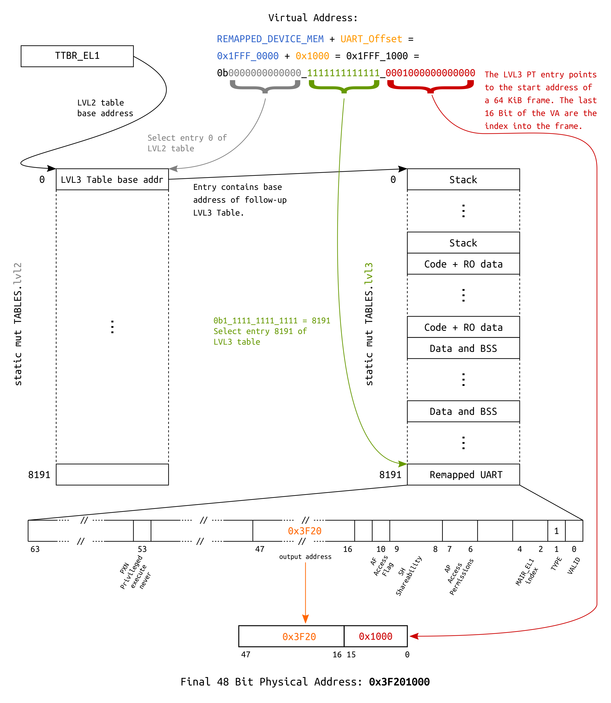

# Tutorial 10 - Virtual Memory Part 1: Identity Map All The Things!

## tl;dr

- The `MMU` is turned on.
- A simple scheme is used: Static `64 KiB` translation tables.
- For educational purposes, we write to a remapped `UART`, and `identity map` everything else.

## Table of Contents

- [Introduction](#introduction)
- [MMU and paging theory](#mmu-and-paging-theory)
- [Approach](#approach)
  * [Generic Kernel code: `memory/mmu.rs`](#generic-kernel-code-memorymmurs)
  * [BSP: `bsp/raspberrypi/memory/mmu.rs`](#bsp-bspraspberrypimemorymmurs)
  * [AArch64: `_arch/aarch64/memory/*`](#aarch64-_archaarch64memory)
  * [`kernel.ld`](#kernelld)
- [Address translation examples](#address-translation-examples)
  * [Address translation using a 64 KiB page descriptor](#address-translation-using-a-64-kib-page-descriptor)
- [Zero-cost abstraction](#zero-cost-abstraction)
- [Test it](#test-it)
- [Diff to previous](#diff-to-previous)

## Introduction

Virtual memory is an immensely complex, but important and powerful topic. In this tutorial, we start
slow and easy by switching on the `MMU`, using static translation tables and `identity-map`
everything at once (except for the `UART`, which we also remap a second time for educational
purposes; This will be gone again in the next tutorial).

## MMU and paging theory

At this point, we will not re-invent the wheel and go into detailed descriptions of how paging in
modern application-grade processors works. The internet is full of great resources regarding this
topic, and we encourage you to read some of it to get a high-level understanding of the topic.

To follow the rest of this `AArch64` specific tutorial, I strongly recommend that you stop right
here and first read `Chapter 12` of the [ARM Cortex-A Series Programmer's Guide for ARMv8-A] before
you continue. This will set you up with all the `AArch64`-specific knowledge needed to follow along.

Back from reading `Chapter 12` already? Good job :+1:!

[ARM Cortex-A Series Programmer's Guide for ARMv8-A]: http://infocenter.arm.com/help/topic/com.arm.doc.den0024a/DEN0024A_v8_architecture_PG.pdf

## Approach

1. The generic `kernel` part: `src/memory/mmu.rs` and its submodules provide architecture-agnostic
   descriptor types for composing a high-level data structure that describes the kernel's virtual
   memory layout: `memory::mmu::KernelVirtualLayout`.
2. The `BSP` part: `src/bsp/raspberrypi/memory/mmu.rs` contains a static instance of
   `KernelVirtualLayout` and makes it accessible through the function
   `bsp::memory::mmu::virt_mem_layout()`.
3. The `aarch64` part: `src/_arch/aarch64/memory/mmu.rs` and its submodules contain the actual `MMU`
   driver. It picks up the `BSP`'s high-level `KernelVirtualLayout` and maps it using a `64 KiB`
   granule.

### Generic Kernel code: `memory/mmu.rs`

The descriptor types provided in this file are building blocks which help to describe attributes of
different memory regions. For example, `R/W`, `no-execute`, `cached/uncached`, and so on.

The descriptors are agnostic of the hardware `MMU`'s actual descriptors. Different `BSP`s can use
these types to produce a high-level description of the kernel's virtual memory layout. The actual
`MMU` driver for the real HW will consume these types as an input.

This way, we achieve a clean abstraction between `BSP` and `_arch` code, which allows exchanging one
without needing to adapt the other.

### BSP: `bsp/raspberrypi/memory/mmu.rs`

This file contains an instance of `KernelVirtualLayout`, which stores the descriptors mentioned
previously. The `BSP` is the correct place to do this, because it has knowledge of the target
board's memory map.

The policy is to only describe regions that are **not** ordinary, normal cacheable DRAM. However,
nothing prevents you from defining those too if you wish to. Here is an example for the device MMIO
region:

```rust
TranslationDescriptor {
    name: "Device MMIO",
    virtual_range: mmio_range_inclusive,
    physical_range_translation: Translation::Identity,
    attribute_fields: AttributeFields {
        mem_attributes: MemAttributes::Device,
        acc_perms: AccessPermissions::ReadWrite,
        execute_never: true,
    },
},
```

`KernelVirtualLayout` itself implements the following method:

```rust
pub fn virt_addr_properties(
    &self,
    virt_addr: usize,
) -> Result<(usize, AttributeFields), &'static str>
```

It will be used by `_arch/aarch64`'s `MMU` code to request attributes for a virtual address and the
translation, which delivers the physical output address (the `usize` in the return-tuple). The
function scans for a descriptor that contains the queried address, and returns the respective
findings for the first entry that is a hit. If no entry is found, it returns default attributes for
normal cacheable DRAM and the input address, hence telling the `MMU` code that the requested
address should be `identity mapped`.

Due to this default behavior, it is not needed to define normal cacheable DRAM regions.

### AArch64: `_arch/aarch64/memory/*`

These modules contain the `AArch64` `MMU` driver. The granule is hardcoded here (`64 KiB` page
descriptors).

In `translation_table.rs`, there is a definition of the actual translation table struct which is
generic over the number of `LVL2` tables. The latter depends on the size of the target board's
memory. Naturally, the `BSP` knows these details about the target board, and provides the size
through the constant `bsp::memory::mmu::KernelAddrSpace::SIZE`.

This information is used by `translation_table.rs` to calculate the number of needed `LVL2` tables.
Since one `LVL2` table in a `64 KiB` configuration covers `512 MiB`, all that needs to be done is to
divide `KernelAddrSpace::SIZE` by `512 MiB` (there are several compile-time checks in place that
ensure that `KernelAddrSpace::SIZE` is a multiple of `512 MiB`).

The final table type is exported as `KernelTranslationTable`. Below is the respective excerpt from
`translation_table.rs`:

```rust
/// A table descriptor for 64 KiB aperture.
///
/// The output points to the next table.
#[derive(Copy, Clone)]
#[repr(C)]
struct TableDescriptor {
    value: u64,
}

/// A page descriptor with 64 KiB aperture.
///
/// The output points to physical memory.
#[derive(Copy, Clone)]
#[repr(C)]
struct PageDescriptor {
    value: u64,
}

const NUM_LVL2_TABLES: usize = bsp::memory::mmu::KernelAddrSpace::SIZE >> Granule512MiB::SHIFT;

//--------------------------------------------------------------------------------------------------
// Public Definitions
//--------------------------------------------------------------------------------------------------

/// Big monolithic struct for storing the translation tables. Individual levels must be 64 KiB
/// aligned, hence the "reverse" order of appearance.
#[repr(C)]
#[repr(align(65536))]
pub struct FixedSizeTranslationTable<const NUM_TABLES: usize> {
    /// Page descriptors, covering 64 KiB windows per entry.
    lvl3: [[PageDescriptor; 8192]; NUM_TABLES],

    /// Table descriptors, covering 512 MiB windows.
    lvl2: [TableDescriptor; NUM_TABLES],
}

/// A translation table type for the kernel space.
pub type KernelTranslationTable = FixedSizeTranslationTable<NUM_LVL2_TABLES>;
```

In `mmu.rs`, `KernelTranslationTable` is then used to create the final instance of the kernel's
tables:

```rust
//--------------------------------------------------------------------------------------------------
// Global instances
//--------------------------------------------------------------------------------------------------

/// The kernel translation tables.
static mut KERNEL_TABLES: KernelTranslationTable = KernelTranslationTable::new();
```

They are populated during `MMU::init()` by calling `KERNEL_TABLES.populate_tt_entries()`, which
utilizes `bsp::memory::mmu::virt_mem_layout().virt_addr_properties()` and a bunch of utility
functions that convert the kernel generic descriptors to the actual `64 bit` integer entries needed
by the `AArch64 MMU` hardware for the translation table arrays.

One notable thing is that each page descriptor has an entry (`AttrIndex`) that indexes into the
[MAIR_EL1] register, which holds information about the cacheability of the respective page. We
currently define normal cacheable memory and device memory (which is not cached).

[MAIR_EL1]: http://infocenter.arm.com/help/index.jsp?topic=/com.arm.doc.ddi0500d/CIHDHJBB.html

```rust
impl MemoryManagementUnit {
    /// Setup function for the MAIR_EL1 register.
    fn set_up_mair(&self) {
        // Define the memory types being mapped.
        MAIR_EL1.write(
            // Attribute 1 - Cacheable normal DRAM.
            MAIR_EL1::Attr1_Normal_Outer::WriteBack_NonTransient_ReadWriteAlloc +
        MAIR_EL1::Attr1_Normal_Inner::WriteBack_NonTransient_ReadWriteAlloc +

        // Attribute 0 - Device.
        MAIR_EL1::Attr0_Device::nonGathering_nonReordering_EarlyWriteAck,
        );
    }
```

Afterwards, the [Translation Table Base Register 0 - EL1] is set up with the base address of the
`lvl2` tables and the [Translation Control Register - EL1] is configured:

```rust
// Set the "Translation Table Base Register".
TTBR0_EL1.set_baddr(KERNEL_TABLES.phys_base_address());

self.configure_translation_control();
```

Finally, the `MMU` is turned on through the [System Control Register - EL1]. The last step also
enables caching for data and instructions.

[Translation Table Base Register 0 - EL1]: https://docs.rs/aarch64-cpu/9.0.0/src/aarch64_cpu/registers/ttbr0_el1.rs.html
[Translation Control Register - EL1]: https://docs.rs/aarch64-cpu/9.0.0/src/aarch64_cpu/registers/tcr_el1.rs.html
[System Control Register - EL1]: https://docs.rs/aarch64-cpu/9.0.0/src/aarch64_cpu/registers/sctlr_el1.rs.html

### `kernel.ld`

We need to align the `code` segment to `64 KiB` so that it doesn't overlap with the next section
that needs read/write attributes instead of read/execute attributes:

```ld.s
. = ALIGN(PAGE_SIZE);
__code_end_exclusive = .;
```

This blows up the binary in size, but is a small price to pay considering that it reduces the amount
of static paging entries significantly, when compared to the classical `4 KiB` granule.

## Address translation examples

For educational purposes, a layout is defined which allows to access the `UART` via two different
virtual addresses:
- Since we identity map the whole `Device MMIO` region, it is accessible by asserting its physical
  base address (`0x3F20_1000` or `0xFA20_1000` depending on which RPi you use) after the `MMU` is
  turned on.
- Additionally, it is also mapped into the last `64 KiB` slot in the first `512 MiB`, making it
  accessible through base address `0x1FFF_1000`.

The following block diagram visualizes the underlying translation for the second mapping.

### Address translation using a 64 KiB page descriptor



## Zero-cost abstraction

The MMU init code is again a good example to see the great potential of Rust's zero-cost
abstractions[[1]][[2]] for embedded programming.

Let's take a look again at the piece of code for setting up the `MAIR_EL1` register using the
[aarch64-cpu] crate:

[1]: https://blog.rust-lang.org/2015/05/11/traits.html
[2]: https://ruudvanasseldonk.com/2016/11/30/zero-cost-abstractions
[aarch64-cpu]: https://crates.io/crates/aarch64-cpu

```rust
/// Setup function for the MAIR_EL1 register.
fn set_up_mair(&self) {
    // Define the memory types being mapped.
    MAIR_EL1.write(
        // Attribute 1 - Cacheable normal DRAM.
        MAIR_EL1::Attr1_Normal_Outer::WriteBack_NonTransient_ReadWriteAlloc +
    MAIR_EL1::Attr1_Normal_Inner::WriteBack_NonTransient_ReadWriteAlloc +

    // Attribute 0 - Device.
    MAIR_EL1::Attr0_Device::nonGathering_nonReordering_EarlyWriteAck,
    );
}
```

This piece of code is super expressive, and it makes use of `traits`, different `types` and
`constants` to provide type-safe register manipulation.

In the end, this code sets the first four bytes of the register to certain values according to the
data sheet. Looking at the generated code, we can see that despite all the type-safety and
abstractions, it boils down to two assembly instructions:

```text
   800a8:       529fe089        mov     w9, #0xff04                     // #65284
   800ac:       d518a209        msr     mair_el1, x9
```

## Test it

Turning on virtual memory is now the first thing we do during kernel init:

```rust
unsafe fn kernel_init() -> ! {
    use memory::mmu::interface::MMU;

    if let Err(string) = memory::mmu::mmu().enable_mmu_and_caching() {
        panic!("MMU: {}", string);
    }
```

Later in the boot process, prints about the mappings can be observed:

```console
$ make chainboot
[...]
Minipush 1.0

[MP] ⏳ Waiting for /dev/ttyUSB0
[MP] ✅ Serial connected
[MP] 🔌 Please power the target now

 __  __ _      _ _                 _
|  \/  (_)_ _ (_) |   ___  __ _ __| |
| |\/| | | ' \| | |__/ _ \/ _` / _` |
|_|  |_|_|_||_|_|____\___/\__,_\__,_|

           Raspberry Pi 3

[ML] Requesting binary
[MP] ⏩ Pushing 64 KiB =========================================🦀 100% 0 KiB/s Time: 00:00:00
[ML] Loaded! Executing the payload now

[    0.811167] mingo version 0.10.0
[    0.811374] Booting on: Raspberry Pi 3
[    0.811829] MMU online. Special regions:
[    0.812306]       0x00080000 - 0x0008ffff |  64 KiB | C   RO PX  | Kernel code and RO data
[    0.813324]       0x1fff0000 - 0x1fffffff |  64 KiB | Dev RW PXN | Remapped Device MMIO
[    0.814310]       0x3f000000 - 0x4000ffff |  17 MiB | Dev RW PXN | Device MMIO
[    0.815198] Current privilege level: EL1
[    0.815675] Exception handling state:
[    0.816119]       Debug:  Masked
[    0.816509]       SError: Masked
[    0.816899]       IRQ:    Masked
[    0.817289]       FIQ:    Masked
[    0.817679] Architectural timer resolution: 52 ns
[    0.818253] Drivers loaded:
[    0.818589]       1. BCM PL011 UART
[    0.819011]       2. BCM GPIO
[    0.819369] Timer test, spinning for 1 second
[     !!!    ] Writing through the remapped UART at 0x1FFF_1000
[    1.820409] Echoing input now
```

## Diff to previous
```diff

diff -uNr 09_privilege_level/Cargo.toml 10_virtual_mem_part1_identity_mapping/Cargo.toml
--- 09_privilege_level/Cargo.toml
+++ 10_virtual_mem_part1_identity_mapping/Cargo.toml
@@ -1,6 +1,6 @@
 [package]
 name = "mingo"
-version = "0.9.0"
+version = "0.10.0"
 authors = ["Andre Richter <andre.o.richter@gmail.com>"]
 edition = "2021"


diff -uNr 09_privilege_level/src/_arch/aarch64/memory/mmu/translation_table.rs 10_virtual_mem_part1_identity_mapping/src/_arch/aarch64/memory/mmu/translation_table.rs
--- 09_privilege_level/src/_arch/aarch64/memory/mmu/translation_table.rs
+++ 10_virtual_mem_part1_identity_mapping/src/_arch/aarch64/memory/mmu/translation_table.rs
@@ -0,0 +1,292 @@
+// SPDX-License-Identifier: MIT OR Apache-2.0
+//
+// Copyright (c) 2021-2023 Andre Richter <andre.o.richter@gmail.com>
+
+//! Architectural translation table.
+//!
+//! Only 64 KiB granule is supported.
+//!
+//! # Orientation
+//!
+//! Since arch modules are imported into generic modules using the path attribute, the path of this
+//! file is:
+//!
+//! crate::memory::mmu::translation_table::arch_translation_table
+
+use crate::{
+    bsp, memory,
+    memory::mmu::{
+        arch_mmu::{Granule512MiB, Granule64KiB},
+        AccessPermissions, AttributeFields, MemAttributes,
+    },
+};
+use core::convert;
+use tock_registers::{
+    interfaces::{Readable, Writeable},
+    register_bitfields,
+    registers::InMemoryRegister,
+};
+
+//--------------------------------------------------------------------------------------------------
+// Private Definitions
+//--------------------------------------------------------------------------------------------------
+
+// A table descriptor, as per ARMv8-A Architecture Reference Manual Figure D5-15.
+register_bitfields! {u64,
+    STAGE1_TABLE_DESCRIPTOR [
+        /// Physical address of the next descriptor.
+        NEXT_LEVEL_TABLE_ADDR_64KiB OFFSET(16) NUMBITS(32) [], // [47:16]
+
+        TYPE  OFFSET(1) NUMBITS(1) [
+            Block = 0,
+            Table = 1
+        ],
+
+        VALID OFFSET(0) NUMBITS(1) [
+            False = 0,
+            True = 1
+        ]
+    ]
+}
+
+// A level 3 page descriptor, as per ARMv8-A Architecture Reference Manual Figure D5-17.
+register_bitfields! {u64,
+    STAGE1_PAGE_DESCRIPTOR [
+        /// Unprivileged execute-never.
+        UXN      OFFSET(54) NUMBITS(1) [
+            False = 0,
+            True = 1
+        ],
+
+        /// Privileged execute-never.
+        PXN      OFFSET(53) NUMBITS(1) [
+            False = 0,
+            True = 1
+        ],
+
+        /// Physical address of the next table descriptor (lvl2) or the page descriptor (lvl3).
+        OUTPUT_ADDR_64KiB OFFSET(16) NUMBITS(32) [], // [47:16]
+
+        /// Access flag.
+        AF       OFFSET(10) NUMBITS(1) [
+            False = 0,
+            True = 1
+        ],
+
+        /// Shareability field.
+        SH       OFFSET(8) NUMBITS(2) [
+            OuterShareable = 0b10,
+            InnerShareable = 0b11
+        ],
+
+        /// Access Permissions.
+        AP       OFFSET(6) NUMBITS(2) [
+            RW_EL1 = 0b00,
+            RW_EL1_EL0 = 0b01,
+            RO_EL1 = 0b10,
+            RO_EL1_EL0 = 0b11
+        ],
+
+        /// Memory attributes index into the MAIR_EL1 register.
+        AttrIndx OFFSET(2) NUMBITS(3) [],
+
+        TYPE     OFFSET(1) NUMBITS(1) [
+            Reserved_Invalid = 0,
+            Page = 1
+        ],
+
+        VALID    OFFSET(0) NUMBITS(1) [
+            False = 0,
+            True = 1
+        ]
+    ]
+}
+
+/// A table descriptor for 64 KiB aperture.
+///
+/// The output points to the next table.
+#[derive(Copy, Clone)]
+#[repr(C)]
+struct TableDescriptor {
+    value: u64,
+}
+
+/// A page descriptor with 64 KiB aperture.
+///
+/// The output points to physical memory.
+#[derive(Copy, Clone)]
+#[repr(C)]
+struct PageDescriptor {
+    value: u64,
+}
+
+trait StartAddr {
+    fn phys_start_addr_u64(&self) -> u64;
+    fn phys_start_addr_usize(&self) -> usize;
+}
+
+const NUM_LVL2_TABLES: usize = bsp::memory::mmu::KernelAddrSpace::SIZE >> Granule512MiB::SHIFT;
+
+//--------------------------------------------------------------------------------------------------
+// Public Definitions
+//--------------------------------------------------------------------------------------------------
+
+/// Big monolithic struct for storing the translation tables. Individual levels must be 64 KiB
+/// aligned, so the lvl3 is put first.
+#[repr(C)]
+#[repr(align(65536))]
+pub struct FixedSizeTranslationTable<const NUM_TABLES: usize> {
+    /// Page descriptors, covering 64 KiB windows per entry.
+    lvl3: [[PageDescriptor; 8192]; NUM_TABLES],
+
+    /// Table descriptors, covering 512 MiB windows.
+    lvl2: [TableDescriptor; NUM_TABLES],
+}
+
+/// A translation table type for the kernel space.
+pub type KernelTranslationTable = FixedSizeTranslationTable<NUM_LVL2_TABLES>;
+
+//--------------------------------------------------------------------------------------------------
+// Private Code
+//--------------------------------------------------------------------------------------------------
+
+// The binary is still identity mapped, so we don't need to convert here.
+impl<T, const N: usize> StartAddr for [T; N] {
+    fn phys_start_addr_u64(&self) -> u64 {
+        self as *const T as u64
+    }
+
+    fn phys_start_addr_usize(&self) -> usize {
+        self as *const _ as usize
+    }
+}
+
+impl TableDescriptor {
+    /// Create an instance.
+    ///
+    /// Descriptor is invalid by default.
+    pub const fn new_zeroed() -> Self {
+        Self { value: 0 }
+    }
+
+    /// Create an instance pointing to the supplied address.
+    pub fn from_next_lvl_table_addr(phys_next_lvl_table_addr: usize) -> Self {
+        let val = InMemoryRegister::<u64, STAGE1_TABLE_DESCRIPTOR::Register>::new(0);
+
+        let shifted = phys_next_lvl_table_addr >> Granule64KiB::SHIFT;
+        val.write(
+            STAGE1_TABLE_DESCRIPTOR::NEXT_LEVEL_TABLE_ADDR_64KiB.val(shifted as u64)
+                + STAGE1_TABLE_DESCRIPTOR::TYPE::Table
+                + STAGE1_TABLE_DESCRIPTOR::VALID::True,
+        );
+
+        TableDescriptor { value: val.get() }
+    }
+}
+
+/// Convert the kernel's generic memory attributes to HW-specific attributes of the MMU.
+impl convert::From<AttributeFields>
+    for tock_registers::fields::FieldValue<u64, STAGE1_PAGE_DESCRIPTOR::Register>
+{
+    fn from(attribute_fields: AttributeFields) -> Self {
+        // Memory attributes.
+        let mut desc = match attribute_fields.mem_attributes {
+            MemAttributes::CacheableDRAM => {
+                STAGE1_PAGE_DESCRIPTOR::SH::InnerShareable
+                    + STAGE1_PAGE_DESCRIPTOR::AttrIndx.val(memory::mmu::arch_mmu::mair::NORMAL)
+            }
+            MemAttributes::Device => {
+                STAGE1_PAGE_DESCRIPTOR::SH::OuterShareable
+                    + STAGE1_PAGE_DESCRIPTOR::AttrIndx.val(memory::mmu::arch_mmu::mair::DEVICE)
+            }
+        };
+
+        // Access Permissions.
+        desc += match attribute_fields.acc_perms {
+            AccessPermissions::ReadOnly => STAGE1_PAGE_DESCRIPTOR::AP::RO_EL1,
+            AccessPermissions::ReadWrite => STAGE1_PAGE_DESCRIPTOR::AP::RW_EL1,
+        };
+
+        // The execute-never attribute is mapped to PXN in AArch64.
+        desc += if attribute_fields.execute_never {
+            STAGE1_PAGE_DESCRIPTOR::PXN::True
+        } else {
+            STAGE1_PAGE_DESCRIPTOR::PXN::False
+        };
+
+        // Always set unprivileged exectue-never as long as userspace is not implemented yet.
+        desc += STAGE1_PAGE_DESCRIPTOR::UXN::True;
+
+        desc
+    }
+}
+
+impl PageDescriptor {
+    /// Create an instance.
+    ///
+    /// Descriptor is invalid by default.
+    pub const fn new_zeroed() -> Self {
+        Self { value: 0 }
+    }
+
+    /// Create an instance.
+    pub fn from_output_addr(phys_output_addr: usize, attribute_fields: &AttributeFields) -> Self {
+        let val = InMemoryRegister::<u64, STAGE1_PAGE_DESCRIPTOR::Register>::new(0);
+
+        let shifted = phys_output_addr as u64 >> Granule64KiB::SHIFT;
+        val.write(
+            STAGE1_PAGE_DESCRIPTOR::OUTPUT_ADDR_64KiB.val(shifted)
+                + STAGE1_PAGE_DESCRIPTOR::AF::True
+                + STAGE1_PAGE_DESCRIPTOR::TYPE::Page
+                + STAGE1_PAGE_DESCRIPTOR::VALID::True
+                + (*attribute_fields).into(),
+        );
+
+        Self { value: val.get() }
+    }
+}
+
+//--------------------------------------------------------------------------------------------------
+// Public Code
+//--------------------------------------------------------------------------------------------------
+
+impl<const NUM_TABLES: usize> FixedSizeTranslationTable<NUM_TABLES> {
+    /// Create an instance.
+    pub const fn new() -> Self {
+        // Can't have a zero-sized address space.
+        assert!(NUM_TABLES > 0);
+
+        Self {
+            lvl3: [[PageDescriptor::new_zeroed(); 8192]; NUM_TABLES],
+            lvl2: [TableDescriptor::new_zeroed(); NUM_TABLES],
+        }
+    }
+
+    /// Iterates over all static translation table entries and fills them at once.
+    ///
+    /// # Safety
+    ///
+    /// - Modifies a `static mut`. Ensure it only happens from here.
+    pub unsafe fn populate_tt_entries(&mut self) -> Result<(), &'static str> {
+        for (l2_nr, l2_entry) in self.lvl2.iter_mut().enumerate() {
+            *l2_entry =
+                TableDescriptor::from_next_lvl_table_addr(self.lvl3[l2_nr].phys_start_addr_usize());
+
+            for (l3_nr, l3_entry) in self.lvl3[l2_nr].iter_mut().enumerate() {
+                let virt_addr = (l2_nr << Granule512MiB::SHIFT) + (l3_nr << Granule64KiB::SHIFT);
+
+                let (phys_output_addr, attribute_fields) =
+                    bsp::memory::mmu::virt_mem_layout().virt_addr_properties(virt_addr)?;
+
+                *l3_entry = PageDescriptor::from_output_addr(phys_output_addr, &attribute_fields);
+            }
+        }
+
+        Ok(())
+    }
+
+    /// The translation table's base address to be used for programming the MMU.
+    pub fn phys_base_address(&self) -> u64 {
+        self.lvl2.phys_start_addr_u64()
+    }
+}

diff -uNr 09_privilege_level/src/_arch/aarch64/memory/mmu.rs 10_virtual_mem_part1_identity_mapping/src/_arch/aarch64/memory/mmu.rs
--- 09_privilege_level/src/_arch/aarch64/memory/mmu.rs
+++ 10_virtual_mem_part1_identity_mapping/src/_arch/aarch64/memory/mmu.rs
@@ -0,0 +1,165 @@
+// SPDX-License-Identifier: MIT OR Apache-2.0
+//
+// Copyright (c) 2018-2023 Andre Richter <andre.o.richter@gmail.com>
+
+//! Memory Management Unit Driver.
+//!
+//! Only 64 KiB granule is supported.
+//!
+//! # Orientation
+//!
+//! Since arch modules are imported into generic modules using the path attribute, the path of this
+//! file is:
+//!
+//! crate::memory::mmu::arch_mmu
+
+use crate::{
+    bsp, memory,
+    memory::mmu::{translation_table::KernelTranslationTable, TranslationGranule},
+};
+use aarch64_cpu::{asm::barrier, registers::*};
+use core::intrinsics::unlikely;
+use tock_registers::interfaces::{ReadWriteable, Readable, Writeable};
+
+//--------------------------------------------------------------------------------------------------
+// Private Definitions
+//--------------------------------------------------------------------------------------------------
+
+/// Memory Management Unit type.
+struct MemoryManagementUnit;
+
+//--------------------------------------------------------------------------------------------------
+// Public Definitions
+//--------------------------------------------------------------------------------------------------
+
+pub type Granule512MiB = TranslationGranule<{ 512 * 1024 * 1024 }>;
+pub type Granule64KiB = TranslationGranule<{ 64 * 1024 }>;
+
+/// Constants for indexing the MAIR_EL1.
+#[allow(dead_code)]
+pub mod mair {
+    pub const DEVICE: u64 = 0;
+    pub const NORMAL: u64 = 1;
+}
+
+//--------------------------------------------------------------------------------------------------
+// Global instances
+//--------------------------------------------------------------------------------------------------
+
+/// The kernel translation tables.
+///
+/// # Safety
+///
+/// - Supposed to land in `.bss`. Therefore, ensure that all initial member values boil down to "0".
+static mut KERNEL_TABLES: KernelTranslationTable = KernelTranslationTable::new();
+
+static MMU: MemoryManagementUnit = MemoryManagementUnit;
+
+//--------------------------------------------------------------------------------------------------
+// Private Code
+//--------------------------------------------------------------------------------------------------
+
+impl<const AS_SIZE: usize> memory::mmu::AddressSpace<AS_SIZE> {
+    /// Checks for architectural restrictions.
+    pub const fn arch_address_space_size_sanity_checks() {
+        // Size must be at least one full 512 MiB table.
+        assert!((AS_SIZE modulo Granule512MiB::SIZE) == 0);
+
+        // Check for 48 bit virtual address size as maximum, which is supported by any ARMv8
+        // version.
+        assert!(AS_SIZE <= (1 << 48));
+    }
+}
+
+impl MemoryManagementUnit {
+    /// Setup function for the MAIR_EL1 register.
+    fn set_up_mair(&self) {
+        // Define the memory types being mapped.
+        MAIR_EL1.write(
+            // Attribute 1 - Cacheable normal DRAM.
+            MAIR_EL1::Attr1_Normal_Outer::WriteBack_NonTransient_ReadWriteAlloc +
+        MAIR_EL1::Attr1_Normal_Inner::WriteBack_NonTransient_ReadWriteAlloc +
+
+        // Attribute 0 - Device.
+        MAIR_EL1::Attr0_Device::nonGathering_nonReordering_EarlyWriteAck,
+        );
+    }
+
+    /// Configure various settings of stage 1 of the EL1 translation regime.
+    fn configure_translation_control(&self) {
+        let t0sz = (64 - bsp::memory::mmu::KernelAddrSpace::SIZE_SHIFT) as u64;
+
+        TCR_EL1.write(
+            TCR_EL1::TBI0::Used
+                + TCR_EL1::IPS::Bits_40
+                + TCR_EL1::TG0::KiB_64
+                + TCR_EL1::SH0::Inner
+                + TCR_EL1::ORGN0::WriteBack_ReadAlloc_WriteAlloc_Cacheable
+                + TCR_EL1::IRGN0::WriteBack_ReadAlloc_WriteAlloc_Cacheable
+                + TCR_EL1::EPD0::EnableTTBR0Walks
+                + TCR_EL1::A1::TTBR0
+                + TCR_EL1::T0SZ.val(t0sz)
+                + TCR_EL1::EPD1::DisableTTBR1Walks,
+        );
+    }
+}
+
+//--------------------------------------------------------------------------------------------------
+// Public Code
+//--------------------------------------------------------------------------------------------------
+
+/// Return a reference to the MMU instance.
+pub fn mmu() -> &'static impl memory::mmu::interface::MMU {
+    &MMU
+}
+
+//------------------------------------------------------------------------------
+// OS Interface Code
+//------------------------------------------------------------------------------
+use memory::mmu::MMUEnableError;
+
+impl memory::mmu::interface::MMU for MemoryManagementUnit {
+    unsafe fn enable_mmu_and_caching(&self) -> Result<(), MMUEnableError> {
+        if unlikely(self.is_enabled()) {
+            return Err(MMUEnableError::AlreadyEnabled);
+        }
+
+        // Fail early if translation granule is not supported.
+        if unlikely(!ID_AA64MMFR0_EL1.matches_all(ID_AA64MMFR0_EL1::TGran64::Supported)) {
+            return Err(MMUEnableError::Other(
+                "Translation granule not supported in HW",
+            ));
+        }
+
+        // Prepare the memory attribute indirection register.
+        self.set_up_mair();
+
+        // Populate translation tables.
+        KERNEL_TABLES
+            .populate_tt_entries()
+            .map_err(MMUEnableError::Other)?;
+
+        // Set the "Translation Table Base Register".
+        TTBR0_EL1.set_baddr(KERNEL_TABLES.phys_base_address());
+
+        self.configure_translation_control();
+
+        // Switch the MMU on.
+        //
+        // First, force all previous changes to be seen before the MMU is enabled.
+        barrier::isb(barrier::SY);
+
+        // Enable the MMU and turn on data and instruction caching.
+        SCTLR_EL1.modify(SCTLR_EL1::M::Enable + SCTLR_EL1::C::Cacheable + SCTLR_EL1::I::Cacheable);
+
+        // Force MMU init to complete before next instruction.
+        barrier::isb(barrier::SY);
+
+        Ok(())
+    }
+
+    #[inline(always)]
+    fn is_enabled(&self) -> bool {
+        SCTLR_EL1.matches_all(SCTLR_EL1::M::Enable)
+    }
+}

diff -uNr 09_privilege_level/src/bsp/raspberrypi/kernel.ld 10_virtual_mem_part1_identity_mapping/src/bsp/raspberrypi/kernel.ld
--- 09_privilege_level/src/bsp/raspberrypi/kernel.ld
+++ 10_virtual_mem_part1_identity_mapping/src/bsp/raspberrypi/kernel.ld
@@ -3,6 +3,9 @@
  * Copyright (c) 2018-2023 Andre Richter <andre.o.richter@gmail.com>
  */

+PAGE_SIZE = 64K;
+PAGE_MASK = PAGE_SIZE - 1;
+
 __rpi_phys_dram_start_addr = 0;

 /* The physical address at which the the kernel binary will be loaded by the Raspberry's firmware */
@@ -42,9 +45,12 @@
         __boot_core_stack_end_exclusive = .; /*   |             */
     } :segment_boot_core_stack

+    ASSERT((. & PAGE_MASK) == 0, "End of boot core stack is not page aligned")
+
     /***********************************************************************************************
     * Code + RO Data + Global Offset Table
     ***********************************************************************************************/
+    __code_start = .;
     .text :
     {
         KEEP(*(.text._start))
@@ -55,6 +61,9 @@

     .rodata : ALIGN(8) { *(.rodata*) } :segment_code

+    . = ALIGN(PAGE_SIZE);
+    __code_end_exclusive = .;
+
     /***********************************************************************************************
     * Data + BSS
     ***********************************************************************************************/

diff -uNr 09_privilege_level/src/bsp/raspberrypi/memory/mmu.rs 10_virtual_mem_part1_identity_mapping/src/bsp/raspberrypi/memory/mmu.rs
--- 09_privilege_level/src/bsp/raspberrypi/memory/mmu.rs
+++ 10_virtual_mem_part1_identity_mapping/src/bsp/raspberrypi/memory/mmu.rs
@@ -0,0 +1,86 @@
+// SPDX-License-Identifier: MIT OR Apache-2.0
+//
+// Copyright (c) 2018-2023 Andre Richter <andre.o.richter@gmail.com>
+
+//! BSP Memory Management Unit.
+
+use super::map as memory_map;
+use crate::memory::mmu::*;
+use core::ops::RangeInclusive;
+
+//--------------------------------------------------------------------------------------------------
+// Public Definitions
+//--------------------------------------------------------------------------------------------------
+
+/// The kernel's address space defined by this BSP.
+pub type KernelAddrSpace = AddressSpace<{ memory_map::END_INCLUSIVE + 1 }>;
+
+const NUM_MEM_RANGES: usize = 3;
+
+/// The virtual memory layout.
+///
+/// The layout must contain only special ranges, aka anything that is _not_ normal cacheable DRAM.
+/// It is agnostic of the paging granularity that the architecture's MMU will use.
+pub static LAYOUT: KernelVirtualLayout<NUM_MEM_RANGES> = KernelVirtualLayout::new(
+    memory_map::END_INCLUSIVE,
+    [
+        TranslationDescriptor {
+            name: "Kernel code and RO data",
+            virtual_range: code_range_inclusive,
+            physical_range_translation: Translation::Identity,
+            attribute_fields: AttributeFields {
+                mem_attributes: MemAttributes::CacheableDRAM,
+                acc_perms: AccessPermissions::ReadOnly,
+                execute_never: false,
+            },
+        },
+        TranslationDescriptor {
+            name: "Remapped Device MMIO",
+            virtual_range: remapped_mmio_range_inclusive,
+            physical_range_translation: Translation::Offset(memory_map::mmio::START + 0x20_0000),
+            attribute_fields: AttributeFields {
+                mem_attributes: MemAttributes::Device,
+                acc_perms: AccessPermissions::ReadWrite,
+                execute_never: true,
+            },
+        },
+        TranslationDescriptor {
+            name: "Device MMIO",
+            virtual_range: mmio_range_inclusive,
+            physical_range_translation: Translation::Identity,
+            attribute_fields: AttributeFields {
+                mem_attributes: MemAttributes::Device,
+                acc_perms: AccessPermissions::ReadWrite,
+                execute_never: true,
+            },
+        },
+    ],
+);
+
+//--------------------------------------------------------------------------------------------------
+// Private Code
+//--------------------------------------------------------------------------------------------------
+
+fn code_range_inclusive() -> RangeInclusive<usize> {
+    // Notice the subtraction to turn the exclusive end into an inclusive end.
+    #[allow(clippy::range_minus_one)]
+    RangeInclusive::new(super::code_start(), super::code_end_exclusive() - 1)
+}
+
+fn remapped_mmio_range_inclusive() -> RangeInclusive<usize> {
+    // The last 64 KiB slot in the first 512 MiB
+    RangeInclusive::new(0x1FFF_0000, 0x1FFF_FFFF)
+}
+
+fn mmio_range_inclusive() -> RangeInclusive<usize> {
+    RangeInclusive::new(memory_map::mmio::START, memory_map::mmio::END_INCLUSIVE)
+}
+
+//--------------------------------------------------------------------------------------------------
+// Public Code
+//--------------------------------------------------------------------------------------------------
+
+/// Return a reference to the virtual memory layout.
+pub fn virt_mem_layout() -> &'static KernelVirtualLayout<NUM_MEM_RANGES> {
+    &LAYOUT
+}

diff -uNr 09_privilege_level/src/bsp/raspberrypi/memory.rs 10_virtual_mem_part1_identity_mapping/src/bsp/raspberrypi/memory.rs
--- 09_privilege_level/src/bsp/raspberrypi/memory.rs
+++ 10_virtual_mem_part1_identity_mapping/src/bsp/raspberrypi/memory.rs
@@ -3,6 +3,45 @@
 // Copyright (c) 2018-2023 Andre Richter <andre.o.richter@gmail.com>

 //! BSP Memory Management.
+//!
+//! The physical memory layout.
+//!
+//! The Raspberry's firmware copies the kernel binary to 0x8_0000. The preceding region will be used
+//! as the boot core's stack.
+//!
+//! +---------------------------------------+
+//! |                                       | 0x0
+//! |                                       |                                ^
+//! | Boot-core Stack                       |                                | stack
+//! |                                       |                                | growth
+//! |                                       |                                | direction
+//! +---------------------------------------+
+//! |                                       | code_start @ 0x8_0000
+//! | .text                                 |
+//! | .rodata                               |
+//! | .got                                  |
+//! |                                       |
+//! +---------------------------------------+
+//! |                                       | code_end_exclusive
+//! | .data                                 |
+//! | .bss                                  |
+//! |                                       |
+//! +---------------------------------------+
+//! |                                       |
+//! |                                       |
+pub mod mmu;
+
+use core::cell::UnsafeCell;
+
+//--------------------------------------------------------------------------------------------------
+// Private Definitions
+//--------------------------------------------------------------------------------------------------
+
+// Symbols from the linker script.
+extern "Rust" {
+    static __code_start: UnsafeCell<()>;
+    static __code_end_exclusive: UnsafeCell<()>;
+}

 //--------------------------------------------------------------------------------------------------
 // Public Definitions
@@ -11,6 +50,20 @@
 /// The board's physical memory map.
 #[rustfmt::skip]
 pub(super) mod map {
+    /// The inclusive end address of the memory map.
+    ///
+    /// End address + 1 must be power of two.
+    ///
+    /// # Note
+    ///
+    /// RPi3 and RPi4 boards can have different amounts of RAM. To make our code lean for
+    /// educational purposes, we set the max size of the address space to 4 GiB regardless of board.
+    /// This way, we can map the entire range that we need (end of MMIO for RPi4) in one take.
+    ///
+    /// However, making this trade-off has the downside of making it possible for the CPU to assert a
+    /// physical address that is not backed by any DRAM (e.g. accessing an address close to 4 GiB on
+    /// an RPi3 that comes with 1 GiB of RAM). This would result in a crash or other kind of error.
+    pub const END_INCLUSIVE:       usize = 0xFFFF_FFFF;

     pub const GPIO_OFFSET:         usize = 0x0020_0000;
     pub const UART_OFFSET:         usize = 0x0020_1000;
@@ -23,6 +76,7 @@
         pub const START:            usize =         0x3F00_0000;
         pub const GPIO_START:       usize = START + GPIO_OFFSET;
         pub const PL011_UART_START: usize = START + UART_OFFSET;
+        pub const END_INCLUSIVE:    usize =         0x4000_FFFF;
     }

     /// Physical devices.
@@ -33,5 +87,29 @@
         pub const START:            usize =         0xFE00_0000;
         pub const GPIO_START:       usize = START + GPIO_OFFSET;
         pub const PL011_UART_START: usize = START + UART_OFFSET;
+        pub const END_INCLUSIVE:    usize =         0xFF84_FFFF;
     }
 }
+
+//--------------------------------------------------------------------------------------------------
+// Private Code
+//--------------------------------------------------------------------------------------------------
+
+/// Start page address of the code segment.
+///
+/// # Safety
+///
+/// - Value is provided by the linker script and must be trusted as-is.
+#[inline(always)]
+fn code_start() -> usize {
+    unsafe { __code_start.get() as usize }
+}
+
+/// Exclusive end page address of the code segment.
+/// # Safety
+///
+/// - Value is provided by the linker script and must be trusted as-is.
+#[inline(always)]
+fn code_end_exclusive() -> usize {
+    unsafe { __code_end_exclusive.get() as usize }
+}

diff -uNr 09_privilege_level/src/bsp.rs 10_virtual_mem_part1_identity_mapping/src/bsp.rs
--- 09_privilege_level/src/bsp.rs
+++ 10_virtual_mem_part1_identity_mapping/src/bsp.rs
@@ -4,7 +4,7 @@

 //! Conditional reexporting of Board Support Packages.

-mod device_driver;
+pub mod device_driver;

 #[cfg(any(feature = "bsp_rpi3", feature = "bsp_rpi4"))]
 mod raspberrypi;

diff -uNr 09_privilege_level/src/common.rs 10_virtual_mem_part1_identity_mapping/src/common.rs
--- 09_privilege_level/src/common.rs
+++ 10_virtual_mem_part1_identity_mapping/src/common.rs
@@ -0,0 +1,22 @@
+// SPDX-License-Identifier: MIT OR Apache-2.0
+//
+// Copyright (c) 2020-2023 Andre Richter <andre.o.richter@gmail.com>
+
+//! General purpose code.
+
+/// Convert a size into human readable format.
+pub const fn size_human_readable_ceil(size: usize) -> (usize, &'static str) {
+    const KIB: usize = 1024;
+    const MIB: usize = 1024 * 1024;
+    const GIB: usize = 1024 * 1024 * 1024;
+
+    if (size / GIB) > 0 {
+        (size.div_ceil(GIB), "GiB")
+    } else if (size / MIB) > 0 {
+        (size.div_ceil(MIB), "MiB")
+    } else if (size / KIB) > 0 {
+        (size.div_ceil(KIB), "KiB")
+    } else {
+        (size, "Byte")
+    }
+}

diff -uNr 09_privilege_level/src/main.rs 10_virtual_mem_part1_identity_mapping/src/main.rs
--- 09_privilege_level/src/main.rs
+++ 10_virtual_mem_part1_identity_mapping/src/main.rs
@@ -107,9 +107,12 @@
 //! 2. Once finished with architectural setup, the arch code calls `kernel_init()`.

 #![allow(clippy::upper_case_acronyms)]
+#![allow(incomplete_features)]
 #![feature(asm_const)]
 #![feature(const_option)]
+#![feature(core_intrinsics)]
 #![feature(format_args_nl)]
+#![feature(int_roundings)]
 #![feature(nonzero_min_max)]
 #![feature(panic_info_message)]
 #![feature(trait_alias)]
@@ -118,10 +121,12 @@
 #![no_std]

 mod bsp;
+mod common;
 mod console;
 mod cpu;
 mod driver;
 mod exception;
+mod memory;
 mod panic_wait;
 mod print;
 mod synchronization;
@@ -132,8 +137,17 @@
 /// # Safety
 ///
 /// - Only a single core must be active and running this function.
-/// - The init calls in this function must appear in the correct order.
+/// - The init calls in this function must appear in the correct order:
+///     - MMU + Data caching must be activated at the earliest. Without it, any atomic operations,
+///       e.g. the yet-to-be-introduced spinlocks in the device drivers (which currently employ
+///       NullLocks instead of spinlocks), will fail to work (properly) on the RPi SoCs.
 unsafe fn kernel_init() -> ! {
+    use memory::mmu::interface::MMU;
+
+    if let Err(string) = memory::mmu::mmu().enable_mmu_and_caching() {
+        panic!("MMU: {}", string);
+    }
+
     // Initialize the BSP driver subsystem.
     if let Err(x) = bsp::driver::init() {
         panic!("Error initializing BSP driver subsystem: {}", x);
@@ -149,7 +163,7 @@

 /// The main function running after the early init.
 fn kernel_main() -> ! {
-    use console::console;
+    use console::{console, interface::Write};
     use core::time::Duration;

     info!(
@@ -159,6 +173,9 @@
     );
     info!("Booting on: {}", bsp::board_name());

+    info!("MMU online. Special regions:");
+    bsp::memory::mmu::virt_mem_layout().print_layout();
+
     let (_, privilege_level) = exception::current_privilege_level();
     info!("Current privilege level: {}", privilege_level);

@@ -176,6 +193,13 @@
     info!("Timer test, spinning for 1 second");
     time::time_manager().spin_for(Duration::from_secs(1));

+    let remapped_uart = unsafe { bsp::device_driver::PL011Uart::new(0x1FFF_1000) };
+    writeln!(
+        remapped_uart,
+        "[     !!!    ] Writing through the remapped UART at 0x1FFF_1000"
+    )
+    .unwrap();
+
     info!("Echoing input now");

     // Discard any spurious received characters before going into echo mode.

diff -uNr 09_privilege_level/src/memory/mmu/translation_table.rs 10_virtual_mem_part1_identity_mapping/src/memory/mmu/translation_table.rs
--- 09_privilege_level/src/memory/mmu/translation_table.rs
+++ 10_virtual_mem_part1_identity_mapping/src/memory/mmu/translation_table.rs
@@ -0,0 +1,14 @@
+// SPDX-License-Identifier: MIT OR Apache-2.0
+//
+// Copyright (c) 2021-2023 Andre Richter <andre.o.richter@gmail.com>
+
+//! Translation table.
+
+#[cfg(target_arch = "aarch64")]
+#[path = "../../_arch/aarch64/memory/mmu/translation_table.rs"]
+mod arch_translation_table;
+
+//--------------------------------------------------------------------------------------------------
+// Architectural Public Reexports
+//--------------------------------------------------------------------------------------------------
+pub use arch_translation_table::KernelTranslationTable;

diff -uNr 09_privilege_level/src/memory/mmu.rs 10_virtual_mem_part1_identity_mapping/src/memory/mmu.rs
--- 09_privilege_level/src/memory/mmu.rs
+++ 10_virtual_mem_part1_identity_mapping/src/memory/mmu.rs
@@ -0,0 +1,253 @@
+// SPDX-License-Identifier: MIT OR Apache-2.0
+//
+// Copyright (c) 2020-2023 Andre Richter <andre.o.richter@gmail.com>
+
+//! Memory Management Unit.
+//!
+//! In order to decouple `BSP` and `arch` parts of the MMU code (to keep them pluggable), this file
+//! provides types for composing an architecture-agnostic description of the kernel's virtual memory
+//! layout.
+//!
+//! The `BSP` provides such a description through the `bsp::memory::mmu::virt_mem_layout()`
+//! function.
+//!
+//! The `MMU` driver of the `arch` code uses `bsp::memory::mmu::virt_mem_layout()` to compile and
+//! install respective translation tables.
+
+#[cfg(target_arch = "aarch64")]
+#[path = "../_arch/aarch64/memory/mmu.rs"]
+mod arch_mmu;
+
+mod translation_table;
+
+use crate::common;
+use core::{fmt, ops::RangeInclusive};
+
+//--------------------------------------------------------------------------------------------------
+// Architectural Public Reexports
+//--------------------------------------------------------------------------------------------------
+pub use arch_mmu::mmu;
+
+//--------------------------------------------------------------------------------------------------
+// Public Definitions
+//--------------------------------------------------------------------------------------------------
+
+/// MMU enable errors variants.
+#[allow(missing_docs)]
+#[derive(Debug)]
+pub enum MMUEnableError {
+    AlreadyEnabled,
+    Other(&'static str),
+}
+
+/// Memory Management interfaces.
+pub mod interface {
+    use super::*;
+
+    /// MMU functions.
+    pub trait MMU {
+        /// Called by the kernel during early init. Supposed to take the translation tables from the
+        /// `BSP`-supplied `virt_mem_layout()` and install/activate them for the respective MMU.
+        ///
+        /// # Safety
+        ///
+        /// - Changes the HW's global state.
+        unsafe fn enable_mmu_and_caching(&self) -> Result<(), MMUEnableError>;
+
+        /// Returns true if the MMU is enabled, false otherwise.
+        fn is_enabled(&self) -> bool;
+    }
+}
+
+/// Describes the characteristics of a translation granule.
+pub struct TranslationGranule<const GRANULE_SIZE: usize>;
+
+/// Describes properties of an address space.
+pub struct AddressSpace<const AS_SIZE: usize>;
+
+/// Architecture agnostic translation types.
+#[allow(missing_docs)]
+#[allow(dead_code)]
+#[derive(Copy, Clone)]
+pub enum Translation {
+    Identity,
+    Offset(usize),
+}
+
+/// Architecture agnostic memory attributes.
+#[allow(missing_docs)]
+#[derive(Copy, Clone)]
+pub enum MemAttributes {
+    CacheableDRAM,
+    Device,
+}
+
+/// Architecture agnostic access permissions.
+#[allow(missing_docs)]
+#[derive(Copy, Clone)]
+pub enum AccessPermissions {
+    ReadOnly,
+    ReadWrite,
+}
+
+/// Collection of memory attributes.
+#[allow(missing_docs)]
+#[derive(Copy, Clone)]
+pub struct AttributeFields {
+    pub mem_attributes: MemAttributes,
+    pub acc_perms: AccessPermissions,
+    pub execute_never: bool,
+}
+
+/// Architecture agnostic descriptor for a memory range.
+#[allow(missing_docs)]
+pub struct TranslationDescriptor {
+    pub name: &'static str,
+    pub virtual_range: fn() -> RangeInclusive<usize>,
+    pub physical_range_translation: Translation,
+    pub attribute_fields: AttributeFields,
+}
+
+/// Type for expressing the kernel's virtual memory layout.
+pub struct KernelVirtualLayout<const NUM_SPECIAL_RANGES: usize> {
+    /// The last (inclusive) address of the address space.
+    max_virt_addr_inclusive: usize,
+
+    /// Array of descriptors for non-standard (normal cacheable DRAM) memory regions.
+    inner: [TranslationDescriptor; NUM_SPECIAL_RANGES],
+}
+
+//--------------------------------------------------------------------------------------------------
+// Public Code
+//--------------------------------------------------------------------------------------------------
+
+impl fmt::Display for MMUEnableError {
+    fn fmt(&self, f: &mut fmt::Formatter<'_>) -> fmt::Result {
+        match self {
+            MMUEnableError::AlreadyEnabled => write!(f, "MMU is already enabled"),
+            MMUEnableError::Other(x) => write!(f, "{}", x),
+        }
+    }
+}
+
+impl<const GRANULE_SIZE: usize> TranslationGranule<GRANULE_SIZE> {
+    /// The granule's size.
+    pub const SIZE: usize = Self::size_checked();
+
+    /// The granule's shift, aka log2(size).
+    pub const SHIFT: usize = Self::SIZE.trailing_zeros() as usize;
+
+    const fn size_checked() -> usize {
+        assert!(GRANULE_SIZE.is_power_of_two());
+
+        GRANULE_SIZE
+    }
+}
+
+impl<const AS_SIZE: usize> AddressSpace<AS_SIZE> {
+    /// The address space size.
+    pub const SIZE: usize = Self::size_checked();
+
+    /// The address space shift, aka log2(size).
+    pub const SIZE_SHIFT: usize = Self::SIZE.trailing_zeros() as usize;
+
+    const fn size_checked() -> usize {
+        assert!(AS_SIZE.is_power_of_two());
+
+        // Check for architectural restrictions as well.
+        Self::arch_address_space_size_sanity_checks();
+
+        AS_SIZE
+    }
+}
+
+impl Default for AttributeFields {
+    fn default() -> AttributeFields {
+        AttributeFields {
+            mem_attributes: MemAttributes::CacheableDRAM,
+            acc_perms: AccessPermissions::ReadWrite,
+            execute_never: true,
+        }
+    }
+}
+
+/// Human-readable output of a TranslationDescriptor.
+impl fmt::Display for TranslationDescriptor {
+    fn fmt(&self, f: &mut fmt::Formatter) -> fmt::Result {
+        // Call the function to which self.range points, and dereference the result, which causes
+        // Rust to copy the value.
+        let start = *(self.virtual_range)().start();
+        let end = *(self.virtual_range)().end();
+        let size = end - start + 1;
+
+        let (size, unit) = common::size_human_readable_ceil(size);
+
+        let attr = match self.attribute_fields.mem_attributes {
+            MemAttributes::CacheableDRAM => "C",
+            MemAttributes::Device => "Dev",
+        };
+
+        let acc_p = match self.attribute_fields.acc_perms {
+            AccessPermissions::ReadOnly => "RO",
+            AccessPermissions::ReadWrite => "RW",
+        };
+
+        let xn = if self.attribute_fields.execute_never {
+            "PXN"
+        } else {
+            "PX"
+        };
+
+        write!(
+            f,
+            "      {:#010x} - {:#010x} | {: >3} {} | {: <3} {} {: <3} | {}",
+            start, end, size, unit, attr, acc_p, xn, self.name
+        )
+    }
+}
+
+impl<const NUM_SPECIAL_RANGES: usize> KernelVirtualLayout<{ NUM_SPECIAL_RANGES }> {
+    /// Create a new instance.
+    pub const fn new(max: usize, layout: [TranslationDescriptor; NUM_SPECIAL_RANGES]) -> Self {
+        Self {
+            max_virt_addr_inclusive: max,
+            inner: layout,
+        }
+    }
+
+    /// For a virtual address, find and return the physical output address and corresponding
+    /// attributes.
+    ///
+    /// If the address is not found in `inner`, return an identity mapped default with normal
+    /// cacheable DRAM attributes.
+    pub fn virt_addr_properties(
+        &self,
+        virt_addr: usize,
+    ) -> Result<(usize, AttributeFields), &'static str> {
+        if virt_addr > self.max_virt_addr_inclusive {
+            return Err("Address out of range");
+        }
+
+        for i in self.inner.iter() {
+            if (i.virtual_range)().contains(&virt_addr) {
+                let output_addr = match i.physical_range_translation {
+                    Translation::Identity => virt_addr,
+                    Translation::Offset(a) => a + (virt_addr - (i.virtual_range)().start()),
+                };
+
+                return Ok((output_addr, i.attribute_fields));
+            }
+        }
+
+        Ok((virt_addr, AttributeFields::default()))
+    }
+
+    /// Print the memory layout.
+    pub fn print_layout(&self) {
+        use crate::info;
+
+        for i in self.inner.iter() {
+            info!("{}", i);
+        }
+    }
+}

diff -uNr 09_privilege_level/src/memory.rs 10_virtual_mem_part1_identity_mapping/src/memory.rs
--- 09_privilege_level/src/memory.rs
+++ 10_virtual_mem_part1_identity_mapping/src/memory.rs
@@ -0,0 +1,7 @@
+// SPDX-License-Identifier: MIT OR Apache-2.0
+//
+// Copyright (c) 2018-2023 Andre Richter <andre.o.richter@gmail.com>
+
+//! Memory Management.
+
+pub mod mmu;

```
