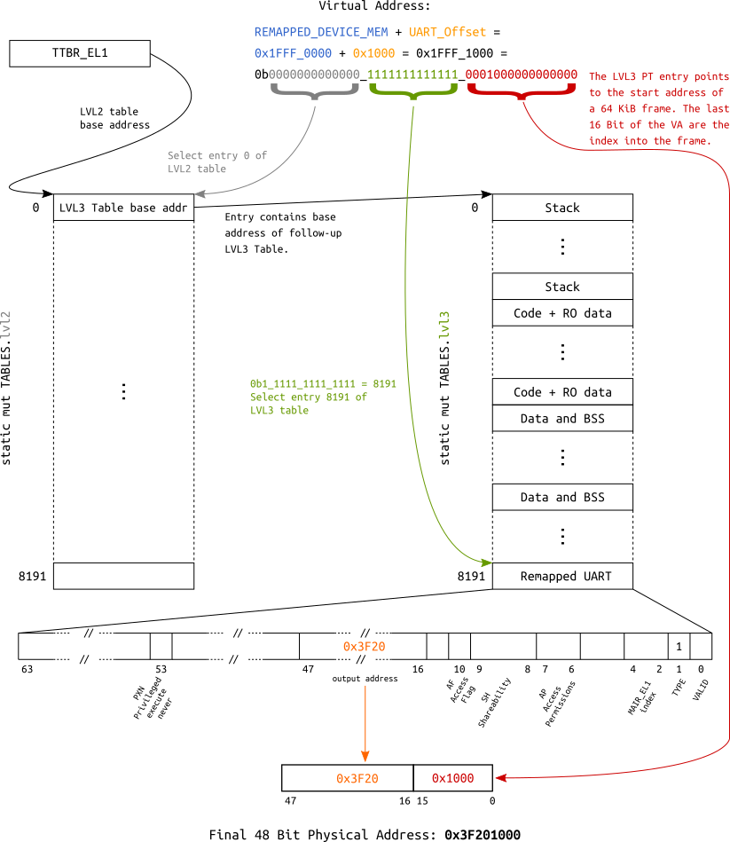

# Tutorial 11 - Virtual Memory

## tl;dr

The `MMU` is turned on; A simple scheme is used: static `64 KiB` page tables; For educational
purposes, we write to a remapped `UART`.

## Table of Contents

- [Introduction](#introduction)
- [MMU and paging theory](#mmu-and-paging-theory)
- [Approach](#approach)
  * [BSP: `bsp/rpi/virt_mem_layout.rs`](#bsp-bsprpivirt_mem_layoutrs)
  * [Arch: `arch/aarch64/mmu.rs`](#arch-archaarch64mmurs)
  * [`link.ld`](#linkld)
- [Address translation examples](#address-translation-examples)
  * [Address translation using a 64 KiB page descriptor](#address-translation-using-a-64-kib-page-descriptor)
- [Zero-cost abstraction](#zero-cost-abstraction)
- [Test it](#test-it)
- [Diff to previous](#diff-to-previous)

## Introduction

Virtual memory is an immensely complex, but important and powerful topic. In this tutorial, we start
slow and easy by switching on the `MMU`, using static page tables and mapping everything at once.

## MMU and paging theory

At this point, we will not re-invent the wheel and go into detailed descriptions of how paging in
modern application-grade processors works. The internet is full of great resources regarding this
topic, and we encourage you to read some of it to get a high-level understanding of the topic.

To follow the rest of this `AArch64` specific tutorial, I strongly recommend that you stop right
here and first read `Chapter 12` of the [ARM Cortex-A Series Programmer's Guide for ARMv8-A] before
you continue. This will set you up with all the `AArch64`-specific knowledge needed to follow along.

Back from reading `Chapter 12` already? Good job :+1:!

[ARM Cortex-A Series Programmer's Guide for ARMv8-A]: http://infocenter.arm.com/help/topic/com.arm.doc.den0024a/DEN0024A_v8_architecture_PG.pdf

## Approach

- Everything is mapped using a `64 KiB` granule.
- Attributes of different regions (e.g. R/W, no-execute, cached/uncached, etc...) are set in a
  high-level data structure in `BSP` code.
- `Arch` code picks up this high-level description and maps it using its specific MMU HW.

### BSP: `bsp/rpi/virt_mem_layout.rs`

This file is used to describe our kernel's memory layout in a high-level abstraction using our own
descriptor format. We can define ranges of arbitrary length and set respective attributes, for
example if the bits and bytes in this range should be executable or not.

The descriptors we use here are agnostic of the hardware `MMU`'s actual descriptors, and we are also
agnostic of the paging granule the `MMU` will use. Having this distinction is less of a technical
need and more a convenience feature for us in order to easily describe the kernel's memory layout,
and hopefully it makes the whole concept a bit more graspable for the reader.

The file contains an instance of `memory::KernelVirtualLayout`,which stores these descriptors. The
policy is to only store regions that are **not** ordinary, normal chacheable DRAM. However, nothing
prevents you from defining those too if you wish to. Here is an example for the device MMIO region:

```rust
// Device MMIO.
RangeDescriptor {
    name: "Device MMIO",
    virtual_range: || {
        RangeInclusive::new(memory_map::mmio::BASE, memory_map::mmio::END_INCLUSIVE)
    },
    translation: Translation::Identity,
    attribute_fields: AttributeFields {
        mem_attributes: MemAttributes::Device,
        acc_perms: AccessPermissions::ReadWrite,
        execute_never: true,
    },
},
```

`KernelVirtualLayout` also provides the following method:

```rust
pub fn get_virt_addr_properties(
        &self,
        virt_addr: usize,
    ) -> Result<(usize, AttributeFields), &'static str>
```

It will be used by the `arch`'s MMU code to request attributes for a virtual address and the
translation of the address. The function scans for a descriptor that contains the queried address,
and returns the respective findings for the first entry that is a hit. If no entry is found, it
returns default attributes for normal chacheable DRAM and the input address, hence telling the `MMU`
code that the requested address should be `identity mapped`.

Due to this default return, it is technicall not needed to define normal cacheable DRAM regions.

### Arch: `arch/aarch64/mmu.rs`

This file contains the `AArch64` specific code. It is a driver, if you like, and the paging granule
is hardcoded here (`64 KiB` page descriptors).

The actual page tables are stored in a global instance of the `PageTables` struct:

```rust
/// A table descriptor for 64 KiB aperture.
///
/// The output points to the next table.
#[derive(Copy, Clone)]
#[repr(transparent)]
struct TableDescriptor(u64);

/// A page descriptor with 64 KiB aperture.
///
/// The output points to physical memory.
#[derive(Copy, Clone)]
#[repr(transparent)]
struct PageDescriptor(u64);

/// Big monolithic struct for storing the page tables. Individual levels must be 64 KiB aligned,
/// hence the "reverse" order of appearance.
#[repr(C)]
#[repr(align(65536))]
struct PageTables<const N: usize> {
    // Page descriptors, covering 64 KiB windows per entry.
    lvl3: [[PageDescriptor; 8192]; N],
    // Table descriptors, covering 512 MiB windows.
    lvl2: [TableDescriptor; N],
}

/// Usually evaluates to 1 GiB for RPi3 and 4 GiB for RPi 4.
const ENTRIES_512_MIB: usize = bsp::addr_space_size() >> FIVETWELVE_MIB_SHIFT;

/// The page tables.
///
/// Supposed to land in `.bss`. Therefore, ensure that they boil down to all "0" entries.
static mut TABLES: PageTables<{ ENTRIES_512_MIB }> = PageTables {
    lvl3: [[PageDescriptor(0); 8192]; ENTRIES_512_MIB],
    lvl2: [TableDescriptor(0); ENTRIES_512_MIB],
};
```

They are populated using `get_virt_addr_properties()` and a bunch of utility functions that convert
our own descriptors to the actual `64 bit` integer entries needed by the MMU hardware for the page
table arrays.

Each page table has an entry (`AttrIndex`) that indexes into the [MAIR_EL1] register, which holds
information about the cacheability of the respective page. We currently define normal cacheable
memory and device memory (which is not cached).

[MAIR_EL1]: http://infocenter.arm.com/help/index.jsp?topic=/com.arm.doc.ddi0500d/CIHDHJBB.html

```rust
/// Setup function for the MAIR_EL1 register.
fn set_up_mair() {
    // Define the memory types being mapped.
    MAIR_EL1.write(
        // Attribute 1 - Cacheable normal DRAM.
        MAIR_EL1::Attr1_HIGH::Memory_OuterWriteBack_NonTransient_ReadAlloc_WriteAlloc
            + MAIR_EL1::Attr1_LOW_MEMORY::InnerWriteBack_NonTransient_ReadAlloc_WriteAlloc

            // Attribute 0 - Device.
            + MAIR_EL1::Attr0_HIGH::Device
            + MAIR_EL1::Attr0_LOW_DEVICE::Device_nGnRE,
    );
}
```

Afterwards, the [Translation Table Base Register 0 - EL1] is set up with the base address of the
`lvl2` and the [Translation Control Register - EL1] is configured.

Finally, the MMU is turned on through the [System Control Register - EL1]. The last step also
enables caching for data and instructions.

[Translation Table Base Register 0 - EL1]: https://docs.rs/crate/cortex-a/2.4.0/source/src/regs/ttbr0_el1.rs
[Translation Control Register - EL1]: https://docs.rs/crate/cortex-a/2.4.0/source/src/regs/tcr_el1.rs
[System Control Register - EL1]: https://docs.rs/crate/cortex-a/2.4.0/source/src/regs/sctlr_el1.rs

### `link.ld`

We need to align the `ro` section to `64 KiB` so that it doesn't overlap with the next section that
needs read/write attributes. This blows up the binary in size, but is a small price to pay
considering that it reduces the amount of static paging entries significantly, when compared to the
classical `4 KiB` granule.

## Address translation examples

For educational purposes, a layout is defined which allows to access the `UART` via two different
virtual addresses:
- Since we identity map the whole `Device MMIO` region, it is accessible by asserting its physical
  base address (`0x3F20_1000` or `0xFA20_1000` depending on which RPi you use) after the `MMU` is
  turned on.
- Additionally, it is also mapped into the last `64 KiB` entry of the `lvl3` table, making it
  accessible through base address `0x1FFF_1000`.

The following block diagram visualizes the underlying translation for the second mapping.

### Address translation using a 64 KiB page descriptor



## Zero-cost abstraction

The MMU init code is again a good example to see the great potential of Rust's zero-cost
abstractions[[1]][[2]] for embedded programming.

Take this piece of code for setting up the `MAIR_EL1` register using the [cortex-a] crate:

[1]: https://blog.rust-lang.org/2015/05/11/traits.html
[2]: https://ruudvanasseldonk.com/2016/11/30/zero-cost-abstractions
[cortex-a]: https://crates.io/crates/cortex-a

```rust
/// Setup function for the MAIR_EL1 register.
fn set_up_mair() {
    // Define the memory types being mapped.
    MAIR_EL1.write(
        // Attribute 1 - Cacheable normal DRAM
        MAIR_EL1::Attr1_HIGH::Memory_OuterWriteBack_NonTransient_ReadAlloc_WriteAlloc
            + MAIR_EL1::Attr1_LOW_MEMORY::InnerWriteBack_NonTransient_ReadAlloc_WriteAlloc

            // Attribute 0 - Device
            + MAIR_EL1::Attr0_HIGH::Device
            + MAIR_EL1::Attr0_LOW_DEVICE::Device_nGnRE,
    );
}
```

This piece of code is super expressive, and it makes use of `traits`, different `types` and
`constants` to provide type-safe register manipulation.

In the end, this code sets the first four bytes of the register to certain values according to the
data sheet. Looking at the generated code, we can see that despite all the type-safety and
abstractions, it boils down to two assembly instructions:

```text
00000000000818d8 kernel::arch::aarch64::mmu::init::h97006e19222f36e2:
   ...
   8191c: 88 e0 9f 52                   mov     w8, #0xff04
   ...
   81924: 08 a2 18 d5                   msr     MAIR_EL1, x8
```

## Test it

```console
» make chainboot
[...]
Minipush 1.0

[MP] ⏳ Waiting for /dev/ttyUSB0
[MP] ✅ Connected
 __  __ _      _ _                 _
|  \/  (_)_ _ (_) |   ___  __ _ __| |
| |\/| | | ' \| | |__/ _ \/ _` / _` |
|_|  |_|_|_||_|_|____\___/\__,_\__,_|

           Raspberry Pi 3

[ML] Requesting binary
[MP] ⏩ Pushing 64 KiB ========================================🦀 100% 32 KiB/s Time: 00:00:02
[ML] Loaded! Executing the payload now

[    2.932547] Booting on: Raspberry Pi 3
[    2.933631] MMU online. Special regions:
[    2.935543]       0x00080000 - 0x0008ffff |  64 KiB | C   RO PX  | Kernel code and RO data
[    2.939626]       0x1fff0000 - 0x1fffffff |  64 KiB | Dev RW PXN | Remapped Device MMIO
[    2.943579]       0x3f000000 - 0x3fffffff |  16 MiB | Dev RW PXN | Device MMIO
[    2.947141] Current privilege level: EL1
[    2.949052] Exception handling state:
[    2.950833]       Debug:  Masked
[    2.952397]       SError: Masked
[    2.953960]       IRQ:    Masked
[    2.955524]       FIQ:    Masked
[    2.957088] Architectural timer resolution: 52 ns
[    2.959390] Drivers loaded:
[    2.960737]       1. GPIO
[    2.961996]       2. PL011Uart
[    2.963473] Timer test, spinning for 1 second
[     !!!    ] Writing through the remapped UART at 0x1FFF_1000
[    3.967641] Echoing input now

```

## Diff to previous
```diff

diff -uNr 10_privilege_level/src/arch/aarch64/mmu.rs 11_virtual_memory/src/arch/aarch64/mmu.rs
--- 10_privilege_level/src/arch/aarch64/mmu.rs
+++ 11_virtual_memory/src/arch/aarch64/mmu.rs
@@ -0,0 +1,295 @@
+// SPDX-License-Identifier: MIT OR Apache-2.0
+//
+// Copyright (c) 2018-2020 Andre Richter <andre.o.richter@gmail.com>
+
+//! Memory Management Unit.
+//!
+//! Static page tables, compiled on boot; Everything 64 KiB granule.
+
+use crate::{
+    bsp, interface,
+    memory::{AccessPermissions, AttributeFields, MemAttributes},
+};
+use core::convert;
+use cortex_a::{barrier, regs::*};
+use register::register_bitfields;
+
+// A table descriptor, as per AArch64 Reference Manual Figure D4-15.
+register_bitfields! {u64,
+    STAGE1_TABLE_DESCRIPTOR [
+        /// Physical address of the next page table.
+        NEXT_LEVEL_TABLE_ADDR_64KiB OFFSET(16) NUMBITS(32) [], // [47:16]
+
+        TYPE  OFFSET(1) NUMBITS(1) [
+            Block = 0,
+            Table = 1
+        ],
+
+        VALID OFFSET(0) NUMBITS(1) [
+            False = 0,
+            True = 1
+        ]
+    ]
+}
+
+// A level 3 page descriptor, as per AArch64 Reference Manual Figure D4-17.
+register_bitfields! {u64,
+    STAGE1_PAGE_DESCRIPTOR [
+        /// Privileged execute-never.
+        PXN      OFFSET(53) NUMBITS(1) [
+            False = 0,
+            True = 1
+        ],
+
+        /// Physical address of the next page table (lvl2) or the page descriptor (lvl3).
+        OUTPUT_ADDR_64KiB OFFSET(16) NUMBITS(32) [], // [47:16]
+
+        /// Access flag.
+        AF       OFFSET(10) NUMBITS(1) [
+            False = 0,
+            True = 1
+        ],
+
+        /// Shareability field.
+        SH       OFFSET(8) NUMBITS(2) [
+            OuterShareable = 0b10,
+            InnerShareable = 0b11
+        ],
+
+        /// Access Permissions.
+        AP       OFFSET(6) NUMBITS(2) [
+            RW_EL1 = 0b00,
+            RW_EL1_EL0 = 0b01,
+            RO_EL1 = 0b10,
+            RO_EL1_EL0 = 0b11
+        ],
+
+        /// Memory attributes index into the MAIR_EL1 register.
+        AttrIndx OFFSET(2) NUMBITS(3) [],
+
+        TYPE     OFFSET(1) NUMBITS(1) [
+            Block = 0,
+            Table = 1
+        ],
+
+        VALID    OFFSET(0) NUMBITS(1) [
+            False = 0,
+            True = 1
+        ]
+    ]
+}
+
+const SIXTYFOUR_KIB_SHIFT: usize = 16; //  log2(64 * 1024)
+const FIVETWELVE_MIB_SHIFT: usize = 29; // log2(512 * 1024 * 1024)
+
+/// A table descriptor for 64 KiB aperture.
+///
+/// The output points to the next table.
+#[derive(Copy, Clone)]
+#[repr(transparent)]
+struct TableDescriptor(u64);
+
+/// A page descriptor with 64 KiB aperture.
+///
+/// The output points to physical memory.
+#[derive(Copy, Clone)]
+#[repr(transparent)]
+struct PageDescriptor(u64);
+
+/// Big monolithic struct for storing the page tables. Individual levels must be 64 KiB aligned,
+/// hence the "reverse" order of appearance.
+#[repr(C)]
+#[repr(align(65536))]
+struct PageTables<const N: usize> {
+    // Page descriptors, covering 64 KiB windows per entry.
+    lvl3: [[PageDescriptor; 8192]; N],
+    // Table descriptors, covering 512 MiB windows.
+    lvl2: [TableDescriptor; N],
+}
+
+/// Usually evaluates to 1 GiB for RPi3 and 4 GiB for RPi 4.
+const ENTRIES_512_MIB: usize = bsp::addr_space_size() >> FIVETWELVE_MIB_SHIFT;
+
+/// The page tables.
+///
+/// Supposed to land in `.bss`. Therefore, ensure that they boil down to all "0" entries.
+static mut TABLES: PageTables<{ ENTRIES_512_MIB }> = PageTables {
+    lvl3: [[PageDescriptor(0); 8192]; ENTRIES_512_MIB],
+    lvl2: [TableDescriptor(0); ENTRIES_512_MIB],
+};
+
+trait BaseAddr {
+    fn base_addr_u64(&self) -> u64;
+    fn base_addr_usize(&self) -> usize;
+}
+
+impl<T, const N: usize> BaseAddr for [T; N] {
+    fn base_addr_u64(&self) -> u64 {
+        self as *const T as u64
+    }
+
+    fn base_addr_usize(&self) -> usize {
+        self as *const T as usize
+    }
+}
+
+impl convert::From<usize> for TableDescriptor {
+    fn from(next_lvl_table_addr: usize) -> Self {
+        let shifted = next_lvl_table_addr >> SIXTYFOUR_KIB_SHIFT;
+        let val = (STAGE1_TABLE_DESCRIPTOR::VALID::True
+            + STAGE1_TABLE_DESCRIPTOR::TYPE::Table
+            + STAGE1_TABLE_DESCRIPTOR::NEXT_LEVEL_TABLE_ADDR_64KiB.val(shifted as u64))
+        .value;
+
+        TableDescriptor(val)
+    }
+}
+
+/// Convert the kernel's generic memory range attributes to HW-specific attributes of the MMU.
+impl convert::From<AttributeFields>
+    for register::FieldValue<u64, STAGE1_PAGE_DESCRIPTOR::Register>
+{
+    fn from(attribute_fields: AttributeFields) -> Self {
+        // Memory attributes.
+        let mut desc = match attribute_fields.mem_attributes {
+            MemAttributes::CacheableDRAM => {
+                STAGE1_PAGE_DESCRIPTOR::SH::InnerShareable
+                    + STAGE1_PAGE_DESCRIPTOR::AttrIndx.val(mair::NORMAL)
+            }
+            MemAttributes::Device => {
+                STAGE1_PAGE_DESCRIPTOR::SH::OuterShareable
+                    + STAGE1_PAGE_DESCRIPTOR::AttrIndx.val(mair::DEVICE)
+            }
+        };
+
+        // Access Permissions.
+        desc += match attribute_fields.acc_perms {
+            AccessPermissions::ReadOnly => STAGE1_PAGE_DESCRIPTOR::AP::RO_EL1,
+            AccessPermissions::ReadWrite => STAGE1_PAGE_DESCRIPTOR::AP::RW_EL1,
+        };
+
+        // Execute Never.
+        desc += if attribute_fields.execute_never {
+            STAGE1_PAGE_DESCRIPTOR::PXN::True
+        } else {
+            STAGE1_PAGE_DESCRIPTOR::PXN::False
+        };
+
+        desc
+    }
+}
+
+impl PageDescriptor {
+    fn new(output_addr: usize, attribute_fields: AttributeFields) -> PageDescriptor {
+        let shifted = output_addr >> SIXTYFOUR_KIB_SHIFT;
+        let val = (STAGE1_PAGE_DESCRIPTOR::VALID::True
+            + STAGE1_PAGE_DESCRIPTOR::AF::True
+            + attribute_fields.into()
+            + STAGE1_PAGE_DESCRIPTOR::TYPE::Table
+            + STAGE1_PAGE_DESCRIPTOR::OUTPUT_ADDR_64KiB.val(shifted as u64))
+        .value;
+
+        PageDescriptor(val)
+    }
+}
+
+/// Constants for indexing the MAIR_EL1.
+#[allow(dead_code)]
+mod mair {
+    pub const DEVICE: u64 = 0;
+    pub const NORMAL: u64 = 1;
+}
+
+/// Setup function for the MAIR_EL1 register.
+fn set_up_mair() {
+    // Define the memory types being mapped.
+    MAIR_EL1.write(
+        // Attribute 1 - Cacheable normal DRAM.
+        MAIR_EL1::Attr1_HIGH::Memory_OuterWriteBack_NonTransient_ReadAlloc_WriteAlloc
+            + MAIR_EL1::Attr1_LOW_MEMORY::InnerWriteBack_NonTransient_ReadAlloc_WriteAlloc
+
+            // Attribute 0 - Device.
+            + MAIR_EL1::Attr0_HIGH::Device
+            + MAIR_EL1::Attr0_LOW_DEVICE::Device_nGnRE,
+    );
+}
+
+/// Iterates over all static page table entries and fills them at once.
+///
+/// # Safety
+///
+/// - Modifies a `static mut`. Ensure it only happens from here.
+unsafe fn populate_pt_entries() -> Result<(), &'static str> {
+    for (l2_nr, l2_entry) in TABLES.lvl2.iter_mut().enumerate() {
+        *l2_entry = TABLES.lvl3[l2_nr].base_addr_usize().into();
+
+        for (l3_nr, l3_entry) in TABLES.lvl3[l2_nr].iter_mut().enumerate() {
+            let virt_addr = (l2_nr << FIVETWELVE_MIB_SHIFT) + (l3_nr << SIXTYFOUR_KIB_SHIFT);
+
+            let (output_addr, attribute_fields) =
+                bsp::virt_mem_layout().get_virt_addr_properties(virt_addr)?;
+
+            *l3_entry = PageDescriptor::new(output_addr, attribute_fields);
+        }
+    }
+
+    Ok(())
+}
+
+/// Configure various settings of stage 1 of the EL1 translation regime.
+fn configure_translation_control() {
+    let ips = ID_AA64MMFR0_EL1.read(ID_AA64MMFR0_EL1::PARange);
+    TCR_EL1.write(
+        TCR_EL1::TBI0::Ignored
+            + TCR_EL1::IPS.val(ips)
+            + TCR_EL1::TG0::KiB_64
+            + TCR_EL1::SH0::Inner
+            + TCR_EL1::ORGN0::WriteBack_ReadAlloc_WriteAlloc_Cacheable
+            + TCR_EL1::IRGN0::WriteBack_ReadAlloc_WriteAlloc_Cacheable
+            + TCR_EL1::EPD0::EnableTTBR0Walks
+            + TCR_EL1::T0SZ.val(32), // TTBR0 spans 4 GiB total.
+    );
+}
+
+//--------------------------------------------------------------------------------------------------
+// Arch-public
+//--------------------------------------------------------------------------------------------------
+
+pub struct MMU;
+
+//--------------------------------------------------------------------------------------------------
+// OS interface implementations
+//--------------------------------------------------------------------------------------------------
+
+impl interface::mm::MMU for MMU {
+    unsafe fn init(&self) -> Result<(), &'static str> {
+        // Fail early if translation granule is not supported. Both RPis support it, though.
+        if !ID_AA64MMFR0_EL1.matches_all(ID_AA64MMFR0_EL1::TGran64::Supported) {
+            return Err("64 KiB translation granule not supported");
+        }
+
+        // Prepare the memory attribute indirection register.
+        set_up_mair();
+
+        // Populate page tables.
+        populate_pt_entries()?;
+
+        // Set the "Translation Table Base Register".
+        TTBR0_EL1.set_baddr(TABLES.lvl2.base_addr_u64());
+
+        configure_translation_control();
+
+        // Switch the MMU on.
+        //
+        // First, force all previous changes to be seen before the MMU is enabled.
+        barrier::isb(barrier::SY);
+
+        // Enable the MMU and turn on data and instruction caching.
+        SCTLR_EL1.modify(SCTLR_EL1::M::Enable + SCTLR_EL1::C::Cacheable + SCTLR_EL1::I::Cacheable);
+
+        // Force MMU init to complete before next instruction.
+        barrier::isb(barrier::SY);
+
+        Ok(())
+    }
+}

diff -uNr 10_privilege_level/src/arch/aarch64.rs 11_virtual_memory/src/arch/aarch64.rs
--- 10_privilege_level/src/arch/aarch64.rs
+++ 11_virtual_memory/src/arch/aarch64.rs
@@ -5,6 +5,7 @@
 //! AArch64.

 mod exception;
+mod mmu;
 pub mod sync;
 mod time;

@@ -77,6 +78,7 @@
 //--------------------------------------------------------------------------------------------------

 static TIMER: time::Timer = time::Timer;
+static MMU: mmu::MMU = mmu::MMU;

 //--------------------------------------------------------------------------------------------------
 // Implementation of the kernel's architecture abstraction code
@@ -104,6 +106,11 @@
     }
 }

+/// Return a reference to an `interface::mm::MMU` implementation.
+pub fn mmu() -> &'static impl interface::mm::MMU {
+    &MMU
+}
+
 /// Information about the HW state.
 pub mod state {
     use crate::arch::PrivilegeLevel;

diff -uNr 10_privilege_level/src/bsp/rpi/link.ld 11_virtual_memory/src/bsp/rpi/link.ld
--- 10_privilege_level/src/bsp/rpi/link.ld
+++ 11_virtual_memory/src/bsp/rpi/link.ld
@@ -8,6 +8,7 @@
     /* Set current address to the value from which the RPi starts execution */
     . = 0x80000;

+    __ro_start = .;
     .text :
     {
         *(.text._start) *(.text*)
@@ -17,6 +18,8 @@
     {
         *(.rodata*)
     }
+    . = ALIGN(65536); /* Fill up to 64 KiB */
+    __ro_end = .;

     .data :
     {

diff -uNr 10_privilege_level/src/bsp/rpi/memory_map.rs 11_virtual_memory/src/bsp/rpi/memory_map.rs
--- 10_privilege_level/src/bsp/rpi/memory_map.rs
+++ 11_virtual_memory/src/bsp/rpi/memory_map.rs
@@ -4,6 +4,14 @@

 //! The board's memory map.

+#[cfg(feature = "bsp_rpi3")]
+#[rustfmt::skip]
+pub const END_INCLUSIVE:       usize =        0x3FFF_FFFF;
+
+#[cfg(feature = "bsp_rpi4")]
+#[rustfmt::skip]
+pub const END_INCLUSIVE:       usize =        0xFFFF_FFFF;
+
 /// Physical devices.
 #[rustfmt::skip]
 pub mod mmio {
@@ -15,4 +23,5 @@

     pub const GPIO_BASE:       usize = BASE + 0x0020_0000;
     pub const PL011_UART_BASE: usize = BASE + 0x0020_1000;
+    pub const END_INCLUSIVE:   usize = super::END_INCLUSIVE;
 }

diff -uNr 10_privilege_level/src/bsp/rpi/virt_mem_layout.rs 11_virtual_memory/src/bsp/rpi/virt_mem_layout.rs
--- 10_privilege_level/src/bsp/rpi/virt_mem_layout.rs
+++ 11_virtual_memory/src/bsp/rpi/virt_mem_layout.rs
@@ -0,0 +1,82 @@
+// SPDX-License-Identifier: MIT OR Apache-2.0
+//
+// Copyright (c) 2018-2020 Andre Richter <andre.o.richter@gmail.com>
+
+//! The virtual memory layout.
+//!
+//! The layout must contain only special ranges, aka anything that is _not_ normal cacheable DRAM.
+//! It is agnostic of the paging granularity that the architecture's MMU will use.
+
+use super::memory_map;
+use crate::memory::*;
+use core::ops::RangeInclusive;
+
+//--------------------------------------------------------------------------------------------------
+// BSP-public
+//--------------------------------------------------------------------------------------------------
+
+pub const NUM_MEM_RANGES: usize = 3;
+
+pub static LAYOUT: KernelVirtualLayout<{ NUM_MEM_RANGES }> = KernelVirtualLayout::new(
+    memory_map::END_INCLUSIVE,
+    [
+        RangeDescriptor {
+            name: "Kernel code and RO data",
+            virtual_range: || {
+                // Using the linker script, we ensure that the RO area is consecutive and 64 KiB
+                // aligned, and we export the boundaries via symbols:
+                //
+                // [__ro_start, __ro_end)
+                extern "C" {
+                    // The inclusive start of the read-only area, aka the address of the first
+                    // byte of the area.
+                    static __ro_start: usize;
+
+                    // The exclusive end of the read-only area, aka the address of the first
+                    // byte _after_ the RO area.
+                    static __ro_end: usize;
+                }
+
+                unsafe {
+                    // Notice the subtraction to turn the exclusive end into an inclusive end.
+                    #[allow(clippy::range_minus_one)]
+                    RangeInclusive::new(
+                        &__ro_start as *const _ as usize,
+                        &__ro_end as *const _ as usize - 1,
+                    )
+                }
+            },
+            translation: Translation::Identity,
+            attribute_fields: AttributeFields {
+                mem_attributes: MemAttributes::CacheableDRAM,
+                acc_perms: AccessPermissions::ReadOnly,
+                execute_never: false,
+            },
+        },
+        RangeDescriptor {
+            name: "Remapped Device MMIO",
+            virtual_range: || {
+                // The last 64 KiB slot in the first 512 MiB
+                RangeInclusive::new(0x1FFF_0000, 0x1FFF_FFFF)
+            },
+            translation: Translation::Offset(memory_map::mmio::BASE + 0x20_0000),
+            attribute_fields: AttributeFields {
+                mem_attributes: MemAttributes::Device,
+                acc_perms: AccessPermissions::ReadWrite,
+                execute_never: true,
+            },
+        },
+        RangeDescriptor {
+            name: "Device MMIO",
+            virtual_range: || {
+                RangeInclusive::new(memory_map::mmio::BASE, memory_map::mmio::END_INCLUSIVE)
+            },
+            translation: Translation::Identity,
+            attribute_fields: AttributeFields {
+                mem_attributes: MemAttributes::Device,
+                acc_perms: AccessPermissions::ReadWrite,
+                execute_never: true,
+            },
+        },
+    ],
+);

diff -uNr 10_privilege_level/src/bsp/rpi.rs 11_virtual_memory/src/bsp/rpi.rs
--- 10_privilege_level/src/bsp/rpi.rs
+++ 11_virtual_memory/src/bsp/rpi.rs
@@ -5,9 +5,10 @@
 //! Board Support Package for the Raspberry Pi.

 mod memory_map;
+mod virt_mem_layout;

 use super::driver;
-use crate::interface;
+use crate::{interface, memory::KernelVirtualLayout};
 use core::fmt;

 /// Used by `arch` code to find the early boot core.
@@ -72,3 +73,13 @@
     // Configure PL011Uart's output pins.
     GPIO.map_pl011_uart();
 }
+
+/// Return the address space size in bytes.
+pub const fn addr_space_size() -> usize {
+    memory_map::END_INCLUSIVE + 1
+}
+
+/// Return a reference to the virtual memory layout.
+pub fn virt_mem_layout() -> &'static KernelVirtualLayout<{ virt_mem_layout::NUM_MEM_RANGES }> {
+    &virt_mem_layout::LAYOUT
+}

diff -uNr 10_privilege_level/src/bsp.rs 11_virtual_memory/src/bsp.rs
--- 10_privilege_level/src/bsp.rs
+++ 11_virtual_memory/src/bsp.rs
@@ -4,7 +4,7 @@

 //! Conditional exporting of Board Support Packages.

-mod driver;
+pub mod driver;

 #[cfg(any(feature = "bsp_rpi3", feature = "bsp_rpi4"))]
 mod rpi;

diff -uNr 10_privilege_level/src/interface.rs 11_virtual_memory/src/interface.rs
--- 10_privilege_level/src/interface.rs
+++ 11_virtual_memory/src/interface.rs
@@ -131,3 +131,17 @@
         fn spin_for(&self, duration: Duration);
     }
 }
+
+/// Memory Management interfaces.
+pub mod mm {
+    /// MMU functions.
+    pub trait MMU {
+        /// Called by the kernel during early init. Supposed to take the page tables from the
+        /// `BSP`-supplied `virt_mem_layout()` and install/activate them for the respective MMU.
+        ///
+        /// # Safety
+        ///
+        /// - Changes the HW's global state.
+        unsafe fn init(&self) -> Result<(), &'static str>;
+    }
+}

diff -uNr 10_privilege_level/src/main.rs 11_virtual_memory/src/main.rs
--- 10_privilege_level/src/main.rs
+++ 11_virtual_memory/src/main.rs
@@ -19,6 +19,8 @@
 //! [Architecture-specific code]: arch/index.html
 //! [`kernel::interface`]: interface/index.html

+#![allow(incomplete_features)]
+#![feature(const_generics)]
 #![feature(format_args_nl)]
 #![feature(panic_info_message)]
 #![feature(trait_alias)]
@@ -47,8 +49,18 @@
 /// # Safety
 ///
 /// - Only a single core must be active and running this function.
-/// - The init calls in this function must appear in the correct order.
+/// - The init calls in this function must appear in the correct order:
+///     - Virtual memory must be activated before the device drivers.
+///       - Without it, any atomic operations, e.g. the yet-to-be-introduced spinlocks in the device
+///         drivers (which currently employ NullLocks instead of spinlocks), will fail to work on
+///         the RPi SoCs.
 unsafe fn kernel_init() -> ! {
+    use interface::mm::MMU;
+
+    if let Err(string) = arch::mmu().init() {
+        panic!("MMU: {}", string);
+    }
+
     for i in bsp::device_drivers().iter() {
         if let Err(()) = i.init() {
             panic!("Error loading driver: {}", i.compatible())
@@ -68,6 +80,9 @@

     info!("Booting on: {}", bsp::board_name());

+    info!("MMU online. Special regions:");
+    bsp::virt_mem_layout().print_layout();
+
     let (_, privilege_level) = arch::state::current_privilege_level();
     info!("Current privilege level: {}", privilege_level);

@@ -87,6 +102,13 @@
     info!("Timer test, spinning for 1 second");
     arch::timer().spin_for(Duration::from_secs(1));

+    let remapped_uart = unsafe { bsp::driver::PL011Uart::new(0x1FFF_1000) };
+    writeln!(
+        remapped_uart,
+        "[     !!!    ] Writing through the remapped UART at 0x1FFF_1000"
+    )
+    .unwrap();
+
     info!("Echoing input now");
     loop {
         let c = bsp::console().read_char();

diff -uNr 10_privilege_level/src/memory.rs 11_virtual_memory/src/memory.rs
--- 10_privilege_level/src/memory.rs
+++ 11_virtual_memory/src/memory.rs
@@ -4,7 +4,10 @@

 //! Memory Management.

-use core::ops::Range;
+use core::{
+    fmt,
+    ops::{Range, RangeInclusive},
+};

 /// Zero out a memory region.
 ///
@@ -23,3 +26,144 @@
         ptr = ptr.offset(1);
     }
 }
+
+#[allow(dead_code)]
+#[derive(Copy, Clone)]
+pub enum Translation {
+    Identity,
+    Offset(usize),
+}
+
+#[derive(Copy, Clone)]
+pub enum MemAttributes {
+    CacheableDRAM,
+    Device,
+}
+
+#[derive(Copy, Clone)]
+pub enum AccessPermissions {
+    ReadOnly,
+    ReadWrite,
+}
+
+#[derive(Copy, Clone)]
+pub struct AttributeFields {
+    pub mem_attributes: MemAttributes,
+    pub acc_perms: AccessPermissions,
+    pub execute_never: bool,
+}
+
+impl Default for AttributeFields {
+    fn default() -> AttributeFields {
+        AttributeFields {
+            mem_attributes: MemAttributes::CacheableDRAM,
+            acc_perms: AccessPermissions::ReadWrite,
+            execute_never: true,
+        }
+    }
+}
+
+/// An architecture agnostic descriptor for a memory range.
+pub struct RangeDescriptor {
+    pub name: &'static str,
+    pub virtual_range: fn() -> RangeInclusive<usize>,
+    pub translation: Translation,
+    pub attribute_fields: AttributeFields,
+}
+
+/// Human-readable output of a RangeDescriptor.
+impl fmt::Display for RangeDescriptor {
+    fn fmt(&self, f: &mut fmt::Formatter) -> fmt::Result {
+        // Call the function to which self.range points, and dereference the result, which causes
+        // Rust to copy the value.
+        let start = *(self.virtual_range)().start();
+        let end = *(self.virtual_range)().end();
+        let size = end - start + 1;
+
+        // log2(1024).
+        const KIB_RSHIFT: u32 = 10;
+
+        // log2(1024 * 1024).
+        const MIB_RSHIFT: u32 = 20;
+
+        let (size, unit) = if (size >> MIB_RSHIFT) > 0 {
+            (size >> MIB_RSHIFT, "MiB")
+        } else if (size >> KIB_RSHIFT) > 0 {
+            (size >> KIB_RSHIFT, "KiB")
+        } else {
+            (size, "Byte")
+        };
+
+        let attr = match self.attribute_fields.mem_attributes {
+            MemAttributes::CacheableDRAM => "C",
+            MemAttributes::Device => "Dev",
+        };
+
+        let acc_p = match self.attribute_fields.acc_perms {
+            AccessPermissions::ReadOnly => "RO",
+            AccessPermissions::ReadWrite => "RW",
+        };
+
+        let xn = if self.attribute_fields.execute_never {
+            "PXN"
+        } else {
+            "PX"
+        };
+
+        write!(
+            f,
+            "      {:#010x} - {:#010x} | {: >3} {} | {: <3} {} {: <3} | {}",
+            start, end, size, unit, attr, acc_p, xn, self.name
+        )
+    }
+}
+
+/// Type for expressing the kernel's virtual memory layout.
+pub struct KernelVirtualLayout<const NUM_SPECIAL_RANGES: usize> {
+    max_virt_addr_inclusive: usize,
+    inner: [RangeDescriptor; NUM_SPECIAL_RANGES],
+}
+
+impl<const NUM_SPECIAL_RANGES: usize> KernelVirtualLayout<{ NUM_SPECIAL_RANGES }> {
+    pub const fn new(max: usize, layout: [RangeDescriptor; NUM_SPECIAL_RANGES]) -> Self {
+        Self {
+            max_virt_addr_inclusive: max,
+            inner: layout,
+        }
+    }
+
+    /// For a virtual address, find and return the output address and corresponding attributes.
+    ///
+    /// If the address is not found in `inner`, return an identity mapped default with normal
+    /// cacheable DRAM attributes.
+    pub fn get_virt_addr_properties(
+        &self,
+        virt_addr: usize,
+    ) -> Result<(usize, AttributeFields), &'static str> {
+        if virt_addr > self.max_virt_addr_inclusive {
+            return Err("Address out of range");
+        }
+
+        for i in self.inner.iter() {
+            if (i.virtual_range)().contains(&virt_addr) {
+                let output_addr = match i.translation {
+                    Translation::Identity => virt_addr,
+                    Translation::Offset(a) => a + (virt_addr - (i.virtual_range)().start()),
+                };
+
+                return Ok((output_addr, i.attribute_fields));
+            }
+        }
+
+        Ok((virt_addr, AttributeFields::default()))
+    }
+
+    /// Print the memory layout.
+    pub fn print_layout(&self) {
+        use crate::info;
+
+        for i in self.inner.iter() {
+            info!("{}", i);
+        }
+    }
+}

```
