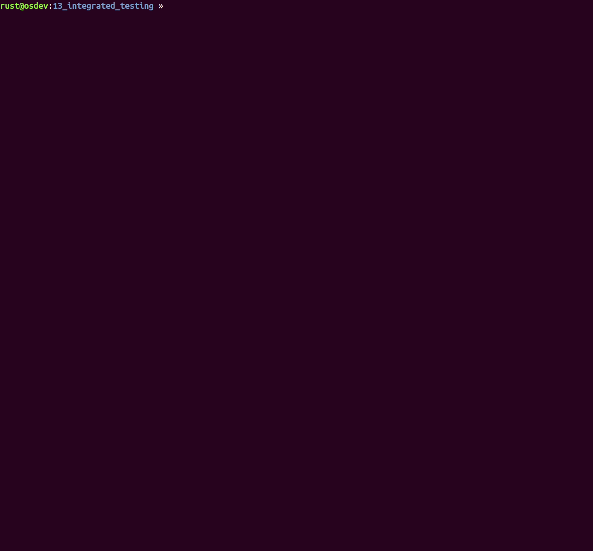

# Tutorial 12 - Integrated Testing

## tl;dr

- We implement our own test framework using `Rust`'s [custom_test_frameworks] feature by enabling
  `Unit Tests` and `Integration Tests` using `QEMU`.
- It is also possible to have test automation for the kernel's `console` (provided over `UART` in
  our case): Sending strings/characters to the console and expecting specific answers in return.



## Table of Contents

- [Introduction](#introduction)
- [Challenges](#challenges)
  * [Acknowledgements](#acknowledgements)
- [Implementation](#implementation)
  * [Test Organization](#test-organization)
  * [Enabling `custom_test_frameworks` for Unit Tests](#enabling-custom_test_frameworks-for-unit-tests)
    + [The Unit Test Runner](#the-unit-test-runner)
    + [Calling the Test `main()` Function](#calling-the-test-main-function)
  * [Quitting QEMU with user-defined Exit Codes](#quitting-qemu-with-user-defined-exit-codes)
    + [Exiting Unit Tests](#exiting-unit-tests)
  * [Controlling Test Kernel Execution](#controlling-test-kernel-execution)
    + [Wrapping QEMU Test Execution](#wrapping-qemu-test-execution)
  * [Writing Unit Tests](#writing-unit-tests)
  * [Integration Tests](#integration-tests)
    + [Test Harness](#test-harness)
    + [No Test Harness](#no-test-harness)
    + [Overriding Panic Behavior](#overriding-panic-behavior)
  * [Console Tests](#console-tests)
- [Test it](#test-it)
- [Diff to previous](#diff-to-previous)

## Introduction

Through the course of the previous tutorials, we silently started to adopt a kind of anti-pattern:
Using the kernel's main function to not only boot the target, but also test or showcase
functionality. For example:
  - Stalling execution during boot to test the kernel's timekeeping code by spinning for 1 second.
  - Willingly causing exceptions to see the exception handler running.

The feature set of the kernel is now rich enough so that it makes sense to introduce proper testing
modeled after Rust's [native testing framework]. This tutorial extends our kernel with three basic
testing facilities:
  - Classic `Unit Tests`.
  - [Integration Tests] (self-contained tests stored in the `$CRATE/tests/` directory).
  - `Console Tests`. These are integration tests acting on external stimuli - aka `console` input.
    Sending strings/characters to the console and expecting specific answers in return.

[native testing framework]: https://doc.rust-lang.org/book/ch11-00-testing.html

## Challenges

Testing Rust `#![no_std]` code like our kernel is, at the point of writing this tutorial, not an
easy endeavor. The short version is: We cannot use Rust's [native testing framework] straight away.
Utilizing the `#[test]` attribute macro and running `cargo test` would throw compilation errors,
because there are dependencies on the standard library.

[native testing framework]: https://doc.rust-lang.org/book/ch11-00-testing.html

We have to fall back to Rust's unstable [custom_test_frameworks] feature. It relieves us from
dependencies on the standard library, but comes at the cost of having a reduced feature set. Instead
of annotating functions with `#[test]`, the `#[test_case]` attribute must be used. Additionally, we
need to write a `test_runner` function, which is supposed to execute all the functions annotated
with `#[test_case]`. This is barely enough to get `Unit Tests` running, though. There will be some
more challenges that need solving for getting `Integration Tests` running as well.

Please note that for automation purposes, all testing will be done in `QEMU` and not on real
hardware.

[custom_test_frameworks]: https://doc.rust-lang.org/unstable-book/language-features/custom-test-frameworks.html
[Integration Tests]: https://doc.rust-lang.org/book/ch11-03-test-organization.html#integration-tests

### Acknowledgements

On this occasion, kudos to [@phil-opp] for his x86-based [testing] article. It helped a lot in
putting together this tutorial. Please go ahead and read it for a different perspective and
additional insights.

[testing]: https://os.phil-opp.com/testing

## Implementation

We introduce a new `Makefile` target:

```console
$ make test
```

In essence, `make test` will execute `cargo test` instead of `cargo rustc`. The details will be
explained in due course. The rest of the tutorial will explain as chronologically as possible what
happens when `make test` aka `cargo test` runs.

### Test Organization

Until now, our kernel was a so-called `binary crate`. As [explained in the official Rust book], this
crate type disallows having `integration tests`. Quoting the book:

[explained in the official Rust book]: https://doc.rust-lang.org/book/ch11-03-test-organization.html#integration-tests-for-binary-crates

> If our project is a binary crate that only contains a _src/main.rs_ file and doesn’t have a
> _src/lib.rs_ file, we can’t create integration tests in the _tests_ directory and bring functions
> defined in the _src/main.rs_ file into scope with a `use` statement. Only library crates expose
> functions that other crates can use; binary crates are meant to be run on their own.

> This is one of the reasons Rust projects that provide a binary have a straightforward
> _src/main.rs_ file that calls logic that lives in the _src/lib.rs_ file. Using that structure,
> integration tests _can_ test the library crate with `use` to make the important functionality
> available. If the important functionality works, the small amount of code in the _src/main.rs_
> file will work as well, and that small amount of code doesn’t need to be tested.

So let's do that first: We add a `lib.rs` to our crate that aggregates and exports the lion's share
of the kernel code. The `main.rs` file is stripped down to the minimum. It only keeps the
`kernel_init() -> !` and `kernel_main() -> !` functions, everything else is brought into scope with
`use` statements.

Since it is not possible to use `kernel` as the name for both the library and the binary part of the
crate, new entries in `Cargo.toml` are needed to differentiate the names. What's more, `cargo test`
would try to compile and run `unit tests` for both. In our case, it will be sufficient to have all
the unit test code in `lib.rs`, so test generation for `main.rs` can be disabled in `Cargo.toml` as
well through the `test` flag:

```toml
[lib]
name = "libkernel"
test = true

[[bin]]
name = "kernel"
test = false
```

### Enabling `custom_test_frameworks` for Unit Tests

In `lib.rs`, we add the following headers to get started with `custom_test_frameworks`:

```rust
// Testing
#![cfg_attr(test, no_main)]
#![feature(custom_test_frameworks)]
#![reexport_test_harness_main = "test_main"]
#![test_runner(crate::test_runner)]
```

Since this is a library now, we do not keep the `#![no_main]` inner attribute that `main.rs` has,
because a library has no `main()` entry function, so the attribute does not apply. When compiling
for testing, though, it is still needed. The reason is that `cargo test` basically turns `lib.rs`
into a binary again by inserting a generated `main()` function (which is then calling a function
that runs all the unit tests, but more about that in a second...).

However, since  our kernel code [overrides the compiler-inserted `main` shim] by way of using
`#![no_main]`, we need the same when `cargo test` is producing its test kernel binary. After all,
what we want is a minimal kernel that boots on the target and runs its own unit tests. Therefore, we
conditionally set this attribute (`#![cfg_attr(test, no_main)]`) when the `test` flag is set, which
it is when `cargo test` runs.

[overrides the compiler-inserted `main` shim]: https://doc.rust-lang.org/unstable-book/language-features/lang-items.html?highlight=no_main#writing-an-executable-without-stdlib

#### The Unit Test Runner

The `#![test_runner(crate::test_runner)]` attribute declares the path of the test runner function
that we are supposed to provide. This is the one that will be called by the `cargo test` generated
`main()` function. Here is the implementation in `lib.rs`:

```rust
/// The default runner for unit tests.
pub fn test_runner(tests: &[&test_types::UnitTest]) {
    println!("Running {} tests", tests.len());
    println!("-------------------------------------------------------------------\n");
    for (i, test) in tests.iter().enumerate() {
        print!("{:>3}. {:.<58}", i + 1, test.name);

        // Run the actual test.
        (test.test_func)();

        // Failed tests call panic!(). Execution reaches here only if the test has passed.
        println!("[ok]")
    }
}
```

The function signature shows that `test_runner` takes one argument: A slice of
`test_types::UnitTest` references. This type definition lives in an external crate stored at
`$ROOT/test_types`. It is external because the type is also needed for a self-made [procedural
macro] that we'll use to write unit tests, and procedural macros _have_ to live in their own crate.
So to avoid a circular dependency between kernel and proc-macro, this split was needed. Anyways,
here is the type definition:

[procedural macro]: https://doc.rust-lang.org/reference/procedural-macros.html

```rust
/// Unit test container.
pub struct UnitTest {
    /// Name of the test.
    pub name: &'static str,

    /// Function pointer to the test.
    pub test_func: fn(),
}
```

A `UnitTest` provides a name and a classic function pointer to the unit test function. The
`test_runner` just iterates over the slice, prints the respective test's name and calls the test
function.

The convetion is that as long as the test function does not `panic!`, the test was successful.

#### Calling the Test `main()` Function

The last of the attributes we added is `#![reexport_test_harness_main = "test_main"]`. Remember that
our kernel uses the `no_main` attribute, and that we also set it for the test compilation. We did
that because we wrote our own `_start()` function, which kicks off the following call chain during
kernel boot:

| | Function  | File |
| - | - | - |
| 1. | `_start()` | `lib.rs` |
| 2. | (some more aarch64 code) | `lib.rs` |
| 3. | `runtime_init()` | `lib.rs` |
| 4. | `kernel_init()` | `main.rs` |
| 5. | `kernel_main()` | `main.rs` |

A function named `main` is never called. Hence, the `main()` function generated by `cargo test`
would be silently dropped, and therefore the tests would never be executed. As you can see,
`runtime_init()` is the last function residing in our carved-out `lib.rs`, and it calls into
`kernel_init()`. So in order to get the tests to execute, we add a test-environment version of
`kernel_init()` to `lib.rs` as well (conditional compilation ensures it is only present when the
test flag is set), and call the `cargo test` generated `main()` function from there.

This is where `#![reexport_test_harness_main = "test_main"]` finally comes into picture. It declares
the name of the generated main function so that we can manually call it. Here is the final
implementation in `lib.rs`:

```rust
/// The `kernel_init()` for unit tests. Called from `runtime_init()`.
#[cfg(test)]
#[no_mangle]
unsafe fn kernel_init() -> ! {
    exception::handling_init();
    bsp::console::qemu_bring_up_console();

    test_main();

    cpu::qemu_exit_success()
}
```

Note the call to `bsp::console::qemu_bring_up_console()`. Since we are running all our tests inside
`QEMU`, we need to ensure that whatever peripheral implements the kernel's `console` interface is
initialized, so that we can print from our tests. If you recall [tutorial 03], bringing up
peripherals in `QEMU` might not need the full initialization as is needed on real hardware (setting
clocks, config registers, etc...) due to the abstractions in `QEMU`'s emulation code. So this is an
opportunity to cut down on setup code.

[tutorial 03]: ../03_hacky_hello_world

As a matter of fact, for the `Raspberrys`, nothing needs to be done, so the function is empy. But
this might be different for other hardware emulated by QEMU, so it makes sense to introduce the
function now to make it easier in case new `BSPs` are added to the kernel in the future.

Next, the reexported `test_main()` is called, which will call our `test_runner()` which finally
prints the unit test names and executes them.

### Quitting QEMU with user-defined Exit Codes

Let's recap where we are right now:

We've enabled `custom_test_frameworks` in `lib.rs` to a point where, when using `make test`, the
code gets compiled to a test kernel binary that eventually executes all the (yet-to-be-defined)
`UnitTest` instances by executing all the way from `_start()` to our `test_runner()` function.

Through mechanisms that are explained later, `cargo` will now instantiate a `QEMU` process that
exectues this test kernel. The question now is: How is test success/failure communicated to `cargo`?
Answer: `cargo` inspects `QEMU`'s [exit status]:

  - `0` translates to testing was successful.
  - `non-0` means failure.

Hence, we need a clever trick now so that our Rust kernel code can get `QEMU` to exit itself with an
exit status that the kernel code supplies. In [@phil-opp]'s testing article, you [learned how to do
this] for `x86 QEMU` systems by using a special `ISA` debug-exit device. Unfortunately, we can't
have that one for our `aarch64` system because it is not compatible.

In our case, we can leverage the ARM [semihosting] emulation of `QEMU` and do a `SYS_EXIT`
semihosting call with an additional parameter for the exit code. I've written a separate crate,
[qemu-exit], to do this. So let us import it and utilize it in `_arch/aarch64/cpu.rs` to provide the
following exit calls for the kernel:

```rust
//--------------------------------------------------------------------------------------------------
// Testing
//--------------------------------------------------------------------------------------------------
#[cfg(feature = "test_build")]
use qemu_exit::QEMUExit;

#[cfg(feature = "test_build")]
const QEMU_EXIT_HANDLE: qemu_exit::AArch64 = qemu_exit::AArch64::new();

/// Make the host QEMU binary execute `exit(1)`.
#[cfg(feature = "test_build")]
pub fn qemu_exit_failure() -> ! {
    QEMU_EXIT_HANDLE.exit_failure()
}

/// Make the host QEMU binary execute `exit(0)`.
#[cfg(feature = "test_build")]
pub fn qemu_exit_success() -> ! {
    QEMU_EXIT_HANDLE.exit_success()
}
```

[Click here] in case you are interested in the implementation. Note that for the functions to work,
the `-semihosting` flag must be added to the `QEMU` invocation.

You might have also noted the `#[cfg(feature = "test_build")]`. In the `Makefile`, we ensure that
this feature is only enabled when `cargo test` runs. This way, it is ensured that testing-specific
code is conditionally compiled only for testing.

[exit status]: https://en.wikipedia.org/wiki/Exit_status
[@phil-opp]: https://github.com/phil-opp
[learned how to do this]: https://os.phil-opp.com/testing/#exiting-qemu
[semihosting]: https://static.docs.arm.com/100863/0200/semihosting.pdf
[qemu-exit]: https://github.com/andre-richter/qemu-exit
[Click here]: https://github.com/andre-richter/qemu-exit/blob/master/src/aarch64.rs

#### Exiting Unit Tests

Unit test failure shall be triggered by the `panic!` macro, either directly or by way of using
`assert!` macros. Until now, our `panic!` implementation finally called `cpu::wait_forever()` to
safely park the panicked CPU core in a busy loop. This can't be used for the unit tests, because
`cargo` would wait forever for `QEMU` to exit and stall the whole test run. Again, conditional
compilation is used to differentiate between a release and testing version of how a `panic!`
concludes:

```rust
/// The point of exit for `libkernel`.
///
/// It is linked weakly, so that the integration tests can overload its standard behavior.
#[linkage = "weak"]
#[no_mangle]
fn _panic_exit() -> ! {
    #[cfg(not(test_build))]
    {
        cpu::wait_forever()
    }

    #[cfg(test_build)]
    {
        cpu::qemu_exit_failure()
    }
}
```

In case none of the unit tests panicked, `lib.rs`'s `kernel_init()` calls `cpu::qemu_exit_success()`
to successfully conclude the unit test run.

### Controlling Test Kernel Execution

Now is a good time to catch up on how the test kernel binary is actually being executed. Normally,
`cargo test` would try to execute the compiled binary as a normal child process. This would fail
horribly because we build a kernel, and not a userspace process. Also, chances are very high that
you sit in front of an `x86` machine, whereas the RPi kernel is `AArch64`.

Therefore, we need to install some hooks that make sure the test kernel gets executed inside `QEMU`,
quite like it is done for the existing `make qemu` target that is in place since tutorial 1. The
first step is to add a new file to the project, `.cargo/config.toml`:

```toml
[target.'cfg(target_os = "none")']
runner = "target/kernel_test_runner.sh"
```

Instead of executing a compilation result directly, the `runner` flag will instruct `cargo` to
delegate the execution. Using the setting depicted above, `target/kernel_test_runner.sh` will be
executed and given the full path to the compiled test kernel as the first command line argument.

The file `kernel_test_runner.sh` does not exist by default. We generate it on demand throguh the
`make test` target:

```Makefile
define KERNEL_TEST_RUNNER
    #!/usr/bin/env bash

    TEST_ELF=$$(echo $$1 | sed -e 's/.*target/target/g')
    TEST_BINARY=$$(echo $$1.img | sed -e 's/.*target/target/g')

    $(OBJCOPY_CMD) $$TEST_ELF $$TEST_BINARY
    $(DOCKER_TEST) ruby tests/runner.rb $(EXEC_QEMU) $(QEMU_TEST_ARGS) -kernel $$TEST_BINARY
endef

export KERNEL_TEST_RUNNER
test: FEATURES += --features test_build
test:
	@mkdir -p target
	@echo "$$KERNEL_TEST_RUNNER" > target/kernel_test_runner.sh
	@chmod +x target/kernel_test_runner.sh
	RUSTFLAGS="$(RUSTFLAGS_PEDANTIC)" $(TEST_CMD) $(TEST_ARG)
```

It first does the standard `objcopy` step to strip the `ELF` down to a raw binary. Just like in all
the other Makefile targets. Next, the script generates a relative path from the absolute path
provided to it by `cargo`, and finally compiles a `docker` command to execute the test kernel. For
reference, here it is fully resolved for an `RPi3 BSP`:

```bash
docker run -i --rm -v /opt/rust-raspberrypi-OS-tutorials/12_integrated_testing:/work/tutorial -w /work/tutorial rustembedded/osdev-utils ruby tests/runner.rb qemu-system-aarch64 -M raspi3 -serial stdio -display none -semihosting -kernel $TEST_BINARY
```

We're still not done with all the redirections. Spotted the `ruby tests/runner.rb` part that gets
excuted inside Docker?

#### Wrapping QEMU Test Execution

`runner.rb` is a [Ruby] wrapper script around `QEMU` that, for unit tests, catches the case that a
test gets stuck, e.g. in an unintentional busy loop or a crash. If `runner.rb` does not observe any
output of the test kernel for `5 seconds`, it cancels the execution and reports a failure back to
`cargo`. If `QEMU` exited itself by means of `aarch64::exit_success() / aarch64::exit_failure()`,
the respective exit status code is passed through. The essential part happens here in `class
RawTest`:

```ruby
def exec
    error = 'Timed out waiting for test'
    io = IO.popen(@qemu_cmd)

    while IO.select([io], nil, nil, MAX_WAIT_SECS)
        begin
            @output << io.read_nonblock(1024)
        rescue EOFError
            io.close
            error = $CHILD_STATUS.to_i != 0
            break
        end
    end
```

[Ruby]: https://www.ruby-lang.org/

### Writing Unit Tests

Alright, that's a wrap for the whole chain from `make test` all the way to reporting the test exit
status back to `cargo test`. It is a lot to digest already, but we haven't even learned to write
`Unit Tests` yet.

In essence, it is almost like in `std` environments, with the difference that `#[test]` can't be
used, because it is part of the standard library. The `no_std` replacement attribute provided by
`custom_test_frameworks` is `#[test_case]`. You can put `#[test_case]` before functions, constants
or statics (you have to decide for one and stick with it). Each attributed item is added to the
"list" that is then passed to the `test_runner` function.

As you learned earlier, we decided that our tests shall be instances of `test_types::UnitTest`. Here
is the type definition again:

```rust
/// Unit test container.
pub struct UnitTest {
    /// Name of the test.
    pub name: &'static str,

    /// Function pointer to the test.
    pub test_func: fn(),
}
```

So what we could do now is write something like:

```rust
#[cfg(test)]
mod tests {
    use super::*;

    #[test_case]
    const TEST1: test_types::UnitTest = test_types::UnitTest {
            name: "test_runner_executes_in_kernel_mode",
            test_func: || {
                let (level, _) = current_privilege_level();

                assert!(level == PrivilegeLevel::Kernel)
            },
        };
}
```

Since this is a bit boiler-platy with the const and name definition, let's write a [procedural
macro] named `#[kernel_test]` to simplify this. It should work this way:

  1. Must be put before functions that take no arguments and return nothing.
  2. Automatically constructs a `const UnitTest` from attributed functions like shown above by:
      1. Converting the function name to the `name` member of the `UnitTest` struct.
      2. Populating the `test_func` member with a closure that executes the body of the attributed
         function.

For the sake of brevity, we're not going to discuss the macro implementation. [The source is in the
test-macros crate] if you're interested in it. Using the macro, the example shown before now boils
down to this (this is now an actual example from [exception.rs]:

[procedural macro]: https://doc.rust-lang.org/reference/procedural-macros.html
[The source is in the test-macros crate]: test-macros/src/lib.rs
[exception.rs]: src/exception.rs

```rust
#[cfg(test)]
mod tests {
    use super::*;
    use test_macros::kernel_test;

    /// Libkernel unit tests must execute in kernel mode.
    #[kernel_test]
    fn test_runner_executes_in_kernel_mode() {
        let (level, _) = current_privilege_level();

        assert!(level == PrivilegeLevel::Kernel)
    }
}
```

Note that since proc macros need to live in their own crates, we need to create a new one at
`$ROOT/test-macros` and save it there.

Aaaaaand that's how you write unit tests. We're finished with that part for good now :raised_hands:.

### Integration Tests

We are still not done with the tutorial, though :scream:.

Integration tests need some special attention here and there too. As you already learned, they live
in `$CRATE/tests/`. Each `.rs` file in there gets compiled into its own test kernel binary and
executed separately by `cargo test`. The code in the integration tests includes the library part of
our kernel (`libkernel`) through `use` statements.

Also note that the entry point for each `integration test` must be the `kernel_init()` function
again, just like in the `unit test` case.

#### Test Harness

By default, `cargo test` will pull in the test harness (that's the official name for the generated
`main()` function) into integration tests as well. This gives you a further means of partitioning
your test code into individual chunks. For example, take a look at `tests/01_timer_sanity.rs`:

```rust
//! Timer sanity tests.

#![feature(custom_test_frameworks)]
#![no_main]
#![no_std]
#![reexport_test_harness_main = "test_main"]
#![test_runner(libkernel::test_runner)]

use core::time::Duration;
use libkernel::{bsp, cpu, exception, time, time::interface::TimeManager};
use test_macros::kernel_test;

#[no_mangle]
unsafe fn kernel_init() -> ! {
    exception::handling_init();
    bsp::console::qemu_bring_up_console();

    // Depending on CPU arch, some timer bring-up code could go here. Not needed for the RPi.

    test_main();

    cpu::qemu_exit_success()
}

/// Simple check that the timer is running.
#[kernel_test]
fn timer_is_counting() {
    assert!(time::time_manager().uptime().as_nanos() > 0)
}

/// Timer resolution must be sufficient.
#[kernel_test]
fn timer_resolution_is_sufficient() {
    assert!(time::time_manager().resolution().as_nanos() < 100)
}
```

Note how the `test_runner` from `libkernel` is pulled in through
`#![test_runner(libkernel::test_runner)]`.

#### No Test Harness

For some tests, however, it is not needed to have the harness, because there is no need or
possibility to partition the test into individual pieces. In this case, all the test code can live
in `kernel_init()`, and harness generation can be turned off through `Cargo.toml`. This tutorial
introduces two tests that don't need a harness. Here is how harness generation is turned off for
them:

```toml
# List of tests without harness.
[[test]]
name = "00_console_sanity"
harness = false

[[test]]
name = "02_exception_sync_page_fault"
harness = false
```

#### Overriding Panic Behavior

Did you notice the `#[linkage = "weak"]` attribute some chapters earlier at the `_panic_exit()`
function? This marks the function in `lib.rs` as a [weak symbol]. Let's look at it again:

```rust
/// The point of exit for `libkernel`.
///
/// It is linked weakly, so that the integration tests can overload its standard behavior.
#[linkage = "weak"]
#[no_mangle]
fn _panic_exit() -> ! {
    #[cfg(not(test_build))]
    {
        cpu::wait_forever()
    }

    #[cfg(test_build)]
    {
        cpu::qemu_exit_failure()
    }
}
```

[weak symbol]: https://en.wikipedia.org/wiki/Weak_symbol

This enables integration tests in `$CRATE/tests/` to override this function according to their
needs. This is useful because depending on the kind of test, a `panic!` could mean success or
failure. For example, `tests/02_exception_sync_page_fault.rs` is intentionally causing a page fault,
so the wanted outcome is a `panic!`. Here is the whole test (minus some inline comments):

```rust
//! Page faults must result in synchronous exceptions.

#![feature(format_args_nl)]
#![no_main]
#![no_std]

mod panic_exit_success;

use libkernel::{bsp, cpu, exception, memory, println};

#[no_mangle]
unsafe fn kernel_init() -> ! {
    use memory::mmu::interface::MMU;

    exception::handling_init();
    bsp::console::qemu_bring_up_console();

    println!("Testing synchronous exception handling by causing a page fault");
    println!("-------------------------------------------------------------------\n");

    if let Err(string) = memory::mmu::mmu().init() {
        println!("MMU: {}", string);
        cpu::qemu_exit_failure()
    }

    println!("Writing beyond mapped area to address 9 GiB...");
    let big_addr: u64 = 9 * 1024 * 1024 * 1024;
    core::ptr::read_volatile(big_addr as *mut u64);

    // If execution reaches here, the memory access above did not cause a page fault exception.
    cpu::qemu_exit_failure()
}

```

The `_panic_exit()` version that makes `QEMU` return `0` (indicating test success) is pulled in by
`mod panic_exit_success;`, and it will take precedence over the `weak` version from `lib.rs`.

### Console Tests

As the kernel or OS grows, it will be more and more interesting to test user/kernel interaction
through the serial console. That is, sending strings/characters to the console and expecting
specific answers in return. The `runner.rb` wrapper script provides infrastructure to do this with
little overhead. It basically works like this:

  1. For each integration test, check if a companion file to the `.rs` test file exists.
      - A companion file has the same name, but ends in `.rb`.
      - The companion file contains one or more console subtests.
  2. If it exists, load the file to dynamically import the console subtests.
  3. Spawn `QEMU` and attach to the serial console.
  4. Run the console subtests.

Here is an excerpt from `00_console_sanity.rb` showing a subtest that does a handshake with the
kernel over the console:

```ruby
TIMEOUT_SECS = 3

# Verify sending and receiving works as expected.
class TxRxHandshake
    def name
        'Transmit and Receive handshake'
    end

    def run(qemu_out, qemu_in)
        qemu_in.write_nonblock('ABC')
        raise('TX/RX test failed') if qemu_out.expect('OK1234', TIMEOUT_SECS).nil?
    end
end
```

The subtest first sends `"ABC"` over the console to the kernel, and then expects to receive
`"OK1234"` back. On the kernel side, it looks like this in `00_console_sanity.rs`:

```rust
#![feature(format_args_nl)]
#![no_main]
#![no_std]

use libkernel::{bsp, console, exception, print};

#[no_mangle]
unsafe fn kernel_init() -> ! {
    use bsp::console::console;
    use console::interface::*;

    exception::handling_init();
    bsp::console::qemu_bring_up_console();

    // Handshake
    assert_eq!(console().read_char(), 'A');
    assert_eq!(console().read_char(), 'B');
    assert_eq!(console().read_char(), 'C');
    print!("OK1234");
```

## Test it

Believe it or not, that is all. There are three ways you can run tests:

  1. `make test` will run all tests back-to-back.
  2. `TEST=unit make test` will run `libkernel`'s unit tests.
  3. `TEST=TEST_NAME make test` will run a specficic integration test.
      - For example, `TEST=01_timer_sanity make test`

```console
$ make test
[...]

     Running unittests (target/aarch64-unknown-none-softfloat/release/deps/libkernel-836110ac5dd535ba)
         -------------------------------------------------------------------
         🦀 Running 8 tests
         -------------------------------------------------------------------

           1. virt_mem_layout_sections_are_64KiB_aligned................[ok]
           2. virt_mem_layout_has_no_overlaps...........................[ok]
           3. test_runner_executes_in_kernel_mode.......................[ok]
           4. kernel_tables_in_bss......................................[ok]
           5. size_of_tabledescriptor_equals_64_bit.....................[ok]
           6. size_of_pagedescriptor_equals_64_bit......................[ok]
           7. zero_volatile_works.......................................[ok]
           8. bss_section_is_sane.......................................[ok]

         -------------------------------------------------------------------
         ✅ Success: libkernel
         -------------------------------------------------------------------


     Running tests/00_console_sanity.rs (target/aarch64-unknown-none-softfloat/release/deps/00_console_sanity-78c12c5472d40df7)
         -------------------------------------------------------------------
         🦀 Running 3 console-based tests
         -------------------------------------------------------------------

           1. Transmit and Receive handshake............................[ok]
           2. Transmit statistics.......................................[ok]
           3. Receive statistics........................................[ok]

         -------------------------------------------------------------------
         ✅ Success: 00_console_sanity
         -------------------------------------------------------------------


     Running tests/01_timer_sanity.rs (target/aarch64-unknown-none-softfloat/release/deps/01_timer_sanity-4866734b14c83c9b)
         -------------------------------------------------------------------
         🦀 Running 3 tests
         -------------------------------------------------------------------

           1. timer_is_counting.........................................[ok]
           2. timer_resolution_is_sufficient............................[ok]
           3. spin_accuracy_check_1_second..............................[ok]

         -------------------------------------------------------------------
         ✅ Success: 01_timer_sanity
         -------------------------------------------------------------------


     Running tests/02_exception_sync_page_fault.rs (target/aarch64-unknown-none-softfloat/release/deps/02_exception_sync_page_fault-f2d0885cada1105b)
         -------------------------------------------------------------------
         🦀 Testing synchronous exception handling by causing a page fault
         -------------------------------------------------------------------

         Writing beyond mapped area to address 9 GiB...

         Kernel panic:

         CPU Exception!
         FAR_EL1: 0x0000000240000000
         ESR_EL1: 0x96000004
         [...]

         -------------------------------------------------------------------
         ✅ Success: 02_exception_sync_page_fault
         -------------------------------------------------------------------
```

## Diff to previous
```diff

diff -uNr 11_exceptions_part1_groundwork/.cargo/config.toml 12_integrated_testing/.cargo/config.toml
--- 11_exceptions_part1_groundwork/.cargo/config.toml
+++ 12_integrated_testing/.cargo/config.toml
@@ -0,0 +1,2 @@
+[target.'cfg(target_os = "none")']
+runner = "target/kernel_test_runner.sh"

diff -uNr 11_exceptions_part1_groundwork/Cargo.toml 12_integrated_testing/Cargo.toml
--- 11_exceptions_part1_groundwork/Cargo.toml
+++ 12_integrated_testing/Cargo.toml
@@ -1,6 +1,6 @@
 [package]
 name = "mingo"
-version = "0.11.0"
+version = "0.12.0"
 authors = ["Andre Richter <andre.o.richter@gmail.com>"]
 edition = "2018"

@@ -11,20 +11,46 @@
 default = []
 bsp_rpi3 = ["register"]
 bsp_rpi4 = ["register"]
-
-[[bin]]
-name = "kernel"
-path = "src/main.rs"
+test_build = ["qemu-exit"]

 ##--------------------------------------------------------------------------------------------------
 ## Dependencies
 ##--------------------------------------------------------------------------------------------------

 [dependencies]
+test-types = { path = "test-types" }

 # Optional dependencies
-register = { version = "1.x.x", optional = true }
+register = { version = "1.x.x", features = ["no_std_unit_tests"], optional = true }
+qemu-exit = { version = "1.x.x", optional = true }

 # Platform specific dependencies
 [target.'cfg(target_arch = "aarch64")'.dependencies]
 cortex-a = { version = "5.x.x" }
+
+##--------------------------------------------------------------------------------------------------
+## Testing
+##--------------------------------------------------------------------------------------------------
+
+[dev-dependencies]
+test-macros = { path = "test-macros" }
+
+# Unit tests are done in the library part of the kernel.
+[lib]
+name = "libkernel"
+test = true
+
+# Disable unit tests for the kernel binary.
+[[bin]]
+name = "kernel"
+path = "src/main.rs"
+test = false
+
+# List of tests without harness.
+[[test]]
+name = "00_console_sanity"
+harness = false
+
+[[test]]
+name = "02_exception_sync_page_fault"
+harness = false

diff -uNr 11_exceptions_part1_groundwork/Makefile 12_integrated_testing/Makefile
--- 11_exceptions_part1_groundwork/Makefile
+++ 12_integrated_testing/Makefile
@@ -20,6 +20,7 @@
     QEMU_BINARY       = qemu-system-aarch64
     QEMU_MACHINE_TYPE = raspi3
     QEMU_RELEASE_ARGS = -serial stdio -display none
+    QEMU_TEST_ARGS    = $(QEMU_RELEASE_ARGS) -semihosting
     OBJDUMP_BINARY    = aarch64-none-elf-objdump
     NM_BINARY         = aarch64-none-elf-nm
     READELF_BINARY    = aarch64-none-elf-readelf
@@ -33,6 +34,7 @@
     QEMU_BINARY       = qemu-system-aarch64
     QEMU_MACHINE_TYPE =
     QEMU_RELEASE_ARGS = -serial stdio -display none
+    QEMU_TEST_ARGS    = $(QEMU_RELEASE_ARGS) -semihosting
     OBJDUMP_BINARY    = aarch64-none-elf-objdump
     NM_BINARY         = aarch64-none-elf-nm
     READELF_BINARY    = aarch64-none-elf-readelf
@@ -45,6 +47,15 @@
 # Export for build.rs
 export LINKER_FILE

+# Testing-specific arguments
+ifdef TEST
+    ifeq ($(TEST),unit)
+        TEST_ARG = --lib
+    else
+        TEST_ARG = --test $(TEST)
+    endif
+endif
+
 QEMU_MISSING_STRING = "This board is not yet supported for QEMU."

 RUSTFLAGS          = -C link-arg=-T$(LINKER_FILE) $(RUSTC_MISC_ARGS)
@@ -59,6 +70,7 @@
 DOC_CMD     = cargo doc $(COMPILER_ARGS)
 CLIPPY_CMD  = cargo clippy $(COMPILER_ARGS)
 CHECK_CMD   = cargo check $(COMPILER_ARGS)
+TEST_CMD    = cargo test $(COMPILER_ARGS)
 OBJCOPY_CMD = rust-objcopy \
     --strip-all            \
     -O binary
@@ -75,6 +87,7 @@

 DOCKER_QEMU  = $(DOCKER_CMD_INTERACT) $(DOCKER_IMAGE)
 DOCKER_GDB   = $(DOCKER_CMD_INTERACT) $(DOCKER_ARG_NET) $(DOCKER_IMAGE)
+DOCKER_TEST  = $(DOCKER_CMD) $(DOCKER_IMAGE)
 DOCKER_TOOLS = $(DOCKER_CMD) $(DOCKER_IMAGE)

 # Dockerize commands that require USB device passthrough only on Linux
@@ -91,8 +104,8 @@
 EXEC_QEMU     = $(QEMU_BINARY) -M $(QEMU_MACHINE_TYPE)
 EXEC_MINIPUSH = ruby ../utils/minipush.rb

-.PHONY: all $(KERNEL_ELF) $(KERNEL_BIN) doc qemu chainboot jtagboot openocd gdb gdb-opt0  clippy \
-    clean readelf objdump nm check
+.PHONY: all $(KERNEL_ELF) $(KERNEL_BIN) doc qemu test chainboot jtagboot openocd gdb gdb-opt0 \
+    clippy clean readelf objdump nm check

 all: $(KERNEL_BIN)

@@ -108,12 +121,31 @@
 	@$(DOC_CMD) --document-private-items --open

 ifeq ($(QEMU_MACHINE_TYPE),)
-qemu:
+qemu test:
 	$(call colorecho, "\n$(QEMU_MISSING_STRING)")
 else
 qemu: $(KERNEL_BIN)
 	$(call colorecho, "\nLaunching QEMU")
 	@$(DOCKER_QEMU) $(EXEC_QEMU) $(QEMU_RELEASE_ARGS) -kernel $(KERNEL_BIN)
+
+define KERNEL_TEST_RUNNER
+    #!/usr/bin/env bash
+
+    TEST_ELF=$$(echo $$1 | sed -e 's/.*target/target/g')
+    TEST_BINARY=$$(echo $$1.img | sed -e 's/.*target/target/g')
+
+    $(OBJCOPY_CMD) $$TEST_ELF $$TEST_BINARY
+    $(DOCKER_TEST) ruby tests/runner.rb $(EXEC_QEMU) $(QEMU_TEST_ARGS) -kernel $$TEST_BINARY
+endef
+
+export KERNEL_TEST_RUNNER
+test: FEATURES += --features test_build
+test:
+	$(call colorecho, "\nCompiling test(s) - $(BSP)")
+	@mkdir -p target
+	@echo "$$KERNEL_TEST_RUNNER" > target/kernel_test_runner.sh
+	@chmod +x target/kernel_test_runner.sh
+	@RUSTFLAGS="$(RUSTFLAGS_PEDANTIC)" $(TEST_CMD) $(TEST_ARG)
 endif

 chainboot: $(KERNEL_BIN)

diff -uNr 11_exceptions_part1_groundwork/src/_arch/aarch64/cpu.rs 12_integrated_testing/src/_arch/aarch64/cpu.rs
--- 11_exceptions_part1_groundwork/src/_arch/aarch64/cpu.rs
+++ 12_integrated_testing/src/_arch/aarch64/cpu.rs
@@ -26,3 +26,24 @@
         asm::wfe()
     }
 }
+
+//--------------------------------------------------------------------------------------------------
+// Testing
+//--------------------------------------------------------------------------------------------------
+#[cfg(feature = "test_build")]
+use qemu_exit::QEMUExit;
+
+#[cfg(feature = "test_build")]
+const QEMU_EXIT_HANDLE: qemu_exit::AArch64 = qemu_exit::AArch64::new();
+
+/// Make the host QEMU binary execute `exit(1)`.
+#[cfg(feature = "test_build")]
+pub fn qemu_exit_failure() -> ! {
+    QEMU_EXIT_HANDLE.exit_failure()
+}
+
+/// Make the host QEMU binary execute `exit(0)`.
+#[cfg(feature = "test_build")]
+pub fn qemu_exit_success() -> ! {
+    QEMU_EXIT_HANDLE.exit_success()
+}

diff -uNr 11_exceptions_part1_groundwork/src/_arch/aarch64/exception.rs 12_integrated_testing/src/_arch/aarch64/exception.rs
--- 11_exceptions_part1_groundwork/src/_arch/aarch64/exception.rs
+++ 12_integrated_testing/src/_arch/aarch64/exception.rs
@@ -12,7 +12,7 @@
 //! crate::exception::arch_exception

 use core::{cell::UnsafeCell, fmt};
-use cortex_a::{asm, barrier, regs::*};
+use cortex_a::{barrier, regs::*};
 use register::InMemoryRegister;

 // Assembly counterpart to this file.
@@ -87,16 +87,6 @@

 #[no_mangle]
 unsafe extern "C" fn current_elx_synchronous(e: &mut ExceptionContext) {
-    let far_el1 = FAR_EL1.get();
-
-    // This catches the demo case for this tutorial. If the fault address happens to be 8 GiB,
-    // advance the exception link register for one instruction, so that execution can continue.
-    if far_el1 == 8 * 1024 * 1024 * 1024 {
-        e.elr_el1 += 4;
-
-        asm::eret()
-    }
-
     default_exception_handler(e);
 }


diff -uNr 11_exceptions_part1_groundwork/src/_arch/aarch64/memory/mmu/translation_table.rs 12_integrated_testing/src/_arch/aarch64/memory/mmu/translation_table.rs
--- 11_exceptions_part1_groundwork/src/_arch/aarch64/memory/mmu/translation_table.rs
+++ 12_integrated_testing/src/_arch/aarch64/memory/mmu/translation_table.rs
@@ -286,3 +286,31 @@
         self.lvl2.phys_start_addr_u64()
     }
 }
+
+//--------------------------------------------------------------------------------------------------
+// Testing
+//--------------------------------------------------------------------------------------------------
+
+#[cfg(test)]
+mod tests {
+    use super::*;
+    use test_macros::kernel_test;
+
+    /// Check if the size of `struct TableDescriptor` is as expected.
+    #[kernel_test]
+    fn size_of_tabledescriptor_equals_64_bit() {
+        assert_eq!(
+            core::mem::size_of::<TableDescriptor>(),
+            core::mem::size_of::<u64>()
+        );
+    }
+
+    /// Check if the size of `struct PageDescriptor` is as expected.
+    #[kernel_test]
+    fn size_of_pagedescriptor_equals_64_bit() {
+        assert_eq!(
+            core::mem::size_of::<PageDescriptor>(),
+            core::mem::size_of::<u64>()
+        );
+    }
+}

diff -uNr 11_exceptions_part1_groundwork/src/_arch/aarch64/memory/mmu.rs 12_integrated_testing/src/_arch/aarch64/memory/mmu.rs
--- 11_exceptions_part1_groundwork/src/_arch/aarch64/memory/mmu.rs
+++ 12_integrated_testing/src/_arch/aarch64/memory/mmu.rs
@@ -162,3 +162,22 @@
         SCTLR_EL1.matches_all(SCTLR_EL1::M::Enable)
     }
 }
+
+//--------------------------------------------------------------------------------------------------
+// Testing
+//--------------------------------------------------------------------------------------------------
+
+#[cfg(test)]
+mod tests {
+    use super::*;
+    use test_macros::kernel_test;
+
+    /// Check if KERNEL_TABLES is in .bss.
+    #[kernel_test]
+    fn kernel_tables_in_bss() {
+        let bss_range = bsp::memory::bss_range_inclusive();
+        let kernel_tables_addr = unsafe { &KERNEL_TABLES as *const _ as usize as *mut u64 };
+
+        assert!(bss_range.contains(&kernel_tables_addr));
+    }
+}

diff -uNr 11_exceptions_part1_groundwork/src/bsp/raspberrypi/console.rs 12_integrated_testing/src/bsp/raspberrypi/console.rs
--- 11_exceptions_part1_groundwork/src/bsp/raspberrypi/console.rs
+++ 12_integrated_testing/src/bsp/raspberrypi/console.rs
@@ -35,3 +35,14 @@
 pub fn console() -> &'static impl console::interface::All {
     &super::PL011_UART
 }
+
+//--------------------------------------------------------------------------------------------------
+// Testing
+//--------------------------------------------------------------------------------------------------
+
+/// Minimal code needed to bring up the console in QEMU (for testing only). This is often less steps
+/// than on real hardware due to QEMU's abstractions.
+///
+/// For the RPi, nothing needs to be done.
+#[cfg(feature = "test_build")]
+pub fn qemu_bring_up_console() {}

diff -uNr 11_exceptions_part1_groundwork/src/bsp/raspberrypi/memory/mmu.rs 12_integrated_testing/src/bsp/raspberrypi/memory/mmu.rs
--- 11_exceptions_part1_groundwork/src/bsp/raspberrypi/memory/mmu.rs
+++ 12_integrated_testing/src/bsp/raspberrypi/memory/mmu.rs
@@ -69,3 +69,46 @@
 pub fn virt_mem_layout() -> &'static KernelVirtualLayout<NUM_MEM_RANGES> {
     &LAYOUT
 }
+
+//--------------------------------------------------------------------------------------------------
+// Testing
+//--------------------------------------------------------------------------------------------------
+
+#[cfg(test)]
+mod tests {
+    use super::*;
+    use test_macros::kernel_test;
+
+    /// Check alignment of the kernel's virtual memory layout sections.
+    #[kernel_test]
+    fn virt_mem_layout_sections_are_64KiB_aligned() {
+        const SIXTYFOUR_KIB: usize = 65536;
+
+        for i in LAYOUT.inner().iter() {
+            let start: usize = *(i.virtual_range)().start();
+            let end: usize = *(i.virtual_range)().end() + 1;
+
+            assert_eq!(start modulo SIXTYFOUR_KIB, 0);
+            assert_eq!(end modulo SIXTYFOUR_KIB, 0);
+            assert!(end >= start);
+        }
+    }
+
+    /// Ensure the kernel's virtual memory layout is free of overlaps.
+    #[kernel_test]
+    fn virt_mem_layout_has_no_overlaps() {
+        let layout = virt_mem_layout().inner();
+
+        for (i, first) in layout.iter().enumerate() {
+            for second in layout.iter().skip(i + 1) {
+                let first_range = first.virtual_range;
+                let second_range = second.virtual_range;
+
+                assert!(!first_range().contains(second_range().start()));
+                assert!(!first_range().contains(second_range().end()));
+                assert!(!second_range().contains(first_range().start()));
+                assert!(!second_range().contains(first_range().end()));
+            }
+        }
+    }
+}

diff -uNr 11_exceptions_part1_groundwork/src/cpu.rs 12_integrated_testing/src/cpu.rs
--- 11_exceptions_part1_groundwork/src/cpu.rs
+++ 12_integrated_testing/src/cpu.rs
@@ -14,3 +14,6 @@
 // Architectural Public Reexports
 //--------------------------------------------------------------------------------------------------
 pub use arch_cpu::{nop, wait_forever};
+
+#[cfg(feature = "test_build")]
+pub use arch_cpu::{qemu_exit_failure, qemu_exit_success};

diff -uNr 11_exceptions_part1_groundwork/src/exception.rs 12_integrated_testing/src/exception.rs
--- 11_exceptions_part1_groundwork/src/exception.rs
+++ 12_integrated_testing/src/exception.rs
@@ -28,3 +28,21 @@
     Hypervisor,
     Unknown,
 }
+
+//--------------------------------------------------------------------------------------------------
+// Testing
+//--------------------------------------------------------------------------------------------------
+
+#[cfg(test)]
+mod tests {
+    use super::*;
+    use test_macros::kernel_test;
+
+    /// Libkernel unit tests must execute in kernel mode.
+    #[kernel_test]
+    fn test_runner_executes_in_kernel_mode() {
+        let (level, _) = current_privilege_level();
+
+        assert!(level == PrivilegeLevel::Kernel)
+    }
+}

diff -uNr 11_exceptions_part1_groundwork/src/lib.rs 12_integrated_testing/src/lib.rs
--- 11_exceptions_part1_groundwork/src/lib.rs
+++ 12_integrated_testing/src/lib.rs
@@ -0,0 +1,184 @@
+// SPDX-License-Identifier: MIT OR Apache-2.0
+//
+// Copyright (c) 2018-2021 Andre Richter <andre.o.richter@gmail.com>
+
+// Rust embedded logo for `make doc`.
+#![doc(html_logo_url = "https://git.io/JeGIp")]
+
+//! The `kernel` library.
+//!
+//! Used to compose the final kernel binary.
+//!
+//! # Code organization and architecture
+//!
+//! The code is divided into different *modules*, each representing a typical **subsystem** of the
+//! `kernel`. Top-level module files of subsystems reside directly in the `src` folder. For example,
+//! `src/memory.rs` contains code that is concerned with all things memory management.
+//!
+//! ## Visibility of processor architecture code
+//!
+//! Some of the `kernel`'s subsystems depend on low-level code that is specific to the target
+//! processor architecture. For each supported processor architecture, there exists a subfolder in
+//! `src/_arch`, for example, `src/_arch/aarch64`.
+//!
+//! The architecture folders mirror the subsystem modules laid out in `src`. For example,
+//! architectural code that belongs to the `kernel`'s MMU subsystem (`src/memory/mmu.rs`) would go
+//! into `src/_arch/aarch64/memory/mmu.rs`. The latter file is loaded as a module in
+//! `src/memory/mmu.rs` using the `path attribute`. Usually, the chosen module name is the generic
+//! module's name prefixed with `arch_`.
+//!
+//! For example, this is the top of `src/memory/mmu.rs`:
+//!
+//! ```
+//! #[cfg(target_arch = "aarch64")]
+//! #[path = "../_arch/aarch64/memory/mmu.rs"]
+//! mod arch_mmu;
+//! ```
+//!
+//! Often times, items from the `arch_ module` will be publicly reexported by the parent module.
+//! This way, each architecture specific module can provide its implementation of an item, while the
+//! caller must not be concerned which architecture has been conditionally compiled.
+//!
+//! ## BSP code
+//!
+//! `BSP` stands for Board Support Package. `BSP` code is organized under `src/bsp.rs` and contains
+//! target board specific definitions and functions. These are things such as the board's memory map
+//! or instances of drivers for devices that are featured on the respective board.
+//!
+//! Just like processor architecture code, the `BSP` code's module structure tries to mirror the
+//! `kernel`'s subsystem modules, but there is no reexporting this time. That means whatever is
+//! provided must be called starting from the `bsp` namespace, e.g. `bsp::driver::driver_manager()`.
+//!
+//! ## Kernel interfaces
+//!
+//! Both `arch` and `bsp` contain code that is conditionally compiled depending on the actual target
+//! and board for which the kernel is compiled. For example, the `interrupt controller` hardware of
+//! the `Raspberry Pi 3` and the `Raspberry Pi 4` is different, but we want the rest of the `kernel`
+//! code to play nicely with any of the two without much hassle.
+//!
+//! In order to provide a clean abstraction between `arch`, `bsp` and `generic kernel code`,
+//! `interface` traits are provided *whenever possible* and *where it makes sense*. They are defined
+//! in the respective subsystem module and help to enforce the idiom of *program to an interface,
+//! not an implementation*. For example, there will be a common IRQ handling interface which the two
+//! different interrupt controller `drivers` of both Raspberrys will implement, and only export the
+//! interface to the rest of the `kernel`.
+//!
+//! ```
+//!         +-------------------+
+//!         | Interface (Trait) |
+//!         |                   |
+//!         +--+-------------+--+
+//!            ^             ^
+//!            |             |
+//!            |             |
+//! +----------+--+       +--+----------+
+//! | kernel code |       |  bsp code   |
+//! |             |       |  arch code  |
+//! +-------------+       +-------------+
+//! ```
+//!
+//! # Summary
+//!
+//! For a logical `kernel` subsystem, corresponding code can be distributed over several physical
+//! locations. Here is an example for the **memory** subsystem:
+//!
+//! - `src/memory.rs` and `src/memory/**/*`
+//!   - Common code that is agnostic of target processor architecture and `BSP` characteristics.
+//!     - Example: A function to zero a chunk of memory.
+//!   - Interfaces for the memory subsystem that are implemented by `arch` or `BSP` code.
+//!     - Example: An `MMU` interface that defines `MMU` function prototypes.
+//! - `src/bsp/__board_name__/memory.rs` and `src/bsp/__board_name__/memory/**/*`
+//!   - `BSP` specific code.
+//!   - Example: The board's memory map (physical addresses of DRAM and MMIO devices).
+//! - `src/_arch/__arch_name__/memory.rs` and `src/_arch/__arch_name__/memory/**/*`
+//!   - Processor architecture specific code.
+//!   - Example: Implementation of the `MMU` interface for the `__arch_name__` processor
+//!     architecture.
+//!
+//! From a namespace perspective, **memory** subsystem code lives in:
+//!
+//! - `crate::memory::*`
+//! - `crate::bsp::memory::*`
+//!
+//! # Boot flow
+//!
+//! 1. The kernel's entry point is the function `cpu::boot::arch_boot::_start()`.
+//!     - It is implemented in `src/_arch/__arch_name__/cpu/boot.s`.
+//! 2. Once finished with architectural setup, the arch code calls [`runtime_init::runtime_init()`].
+//!
+//! [`runtime_init::runtime_init()`]: runtime_init/fn.runtime_init.html
+
+#![allow(clippy::upper_case_acronyms)]
+#![allow(incomplete_features)]
+#![feature(const_fn_fn_ptr_basics)]
+#![feature(const_generics)]
+#![feature(const_panic)]
+#![feature(core_intrinsics)]
+#![feature(format_args_nl)]
+#![feature(global_asm)]
+#![feature(linkage)]
+#![feature(panic_info_message)]
+#![feature(trait_alias)]
+#![no_std]
+// Testing
+#![cfg_attr(test, no_main)]
+#![feature(custom_test_frameworks)]
+#![reexport_test_harness_main = "test_main"]
+#![test_runner(crate::test_runner)]
+
+mod panic_wait;
+mod runtime_init;
+mod synchronization;
+
+pub mod bsp;
+pub mod console;
+pub mod cpu;
+pub mod driver;
+pub mod exception;
+pub mod memory;
+pub mod print;
+pub mod time;
+
+//--------------------------------------------------------------------------------------------------
+// Public Code
+//--------------------------------------------------------------------------------------------------
+
+/// Version string.
+pub fn version() -> &'static str {
+    concat!(
+        env!("CARGO_PKG_NAME"),
+        " version ",
+        env!("CARGO_PKG_VERSION")
+    )
+}
+
+//--------------------------------------------------------------------------------------------------
+// Testing
+//--------------------------------------------------------------------------------------------------
+
+/// The default runner for unit tests.
+pub fn test_runner(tests: &[&test_types::UnitTest]) {
+    println!("Running {} tests", tests.len());
+    println!("-------------------------------------------------------------------\n");
+    for (i, test) in tests.iter().enumerate() {
+        print!("{:>3}. {:.<58}", i + 1, test.name);
+
+        // Run the actual test.
+        (test.test_func)();
+
+        // Failed tests call panic!(). Execution reaches here only if the test has passed.
+        println!("[ok]")
+    }
+}
+
+/// The `kernel_init()` for unit tests. Called from `runtime_init()`.
+#[cfg(test)]
+#[no_mangle]
+unsafe fn kernel_init() -> ! {
+    exception::handling_init();
+    bsp::console::qemu_bring_up_console();
+
+    test_main();
+
+    cpu::qemu_exit_success()
+}

diff -uNr 11_exceptions_part1_groundwork/src/main.rs 12_integrated_testing/src/main.rs
--- 11_exceptions_part1_groundwork/src/main.rs
+++ 12_integrated_testing/src/main.rs
@@ -6,130 +6,12 @@
 #![doc(html_logo_url = "https://git.io/JeGIp")]

 //! The `kernel` binary.
-//!
-//! # Code organization and architecture
-//!
-//! The code is divided into different *modules*, each representing a typical **subsystem** of the
-//! `kernel`. Top-level module files of subsystems reside directly in the `src` folder. For example,
-//! `src/memory.rs` contains code that is concerned with all things memory management.
-//!
-//! ## Visibility of processor architecture code
-//!
-//! Some of the `kernel`'s subsystems depend on low-level code that is specific to the target
-//! processor architecture. For each supported processor architecture, there exists a subfolder in
-//! `src/_arch`, for example, `src/_arch/aarch64`.
-//!
-//! The architecture folders mirror the subsystem modules laid out in `src`. For example,
-//! architectural code that belongs to the `kernel`'s MMU subsystem (`src/memory/mmu.rs`) would go
-//! into `src/_arch/aarch64/memory/mmu.rs`. The latter file is loaded as a module in
-//! `src/memory/mmu.rs` using the `path attribute`. Usually, the chosen module name is the generic
-//! module's name prefixed with `arch_`.
-//!
-//! For example, this is the top of `src/memory/mmu.rs`:
-//!
-//! ```
-//! #[cfg(target_arch = "aarch64")]
-//! #[path = "../_arch/aarch64/memory/mmu.rs"]
-//! mod arch_mmu;
-//! ```
-//!
-//! Often times, items from the `arch_ module` will be publicly reexported by the parent module.
-//! This way, each architecture specific module can provide its implementation of an item, while the
-//! caller must not be concerned which architecture has been conditionally compiled.
-//!
-//! ## BSP code
-//!
-//! `BSP` stands for Board Support Package. `BSP` code is organized under `src/bsp.rs` and contains
-//! target board specific definitions and functions. These are things such as the board's memory map
-//! or instances of drivers for devices that are featured on the respective board.
-//!
-//! Just like processor architecture code, the `BSP` code's module structure tries to mirror the
-//! `kernel`'s subsystem modules, but there is no reexporting this time. That means whatever is
-//! provided must be called starting from the `bsp` namespace, e.g. `bsp::driver::driver_manager()`.
-//!
-//! ## Kernel interfaces
-//!
-//! Both `arch` and `bsp` contain code that is conditionally compiled depending on the actual target
-//! and board for which the kernel is compiled. For example, the `interrupt controller` hardware of
-//! the `Raspberry Pi 3` and the `Raspberry Pi 4` is different, but we want the rest of the `kernel`
-//! code to play nicely with any of the two without much hassle.
-//!
-//! In order to provide a clean abstraction between `arch`, `bsp` and `generic kernel code`,
-//! `interface` traits are provided *whenever possible* and *where it makes sense*. They are defined
-//! in the respective subsystem module and help to enforce the idiom of *program to an interface,
-//! not an implementation*. For example, there will be a common IRQ handling interface which the two
-//! different interrupt controller `drivers` of both Raspberrys will implement, and only export the
-//! interface to the rest of the `kernel`.
-//!
-//! ```
-//!         +-------------------+
-//!         | Interface (Trait) |
-//!         |                   |
-//!         +--+-------------+--+
-//!            ^             ^
-//!            |             |
-//!            |             |
-//! +----------+--+       +--+----------+
-//! | kernel code |       |  bsp code   |
-//! |             |       |  arch code  |
-//! +-------------+       +-------------+
-//! ```
-//!
-//! # Summary
-//!
-//! For a logical `kernel` subsystem, corresponding code can be distributed over several physical
-//! locations. Here is an example for the **memory** subsystem:
-//!
-//! - `src/memory.rs` and `src/memory/**/*`
-//!   - Common code that is agnostic of target processor architecture and `BSP` characteristics.
-//!     - Example: A function to zero a chunk of memory.
-//!   - Interfaces for the memory subsystem that are implemented by `arch` or `BSP` code.
-//!     - Example: An `MMU` interface that defines `MMU` function prototypes.
-//! - `src/bsp/__board_name__/memory.rs` and `src/bsp/__board_name__/memory/**/*`
-//!   - `BSP` specific code.
-//!   - Example: The board's memory map (physical addresses of DRAM and MMIO devices).
-//! - `src/_arch/__arch_name__/memory.rs` and `src/_arch/__arch_name__/memory/**/*`
-//!   - Processor architecture specific code.
-//!   - Example: Implementation of the `MMU` interface for the `__arch_name__` processor
-//!     architecture.
-//!
-//! From a namespace perspective, **memory** subsystem code lives in:
-//!
-//! - `crate::memory::*`
-//! - `crate::bsp::memory::*`
-//!
-//! # Boot flow
-//!
-//! 1. The kernel's entry point is the function `cpu::boot::arch_boot::_start()`.
-//!     - It is implemented in `src/_arch/__arch_name__/cpu/boot.s`.
-//! 2. Once finished with architectural setup, the arch code calls [`runtime_init::runtime_init()`].
-//!
-//! [`runtime_init::runtime_init()`]: runtime_init/fn.runtime_init.html
-
-#![allow(clippy::upper_case_acronyms)]
-#![allow(incomplete_features)]
-#![feature(const_fn_fn_ptr_basics)]
-#![feature(const_generics)]
-#![feature(const_panic)]
-#![feature(core_intrinsics)]
+
 #![feature(format_args_nl)]
-#![feature(global_asm)]
-#![feature(panic_info_message)]
-#![feature(trait_alias)]
 #![no_main]
 #![no_std]

-mod bsp;
-mod console;
-mod cpu;
-mod driver;
-mod exception;
-mod memory;
-mod panic_wait;
-mod print;
-mod runtime_init;
-mod synchronization;
-mod time;
+use libkernel::{bsp, console, driver, exception, info, memory, time};

 /// Early init code.
 ///
@@ -140,6 +22,7 @@
 ///     - MMU + Data caching must be activated at the earliest. Without it, any atomic operations,
 ///       e.g. the yet-to-be-introduced spinlocks in the device drivers (which currently employ
 ///       NullLocks instead of spinlocks), will fail to work (properly) on the RPi SoCs.
+#[no_mangle]
 unsafe fn kernel_init() -> ! {
     use driver::interface::DriverManager;
     use memory::mmu::interface::MMU;
@@ -166,15 +49,9 @@
 fn kernel_main() -> ! {
     use bsp::console::console;
     use console::interface::All;
-    use core::time::Duration;
     use driver::interface::DriverManager;
-    use time::interface::TimeManager;

-    info!(
-        "{} version {}",
-        env!("CARGO_PKG_NAME"),
-        env!("CARGO_PKG_VERSION")
-    );
+    info!("{}", libkernel::version());
     info!("Booting on: {}", bsp::board_name());

     info!("MMU online. Special regions:");
@@ -200,31 +77,6 @@
         info!("      {}. {}", i + 1, driver.compatible());
     }

-    info!("Timer test, spinning for 1 second");
-    time::time_manager().spin_for(Duration::from_secs(1));
-
-    // Cause an exception by accessing a virtual address for which no translation was set up. This
-    // code accesses the address 8 GiB, which is outside the mapped address space.
-    //
-    // For demo purposes, the exception handler will catch the faulting 8 GiB address and allow
-    // execution to continue.
-    info!("");
-    info!("Trying to read from address 8 GiB...");
-    let mut big_addr: u64 = 8 * 1024 * 1024 * 1024;
-    unsafe { core::ptr::read_volatile(big_addr as *mut u64) };
-
-    info!("************************************************");
-    info!("Whoa! We recovered from a synchronous exception!");
-    info!("************************************************");
-    info!("");
-    info!("Let's try again");
-
-    // Now use address 9 GiB. The exception handler won't forgive us this time.
-    info!("Trying to read from address 9 GiB...");
-    big_addr = 9 * 1024 * 1024 * 1024;
-    unsafe { core::ptr::read_volatile(big_addr as *mut u64) };
-
-    // Will never reach here in this tutorial.
     info!("Echoing input now");

     // Discard any spurious received characters before going into echo mode.

diff -uNr 11_exceptions_part1_groundwork/src/memory/mmu.rs 12_integrated_testing/src/memory/mmu.rs
--- 11_exceptions_part1_groundwork/src/memory/mmu.rs
+++ 12_integrated_testing/src/memory/mmu.rs
@@ -66,7 +66,6 @@

 /// Architecture agnostic translation types.
 #[allow(missing_docs)]
-#[allow(dead_code)]
 #[derive(Copy, Clone)]
 pub enum Translation {
     Identity,
@@ -261,4 +260,9 @@
             info!("{}", i);
         }
     }
+
+    #[cfg(test)]
+    pub fn inner(&self) -> &[TranslationDescriptor; NUM_SPECIAL_RANGES] {
+        &self.inner
+    }
 }

diff -uNr 11_exceptions_part1_groundwork/src/memory.rs 12_integrated_testing/src/memory.rs
--- 11_exceptions_part1_groundwork/src/memory.rs
+++ 12_integrated_testing/src/memory.rs
@@ -30,3 +30,40 @@
         ptr = ptr.offset(1);
     }
 }
+
+//--------------------------------------------------------------------------------------------------
+// Testing
+//--------------------------------------------------------------------------------------------------
+
+#[cfg(test)]
+mod tests {
+    use super::*;
+    use test_macros::kernel_test;
+
+    /// Check `zero_volatile()`.
+    #[kernel_test]
+    fn zero_volatile_works() {
+        let mut x: [usize; 3] = [10, 11, 12];
+        let x_range = x.as_mut_ptr_range();
+        let x_range_inclusive =
+            RangeInclusive::new(x_range.start, unsafe { x_range.end.offset(-1) });
+
+        unsafe { zero_volatile(x_range_inclusive) };
+
+        assert_eq!(x, [0, 0, 0]);
+    }
+
+    /// Check `bss` section layout.
+    #[kernel_test]
+    fn bss_section_is_sane() {
+        use crate::bsp::memory::bss_range_inclusive;
+        use core::mem;
+
+        let start = *bss_range_inclusive().start() as usize;
+        let end = *bss_range_inclusive().end() as usize;
+
+        assert_eq!(start modulo mem::size_of::<usize>(), 0);
+        assert_eq!(end modulo mem::size_of::<usize>(), 0);
+        assert!(end >= start);
+    }
+}

diff -uNr 11_exceptions_part1_groundwork/src/panic_wait.rs 12_integrated_testing/src/panic_wait.rs
--- 11_exceptions_part1_groundwork/src/panic_wait.rs
+++ 12_integrated_testing/src/panic_wait.rs
@@ -17,6 +17,23 @@
     unsafe { bsp::console::panic_console_out().write_fmt(args).unwrap() };
 }

+/// The point of exit for `libkernel`.
+///
+/// It is linked weakly, so that the integration tests can overload its standard behavior.
+#[linkage = "weak"]
+#[no_mangle]
+fn _panic_exit() -> ! {
+    #[cfg(not(test_build))]
+    {
+        cpu::wait_forever()
+    }
+
+    #[cfg(test_build)]
+    {
+        cpu::qemu_exit_failure()
+    }
+}
+
 /// Prints with a newline - only use from the panic handler.
 ///
 /// Carbon copy from <https://doc.rust-lang.org/src/std/macros.rs.html>
@@ -35,5 +52,5 @@
         panic_println!("\nKernel panic!");
     }

-    cpu::wait_forever()
+    _panic_exit()
 }

diff -uNr 11_exceptions_part1_groundwork/src/runtime_init.rs 12_integrated_testing/src/runtime_init.rs
--- 11_exceptions_part1_groundwork/src/runtime_init.rs
+++ 12_integrated_testing/src/runtime_init.rs
@@ -31,7 +31,10 @@
 ///
 /// - Only a single core must be active and running this function.
 pub unsafe fn runtime_init() -> ! {
-    zero_bss();
+    extern "Rust" {
+        fn kernel_init() -> !;
+    }

-    crate::kernel_init()
+    zero_bss();
+    kernel_init()
 }

diff -uNr 11_exceptions_part1_groundwork/test-macros/Cargo.toml 12_integrated_testing/test-macros/Cargo.toml
--- 11_exceptions_part1_groundwork/test-macros/Cargo.toml
+++ 12_integrated_testing/test-macros/Cargo.toml
@@ -0,0 +1,14 @@
+[package]
+name = "test-macros"
+version = "0.1.0"
+authors = ["Andre Richter <andre.o.richter@gmail.com>"]
+edition = "2018"
+
+[lib]
+proc-macro = true
+
+[dependencies]
+proc-macro2 = "1.x"
+quote = "1.x"
+syn = { version = "1.x", features = ["full"] }
+test-types = { path = "../test-types" }

diff -uNr 11_exceptions_part1_groundwork/test-macros/src/lib.rs 12_integrated_testing/test-macros/src/lib.rs
--- 11_exceptions_part1_groundwork/test-macros/src/lib.rs
+++ 12_integrated_testing/test-macros/src/lib.rs
@@ -0,0 +1,29 @@
+// SPDX-License-Identifier: MIT OR Apache-2.0
+//
+// Copyright (c) 2019-2021 Andre Richter <andre.o.richter@gmail.com>
+
+use proc_macro::TokenStream;
+use proc_macro2::Span;
+use quote::quote;
+use syn::{parse_macro_input, Ident, ItemFn};
+
+#[proc_macro_attribute]
+pub fn kernel_test(_attr: TokenStream, input: TokenStream) -> TokenStream {
+    let f = parse_macro_input!(input as ItemFn);
+
+    let test_name = &format!("{}", f.sig.ident.to_string());
+    let test_ident = Ident::new(
+        &format!("{}_TEST_CONTAINER", f.sig.ident.to_string().to_uppercase()),
+        Span::call_site(),
+    );
+    let test_code_block = f.block;
+
+    quote!(
+        #[test_case]
+        const #test_ident: test_types::UnitTest = test_types::UnitTest {
+            name: #test_name,
+            test_func: || #test_code_block,
+        };
+    )
+    .into()
+}

diff -uNr 11_exceptions_part1_groundwork/tests/00_console_sanity.rb 12_integrated_testing/tests/00_console_sanity.rb
--- 11_exceptions_part1_groundwork/tests/00_console_sanity.rb
+++ 12_integrated_testing/tests/00_console_sanity.rb
@@ -0,0 +1,50 @@
+# frozen_string_literal: true
+
+# SPDX-License-Identifier: MIT OR Apache-2.0
+#
+# Copyright (c) 2019-2021 Andre Richter <andre.o.richter@gmail.com>
+
+require 'expect'
+
+TIMEOUT_SECS = 3
+
+# Verify sending and receiving works as expected.
+class TxRxHandshake
+    def name
+        'Transmit and Receive handshake'
+    end
+
+    def run(qemu_out, qemu_in)
+        qemu_in.write_nonblock('ABC')
+        raise('TX/RX test failed') if qemu_out.expect('OK1234', TIMEOUT_SECS).nil?
+    end
+end
+
+# Check for correct TX statistics implementation. Depends on test 1 being run first.
+class TxStatistics
+    def name
+        'Transmit statistics'
+    end
+
+    def run(qemu_out, _qemu_in)
+        raise('chars_written reported wrong') if qemu_out.expect('6', TIMEOUT_SECS).nil?
+    end
+end
+
+# Check for correct RX statistics implementation. Depends on test 1 being run first.
+class RxStatistics
+    def name
+        'Receive statistics'
+    end
+
+    def run(qemu_out, _qemu_in)
+        raise('chars_read reported wrong') if qemu_out.expect('3', TIMEOUT_SECS).nil?
+    end
+end
+
+##--------------------------------------------------------------------------------------------------
+## Test registration
+##--------------------------------------------------------------------------------------------------
+def subtest_collection
+    [TxRxHandshake.new, TxStatistics.new, RxStatistics.new]
+end

diff -uNr 11_exceptions_part1_groundwork/tests/00_console_sanity.rs 12_integrated_testing/tests/00_console_sanity.rs
--- 11_exceptions_part1_groundwork/tests/00_console_sanity.rs
+++ 12_integrated_testing/tests/00_console_sanity.rs
@@ -0,0 +1,42 @@
+// SPDX-License-Identifier: MIT OR Apache-2.0
+//
+// Copyright (c) 2019-2021 Andre Richter <andre.o.richter@gmail.com>
+
+//! Console sanity tests - RX, TX and statistics.
+
+#![feature(format_args_nl)]
+#![no_main]
+#![no_std]
+
+use libkernel::{bsp, console, cpu, exception, print};
+
+#[no_mangle]
+unsafe fn kernel_init() -> ! {
+    use bsp::console::console;
+    use console::interface::*;
+
+    exception::handling_init();
+    bsp::console::qemu_bring_up_console();
+
+    // Handshake
+    assert_eq!(console().read_char(), 'A');
+    assert_eq!(console().read_char(), 'B');
+    assert_eq!(console().read_char(), 'C');
+    print!("OK1234");
+
+    // 6
+    print!("{}", console().chars_written());
+
+    // 3
+    print!("{}", console().chars_read());
+
+    // The QEMU process running this test will be closed by the I/O test harness.
+    // cpu::wait_forever();
+
+    // For some reason, in this test, rustc or the linker produces an empty binary when
+    // wait_forever() is used. Calling qemu_exit_success() fixes this behavior. So for the time
+    // being, the following lines are just a workaround to fix this compiler/linker weirdness.
+    use libkernel::time::interface::TimeManager;
+    libkernel::time::time_manager().spin_for(core::time::Duration::from_secs(3600));
+    cpu::qemu_exit_success()
+}

diff -uNr 11_exceptions_part1_groundwork/tests/01_timer_sanity.rs 12_integrated_testing/tests/01_timer_sanity.rs
--- 11_exceptions_part1_groundwork/tests/01_timer_sanity.rs
+++ 12_integrated_testing/tests/01_timer_sanity.rs
@@ -0,0 +1,49 @@
+// SPDX-License-Identifier: MIT OR Apache-2.0
+//
+// Copyright (c) 2019-2021 Andre Richter <andre.o.richter@gmail.com>
+
+//! Timer sanity tests.
+
+#![feature(custom_test_frameworks)]
+#![no_main]
+#![no_std]
+#![reexport_test_harness_main = "test_main"]
+#![test_runner(libkernel::test_runner)]
+
+use core::time::Duration;
+use libkernel::{bsp, cpu, exception, time, time::interface::TimeManager};
+use test_macros::kernel_test;
+
+#[no_mangle]
+unsafe fn kernel_init() -> ! {
+    exception::handling_init();
+    bsp::console::qemu_bring_up_console();
+
+    // Depending on CPU arch, some timer bring-up code could go here. Not needed for the RPi.
+
+    test_main();
+
+    cpu::qemu_exit_success()
+}
+
+/// Simple check that the timer is running.
+#[kernel_test]
+fn timer_is_counting() {
+    assert!(time::time_manager().uptime().as_nanos() > 0)
+}
+
+/// Timer resolution must be sufficient.
+#[kernel_test]
+fn timer_resolution_is_sufficient() {
+    assert!(time::time_manager().resolution().as_nanos() < 100)
+}
+
+/// Sanity check spin_for() implementation.
+#[kernel_test]
+fn spin_accuracy_check_1_second() {
+    let t1 = time::time_manager().uptime();
+    time::time_manager().spin_for(Duration::from_secs(1));
+    let t2 = time::time_manager().uptime();
+
+    assert_eq!((t2 - t1).as_secs(), 1)
+}

diff -uNr 11_exceptions_part1_groundwork/tests/02_exception_sync_page_fault.rs 12_integrated_testing/tests/02_exception_sync_page_fault.rs
--- 11_exceptions_part1_groundwork/tests/02_exception_sync_page_fault.rs
+++ 12_integrated_testing/tests/02_exception_sync_page_fault.rs
@@ -0,0 +1,43 @@
+// SPDX-License-Identifier: MIT OR Apache-2.0
+//
+// Copyright (c) 2019-2021 Andre Richter <andre.o.richter@gmail.com>
+
+//! Page faults must result in synchronous exceptions.
+
+#![feature(format_args_nl)]
+#![no_main]
+#![no_std]
+
+/// Overwrites libkernel's `panic_wait::_panic_exit()` so that it returns a "success" code.
+///
+/// In this test, teaching the panic is a success, because it is called from the synchronous
+/// exception handler, which is what this test wants to achieve.
+///
+/// It also means that this integration test can not use any other code that calls panic!() directly
+/// or indirectly.
+mod panic_exit_success;
+
+use libkernel::{bsp, cpu, exception, memory, println};
+
+#[no_mangle]
+unsafe fn kernel_init() -> ! {
+    use memory::mmu::interface::MMU;
+
+    exception::handling_init();
+    bsp::console::qemu_bring_up_console();
+
+    println!("Testing synchronous exception handling by causing a page fault");
+    println!("-------------------------------------------------------------------\n");
+
+    if let Err(string) = memory::mmu::mmu().enable_mmu_and_caching() {
+        println!("MMU: {}", string);
+        cpu::qemu_exit_failure()
+    }
+
+    println!("Writing beyond mapped area to address 9 GiB...");
+    let big_addr: u64 = 9 * 1024 * 1024 * 1024;
+    core::ptr::read_volatile(big_addr as *mut u64);
+
+    // If execution reaches here, the memory access above did not cause a page fault exception.
+    cpu::qemu_exit_failure()
+}

diff -uNr 11_exceptions_part1_groundwork/tests/panic_exit_success/mod.rs 12_integrated_testing/tests/panic_exit_success/mod.rs
--- 11_exceptions_part1_groundwork/tests/panic_exit_success/mod.rs
+++ 12_integrated_testing/tests/panic_exit_success/mod.rs
@@ -0,0 +1,9 @@
+// SPDX-License-Identifier: MIT OR Apache-2.0
+//
+// Copyright (c) 2019-2021 Andre Richter <andre.o.richter@gmail.com>
+
+/// Overwrites libkernel's `panic_wait::_panic_exit()` with the QEMU-exit version.
+#[no_mangle]
+fn _panic_exit() -> ! {
+    libkernel::cpu::qemu_exit_success()
+}

diff -uNr 11_exceptions_part1_groundwork/tests/runner.rb 12_integrated_testing/tests/runner.rb
--- 11_exceptions_part1_groundwork/tests/runner.rb
+++ 12_integrated_testing/tests/runner.rb
@@ -0,0 +1,143 @@
+#!/usr/bin/env ruby
+# frozen_string_literal: true
+
+# SPDX-License-Identifier: MIT OR Apache-2.0
+#
+# Copyright (c) 2019-2021 Andre Richter <andre.o.richter@gmail.com>
+
+require 'English'
+require 'pty'
+
+# Test base class.
+class Test
+    INDENT = '         '
+
+    def print_border(status)
+        puts
+        puts "#{INDENT}-------------------------------------------------------------------"
+        puts status
+        puts "#{INDENT}-------------------------------------------------------------------\n\n\n"
+    end
+
+    def print_error(error)
+        puts
+        print_border("#{INDENT}❌ Failure: #{error}: #{@test_name}")
+    end
+
+    def print_success
+        print_border("#{INDENT}✅ Success: #{@test_name}")
+    end
+
+    def print_output
+        puts "#{INDENT}-------------------------------------------------------------------"
+        print INDENT
+        print '🦀 '
+        print @output.join.gsub("\n", "\n#{INDENT}")
+    end
+
+    def finish(error)
+        print_output
+
+        exit_code = if error
+                        print_error(error)
+                        false
+                    else
+                        print_success
+                        true
+                    end
+
+        exit(exit_code)
+    end
+end
+
+# Executes tests with console I/O.
+class ConsoleTest < Test
+    def initialize(binary, qemu_cmd, test_name, console_subtests)
+        super()
+
+        @binary = binary
+        @qemu_cmd = qemu_cmd
+        @test_name = test_name
+        @console_subtests = console_subtests
+        @cur_subtest = 1
+        @output = ["Running #{@console_subtests.length} console-based tests\n",
+                   "-------------------------------------------------------------------\n\n"]
+    end
+
+    def format_test_name(number, name)
+        formatted_name = "#{number.to_s.rjust(3)}. #{name}"
+        formatted_name.ljust(63, '.')
+    end
+
+    def run_subtest(subtest, qemu_out, qemu_in)
+        @output << format_test_name(@cur_subtest, subtest.name)
+
+        subtest.run(qemu_out, qemu_in)
+
+        @output << "[ok]\n"
+        @cur_subtest += 1
+    end
+
+    def exec
+        error = false
+
+        PTY.spawn(@qemu_cmd) do |qemu_out, qemu_in|
+            begin
+                @console_subtests.each { |t| run_subtest(t, qemu_out, qemu_in) }
+            rescue StandardError => e
+                error = e.message
+            end
+
+            finish(error)
+        end
+    end
+end
+
+# A wrapper around the bare QEMU invocation.
+class RawTest < Test
+    MAX_WAIT_SECS = 5
+
+    def initialize(binary, qemu_cmd, test_name)
+        super()
+
+        @binary = binary
+        @qemu_cmd = qemu_cmd
+        @test_name = test_name
+        @output = []
+    end
+
+    def exec
+        error = 'Timed out waiting for test'
+        io = IO.popen(@qemu_cmd)
+
+        while IO.select([io], nil, nil, MAX_WAIT_SECS)
+            begin
+                @output << io.read_nonblock(1024)
+            rescue EOFError
+                io.close
+                error = $CHILD_STATUS.to_i != 0
+                break
+            end
+        end
+
+        finish(error)
+    end
+end
+
+##--------------------------------------------------------------------------------------------------
+## Script entry point
+##--------------------------------------------------------------------------------------------------
+binary = ARGV.last
+test_name = binary.gsub(modulor{.*deps/}, '').split('-')[0]
+console_test_file = "tests/#{test_name}.rb"
+qemu_cmd = ARGV.join(' ')
+
+test_runner = if File.exist?(console_test_file)
+                  load console_test_file
+                  # subtest_collection is provided by console_test_file
+                  ConsoleTest.new(binary, qemu_cmd, test_name, subtest_collection)
+              else
+                  RawTest.new(binary, qemu_cmd, test_name)
+              end
+
+test_runner.exec

diff -uNr 11_exceptions_part1_groundwork/test-types/Cargo.toml 12_integrated_testing/test-types/Cargo.toml
--- 11_exceptions_part1_groundwork/test-types/Cargo.toml
+++ 12_integrated_testing/test-types/Cargo.toml
@@ -0,0 +1,5 @@
+[package]
+name = "test-types"
+version = "0.1.0"
+authors = ["Andre Richter <andre.o.richter@gmail.com>"]
+edition = "2018"

diff -uNr 11_exceptions_part1_groundwork/test-types/src/lib.rs 12_integrated_testing/test-types/src/lib.rs
--- 11_exceptions_part1_groundwork/test-types/src/lib.rs
+++ 12_integrated_testing/test-types/src/lib.rs
@@ -0,0 +1,16 @@
+// SPDX-License-Identifier: MIT OR Apache-2.0
+//
+// Copyright (c) 2019-2021 Andre Richter <andre.o.richter@gmail.com>
+
+//! Types for the `custom_test_frameworks` implementation.
+
+#![no_std]
+
+/// Unit test container.
+pub struct UnitTest {
+    /// Name of the test.
+    pub name: &'static str,
+
+    /// Function pointer to the test.
+    pub test_func: fn(),
+}

```
