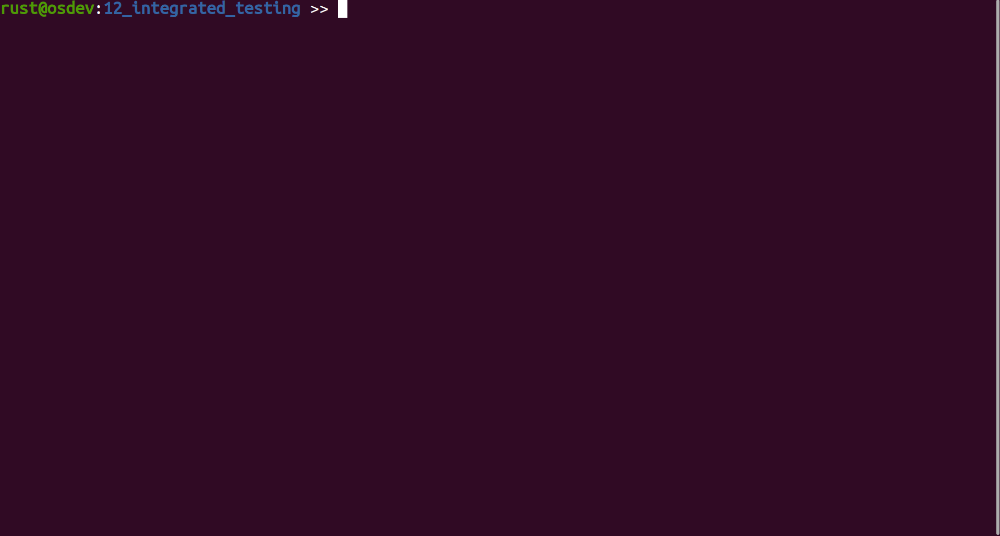

# Tutorial 12 - Integrated Testing

## tl;dr

- We implement our own integrated test framework using `Rust`'s [custom_test_frameworks] feature by
  enabling `Unit Tests` and `Integration Tests` using `QEMU`.
- It is also possible to have test automation for I/O with the kernel's `console` (provided over
  `UART` in our case). That is, sending strings/characters to the console and expecting specific
  answers in return.
- The already existing basic `boot test` remains unchanged.



## Table of Contents

- [Introduction](#introduction)
- [Challenges](#challenges)
  * [Acknowledgements](#acknowledgements)
- [Folder Restructuring](#folder-restructuring)
- [Implementation](#implementation)
  * [Test Organization](#test-organization)
  * [Enabling `custom_test_frameworks` for Unit Tests](#enabling-custom_test_frameworks-for-unit-tests)
    + [The Unit Test Runner](#the-unit-test-runner)
    + [Calling the Test `main()` Function](#calling-the-test-main-function)
  * [Quitting QEMU with user-defined Exit Codes](#quitting-qemu-with-user-defined-exit-codes)
    + [Exiting Unit Tests](#exiting-unit-tests)
  * [Controlling Test Kernel Execution](#controlling-test-kernel-execution)
    + [Wrapping QEMU Test Execution](#wrapping-qemu-test-execution)
  * [Writing Unit Tests](#writing-unit-tests)
  * [Integration Tests](#integration-tests)
    + [Test Harness](#test-harness)
    + [No Test Harness](#no-test-harness)
    + [Overriding Panic Behavior](#overriding-panic-behavior)
  * [Console Tests](#console-tests)
- [Test it](#test-it)
- [Diff to previous](#diff-to-previous)

## Introduction

Through the course of the previous tutorials, we silently started to adopt a kind of anti-pattern:
Using the kernel's main function to not only boot the target, but also test or showcase
functionality. For example:
  - Stalling execution during boot to test the kernel's timekeeping code by spinning for 1 second.
  - Willingly causing exceptions to see the exception handler running.

The feature set of the kernel is now rich enough so that it makes sense to introduce proper
integrated testing modeled after Rust's [native testing framework]. This tutorial extends our single
existing kernel test with three new testing facilities:
  - Classic `Unit Tests`.
  - [Integration Tests] (self-contained tests stored in the `$CRATE/tests/` directory).
  - `Console I/O Tests`. These are integration tests acting on external stimuli - aka `console`
    input. Sending strings/characters to the console and expecting specific answers in return.

[native testing framework]: https://doc.rust-lang.org/book/ch11-00-testing.html

## Challenges

Testing Rust `#![no_std]` code like our kernel is, at the point of writing this tutorial, not an
easy endeavor. The short version is: We cannot use Rust's [native testing framework] straight away.
Utilizing the `#[test]` attribute macro and running `cargo test` would throw compilation errors,
because there are dependencies on the standard library.

[native testing framework]: https://doc.rust-lang.org/book/ch11-00-testing.html

We have to fall back to Rust's unstable [custom_test_frameworks] feature. It relieves us from
dependencies on the standard library, but comes at the cost of having a reduced feature set. Instead
of annotating functions with `#[test]`, the `#[test_case]` attribute must be used. Additionally, we
need to write a `test_runner` function, which is supposed to execute all the functions annotated
with `#[test_case]`. This is barely enough to get `Unit Tests` running, though. There will be some
more challenges that need be solved for getting `Integration Tests` running as well.

Please note that for automation purposes, all testing will be done in `QEMU` and not on real
hardware.

[custom_test_frameworks]: https://doc.rust-lang.org/unstable-book/language-features/custom-test-frameworks.html
[Integration Tests]: https://doc.rust-lang.org/book/ch11-03-test-organization.html#integration-tests

### Acknowledgements

On this occasion, kudos to [@phil-opp] for his x86-based [testing] article. It helped a lot in
putting together this tutorial. Please go ahead and read it for a different perspective and
additional insights.

[testing]: https://os.phil-opp.com/testing

## Folder Restructuring

For reasons explained later, in this tutorial, we need to add two support crates next to our main
kernel crate. To keep everything organized in separate directories, we are switching to what `cargo`
calls a [virtual manifest]. The kernel crate moves to `$ROOT/kernel`, and the support crates will go
into `$ROOT/libraries/`. The `Cargo.toml` in the `$ROOT` folder desribes this layout:

```toml
[workspace]

members = [
        "libraries/*",
        "kernel"
]
```

[virtual manifest]: https://doc.rust-lang.org/cargo/reference/workspaces.html#virtual-manifest

## Implementation

We introduce two new `Makefile` targets:

```console
$ make test_unit
$ make test_integration
```

In essence, the `make test_*` targets will execute `cargo test` instead of `cargo rustc`. The
details will be explained in due course. The rest of the tutorial will explain as chronologically as
possible what happens when `make test_*` aka `cargo test` runs.

Please note that the new targets are added to the existing `make test` target, so this is now your
one-stop target to execute all possible tests for the kernel:

```Makefile
test: test_boot test_unit test_integration
```

### Test Organization

Until now, our kernel crate was a so-called `binary crate`. As [explained in the official Rust
book], this crate type disallows having `integration tests`. Quoting the book:

[explained in the official Rust book]: https://doc.rust-lang.org/book/ch11-03-test-organization.html#integration-tests-for-binary-crates

> If our project is a binary crate that only contains a _src/main.rs_ file and doesn’t have a
> _src/lib.rs_ file, we can’t create integration tests in the _tests_ directory and bring functions
> defined in the _src/main.rs_ file into scope with a `use` statement. Only library crates expose
> functions that other crates can use; binary crates are meant to be run on their own.

> This is one of the reasons Rust projects that provide a binary have a straightforward
> _src/main.rs_ file that calls logic that lives in the _src/lib.rs_ file. Using that structure,
> integration tests _can_ test the library crate with `use` to make the important functionality
> available. If the important functionality works, the small amount of code in the _src/main.rs_
> file will work as well, and that small amount of code doesn’t need to be tested.

So let's do that first: We add a `lib.rs` to our crate that aggregates and exports the lion's share
of the kernel code. The `main.rs` file is stripped down to the minimum. It only keeps the
`kernel_init() -> !` and `kernel_main() -> !` functions, everything else is brought into scope with
`use` statements.

Since it is not possible to use `kernel` as the name for both the library and the binary part of the
crate, new entries in `$ROOT/kernel/Cargo.toml` are needed to differentiate the names. What's more,
`cargo test` would try to compile and run `unit tests` for both. In our case, it will be sufficient
to have all the unit test code in `lib.rs`, so test generation for `main.rs` can be disabled in
`Cargo.toml` as well through the `test` flag:

```toml
[lib]
name = "libkernel"
test = true

[[bin]]
name = "kernel"
test = false
```

### Enabling `custom_test_frameworks` for Unit Tests

In `lib.rs`, we add the following headers to get started with `custom_test_frameworks`:

```rust
// Testing
#![cfg_attr(test, no_main)]
#![feature(custom_test_frameworks)]
#![reexport_test_harness_main = "test_main"]
#![test_runner(crate::test_runner)]
```

Since this is a library now, we do not keep the `#![no_main]` inner attribute that `main.rs` has,
because a library has no `main()` entry function, so the attribute does not apply. When compiling
for testing, though, it is still needed. The reason is that `cargo test` basically turns `lib.rs`
into a binary again by inserting a generated `main()` function (which is then calling a function
that runs all the unit tests, but more about that in a second...).

However, since  our kernel code [overrides the compiler-inserted `main` shim] by way of using
`#![no_main]`, we need the same when `cargo test` is producing its test kernel binary. After all,
what we want is a minimal kernel that boots on the target and runs its own unit tests. Therefore, we
conditionally set this attribute (`#![cfg_attr(test, no_main)]`) when the `test` flag is set, which
it is when `cargo test` runs.

[overrides the compiler-inserted `main` shim]: https://doc.rust-lang.org/unstable-book/language-features/lang-items.html?highlight=no_main#writing-an-executable-without-stdlib

#### The Unit Test Runner

The `#![test_runner(crate::test_runner)]` attribute declares the path of the test runner function
that we are supposed to provide. This is the one that will be called by the `cargo test` generated
`main()` function. Here is the implementation in `lib.rs`:

```rust
/// The default runner for unit tests.
pub fn test_runner(tests: &[&test_types::UnitTest]) {
    // This line will be printed as the test header.
    println!("Running {} tests", tests.len());

    for (i, test) in tests.iter().enumerate() {
        print!("{:>3}. {:.<58}", i + 1, test.name);

        // Run the actual test.
        (test.test_func)();

        // Failed tests call panic!(). Execution reaches here only if the test has passed.
        println!("[ok]")
    }
}
```

The function signature shows that `test_runner` takes one argument: A slice of
`test_types::UnitTest` references. This type definition lives in an external crate stored at
`$ROOT/libraries/test_types`. It is external because the type is also needed for a self-made
[procedural macro] that we'll use to write unit tests, and procedural macros _have_ to live in their
own crate. So to avoid a circular dependency between kernel and proc-macro, this split was needed.
Anyways, here is the type definition:

[procedural macro]: https://doc.rust-lang.org/reference/procedural-macros.html

```rust
/// Unit test container.
pub struct UnitTest {
    /// Name of the test.
    pub name: &'static str,

    /// Function pointer to the test.
    pub test_func: fn(),
}
```

A `UnitTest` provides a name and a classic function pointer to the unit test function. The
`test_runner` just iterates over the slice, prints the respective test's name and calls the test
function.

The convetion is that as long as the test function does not `panic!`, the test was successful.

#### Calling the Test `main()` Function

The last of the attributes we added is `#![reexport_test_harness_main = "test_main"]`. Remember that
our kernel uses the `no_main` attribute, and that we also set it for the test compilation. We did
that because we wrote our own `_start()` function, which kicks off the following call chain during
kernel boot:

| | Function  | File |
| - | - | - |
| 1. | `_start()` | The library's `boot.s` |
| 2. | (some more aarch64 code) | The library's `boot.rs` |
| 3. | `kernel_init()` | `main.rs` |
| 4. | `kernel_main()` | `main.rs` |

A function named `main` is never called. Hence, the `main()` function generated by `cargo test`
would be silently dropped, and therefore the tests would never be executed. As you can see, the
first function getting called in our carved-out `main.rs` is `kernel_init()`. So in order to get the
tests to execute, we add a test-environment version of `kernel_init()` to `lib.rs` as well
(conditional compilation ensures it is only present when the test flag is set), and call the `cargo
test` generated `main()` function from there.

This is where `#![reexport_test_harness_main = "test_main"]` finally comes into picture. It declares
the name of the generated main function so that we can manually call it. Here is the final
implementation in `lib.rs`:

```rust
/// The `kernel_init()` for unit tests.
#[cfg(test)]
#[no_mangle]
unsafe fn kernel_init() -> ! {
    exception::handling_init();
    bsp::driver::qemu_bring_up_console();

    test_main();

    cpu::qemu_exit_success()
}
```

Note the call to `bsp::driver::qemu_bring_up_console()`. Since we are running all our tests inside
`QEMU`, we need to ensure that whatever peripheral implements the kernel's `console` interface is
initialized, so that we can print from our tests. If you recall [tutorial 03], bringing up
peripherals in `QEMU` might not need the full initialization as is needed on real hardware (setting
clocks, config registers, etc...) due to the abstractions in `QEMU`'s emulation code. So this is an
opportunity to cut down on setup code.

[tutorial 03]: ../03_hacky_hello_world

As a matter of fact, for the `Raspberrys`, nothing needs to be done, so the function is empy. But
this might be different for other hardware emulated by `QEMU`, so it makes sense to introduce the
function now to make it easier in case new `BSPs` are added to the kernel in the future.

Next, the reexported `test_main()` is called, which will call our `test_runner()` which finally
prints the unit test names and executes them.

### Quitting QEMU with user-defined Exit Codes

Let's recap where we are right now:

We've enabled `custom_test_frameworks` in `lib.rs` to a point where, when using a `make test_unit`
target, the code gets compiled to a test kernel binary that eventually executes all the
(yet-to-be-defined) `UnitTest` instances by executing all the way from `_start()` to our
`test_runner()` function.

Through mechanisms that are explained later, `cargo` will now instantiate a `QEMU` process that
exectues this test kernel. The question now is: How is test success/failure communicated to `cargo`?
Answer: `cargo` inspects `QEMU`'s [exit status]:

  - `0` translates to testing was successful.
  - `non-0` means failure.

Hence, we need a clever trick now so that our Rust kernel code can get `QEMU` to exit itself with an
exit status that the kernel code supplies. In [@phil-opp]'s testing article, you [learned how to do
this] for `x86 QEMU` systems by using a special `ISA` debug-exit device. Unfortunately, we can't
have that one for our `aarch64` system because it is not compatible.

In our case, we can leverage the ARM [semihosting] emulation of `QEMU` and do a `SYS_EXIT`
semihosting call with an additional parameter for the exit code. I've written a separate crate,
[qemu-exit], to do this. So let us import it and utilize it in `_arch/aarch64/cpu.rs` to provide the
following exit calls for the kernel:

```rust
//--------------------------------------------------------------------------------------------------
// Testing
//--------------------------------------------------------------------------------------------------
#[cfg(feature = "test_build")]
use qemu_exit::QEMUExit;

#[cfg(feature = "test_build")]
const QEMU_EXIT_HANDLE: qemu_exit::AArch64 = qemu_exit::AArch64::new();

/// Make the host QEMU binary execute `exit(1)`.
#[cfg(feature = "test_build")]
pub fn qemu_exit_failure() -> ! {
    QEMU_EXIT_HANDLE.exit_failure()
}

/// Make the host QEMU binary execute `exit(0)`.
#[cfg(feature = "test_build")]
pub fn qemu_exit_success() -> ! {
    QEMU_EXIT_HANDLE.exit_success()
}
```

[Click here] in case you are interested in the implementation. Note that for the functions to work,
the `-semihosting` flag must be added to the `QEMU` invocation.

You might have also noted the `#[cfg(feature = "test_build")]`. In the `Makefile`, we ensure that
this feature is only enabled when `cargo test` runs. This way, it is ensured that testing-specific
code is conditionally compiled only for testing.

[exit status]: https://en.wikipedia.org/wiki/Exit_status
[@phil-opp]: https://github.com/phil-opp
[learned how to do this]: https://os.phil-opp.com/testing/#exiting-qemu
[semihosting]: https://static.docs.arm.com/100863/0200/semihosting.pdf
[qemu-exit]: https://github.com/andre-richter/qemu-exit
[Click here]: https://github.com/andre-richter/qemu-exit/blob/master/src/aarch64.rs

#### Exiting Unit Tests

Unit test failure shall be triggered by the `panic!` macro, either directly or by way of using
`assert!` macros. Until now, our `panic!` implementation finally called `cpu::wait_forever()` to
safely park the panicked CPU core in a busy loop. This can't be used for the unit tests, because
`cargo` would wait forever for `QEMU` to exit and stall the whole test run. Again, conditional
compilation is used to differentiate between a release and testing version of how a `panic!`
concludes:

```rust
/// The point of exit for `libkernel`.
///
/// It is linked weakly, so that the integration tests can overload its standard behavior.
#[linkage = "weak"]
#[no_mangle]
fn _panic_exit() -> ! {
    #[cfg(not(feature = "test_build"))]
    {
        cpu::wait_forever()
    }

    #[cfg(feature = "test_build")]
    {
        cpu::qemu_exit_failure()
    }
}
```

In case _none_ of the unit tests panicked, `lib.rs`'s `kernel_init()` calls
`cpu::qemu_exit_success()` to successfully conclude the unit test run.

### Controlling Test Kernel Execution

Now is a good time to catch up on how the test kernel binary is actually being executed. Normally,
`cargo test` would try to execute the compiled binary as a normal child process. This would fail
horribly because we build a kernel, and not a userspace process. Also, chances are high that you sit
in front of an `x86` machine, whereas the RPi kernel is `AArch64`.

Therefore, we need to install some hooks that make sure the test kernel gets executed inside `QEMU`,
quite like it is done for the existing `make qemu` target that is in place since `tutorial 1`. The
first step is to add a new file to the project, `.cargo/config.toml`:

```toml
[target.'cfg(target_os = "none")']
runner = "target/kernel_test_runner.sh"
```

Instead of executing a compilation result directly, the `runner` flag will instruct `cargo` to
delegate the execution. Using the setting depicted above, `target/kernel_test_runner.sh` will be
executed and given the full path to the compiled test kernel as the first command line argument.

The file `kernel_test_runner.sh` does not exist by default. We generate it on demand when one of the
`make test_*` targets is called:

```Makefile
##------------------------------------------------------------------------------
## Helpers for unit and integration test targets
##------------------------------------------------------------------------------
define KERNEL_TEST_RUNNER
    #!/usr/bin/env bash

    # The cargo test runner seems to change into the crate under test's directory. Therefore, ensure
    # this script executes from the root.
    cd $(shell pwd)

    TEST_ELF=$$(echo $$1 | sed -e 's/.*target/target/g')
    TEST_BINARY=$$(echo $$1.img | sed -e 's/.*target/target/g')

    $(OBJCOPY_CMD) $$TEST_ELF $$TEST_BINARY
    $(DOCKER_TEST) $(EXEC_TEST_DISPATCH) $(EXEC_QEMU) $(QEMU_TEST_ARGS) -kernel $$TEST_BINARY
endef

export KERNEL_TEST_RUNNER

define test_prepare
    @mkdir -p target
    @echo "$$KERNEL_TEST_RUNNER" > target/kernel_test_runner.sh
    @chmod +x target/kernel_test_runner.sh
endef

##------------------------------------------------------------------------------
## Run unit test(s)
##------------------------------------------------------------------------------
test_unit:
	$(call color_header, "Compiling unit test(s) - $(BSP)")
	$(call test_prepare)
	@RUSTFLAGS="$(RUSTFLAGS_PEDANTIC)" $(TEST_CMD) --lib
```

It first does the standard `objcopy` step to strip the `ELF` down to a raw binary. Just like in all
the other Makefile targets. Next, the script generates a relative path from the absolute path
provided to it by `cargo`, and finally compiles a `docker` command to execute the test kernel. For
reference, here it is fully resolved for an `RPi3 BSP`:

```bash
docker run -t --rm -v /opt/rust-raspberrypi-OS-tutorials/12_integrated_testing:/work/tutorial -w /work/tutorial -v /opt/rust-raspberrypi-OS-tutorials/12_integrated_testing/../common:/work/common rustembedded/osdev-utils:2021.12 ruby ../common/tests/dispatch.rb qemu-system-aarch64 -M raspi3 -serial stdio -display none -semihosting -kernel $TEST_BINARY
```

This command is quite similar to the one used in the `make test_boot` target that we have since
`tutorial 3`. However, we never bothered explaining it, so lets take a closer look this time. One of
the key ingredients is that we execute this script: `ruby ../common/tests/dispatch.rb`.

#### Wrapping QEMU Test Execution

`dispatch.rb` is a [Ruby] script which first determines what kind of test is due by inspecting the
`QEMU`-command that was given to it. In case of `unit tests`, we are only interested if they all
executed successfully, which can be checked by inspecting `QEMU`'s exit code. So the script takes
the provided qemu command it got from `ARGV`, and creates and runs an instance of `ExitCodeTest`:

```ruby
qemu_cmd = ARGV.join(' ')
binary = ARGV.last
test_name = binary.gsub(%r{.*deps/}, '').split('-')[0]

# Check if virtual manifest (tutorial 12 or later) or not
path_prefix = File.exist?('kernel/Cargo.toml') ? 'kernel/' : ''

case test_name
when 'kernel8.img'
    load "#{path_prefix}tests/boot_test_string.rb" # provides 'EXPECTED_PRINT'
    BootTest.new(qemu_cmd, EXPECTED_PRINT).run # Doesn't return

when 'libkernel'
    ExitCodeTest.new(qemu_cmd, 'Kernel library unit tests').run # Doesn't return
```

The easy case is `QEMU` exiting by itself by means of `aarch64::exit_success()` or
`aarch64::exit_failure()`. But the script can also catch the case of a test that gets stuck, e.g. in
an unintentional busy loop or a crash. If `ExitCodeTest` does not observe any output of the test
kernel for `MAX_WAIT_SECS`, it cancels the execution and marks the test as failed. Test success or
failure is finally reported back to `cargo`.

Here is the essential part happening in `class ExitCodeTest` (If `QEMU` exits itself, an `EOFError`
is thrown):

```ruby
def run_concrete_test
    Timeout.timeout(MAX_WAIT_SECS) do
        @test_output << @qemu_serial.read_nonblock(1024) while @qemu_serial.wait_readable
    end
rescue EOFError
    @qemu_serial.close
    @test_error = $CHILD_STATUS.to_i.zero? ? false : 'QEMU exit status != 0'
rescue Timeout::Error
    @test_error = 'Timed out waiting for test'
rescue StandardError => e
    @test_error = e.inspect
end
```

Please note that `dispatch.rb` and all its dependencies live in the shared folder
`../common/tests/`.

[Ruby]: https://www.ruby-lang.org/

### Writing Unit Tests

Alright, that's a wrap for the whole chain from `make test_unit` all the way to reporting the test
exit status back to `cargo test`. It is a lot to digest already, but we haven't even learned to
write `Unit Tests` yet.

In essence, it is almost like in `std` environments, with the difference that `#[test]` can't be
used, because it is part of the standard library. The `no_std` replacement attribute provided by
`custom_test_frameworks` is `#[test_case]`. You can put `#[test_case]` before functions, constants
or statics (you have to decide for one and stick with it). Each attributed item is added to the
"list" that is then passed to the `test_runner` function.

As you learned earlier, we decided that our tests shall be instances of `test_types::UnitTest`. Here
is the type definition again:

```rust
/// Unit test container.
pub struct UnitTest {
    /// Name of the test.
    pub name: &'static str,

    /// Function pointer to the test.
    pub test_func: fn(),
}
```

So what we could do now is write something like:

```rust
#[cfg(test)]
mod tests {
    use super::*;

    #[test_case]
    const TEST1: test_types::UnitTest = test_types::UnitTest {
            name: "test_runner_executes_in_kernel_mode",
            test_func: || {
                let (level, _) = current_privilege_level();

                assert!(level == PrivilegeLevel::Kernel)
            },
        };
}
```

Since this is a bit boiler-platy with the const and name definition, let's write a [procedural
macro] named `#[kernel_test]` to simplify this. It should work this way:

  1. Must be put before functions that take no arguments and return nothing.
  1. Automatically constructs a `const UnitTest` from attributed functions like shown above by:
      1. Converting the function name to the `name` member of the `UnitTest` struct.
      1. Populating the `test_func` member with a closure that executes the body of the attributed
         function.

For the sake of brevity, we're not going to discuss the macro implementation. [The source is in the
test-macros crate] if you're interested in it. Using the macro, the example shown before now boils
down to this (this is now an actual example from [exception.rs]:

[procedural macro]: https://doc.rust-lang.org/reference/procedural-macros.html
[The source is in the test-macros crate]: test-macros/src/lib.rs
[exception.rs]: src/exception.rs

```rust
#[cfg(test)]
mod tests {
    use super::*;
    use test_macros::kernel_test;

    /// Libkernel unit tests must execute in kernel mode.
    #[kernel_test]
    fn test_runner_executes_in_kernel_mode() {
        let (level, _) = current_privilege_level();

        assert!(level == PrivilegeLevel::Kernel)
    }
}
```

Note that since proc macros need to live in their own crates, we need to create a new one at
`$ROOT/libraries/test-macros` and save it there.

Aaaaaand that's how you write unit tests. We're finished with that part for good now :raised_hands:.

### Integration Tests

We are still not done with the tutorial, though :scream:.

Integration tests need some special attention here and there too. As you already learned, they live
in `$CRATE/tests/`. Each `.rs` file in there gets compiled into its own test kernel binary and
executed separately by `cargo test`. The code in the integration tests includes the library part of
our kernel (`libkernel`) through `use` statements.

Also note that the entry point for each `integration test` must be the `kernel_init()` function
again, just like in the `unit test` case.

#### Test Harness

By default, `cargo test` will pull in the test harness (that's the official name for the generated
`main()` function) into integration tests as well. This gives you a further means of partitioning
your test code into individual chunks. For example, take a look at `tests/01_timer_sanity.rs`:

```rust
//! Timer sanity tests.

#![feature(custom_test_frameworks)]
#![no_main]
#![no_std]
#![reexport_test_harness_main = "test_main"]
#![test_runner(libkernel::test_runner)]

use core::time::Duration;
use libkernel::{bsp, cpu, exception, time};
use test_macros::kernel_test;

#[no_mangle]
unsafe fn kernel_init() -> ! {
    exception::handling_init();
    bsp::driver::qemu_bring_up_console();

    // Depending on CPU arch, some timer bring-up code could go here. Not needed for the RPi.

    test_main();

    cpu::qemu_exit_success()
}

/// Simple check that the timer is running.
#[kernel_test]
fn timer_is_counting() {
    assert!(time::time_manager().uptime().as_nanos() > 0)
}

/// Timer resolution must be sufficient.
#[kernel_test]
fn timer_resolution_is_sufficient() {
    assert!(time::time_manager().resolution().as_nanos() > 0);
    assert!(time::time_manager().resolution().as_nanos() < 100)
}
```

Note how the `test_runner` from `libkernel` is pulled in through
`#![test_runner(libkernel::test_runner)]`.

#### No Test Harness

For some tests, however, it is not needed to have the harness, because there is no need or
possibility to partition the test into individual pieces. In this case, all the test code can live
in `kernel_init()`, and harness generation can be turned off through `$ROOT/kernel/Cargo.toml`. This
tutorial introduces two tests that don't need a harness. Here is how harness generation is turned
off for them:

```toml
# List of tests without harness.
[[test]]
name = "00_console_sanity"
harness = false

[[test]]
name = "02_exception_sync_page_fault"
harness = false

[[test]]
name = "03_exception_restore_sanity"
harness = false
```

#### Overriding Panic Behavior

Did you notice the `#[linkage = "weak"]` attribute some chapters earlier at the `_panic_exit()`
function? This marks the function in `lib.rs` as a [weak symbol]. Let's look at it again:

```rust
/// The point of exit for `libkernel`.
///
/// It is linked weakly, so that the integration tests can overload its standard behavior.
#[linkage = "weak"]
#[no_mangle]
fn _panic_exit() -> ! {
    #[cfg(not(feature = "test_build"))]
    {
        cpu::wait_forever()
    }

    #[cfg(feature = "test_build")]
    {
        cpu::qemu_exit_failure()
    }
}
```

[weak symbol]: https://en.wikipedia.org/wiki/Weak_symbol

This enables integration tests in `$CRATE/tests/` to override this function according to their
needs. This is useful, because depending on the kind of test, a `panic!` could mean success or
failure. For example, `tests/02_exception_sync_page_fault.rs` is intentionally causing a page fault,
so the wanted outcome is a `panic!`. Here is the whole test (minus some inline comments):

```rust
//! Page faults must result in synchronous exceptions.

#![feature(format_args_nl)]
#![no_main]
#![no_std]

mod panic_exit_success;

use libkernel::{bsp, cpu, exception, info, memory, println};

#[no_mangle]
unsafe fn kernel_init() -> ! {
    use memory::mmu::interface::MMU;

    exception::handling_init();
    bsp::driver::qemu_bring_up_console();

    // This line will be printed as the test header.
    println!("Testing synchronous exception handling by causing a page fault");

    if let Err(string) = memory::mmu::mmu().enable_mmu_and_caching() {
        info!("MMU: {}", string);
        cpu::qemu_exit_failure()
    }

    info!("Writing beyond mapped area to address 9 GiB...");
    let big_addr: u64 = 9 * 1024 * 1024 * 1024;
    core::ptr::read_volatile(big_addr as *mut u64);

    // If execution reaches here, the memory access above did not cause a page fault exception.
    cpu::qemu_exit_failure()
}
```

The `_panic_exit()` version that makes `QEMU` return `0` (indicating test success) is pulled in by
`mod panic_exit_success;`, and it will take precedence over the `weak` version from `lib.rs`.

### Console Tests

As the kernel or OS grows, it will be more and more interesting to test user/kernel interaction
through the serial console. That is, sending strings/characters to the console and expecting
specific answers in return. The `dispatch.rb` wrapper script provides infrastructure to recognize
and dispatch console I/O tests with little overhead. It basically works like this:

  1. For each integration test, check if a companion file to the `.rs` test file exists.
      - A companion file has the same name, but ends in `.rb`.
      - The companion file contains one or more console I/O subtests.
  1. If it exists, load the file to dynamically import the console subtests.
  1. Create a `ConsoleIOTest` instance and run it.
      - This first spawns `QEMU` and attaches to `QEMU`'s serial console emulation.
      - Then it runs all console subtests on it.

Here is an excerpt from `00_console_sanity.rb` showing a subtest that does a handshake with the
kernel over the console:

```ruby
require 'console_io_test'

# Verify sending and receiving works as expected.
class TxRxHandshakeTest < SubtestBase
    def name
        'Transmit and Receive handshake'
    end

    def run(qemu_out, qemu_in)
        qemu_in.write_nonblock('ABC')
        expect_or_raise(qemu_out, 'OK1234')
    end
end
```

The subtest first sends `"ABC"` over the console to the kernel, and then expects to receive
`"OK1234"` back. On the kernel side, it looks like this in `00_console_sanity.rs`:

```rust
#![feature(format_args_nl)]
#![no_main]
#![no_std]

/// Console tests should time out on the I/O harness in case of panic.
mod panic_wait_forever;

use libkernel::{bsp, console, cpu, exception, print};

#[no_mangle]
unsafe fn kernel_init() -> ! {
    use console::console;

    exception::handling_init();
    bsp::driver::qemu_bring_up_console();

    // Handshake
    assert_eq!(console().read_char(), 'A');
    assert_eq!(console().read_char(), 'B');
    assert_eq!(console().read_char(), 'C');
    print!("OK1234");
```

## Test it

Believe it or not, that is all. There are four ways you can run tests now:

  1. `make test` will run all tests back-to-back. That is, the ever existing `boot test` first, then
     `unit tests`, then `integration tests`.
  1. `make test_unit` will run `libkernel`'s unit tests.
  1. `make test_integration` will run all integration tests back-to-back.
  1. `TEST=TEST_NAME make test_integration` will run a specficic integration test.
      - For example, `TEST=01_timer_sanity make test_integration`

```console
$ make test
[...]

     Running unittests (target/aarch64-unknown-none-softfloat/release/deps/libkernel-142a8d94bc9c615a)
         -------------------------------------------------------------------
         🦀 Running 6 tests
         -------------------------------------------------------------------

           1. virt_mem_layout_sections_are_64KiB_aligned................[ok]
           2. virt_mem_layout_has_no_overlaps...........................[ok]
           3. test_runner_executes_in_kernel_mode.......................[ok]
           4. kernel_tables_in_bss......................................[ok]
           5. size_of_tabledescriptor_equals_64_bit.....................[ok]
           6. size_of_pagedescriptor_equals_64_bit......................[ok]

         -------------------------------------------------------------------
         ✅ Success: Kernel library unit tests
         -------------------------------------------------------------------


Compiling integration test(s) - rpi3
    Finished release [optimized] target(s) in 0.00s
     Running tests/00_console_sanity.rs (target/aarch64-unknown-none-softfloat/release/deps/00_console_sanity-c06130838f14dbff)
         -------------------------------------------------------------------
         🦀 Running 3 console I/O tests
         -------------------------------------------------------------------

           1. Transmit and Receive handshake............................[ok]
           2. Transmit statistics.......................................[ok]
           3. Receive statistics........................................[ok]

         Console log:
           ABCOK123463

         -------------------------------------------------------------------
         ✅ Success: 00_console_sanity.rs
         -------------------------------------------------------------------


     Running tests/01_timer_sanity.rs (target/aarch64-unknown-none-softfloat/release/deps/01_timer_sanity-62a954d22239d1a3)
         -------------------------------------------------------------------
         🦀 Running 3 tests
         -------------------------------------------------------------------

           1. timer_is_counting.........................................[ok]
           2. timer_resolution_is_sufficient............................[ok]
           3. spin_accuracy_check_1_second..............................[ok]

         -------------------------------------------------------------------
         ✅ Success: 01_timer_sanity.rs
         -------------------------------------------------------------------


     Running tests/02_exception_sync_page_fault.rs (target/aarch64-unknown-none-softfloat/release/deps/02_exception_sync_page_fault-2d8ec603ef1c4d8e)
         -------------------------------------------------------------------
         🦀 Testing synchronous exception handling by causing a page fault
         -------------------------------------------------------------------

         [    0.132792] Writing beyond mapped area to address 9 GiB...
         [    0.134563] Kernel panic!

         Panic location:
               File 'src/_arch/aarch64/exception.rs', line 58, column 5

         CPU Exception!

         ESR_EL1: 0x96000004
               Exception Class         (EC) : 0x25 - Data Abort, current EL
         [...]

         -------------------------------------------------------------------
         ✅ Success: 02_exception_sync_page_fault.rs
         -------------------------------------------------------------------


     Running tests/03_exception_restore_sanity.rs (target/aarch64-unknown-none-softfloat/release/deps/03_exception_restore_sanity-a56e14285bb26e0e)
         -------------------------------------------------------------------
         🦀 Running 1 console I/O tests
         -------------------------------------------------------------------

           1. Exception restore.........................................[ok]

         Console log:
           Testing exception restore
           [    0.130757] Making a dummy system call
           [    0.132592] Back from system call!

         -------------------------------------------------------------------
         ✅ Success: 03_exception_restore_sanity.rs
         -------------------------------------------------------------------

```

## Diff to previous

The diff in this tutorial is skipped, because due to the changes in top-level folder structure, it
becomes unreadable. This might be fixed in the future. For now, consider using a diff tool like
`meld` to diff between the previous and the `kernel` folder of this tutorial to see the lion's share
of changes:

```console
meld 11_exceptions_part1_groundwork 12_integrated_testing/kernel
```
