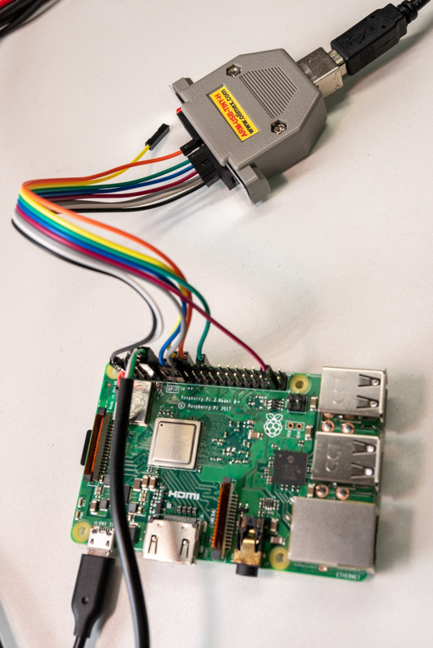

# Tutorial 13 - Using debugger

Debugging with a debugger is very effective, but it's a bit difficult on our Raspberry Pi. 

[The Embedded Rust Book mentions](https://rust-embedded.github.io/book/start/hardware.html) about using debugger on `STM32F3DISCOVERY`, however, there are some differences from our environment. First, we need a config file (`xxx.cfg`) to use openocd with Raspberry Pi. Second, unlike `STM32F3DISCOVERY`, Raspberry Pi does not have embedded debugger on it's board; it means we need to get, connect, and setup it.


## Config file

Thanks to [daniel-k](https://github.com/daniel-k), config file for Raspberry Pi3 is already there.

https://github.com/daniel-k/openocd/blob/armv8/tcl/target/rpi3.cfg

https://github.com/daniel-k/openocd/blob/armv8/tcl/interface/olimex-arm-usb-tiny-h.cfg

## Hardware debugger

A debugger `ARM-USB-TINY-H` made by OLIMEX has tested with Raspberry Pi3 and openocd.

https://www.olimex.com/Products/ARM/JTAG/ARM-USB-TINY-H/


It has standard [ARM JTAG 20 connector](http://infocenter.arm.com/help/index.jsp?topic=/com.arm.doc.dui0499dj/BEHEIHCE.html), but unfortunately, Raspberry Pi doesn't; we have to connect like following:

| GPIO# | Name  | JTAG# | Note    |
|-------|-------|-------|---------|
|       | VTREF | 1     | to 3.3V |
|       | GND   | 4     | to GND  |
| 22    | TRST  | 3     |         |
| 26    | TDI   | 5     |         |
| 27    | TMS   | 7     |         |
| 25    | TCK   | 9     |         |
| 24    | TDO   | 13    |         |



## debugger.rs

At last, GPIO pins have to be changed to alternative functions like using UART0. In this tutorial, `debugger.rs` sets the pins JTAG functions(all of them are assigned to Alt4) from default.

```rust
pub fn setup_debug() {
    unsafe {
        (*GPFSEL2).modify(
            GPFSEL2::FSEL27::Alt4
                + GPFSEL2::FSEL26::Alt4
                + GPFSEL2::FSEL25::Alt4
                + GPFSEL2::FSEL24::Alt4
                + GPFSEL2::FSEL23::Alt4
                + GPFSEL2::FSEL22::Alt4,
        );
    }
}
```

## main.rs

After enabling debugger, it goes empty loop to wait debugger connection.

## Running debugger

Run openocd with config files.

```console
$ ./openocd.exe -f olimex-arm-usb-tiny-h.cfg -f rpi3.cfg
Open On-Chip Debugger 0.9.0-dev-gb796a58 (2019-02-19-01:36)
Licensed under GNU GPL v2
For bug reports, read
        http://openocd.sourceforge.net/doc/doxygen/bugs.html
trst_and_srst separate srst_gates_jtag trst_push_pull srst_open_drain connect_deassert_srst
adapter speed: 1000 kHz
jtag_ntrst_delay: 500
Info : clock speed 1000 kHz
Info : JTAG tap: rpi3.dap tap/device found: 0x4ba00477 (mfg: 0x23b, part: 0xba00, ver: 0x4)
Info : rpi3.cpu: hardware has 6 breakpoints, 4 watchpoints
Info : rpi3.cpu1: hardware has 6 breakpoints, 4 watchpoints
Info : rpi3.cpu2: hardware has 6 breakpoints, 4 watchpoints
Info : rpi3.cpu3: hardware has 6 breakpoints, 4 watchpoints
```

Then, from another console, connect to openocd, halt, and show status.  
In this timing, value of `pc` may point an address of the empty loop.

```console
$ telnet localhost 4444
Trying ::1...
Connection failed: Connection refused
Trying 127.0.0.1...
Connected to localhost.
Escape character is '^]'.
Open On-Chip Debugger
> targets
    TargetName         Type       Endian TapName            State
--  ------------------ ---------- ------ ------------------ ------------
 0  rpi3.cpu           aarch64    little rpi3.dap           running
 1  rpi3.cpu1          aarch64    little rpi3.dap           running
 2  rpi3.cpu2          aarch64    little rpi3.dap           running
 3* rpi3.cpu3          aarch64    little rpi3.dap           running
> targets rpi3.cpu # switch to core0
> halt # stop CPU
number of cache level 2
cache l2 present :not supported
rpi3.cpu cluster 0 core 0 multi core
target state: halted
target halted in ARM64 state due to debug-request, current mode: EL2H
cpsr: 0x600003c9 pc: 0x8004c
MMU: disabled, D-Cache: disabled, I-Cache: disabled
> reg # show registers
===== arm v8 registers
(0) x0 (/64): 0x0000000000000000 (dirty)
(1) x1 (/64): 0x0000000000080000
(2) x2 (/64): 0x0000000000000000
(3) x3 (/64): 0x0000000000000000
(4) x4 (/64): 0x0000000000080000
(5) x5 (/64): 0x0CE3728200000000
(6) x6 (/64): 0x0000000000000000
(7) x7 (/64): 0xE28EFFCBBC0D3F9A
(8) x8 (/64): 0x000000003F200008
(9) x9 (/64): 0x00000000086DB6C0
(10) x10 (/64): 0x000000000001B6DB
(11) x11 (/64): 0xFF706A1100000A6D
(12) x12 (/64): 0xB2751590048043E9
(13) x13 (/64): 0x240C9001B556D979
(14) x14 (/64): 0x1494449B68400832
(15) x15 (/64): 0x853041015D66C079
(16) x16 (/64): 0xE0F0E480C0062E13
(17) x17 (/64): 0x108108403B144270
(18) x18 (/64): 0xA3F81384D91212E8
(19) x19 (/64): 0xD4E85D8097C27EF2
(20) x20 (/64): 0xA5099B470000006C
(21) x21 (/64): 0x942A4C8000000000
(22) x22 (/64): 0x44C30A969D494FF5
(23) x23 (/64): 0x9CF7E1042808C5F4
(24) x24 (/64): 0xE1CCA0080D449422
(25) x25 (/64): 0xD18B1214B42A6E80
(26) x26 (/64): 0xA5D0885000301356
(27) x27 (/64): 0x326A69826505DD40
(28) x28 (/64): 0xE1BF1305A2205551
(29) x29 (/64): 0xE55C2E08279A78D0
(30) x30 (/64): 0x0000000000080080
(31) sp (/64): 0x0000000000080000
(32) pc (/64): 0x000000000008004C
(33) CPSR (/32): 0x600003C9
```
