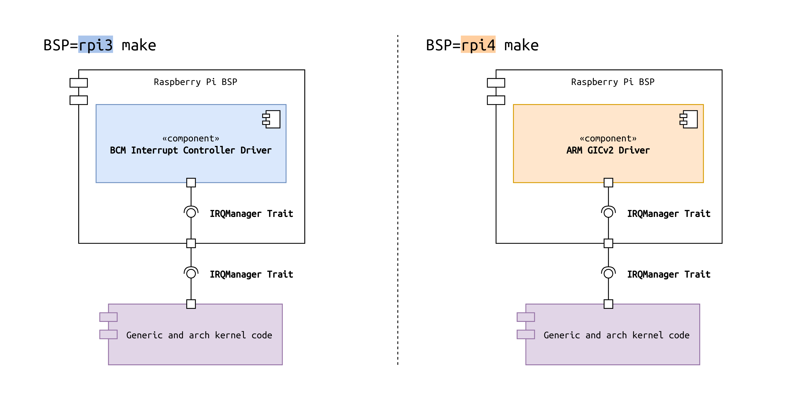
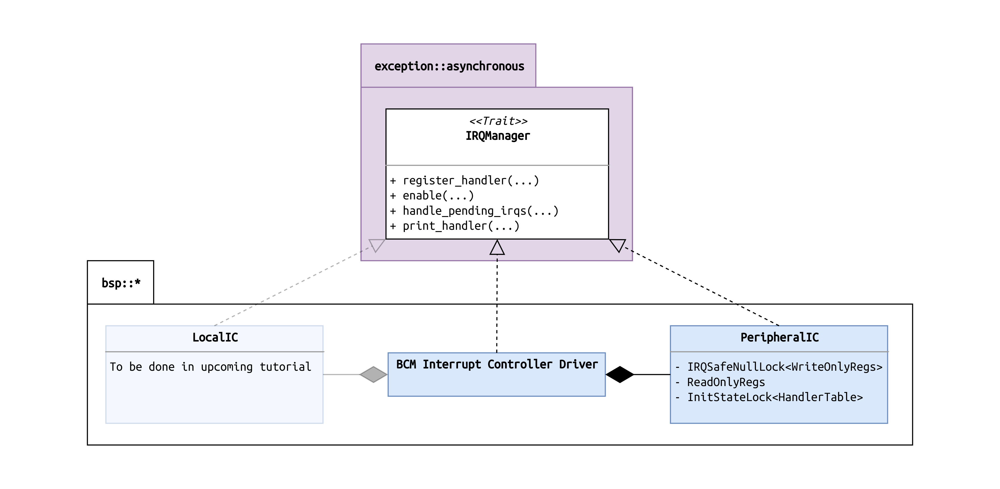
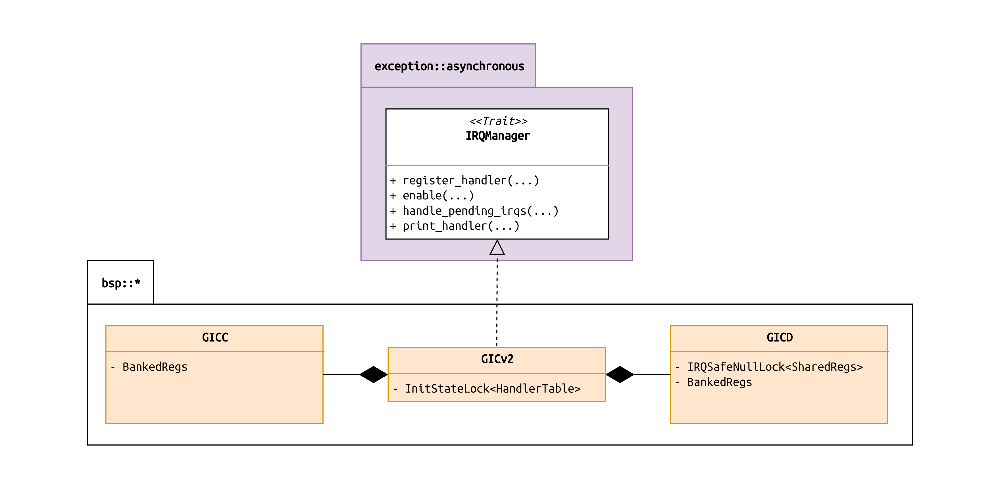

# Tutorial 14 - Exceptions Part 2: Peripheral IRQs

## tl;dr

- We write `device drivers` for the two interrupt controllers on the **Raspberry Pi 3** (Broadcom
  custom controller) and **Pi 4** (ARM Generic Interrupt Controller v2, `GICv2`).
- Modularity is ensured by interfacing everything through a trait named `IRQManager`.
- Handling for our first peripheral IRQs is implemented: The `UART`'s receive IRQs.



## Table of Contents

- [Introduction](#introduction)
- [Different Controllers: A Usecase for Abstraction](#different-controllers-a-usecase-for-abstraction)
- [New Challenges: Reentrancy](#new-challenges-reentrancy)
- [Implementation](#implementation)
  * [The Kernel's Interfaces for Interrupt Handling](#the-kernels-interfaces-for-interrupt-handling)
    + [Uniquely Identifying an IRQ](#uniquely-identifying-an-irq)
      - [The BCM IRQ Number Scheme](#the-bcm-irq-number-scheme)
      - [The GICv2 IRQ Number Scheme](#the-gicv2-irq-number-scheme)
    + [Registering IRQ Handlers](#registering-irq-handlers)
    + [Handling Pending IRQs](#handling-pending-irqs)
  * [Reentrancy: What to protect?](#reentrancy-what-to-protect)
  * [The Interrupt Controller Device Drivers](#the-interrupt-controller-device-drivers)
    + [The BCM Driver (Pi 3)](#the-bcm-driver-pi-3)
      - [Peripheral Controller Register Access](#peripheral-controller-register-access)
      - [The IRQ Handler Table](#the-irq-handler-table)
    + [The GICv2 Driver (Pi 4)](#the-gicv2-driver-pi-4)
      - [GICC Details](#gicc-details)
      - [GICD Details](#gicd-details)
- [UART hack](#uart-hack)
- [Test it](#test-it)
- [Diff to previous](#diff-to-previous)

## Introduction

In [tutorial 12], we laid the groundwork for exception handling from the processor architecture
side. Handler stubs for the different exception types were set up, and a first glimpse at exception
handling was presented by causing a `synchronous` exception by means of a `page fault`.

[tutorial 12]: ../12_exceptions_part1_groundwork

In this tutorial, we will add a first level of support for one of the three types of `asynchronous`
exceptions that are defined for `AArch64`: `IRQs`. The overall goal for this tutorial is to get rid
of the  busy-loop at the end of our current `kernel_main()` function, which actively polls the
`UART` for newly received characters. Instead, we will let the processor idle and wait for the
`UART`'s RX IRQs, which indicate that new characters were received. A respective `IRQ` service
routine, provided by the `UART` driver, will run in response to the `IRQ` and print the characters.

## Different Controllers: A Usecase for Abstraction

One very exciting aspect of this tutorial is that the `Pi 3` and the `Pi 4` feature completely
different interrupt controllers. This is also a first in all of the tutorial series. Until now, both
Raspberrys did not need differentiation with respect to their devices.

The `Pi 3` has a very simple custom controller made by Broadcom (BCM), the manufacturer of the Pi's
`System-on-Chip`. The `Pi 4` features an implementation of `ARM`'s Generic Interrupt Controller
version 2 (`GICv2`). Since ARM's GIC controllers are the prevalent interrupt controllers in ARM
application procesors, it is very beneficial to finally have it on the Raspberry Pi. It will enable
people to learn about one of the most common building blocks in ARM-based embedded computing.

This also means that we can finally make full use of all the infrastructure for abstraction that we
prepared already. We will design an `IRQManager` interface trait and implement it in both controller
drivers. The generic part of our `kernel` code will only be exposed to this trait (compare to the
diagram in the [tl;dr] section). This common idiom of *program to an interface, not an
implementation* enables a clean abstraction and makes the code modular and pluggable.

[tl;dr]: #tldr

## New Challenges: Reentrancy

Enabling interrupts also poses new challenges with respect to protecting certain code sections in
the kernel from being [re-entered]. Please read the linked article for background on that topic.

[re-entered]: https://en.wikipedia.org/wiki/Reentrancy_(computing)

Our `kernel` is still running on a single core. For this reason, we are still using our `NullLock`
pseudo-locks for `Critical Sections` or `shared resources`, instead of real `Spinlocks`. Hence,
interrupt handling at this point in time does not put us at risk of running into one of those
dreaded `deadlocks`, which is one of several side-effects that reentrancy can cause. For example, a
`deadlock` because of interrupts can happen happen when the executing CPU core has locked a
`Spinlock` at the beginning of a function, an IRQ happens, and the IRQ service routine is trying to
execute the same function. Since the lock is already locked, the core would spin forever waiting for
it to be released.

There is no straight-forward way to tell if a function is `reentrantcy`-safe or not. It usually
needs careful manual checking to conclude. Even though it might be technically safe to `re-enter` a
function, sometimes you don't want that to happen for functional reasons. For example, printing of a
string should not be interrupted by a an interrupt service routine that starts printing another
string, so that the output mixes. In the course of this tutorial, we will check and see where we
want to protect against `reentrancy`.

## Implementation

Okay, let's start. The following sections cover the the implementation in a top-down fashion,
starting with the trait that interfaces all the `kernel` components to each other.

### The Kernel's Interfaces for Interrupt Handling

First, we design the `IRQManager` trait that interrupt controller drivers must implement. The
minimal set of functionality that we need for starters is:

1. Registering an IRQ `handler` for a given IRQ `number`.
2. Enabling an IRQ (from the controller side).
3. Handling pending IRQs.
4. Printing the list of registered IRQ handlers.

The trait is defined as `exception::asynchronous::interface::IRQManager`:

```rust
pub trait IRQManager {
    /// The IRQ number type depends on the implementation.
    type IRQNumberType;

    /// Register a handler.
    fn register_handler(
        &self,
        irq_number: Self::IRQNumberType,
        descriptor: super::IRQDescriptor,
    ) -> Result<(), &'static str>;

    /// Enable an interrupt in the controller.
    fn enable(&self, irq_number: Self::IRQNumberType);

    /// Handle pending interrupts.
    ///
    /// This function is called directly from the CPU's IRQ exception vector. On AArch64,
    /// this means that the respective CPU core has disabled exception handling.
    /// This function can therefore not be preempted and runs start to finish.
    ///
    /// Takes an IRQContext token to ensure it can only be called from IRQ context.
    #[allow(clippy::trivially_copy_pass_by_ref)]
    fn handle_pending_irqs<'irq_context>(
        &'irq_context self,
        ic: &super::IRQContext<'irq_context>,
    );

    /// Print list of registered handlers.
    fn print_handler(&self);
}
```

#### Uniquely Identifying an IRQ

The first member of the trait is the [associated type] `IRQNumberType`. The following explains why
we make it customizable for the implementor and do not define the type as a plain integer right
away.

Interrupts can generally be characterizied with the following properties:

[associated type]: https://doc.rust-lang.org/book/ch19-03-advanced-traits.html#specifying-placeholder-types-in-trait-definitions-with-associated-types

1. Software-generated vs hardware-generated.
2. Private vs shared.

Different interrupt controllers take different approaches at categorizing and numbering IRQs that
have one or the other property. Often times, this leads to situations where a plain integer does not
suffice to uniquely identify an IRQ, and makes it necessary to encode additional information in the
used type. Letting the respective interrupt controller driver define `IRQManager::IRQNumberType`
itself addresses this issue. The rest of the `BSP` must then conditionally use this type.

##### The BCM IRQ Number Scheme

The `BCM` controller of the `Raspberry Pi 3`, for example, is composed of two functional parts: A
**local** controller and a **peripheral** controller. The BCM's **local controller** handles all
`private` IRQs, which means private SW-generated IRQs and IRQs of private HW devices. An example for
the latter would be the `ARMv8` timer. Each  CPU core has its own private instance of it. The BCM's
**peripheral controller** handles all IRQs of `non-private` HW devices such as the `UART` (if those
IRQs can be declared as `shared` according to our taxonomy above is a different discussion, because
the BCM controller allows these HW interrupts to be routed to _only one CPU core at a time_).

The IRQ numbers of the BCM **local controller** range from `0..11`. The numbers of the **peripheral
controller** range from `0..63`. This demonstrates why a primitive integer type would not be
sufficient to uniquely encode the IRQs, because their ranges overlap. In the driver for the `BCM`
controller, we therefore define the associated type as follows:

```rust
pub type LocalIRQ =
    exception::asynchronous::IRQNumber<{ InterruptController::MAX_LOCAL_IRQ_NUMBER }>;
pub type PeripheralIRQ =
    exception::asynchronous::IRQNumber<{ InterruptController::MAX_PERIPHERAL_IRQ_NUMBER }>;

/// Used for the associated type of trait  [`exception::asynchronous::interface::IRQManager`].
#[derive(Copy, Clone)]
pub enum IRQNumber {
    Local(LocalIRQ),
    Peripheral(PeripheralIRQ),
}
```

The type `exception::asynchronous::IRQNumber` is a newtype around an `usize` that uses a [const
generic] to ensure that the value of the encapsulated IRQ number is in the allowed range (e.g.
`0..MAX_LOCAL_IRQ_NUMBER` for `LocalIRQ`, with `MAX_LOCAL_IRQ_NUMBER == 11`).

[const generic]: https://github.com/rust-lang/rfcs/blob/master/text/2000-const-generics.md

##### The GICv2 IRQ Number Scheme

The `GICv2` in the `Raspberry Pi 4`, on the other hand, uses a different scheme. IRQ numbers `0..31`
are for `private` IRQs. Those are further subdivided into `SW-generated` (SGIs, `0..15`) and
`HW-generated` (PPIs, Private Peripheral Interrupts, `16..31`). Numbers `32..1019` are for `shared
hardware-generated` interrupts (SPI, Shared Peripheral Interrupts).

There are no overlaps, so this scheme enables us to actually have a plain integer as a unique
identifier for the IRQs. We define the type as follows:

```rust
/// Used for the associated type of trait [`exception::asynchronous::interface::IRQManager`].
pub type IRQNumber = exception::asynchronous::IRQNumber<{ GICv2::MAX_IRQ_NUMBER }>;
```

#### Registering IRQ Handlers

To enable the controller driver to manage interrupt handling, it must know where to find respective
handlers, and it must know how to call them. For the latter, we define an `IRQHandler` trait in
`exception::asynchronous` that must be implemented by any SW entity that wants to handle IRQs:

```rust
/// Implemented by types that handle IRQs.
pub trait IRQHandler {
    /// Called when the corresponding interrupt is asserted.
    fn handle(&self) -> Result<(), &'static str>;
}
```

The `PL011Uart` driver gets the honors for being our first driver to ever implement this trait. In
this tutorial, the `RX IRQ` and the `RX Timeout IRQ` will be configured. This means that the
`PL011Uart` will assert it's interrupt line when one of following conditions is met:

1. `RX IRQ`: The RX FIFO fill level is equal or more than the configured trigger level (which will be 1/8 of
   the total FIFO size in our case).
1. `RX Timeout IRQ`: The RX FIFO fill level is greater than zero, but less than the configured fill
   level, and the characters have not been pulled for a certain amount of time. The exact time is
   not documented in the respective `PL011Uart` datasheet. Usually, it is a single-digit multiple of
   the time it takes to receive or transmit one character on the serial line.

 In the handler, our standard scheme of echoing any received characters back to the host is used:

```rust
impl exception::asynchronous::interface::IRQHandler for PL011Uart {
    fn handle(&self) -> Result<(), &'static str> {
        let mut r = &self.inner;
        r.lock(|inner| {
            let pending = inner.registers.MIS.extract();

            // Clear all pending IRQs.
            inner.registers.ICR.write(ICR::ALL::CLEAR);

            // Check for any kind of RX interrupt.
            if pending.matches_any(MIS::RXMIS::SET + MIS::RTMIS::SET) {
                // Echo any received characters.
                while let Some(c) = inner.read_char_converting(BlockingMode::NonBlocking) {
                    inner.write_char(c)
                }
            }
        });

        Ok(())
    }
}
```

Registering and enabling handlers in the interrupt controller is supposed to be done by the
respective drivers themselves. Therefore, we added a new function to the standard device driver
trait in `driver::interface::DeviceDriver` that must be implemented if IRQ handling is supported:

```rust
/// Called by the kernel to register and enable the device's IRQ handlers, if any.
///
/// Rust's type system will prevent a call to this function unless the calling instance
/// itself has static lifetime.
fn register_and_enable_irq_handler(&'static self) -> Result<(), &'static str> {
    Ok(())
}
```

Here is the implementation for the `PL011Uart`:

```rust
fn register_and_enable_irq_handler(&'static self) -> Result<(), &'static str> {
    use bsp::exception::asynchronous::irq_manager;
    use exception::asynchronous::{interface::IRQManager, IRQDescriptor};

    let descriptor = IRQDescriptor {
        name: "BCM PL011 UART",
        handler: self,
    };

    irq_manager().register_handler(self.irq_number, descriptor)?;
    irq_manager().enable(self.irq_number);

    Ok(())
}
```

The `bsp::exception::asynchronous::irq_manager()` function used here returns a reference to an
implementor of the `IRQManager` trait. Since the implementation is supposed to be done by the
platform's interrupt controller, this call will redirect to the `kernel`'s instance of either the
driver for the `BCM` controller (`Raspberry Pi 3`) or the driver for the `GICv2` (`Pi 4`). We will
look into the  implementation of the `register_handler()` function from the driver's perspective
later. The gist here is that the calls on `irq_manager()` will make the platform's interrupt
controller aware that the `UART` driver (i) wants to handle its interrupt and (ii) which function it
provides to do so.

Also note how `irq_number` is a member of the `PL011Uart` struct and not hardcoded. The reason is
that the `UART` driver code is agnostic about the **IRQ numbers** that are associated to it. This is
vendor-supplied information and as such typically part of the Board Support Package (`BSP`). It can
vary from `BSP` to `BSP`, same like the board's memory map, which provides the `UART`'s MMIO
register addresses. Therefore, we extend the instantiation of the `UART` driver accordingly, so that
the `BSP` now additionally provides the IRQ number as an argument:

```rust
static PL011_UART: device_driver::PL011Uart = unsafe {
    device_driver::PL011Uart::new(
        memory::map::mmio::PL011_UART_BASE,
        exception::asynchronous::irq_map::PL011_UART,
    )
};
```

With all this in place, we can finally let drivers register and enable their IRQ handlers with the
interrupt controller, and unmask IRQ reception on the boot CPU core during the kernel init phase in
`main.rs`. After unmasking, IRQ handling is live:

```rust
// Let device drivers register and enable their handlers with the interrupt controller.
for i in bsp::driver::driver_manager().all_device_drivers() {
    if let Err(msg) = i.register_and_enable_irq_handler() {
        warn!("Error registering IRQ handler: {}", msg);
    }
}

// Unmask interrupts on the boot CPU core.
exception::asynchronous::local_irq_unmask();
```

#### Handling Pending IRQs

Now that interrupts can happen, the `kernel` needs a way of requesting the interrupt controller
driver to handle pending interrupts. Therefore, implementors of the trait `IRQManager` must also
supply the following function:

```rust
fn handle_pending_irqs<'irq_context>(
    &'irq_context self,
    ic: &super::IRQContext<'irq_context>,
);
```

An important aspect of this function signature is that we want to ensure that IRQ handling is only
possible from IRQ context. Part of the reason is that this invariant allows us to make some implicit
assumptions (which might depend on the target architecture, though). For example, as we have learned
in [tutorial 12], in `AArch64`, _"all kinds of exceptions are turned off upon taking an exception,
so that by default, exception handlers can not get interrupted themselves"_ (note that an IRQ is an
exception). This is a useful property that relieves us from explicitly protecting IRQ handling from
being interrupted itself. Another reason would be that calling IRQ handling functions from arbitrary
execution contexts just doesn't make a lot of sense.

[tutorial 12]: ../12_exceptions_part1_groundwork/

So in order to ensure that this function is only being called from IRQ context, we borrow a
technique that I first saw in the [Rust embedded WG]'s [bare-metal crate]. It uses Rust's type
system to create a "token" that is only valid for the duration of the IRQ context. We create it
directly at the top of the IRQ vector function in `_arch/aarch64/exception.rs`, and pass it on to
the the implementation of the trait's handling function:

[Rust embedded WG]: https://github.com/rust-embedded/bare-metal
[bare-metal crate]: https://github.com/rust-embedded/bare-metal/blob/master/src/lib.rs#L20

```rust
#[no_mangle]
unsafe extern "C" fn current_elx_irq(_e: &mut ExceptionContext) {
    use exception::asynchronous::interface::IRQManager;

    let token = &exception::asynchronous::IRQContext::new();
    bsp::exception::asynchronous::irq_manager().handle_pending_irqs(token);
}
```

By requiring the caller of the function `handle_pending_irqs()` to provide this `IRQContext` token,
we can prevent that the same function is accidentally being called from somewhere else. It is
evident, though, that for this to work, it is the _user's responsibility_ to only ever create this
token from within an IRQ context. If you want to circumvent this on purpose, you can do it.

### Reentrancy: What to protect?

Now that interrupt handling is live, we need to think about `reentrancy`. At [the beginning of this
tutorial], we mused about the need to protect certain functions from being re-entered, and that it
is not straight-forward to identify all the places that need protection.

[the beginning of this tutorial]: #new-challenges-reentrancy

In this tutorial, we will keep this part short nonetheless by taking a better-safe-than-sorry
approach. In the past, we already made efforts to prepare parts of `shared resources` (e.g. global
device driver instances) to be protected against parallel access. We did so by wrapping them into
`NullLocks`, which we will upgrade to real `Spinlocks` once we boot secondary CPU cores.

We can hook on that previous work and reason that anything that we wanted protected against parallel
access so far, we also want it protected against reentrancy now. Therefore, we upgrade all
`NullLocks` to `IRQSafeNullocks`:

```rust
impl<T> interface::Mutex for &IRQSafeNullLock<T> {
    type Data = T;

    fn lock<R>(&mut self, f: impl FnOnce(&mut Self::Data) -> R) -> R {
        // In a real lock, there would be code encapsulating this line that ensures that this
        // mutable reference will ever only be given out once at a time.
        let data = unsafe { &mut *self.data.get() };

        // Execute the closure while IRQs are masked.
        exception::asynchronous::exec_with_irq_masked(|| f(data))
    }
}
```

The new part is that the call to `f(data)` is executed as a closure in
`exception::asynchronous::exec_with_irq_masked()`. Inside that function, IRQs on the executing CPU
core are masked before the `f(data)` is being executed, and restored afterwards:

```rust
/// Executes the provided closure while IRQs are masked on the executing core.
///
/// While the function temporarily changes the HW state of the executing core, it restores it to the
/// previous state before returning, so this is deemed safe.
#[inline(always)]
pub fn exec_with_irq_masked<T>(f: impl FnOnce() -> T) -> T {
    let ret: T;

    unsafe {
        let saved = local_irq_mask_save();
        ret = f();
        local_irq_restore(saved);
    }

    ret
}
```

The helper functions used here are defined in `src/_arch/aarch64/exception/asynchronous.rs`.

### The Interrupt Controller Device Drivers

The previous sections explained how the `kernel` uses the `IRQManager` trait. Now, let's have a look
at the driver-side of it in the Raspberry Pi `BSP`. We start with the Broadcom interrupt controller
featured in the `Pi 3`.

#### The BCM Driver (Pi 3)

As mentioned earlier, the `BCM` driver consists of two subcomponents, a **local** and a
**peripheral** controller. The local controller owns a bunch of configuration registers, among
others, the `routing` configuration for peripheral IRQs such as those from the `UART`. Peripheral
IRQs can be routed to _one core only_. In our case, we leave the default unchanged, which means
everything is routed to the boot CPU core. The image below depicts the `struct diagram` of the
driver implementation.



We have a top-level driver, which implements the `IRQManager` trait. _Only the top-level driver_ is
exposed to the rest of the `kernel`. The top-level itself has two members, representing the local
and the peripheral controller, respectively, which implement the `IRQManager` trait as well. This
design allows for easy forwarding of function calls from the top-level driver to one of the
subcontrollers.

For this tutorial, we leave out implementation of the local controller, because we will only be
concerned with the peripheral  `UART` IRQ.

##### Peripheral Controller Register Access

When writing a device driver for a kernel with exception handling and multi-core support, it is
always important to analyze what parts of the driver will need protection against reentrancy (we
talked about this earlier in this tutorial) and/or parallel execution of other driver parts. If a
driver function needs to follow a vendor-defined sequence of multiple register operations that
include `write operations`, this is usually a good hint that protection might be needed. But that is
only one of many examples.

For the driver implementation in this tutorial, we are following a simple rule: Register read access
is deemed always safe. Write access is guarded by an `IRQSafeNullLock`, which means that we are safe
against `reentrancy` issues, and also in the future when the kernel will be running on multiple
cores, we can easily upgrade to a real spinlock, which serializes register write operations from
different CPU cores.

In fact, for this tutorial, we probably would not have needed any protection yet, because all the
driver does is read from the `PENDING_*` registers for the `handle_pending_irqs()` implementation,
and writing to the `ENABLE_*` registers for the `enable()` implementation. However, the chosen
architecture will have us set up for future extensions, when more complex register manipulation
sequences might be needed.

Since nothing complex is happening in the implementation, it is not covered in detail here. Please
refer to [the source of the **peripheral** controller] to check it out.

[the source of the **peripheral** controller]: src/bsp/device_driver/bcm/bcm2xxx_interrupt_controller/peripheral_ic.rs

##### The IRQ Handler Table

Calls to `register_handler()` result in the driver inserting the provided handler reference in a
specific table (the handler reference is a member of `IRQDescriptor`):

```rust
type HandlerTable =
    [Option<exception::asynchronous::IRQDescriptor>; InterruptController::NUM_PERIPHERAL_IRQS];
```

One of the requirements for safe operation of the `kernel` is that those handlers are not
registered, removed or exchanged in the middle of an IRQ handling situation. This, again, is a
multi-core scenario where one core might look up a handler entry while another core is modifying the
same in parallel.

While we want to allow drivers to take the decision of registering or not registering a handler at
runtime, there is no need to allow it for the _whole_ runtime of the kernel. It is fine to restrict
this option to the kernel `init phase`, at which only a single boot core runs and IRQs are masked.

We introduce the so called `InitStateLock` for cases like that. From an API-perspective, it is a
special variant of a `Read/Write exclusion synchronization primitive`. RWLocks in the Rust standard
library [are characterized] as allowing _"a number of readers or at most one writer at any point in
time"_. For the `InitStateLock`, we only implement the `read()` and `write()` functions:

[are characterized]: https://doc.rust-lang.org/std/sync/struct.RwLock.html

```rust
impl<T> interface::ReadWriteEx for &InitStateLock<T> {
    type Data = T;

    fn write<R>(&mut self, f: impl FnOnce(&mut Self::Data) -> R) -> R {
        assert!(
            state::state_manager().state() == state::State::Init,
            "InitStateLock::write called after kernel init phase"
        );
        assert!(
            !exception::asynchronous::is_local_irq_masked(),
            "InitStateLock::write called with IRQs unmasked"
        );

        let data = unsafe { &mut *self.data.get() };

        f(data)
    }

    fn read<R>(&mut self, f: impl FnOnce(&Self::Data) -> R) -> R {
        let data = unsafe { &*self.data.get() };

        f(data)
    }
}
```

The `write()` function is guarded by two `assertions`. One ensures that IRQs are masked, the other
checks the `state::state_manager()` if the kernel is still in the init phase. The `State Manager` is
new since this tutorial, and implemented in `src/state.rs`. It provides atomic state transition and
reporting functions that are called when the kernel enters a new phase. In the current kernel, the
only call is happening before the transition from `kernel_init()` to `kernel_main()`:

```rust
// Announce conclusion of the kernel_init() phase.
state::state_manager().transition_to_single_core_main();
```

#### The GICv2 Driver (Pi 4)

As we learned earlier, the ARM `GICv2` in the `Raspberry Pi 4` features a continuous interrupt
number range:
- IRQ numbers `0..31` represent IRQs that are private (aka local) to the respective processor core.
- IRQ numbers `32..1019` are for shared IRQs.

The `GIC` has a so-called `Distributor`, the `GICD`, and a `CPU Interface`, the `GICC`. The `GICD`,
among other things, is used to enable IRQs and route them to one or more CPU cores. The `GICC` is
used by CPU cores to check which IRQs are pending, and to acknowledge them once they were handled.
There is one dedicated `GICC` for _each CPU core_.

One neat thing about the `GICv2` is that any MMIO registers that are associated to core-private IRQs
are `banked`. That means that different CPU cores can assert the same MMIO address, but they will
end up accessing a core-private copy of the referenced register. This makes it very comfortable to
program the `GIC`, because this hardware design ensures that each core only ever gets access to its
own resources. Preventing one core to accidentally or willfully fiddle with the IRQ state of another
core must therefore not be enforced in software.

In summary, this means that any registers in the `GICD` that deal with the core-private IRQ range
are banked. Since there is one `GICC` per CPU core, the whole thing is banked. This allows us to
design the following `struct diagram` for our driver implementation:



The top-level struct is composed of a `GICD`, a `GICC` and a `HandlerTable`. The latter is
implemented identically as in the `Pi 3`.

##### GICC Details

Since the `GICC` is banked wholly, the top-level driver can directly forward any requests to it,
without worrying about concurrency issues for now. Note that this only works as long as the `GICC`
implementation is only accessing the banked `GICC` registers, and does not save any state in member
variables that are stored in `DRAM`. The two main duties of the `GICC` struct are to read the `IAR`
(Interrupt Acknowledge) register, which returns the number of the highest-priority pending IRQ, and
writing to the `EOIR` (End Of Interrupt) register, which tells the hardware that handling of an
interrupt is now concluded.

##### GICD Details

The `GICD` hardware block differentiates between `shared` and `banked` registers. As with the
`GICC`, we don't have to protect the banked registers against concurrent access. The shared
registers are wrapped into an `IRQSafeNullLock` again. The important parts of the `GICD` for this
tutorial are the `ITARGETSR[256]` and `ISENABLER[32]` register arrays.

Each `ITARGETSR` is subdivided into four _bytes_. Each byte represents one IRQ, and stores a bitmask
that encodes all the `GICCs` to which the respective IRQ is forwarded. For example,
`ITARGETSR[0].byte0` would represent IRQ number 0, and `ITARGETSR[0].byte3` IRQ number 3. In the
`ISENABLER`, each _bit_ represents an IRQ. For example, `ISENABLER[0].bit3` is IRQ number 3.

In summary, this means that `ITARGETSR[0..7]` and `ISENABLER[0]` represent the first 32 IRQs (the
banked ones), and as such, we split the register block into `shared` and `banked` parts accordingly
in `gicd.rs`:

```rust
register_structs! {
    #[allow(non_snake_case)]
    SharedRegisterBlock {
        (0x000 => CTLR: ReadWrite<u32, CTLR::Register>),
        (0x004 => TYPER: ReadOnly<u32, TYPER::Register>),
        (0x008 => _reserved1),
        (0x104 => ISENABLER: [ReadWrite<u32>; 31]),
        (0x108 => _reserved2),
        (0x820 => ITARGETSR: [ReadWrite<u32, ITARGETSR::Register>; 248]),
        (0xBFC => @END),
    }
}

register_structs! {
    #[allow(non_snake_case)]
    BankedRegisterBlock {
        (0x000 => _reserved1),
        (0x100 => ISENABLER: ReadWrite<u32>),
        (0x104 => _reserved2),
        (0x800 => ITARGETSR: [ReadOnly<u32, ITARGETSR::Register>; 8]),
        (0xBFC => @END),
    }
}
```

As with the implementation of the BCM interrupt controller driver, we won't cover the remaining
parts in exhaustive detail. For that, please refer to [this folder] folder which contains all the
sources.

[this folder]: src/bsp/device_driver/arm

## Test it

When you load the kernel, any keystroke results in echoing back the character by way of IRQ
handling. There is no more polling done at the end of `kernel_main()`, just waiting for events such
as IRQs:

```rust
fn kernel_main() -> ! {

    // omitted for brevity

    info!("Echoing input now");
    cpu::wait_forever();
}
```

Raspberry Pi 3:

```console
$ make chainboot
[...]
Minipush 1.0

[MP] ⏳ Waiting for /dev/ttyUSB0
[MP] ✅ Connected
 __  __ _      _ _                 _
|  \/  (_)_ _ (_) |   ___  __ _ __| |
| |\/| | | ' \| | |__/ _ \/ _` / _` |
|_|  |_|_|_||_|_|____\___/\__,_\__,_|

           Raspberry Pi 3

[ML] Requesting binary
[MP] ⏩ Pushing 66 KiB ========================================🦀 100% 33 KiB/s Time: 00:00:02
[ML] Loaded! Executing the payload now

[    3.134937] Booting on: Raspberry Pi 3
[    3.136023] MMU online. Special regions:
[    3.137934]       0x00080000 - 0x0008ffff |  64 KiB | C   RO PX  | Kernel code and RO data
[    3.142017]       0x3f000000 - 0x4000ffff |  16 MiB | Dev RW PXN | Device MMIO
[    3.145579] Current privilege level: EL1
[    3.147490] Exception handling state:
[    3.149271]       Debug:  Masked
[    3.150835]       SError: Masked
[    3.152398]       IRQ:    Unmasked
[    3.154049]       FIQ:    Masked
[    3.155613] Architectural timer resolution: 52 ns
[    3.157915] Drivers loaded:
[    3.159262]       1. BCM GPIO
[    3.160695]       2. BCM PL011 UART
[    3.162389]       3. BCM Interrupt Controller
[    3.164518] Registered IRQ handlers:
[    3.166255]       Peripheral handler:
[    3.168038]              57. BCM PL011 UART
[    3.170078] Echoing input now
```

Raspberry Pi 4:

```console
$ BSP=rpi4 make chainboot
[...]
Minipush 1.0

[MP] ⏳ Waiting for /dev/ttyUSB0
[MP] ✅ Connected
 __  __ _      _ _                 _
|  \/  (_)_ _ (_) |   ___  __ _ __| |
| |\/| | | ' \| | |__/ _ \/ _` / _` |
|_|  |_|_|_||_|_|____\___/\__,_\__,_|

           Raspberry Pi 4

[ML] Requesting binary
[MP] ⏩ Pushing 73 KiB ========================================🦀 100% 24 KiB/s Time: 00:00:03
[ML] Loaded! Executing the payload now

[    3.413865] Booting on: Raspberry Pi 4
[    3.414255] MMU online. Special regions:
[    3.416166]       0x00080000 - 0x0008ffff |  64 KiB | C   RO PX  | Kernel code and RO data
[    3.420249]       0xfe000000 - 0xff84ffff |  24 MiB | Dev RW PXN | Device MMIO
[    3.423811] Current privilege level: EL1
[    3.425722] Exception handling state:
[    3.427503]       Debug:  Masked
[    3.429067]       SError: Masked
[    3.430630]       IRQ:    Unmasked
[    3.432281]       FIQ:    Masked
[    3.433845] Architectural timer resolution: 18 ns
[    3.436147] Drivers loaded:
[    3.437494]       1. BCM GPIO
[    3.438927]       2. BCM PL011 UART
[    3.440621]       3. GICv2 (ARM Generic Interrupt Controller v2)
[    3.443575] Registered IRQ handlers:
[    3.445312]       Peripheral handler:
[    3.447096]             153. BCM PL011 UART
[    3.449136] Echoing input now
```

## Diff to previous
```diff

diff -uNr 13_integrated_testing/Makefile 14_exceptions_part2_peripheral_IRQs/Makefile
--- 13_integrated_testing/Makefile
+++ 14_exceptions_part2_peripheral_IRQs/Makefile
@@ -53,8 +53,9 @@
 RUSTFLAGS          = -C link-arg=-T$(LINKER_FILE) $(RUSTC_MISC_ARGS)
 RUSTFLAGS_PEDANTIC = $(RUSTFLAGS) -D warnings -D missing_docs

+FEATURES      = bsp_$(BSP)
 COMPILER_ARGS = --target=$(TARGET) \
-    --features bsp_$(BSP)          \
+    --features $(FEATURES)         \
     --release

 RUSTC_CMD   = cargo rustc $(COMPILER_ARGS)

diff -uNr 13_integrated_testing/src/_arch/aarch64/exception/asynchronous.rs 14_exceptions_part2_peripheral_IRQs/src/_arch/aarch64/exception/asynchronous.rs
--- 13_integrated_testing/src/_arch/aarch64/exception/asynchronous.rs
+++ 14_exceptions_part2_peripheral_IRQs/src/_arch/aarch64/exception/asynchronous.rs
@@ -10,6 +10,10 @@
 // Private Definitions
 //--------------------------------------------------------------------------------------------------

+mod daif_bits {
+    pub const IRQ: u8 = 0b0010;
+}
+
 trait DaifField {
     fn daif_field() -> register::Field<u32, DAIF::Register>;
 }
@@ -55,6 +59,71 @@
 // Public Code
 //--------------------------------------------------------------------------------------------------

+/// Returns whether IRQs are masked on the executing core.
+pub fn is_local_irq_masked() -> bool {
+    !is_masked::<IRQ>()
+}
+
+/// Unmask IRQs on the executing core.
+///
+/// It is not needed to place an explicit instruction synchronization barrier after the `msr`.
+/// Quoting the Architecture Reference Manual for ARMv8-A, section C5.1.3:
+///
+/// "Writes to PSTATE.{PAN, D, A, I, F} occur in program order without the need for additional
+/// synchronization."
+///
+/// # Safety
+///
+/// - Changes the HW state of the executing core.
+#[inline(always)]
+pub unsafe fn local_irq_unmask() {
+    #[rustfmt::skip]
+    asm!(
+        "msr DAIFClr, {arg}",
+        arg = const daif_bits::IRQ,
+        options(nomem, nostack, preserves_flags)
+    );
+}
+
+/// Mask IRQs on the executing core.
+///
+/// # Safety
+///
+/// - Changes the HW state of the executing core.
+#[inline(always)]
+pub unsafe fn local_irq_mask() {
+    #[rustfmt::skip]
+    asm!(
+        "msr DAIFSet, {arg}",
+        arg = const daif_bits::IRQ,
+        options(nomem, nostack, preserves_flags)
+    );
+}
+
+/// Mask IRQs on the executing core and return the previously saved interrupt mask bits (DAIF).
+///
+/// # Safety
+///
+/// - Changes the HW state of the executing core.
+#[inline(always)]
+pub unsafe fn local_irq_mask_save() -> u32 {
+    let saved = DAIF.get();
+    local_irq_mask();
+
+    saved
+}
+
+/// Restore the interrupt mask bits (DAIF) using the callee's argument.
+///
+/// # Safety
+///
+/// - Changes the HW state of the executing core.
+/// - No sanity checks on the input.
+#[inline(always)]
+pub unsafe fn local_irq_restore(saved: u32) {
+    DAIF.set(saved);
+}
+
 /// Print the AArch64 exceptions status.
 #[rustfmt::skip]
 pub fn print_state() {

diff -uNr 13_integrated_testing/src/_arch/aarch64/exception.rs 14_exceptions_part2_peripheral_IRQs/src/_arch/aarch64/exception.rs
--- 13_integrated_testing/src/_arch/aarch64/exception.rs
+++ 14_exceptions_part2_peripheral_IRQs/src/_arch/aarch64/exception.rs
@@ -4,6 +4,7 @@

 //! Architectural synchronous and asynchronous exception handling.

+use crate::{bsp, exception};
 use core::fmt;
 use cortex_a::{barrier, regs::*};
 use register::InMemoryRegister;
@@ -84,8 +85,11 @@
 }

 #[no_mangle]
-unsafe extern "C" fn current_elx_irq(e: &mut ExceptionContext) {
-    default_exception_handler(e);
+unsafe extern "C" fn current_elx_irq(_e: &mut ExceptionContext) {
+    use exception::asynchronous::interface::IRQManager;
+
+    let token = &exception::asynchronous::IRQContext::new();
+    bsp::exception::asynchronous::irq_manager().handle_pending_irqs(token);
 }

 #[no_mangle]

diff -uNr 13_integrated_testing/src/bsp/device_driver/arm/gicv2/gicc.rs 14_exceptions_part2_peripheral_IRQs/src/bsp/device_driver/arm/gicv2/gicc.rs
--- 13_integrated_testing/src/bsp/device_driver/arm/gicv2/gicc.rs
+++ 14_exceptions_part2_peripheral_IRQs/src/bsp/device_driver/arm/gicv2/gicc.rs
@@ -0,0 +1,137 @@
+// SPDX-License-Identifier: MIT OR Apache-2.0
+//
+// Copyright (c) 2020 Andre Richter <andre.o.richter@gmail.com>
+
+//! GICC Driver - GIC CPU interface.
+
+use crate::{bsp::device_driver::common::MMIODerefWrapper, exception};
+use register::{mmio::*, register_bitfields, register_structs};
+
+//--------------------------------------------------------------------------------------------------
+// Private Definitions
+//--------------------------------------------------------------------------------------------------
+
+register_bitfields! {
+    u32,
+
+    /// CPU Interface Control Register
+    CTLR [
+        Enable OFFSET(0) NUMBITS(1) []
+    ],
+
+    /// Interrupt Priority Mask Register
+    PMR [
+        Priority OFFSET(0) NUMBITS(8) []
+    ],
+
+    /// Interrupt Acknowledge Register
+    IAR [
+        InterruptID OFFSET(0) NUMBITS(10) []
+    ],
+
+    /// End of Interrupt Register
+    EOIR [
+        EOIINTID OFFSET(0) NUMBITS(10) []
+    ]
+}
+
+register_structs! {
+    #[allow(non_snake_case)]
+    pub RegisterBlock {
+        (0x000 => CTLR: ReadWrite<u32, CTLR::Register>),
+        (0x004 => PMR: ReadWrite<u32, PMR::Register>),
+        (0x008 => _reserved1),
+        (0x00C => IAR: ReadWrite<u32, IAR::Register>),
+        (0x010 => EOIR: ReadWrite<u32, EOIR::Register>),
+        (0x014  => @END),
+    }
+}
+
+/// Abstraction for the associated MMIO registers.
+type Registers = MMIODerefWrapper<RegisterBlock>;
+
+//--------------------------------------------------------------------------------------------------
+// Public Definitions
+//--------------------------------------------------------------------------------------------------
+
+/// Representation of the GIC CPU interface.
+pub struct GICC {
+    registers: Registers,
+}
+
+//--------------------------------------------------------------------------------------------------
+// Public Code
+//--------------------------------------------------------------------------------------------------
+
+impl GICC {
+    /// Create an instance.
+    ///
+    /// # Safety
+    ///
+    /// - The user must ensure to provide the correct `base_addr`.
+    pub const unsafe fn new(base_addr: usize) -> Self {
+        Self {
+            registers: Registers::new(base_addr),
+        }
+    }
+
+    /// Accept interrupts of any priority.
+    ///
+    /// Quoting the GICv2 Architecture Specification:
+    ///
+    ///   "Writing 255 to the GICC_PMR always sets it to the largest supported priority field
+    ///    value."
+    ///
+    /// # Safety
+    ///
+    /// - GICC MMIO registers are banked per CPU core. It is therefore safe to have `&self` instead
+    ///   of `&mut self`.
+    pub fn priority_accept_all(&self) {
+        self.registers.PMR.write(PMR::Priority.val(255)); // Comment in arch spec.
+    }
+
+    /// Enable the interface - start accepting IRQs.
+    ///
+    /// # Safety
+    ///
+    /// - GICC MMIO registers are banked per CPU core. It is therefore safe to have `&self` instead
+    ///   of `&mut self`.
+    pub fn enable(&self) {
+        self.registers.CTLR.write(CTLR::Enable::SET);
+    }
+
+    /// Extract the number of the highest-priority pending IRQ.
+    ///
+    /// Can only be called from IRQ context, which is ensured by taking an `IRQContext` token.
+    ///
+    /// # Safety
+    ///
+    /// - GICC MMIO registers are banked per CPU core. It is therefore safe to have `&self` instead
+    ///   of `&mut self`.
+    #[allow(clippy::trivially_copy_pass_by_ref)]
+    pub fn get_pending_number<'irq_context>(
+        &self,
+        _ic: &exception::asynchronous::IRQContext<'irq_context>,
+    ) -> usize {
+        self.registers.IAR.read(IAR::InterruptID) as usize
+    }
+
+    /// Complete handling of the currently active IRQ.
+    ///
+    /// Can only be called from IRQ context, which is ensured by taking an `IRQContext` token.
+    ///
+    /// To be called after `get_pending_number()`.
+    ///
+    /// # Safety
+    ///
+    /// - GICC MMIO registers are banked per CPU core. It is therefore safe to have `&self` instead
+    ///   of `&mut self`.
+    #[allow(clippy::trivially_copy_pass_by_ref)]
+    pub fn mark_comleted<'irq_context>(
+        &self,
+        irq_number: u32,
+        _ic: &exception::asynchronous::IRQContext<'irq_context>,
+    ) {
+        self.registers.EOIR.write(EOIR::EOIINTID.val(irq_number));
+    }
+}

diff -uNr 13_integrated_testing/src/bsp/device_driver/arm/gicv2/gicd.rs 14_exceptions_part2_peripheral_IRQs/src/bsp/device_driver/arm/gicv2/gicd.rs
--- 13_integrated_testing/src/bsp/device_driver/arm/gicv2/gicd.rs
+++ 14_exceptions_part2_peripheral_IRQs/src/bsp/device_driver/arm/gicv2/gicd.rs
@@ -0,0 +1,197 @@
+// SPDX-License-Identifier: MIT OR Apache-2.0
+//
+// Copyright (c) 2020 Andre Richter <andre.o.richter@gmail.com>
+
+//! GICD Driver - GIC Distributor.
+//!
+//! # Glossary
+//!   - SPI - Shared Peripheral Interrupt.
+
+use crate::{
+    bsp::device_driver::common::MMIODerefWrapper, state, synchronization,
+    synchronization::IRQSafeNullLock,
+};
+use register::{mmio::*, register_bitfields, register_structs};
+
+//--------------------------------------------------------------------------------------------------
+// Private Definitions
+//--------------------------------------------------------------------------------------------------
+
+register_bitfields! {
+    u32,
+
+    /// Distributor Control Register
+    CTLR [
+        Enable OFFSET(0) NUMBITS(1) []
+    ],
+
+    /// Interrupt Controller Type Register
+    TYPER [
+        ITLinesNumber OFFSET(0)  NUMBITS(5) []
+    ],
+
+    /// Interrupt Processor Targets Registers
+    ITARGETSR [
+        Offset3 OFFSET(24) NUMBITS(8) [],
+        Offset2 OFFSET(16) NUMBITS(8) [],
+        Offset1 OFFSET(8)  NUMBITS(8) [],
+        Offset0 OFFSET(0)  NUMBITS(8) []
+    ]
+}
+
+register_structs! {
+    #[allow(non_snake_case)]
+    SharedRegisterBlock {
+        (0x000 => CTLR: ReadWrite<u32, CTLR::Register>),
+        (0x004 => TYPER: ReadOnly<u32, TYPER::Register>),
+        (0x008 => _reserved1),
+        (0x104 => ISENABLER: [ReadWrite<u32>; 31]),
+        (0x108 => _reserved2),
+        (0x820 => ITARGETSR: [ReadWrite<u32, ITARGETSR::Register>; 248]),
+        (0xBFC => @END),
+    }
+}
+
+register_structs! {
+    #[allow(non_snake_case)]
+    BankedRegisterBlock {
+        (0x000 => _reserved1),
+        (0x100 => ISENABLER: ReadWrite<u32>),
+        (0x104 => _reserved2),
+        (0x800 => ITARGETSR: [ReadOnly<u32, ITARGETSR::Register>; 8]),
+        (0xBFC => @END),
+    }
+}
+
+/// Abstraction for the non-banked parts of the associated MMIO registers.
+type SharedRegisters = MMIODerefWrapper<SharedRegisterBlock>;
+
+/// Abstraction for the banked parts of the associated MMIO registers.
+type BankedRegisters = MMIODerefWrapper<BankedRegisterBlock>;
+
+//--------------------------------------------------------------------------------------------------
+// Public Definitions
+//--------------------------------------------------------------------------------------------------
+
+/// Representation of the GIC Distributor.
+pub struct GICD {
+    /// Access to shared registers is guarded with a lock.
+    shared_registers: IRQSafeNullLock<SharedRegisters>,
+
+    /// Access to banked registers is unguarded.
+    banked_registers: BankedRegisters,
+}
+
+//--------------------------------------------------------------------------------------------------
+// Private Code
+//--------------------------------------------------------------------------------------------------
+
+impl SharedRegisters {
+    /// Return the number of IRQs that this HW implements.
+    #[inline(always)]
+    fn num_irqs(&mut self) -> usize {
+        // Query number of implemented IRQs.
+        //
+        // Refer to GICv2 Architecture Specification, Section 4.3.2.
+        ((self.TYPER.read(TYPER::ITLinesNumber) as usize) + 1) * 32
+    }
+
+    /// Return a slice of the implemented ITARGETSR.
+    #[inline(always)]
+    fn implemented_itargets_slice(&mut self) -> &[ReadWrite<u32, ITARGETSR::Register>] {
+        assert!(self.num_irqs() >= 36);
+
+        // Calculate the max index of the shared ITARGETSR array.
+        //
+        // The first 32 IRQs are private, so not included in `shared_registers`. Each ITARGETS
+        // register has four entries, so shift right by two. Subtract one because we start
+        // counting at zero.
+        let spi_itargetsr_max_index = ((self.num_irqs() - 32) >> 2) - 1;
+
+        // Rust automatically inserts slice range sanity check, i.e. max >= min.
+        &self.ITARGETSR[0..spi_itargetsr_max_index]
+    }
+}
+
+//--------------------------------------------------------------------------------------------------
+// Public Code
+//--------------------------------------------------------------------------------------------------
+use synchronization::interface::Mutex;
+
+impl GICD {
+    /// Create an instance.
+    ///
+    /// # Safety
+    ///
+    /// - The user must ensure to provide the correct `base_addr`.
+    pub const unsafe fn new(base_addr: usize) -> Self {
+        Self {
+            shared_registers: IRQSafeNullLock::new(SharedRegisters::new(base_addr)),
+            banked_registers: BankedRegisters::new(base_addr),
+        }
+    }
+
+    /// Use a banked ITARGETSR to retrieve the executing core's GIC target mask.
+    ///
+    /// Quoting the GICv2 Architecture Specification:
+    ///
+    ///   "GICD_ITARGETSR0 to GICD_ITARGETSR7 are read-only, and each field returns a value that
+    ///    corresponds only to the processor reading the register."
+    fn local_gic_target_mask(&self) -> u32 {
+        self.banked_registers.ITARGETSR[0].read(ITARGETSR::Offset0)
+    }
+
+    /// Route all SPIs to the boot core and enable the distributor.
+    pub fn boot_core_init(&self) {
+        assert!(
+            state::state_manager().state() == state::State::Init,
+            "Only allowed during kernel init phase"
+        );
+
+        // Target all SPIs to the boot core only.
+        let mask = self.local_gic_target_mask();
+
+        let mut r = &self.shared_registers;
+        r.lock(|regs| {
+            for i in regs.implemented_itargets_slice().iter() {
+                i.write(
+                    ITARGETSR::Offset3.val(mask)
+                        + ITARGETSR::Offset2.val(mask)
+                        + ITARGETSR::Offset1.val(mask)
+                        + ITARGETSR::Offset0.val(mask),
+                );
+            }
+
+            regs.CTLR.write(CTLR::Enable::SET);
+        });
+    }
+
+    /// Enable an interrupt.
+    pub fn enable(&self, irq_num: super::IRQNumber) {
+        let irq_num = irq_num.get();
+
+        // Each bit in the u32 enable register corresponds to one IRQ number. Shift right by 5
+        // (division by 32) and arrive at the index for the respective ISENABLER[i].
+        let enable_reg_index = irq_num >> 5;
+        let enable_bit: u32 = 1u32 << (irq_num modulo 32);
+
+        // Check if we are handling a private or shared IRQ.
+        match irq_num {
+            // Private.
+            0..=31 => {
+                let enable_reg = &self.banked_registers.ISENABLER;
+                enable_reg.set(enable_reg.get() | enable_bit);
+            }
+            // Shared.
+            _ => {
+                let enable_reg_index_shared = enable_reg_index - 1;
+
+                let mut r = &self.shared_registers;
+                r.lock(|regs| {
+                    let enable_reg = &regs.ISENABLER[enable_reg_index_shared];
+                    enable_reg.set(enable_reg.get() | enable_bit);
+                });
+            }
+        }
+    }
+}

diff -uNr 13_integrated_testing/src/bsp/device_driver/arm/gicv2.rs 14_exceptions_part2_peripheral_IRQs/src/bsp/device_driver/arm/gicv2.rs
--- 13_integrated_testing/src/bsp/device_driver/arm/gicv2.rs
+++ 14_exceptions_part2_peripheral_IRQs/src/bsp/device_driver/arm/gicv2.rs
@@ -0,0 +1,222 @@
+// SPDX-License-Identifier: MIT OR Apache-2.0
+//
+// Copyright (c) 2020 Andre Richter <andre.o.richter@gmail.com>
+
+//! GICv2 Driver - ARM Generic Interrupt Controller v2.
+//!
+//! The following is a collection of excerpts with useful information from
+//!   - `Programmer's Guide for ARMv8-A`
+//!   - `ARM Generic Interrupt Controller Architecture Specification`
+//!
+//! # Programmer's Guide - 10.6.1 Configuration
+//!
+//! The GIC is accessed as a memory-mapped peripheral.
+//!
+//! All cores can access the common Distributor, but the CPU interface is banked, that is, each core
+//! uses the same address to access its own private CPU interface.
+//!
+//! It is not possible for a core to access the CPU interface of another core.
+//!
+//! # Architecture Specification - 10.6.2 Initialization
+//!
+//! Both the Distributor and the CPU interfaces are disabled at reset. The GIC must be initialized
+//! after reset before it can deliver interrupts to the core.
+//!
+//! In the Distributor, software must configure the priority, target, security and enable individual
+//! interrupts. The Distributor must subsequently be enabled through its control register
+//! (GICD_CTLR). For each CPU interface, software must program the priority mask and preemption
+//! settings.
+//!
+//! Each CPU interface block itself must be enabled through its control register (GICD_CTLR). This
+//! prepares the GIC to deliver interrupts to the core.
+//!
+//! Before interrupts are expected in the core, software prepares the core to take interrupts by
+//! setting a valid interrupt vector in the vector table, and clearing interrupt mask bits in
+//! PSTATE, and setting the routing controls.
+//!
+//! The entire interrupt mechanism in the system can be disabled by disabling the Distributor.
+//! Interrupt delivery to an individual core can be disabled by disabling its CPU interface.
+//! Individual interrupts can also be disabled (or enabled) in the distributor.
+//!
+//! For an interrupt to reach the core, the individual interrupt, Distributor and CPU interface must
+//! all be enabled. The interrupt also needs to be of sufficient priority, that is, higher than the
+//! core's priority mask.
+//!
+//! # Architecture Specification - 1.4.2 Interrupt types
+//!
+//! - Peripheral interrupt
+//!     - Private Peripheral Interrupt (PPI)
+//!         - This is a peripheral interrupt that is specific to a single processor.
+//!     - Shared Peripheral Interrupt (SPI)
+//!         - This is a peripheral interrupt that the Distributor can route to any of a specified
+//!           combination of processors.
+//!
+//! - Software-generated interrupt (SGI)
+//!     - This is an interrupt generated by software writing to a GICD_SGIR register in the GIC. The
+//!       system uses SGIs for interprocessor communication.
+//!     - An SGI has edge-triggered properties. The software triggering of the interrupt is
+//!       equivalent to the edge transition of the interrupt request signal.
+//!     - When an SGI occurs in a multiprocessor implementation, the CPUID field in the Interrupt
+//!       Acknowledge Register, GICC_IAR, or the Aliased Interrupt Acknowledge Register, GICC_AIAR,
+//!       identifies the processor that requested the interrupt.
+//!
+//! # Architecture Specification - 2.2.1 Interrupt IDs
+//!
+//! Interrupts from sources are identified using ID numbers. Each CPU interface can see up to 1020
+//! interrupts. The banking of SPIs and PPIs increases the total number of interrupts supported by
+//! the Distributor.
+//!
+//! The GIC assigns interrupt ID numbers ID0-ID1019 as follows:
+//!   - Interrupt numbers 32..1019 are used for SPIs.
+//!   - Interrupt numbers 0..31 are used for interrupts that are private to a CPU interface. These
+//!     interrupts are banked in the Distributor.
+//!       - A banked interrupt is one where the Distributor can have multiple interrupts with the
+//!         same ID. A banked interrupt is identified uniquely by its ID number and its associated
+//!         CPU interface number. Of the banked interrupt IDs:
+//!           - 00..15 SGIs
+//!           - 16..31 PPIs
+
+mod gicc;
+mod gicd;
+
+use crate::{bsp, cpu, driver, exception, synchronization, synchronization::InitStateLock};
+
+//--------------------------------------------------------------------------------------------------
+// Private Definitions
+//--------------------------------------------------------------------------------------------------
+
+type HandlerTable = [Option<exception::asynchronous::IRQDescriptor>; GICv2::NUM_IRQS];
+
+//--------------------------------------------------------------------------------------------------
+// Public Definitions
+//--------------------------------------------------------------------------------------------------
+
+/// Used for the associated type of trait [`exception::asynchronous::interface::IRQManager`].
+pub type IRQNumber = exception::asynchronous::IRQNumber<{ GICv2::MAX_IRQ_NUMBER }>;
+
+/// Representation of the GIC.
+pub struct GICv2 {
+    /// The Distributor.
+    gicd: gicd::GICD,
+
+    /// The CPU Interface.
+    gicc: gicc::GICC,
+
+    /// Stores registered IRQ handlers. Writable only during kernel init. RO afterwards.
+    handler_table: InitStateLock<HandlerTable>,
+}
+
+//--------------------------------------------------------------------------------------------------
+// Public Code
+//--------------------------------------------------------------------------------------------------
+
+impl GICv2 {
+    const MAX_IRQ_NUMBER: usize = 300; // Normally 1019, but keep it lower to save some space.
+    const NUM_IRQS: usize = Self::MAX_IRQ_NUMBER + 1;
+
+    /// Create an instance.
+    ///
+    /// # Safety
+    ///
+    /// - The user must ensure to provide the correct `base_addr`.
+    pub const unsafe fn new(gicd_base_addr: usize, gicc_base_addr: usize) -> Self {
+        Self {
+            gicd: gicd::GICD::new(gicd_base_addr),
+            gicc: gicc::GICC::new(gicc_base_addr),
+            handler_table: InitStateLock::new([None; Self::NUM_IRQS]),
+        }
+    }
+}
+
+//------------------------------------------------------------------------------
+// OS Interface Code
+//------------------------------------------------------------------------------
+use synchronization::interface::ReadWriteEx;
+
+impl driver::interface::DeviceDriver for GICv2 {
+    fn compatible(&self) -> &str {
+        "GICv2 (ARM Generic Interrupt Controller v2)"
+    }
+
+    fn init(&self) -> Result<(), ()> {
+        if cpu::smp::core_id::<usize>() == bsp::cpu::BOOT_CORE_ID {
+            self.gicd.boot_core_init();
+        }
+
+        self.gicc.priority_accept_all();
+        self.gicc.enable();
+
+        Ok(())
+    }
+}
+
+impl exception::asynchronous::interface::IRQManager for GICv2 {
+    type IRQNumberType = IRQNumber;
+
+    fn register_handler(
+        &self,
+        irq_number: Self::IRQNumberType,
+        descriptor: exception::asynchronous::IRQDescriptor,
+    ) -> Result<(), &'static str> {
+        let mut r = &self.handler_table;
+        r.write(|table| {
+            let irq_number = irq_number.get();
+
+            if table[irq_number].is_some() {
+                return Err("IRQ handler already registered");
+            }
+
+            table[irq_number] = Some(descriptor);
+
+            Ok(())
+        })
+    }
+
+    fn enable(&self, irq_number: Self::IRQNumberType) {
+        self.gicd.enable(irq_number);
+    }
+
+    fn handle_pending_irqs<'irq_context>(
+        &'irq_context self,
+        ic: &exception::asynchronous::IRQContext<'irq_context>,
+    ) {
+        // Extract the highest priority pending IRQ number from the Interrupt Acknowledge Register
+        // (IAR).
+        let irq_number = self.gicc.get_pending_number(ic);
+
+        // Guard against spurious interrupts.
+        if irq_number > GICv2::MAX_IRQ_NUMBER {
+            return;
+        }
+
+        // Call the IRQ handler. Panic if there is none.
+        let mut r = &self.handler_table;
+        r.read(|table| {
+            match table[irq_number] {
+                None => panic!("No handler registered for IRQ {}", irq_number),
+                Some(descriptor) => {
+                    // Call the IRQ handler. Panics on failure.
+                    descriptor.handler.handle().expect("Error handling IRQ");
+                }
+            }
+        });
+
+        // Signal completion of handling.
+        self.gicc.mark_comleted(irq_number as u32, ic);
+    }
+
+    fn print_handler(&self) {
+        use crate::info;
+
+        info!("      Peripheral handler:");
+
+        let mut r = &self.handler_table;
+        r.read(|table| {
+            for (i, opt) in table.iter().skip(32).enumerate() {
+                if let Some(handler) = opt {
+                    info!("            {: >3}. {}", i + 32, handler.name);
+                }
+            }
+        });
+    }
+}

diff -uNr 13_integrated_testing/src/bsp/device_driver/arm.rs 14_exceptions_part2_peripheral_IRQs/src/bsp/device_driver/arm.rs
--- 13_integrated_testing/src/bsp/device_driver/arm.rs
+++ 14_exceptions_part2_peripheral_IRQs/src/bsp/device_driver/arm.rs
@@ -0,0 +1,9 @@
+// SPDX-License-Identifier: MIT OR Apache-2.0
+//
+// Copyright (c) 2020 Andre Richter <andre.o.richter@gmail.com>
+
+//! ARM driver top level.
+
+pub mod gicv2;
+
+pub use gicv2::*;

diff -uNr 13_integrated_testing/src/bsp/device_driver/bcm/bcm2xxx_gpio.rs 14_exceptions_part2_peripheral_IRQs/src/bsp/device_driver/bcm/bcm2xxx_gpio.rs
--- 13_integrated_testing/src/bsp/device_driver/bcm/bcm2xxx_gpio.rs
+++ 14_exceptions_part2_peripheral_IRQs/src/bsp/device_driver/bcm/bcm2xxx_gpio.rs
@@ -6,7 +6,7 @@

 use crate::{
     bsp::device_driver::common::MMIODerefWrapper, cpu, driver, synchronization,
-    synchronization::NullLock,
+    synchronization::IRQSafeNullLock,
 };
 use register::{mmio::*, register_bitfields, register_structs};

@@ -81,7 +81,7 @@

 /// Representation of the GPIO HW.
 pub struct GPIO {
-    registers: NullLock<Registers>,
+    registers: IRQSafeNullLock<Registers>,
 }

 //--------------------------------------------------------------------------------------------------
@@ -96,7 +96,7 @@
     /// - The user must ensure to provide the correct `base_addr`.
     pub const unsafe fn new(base_addr: usize) -> Self {
         Self {
-            registers: NullLock::new(Registers::new(base_addr)),
+            registers: IRQSafeNullLock::new(Registers::new(base_addr)),
         }
     }


diff -uNr 13_integrated_testing/src/bsp/device_driver/bcm/bcm2xxx_interrupt_controller/peripheral_ic.rs 14_exceptions_part2_peripheral_IRQs/src/bsp/device_driver/bcm/bcm2xxx_interrupt_controller/peripheral_ic.rs
--- 13_integrated_testing/src/bsp/device_driver/bcm/bcm2xxx_interrupt_controller/peripheral_ic.rs
+++ 14_exceptions_part2_peripheral_IRQs/src/bsp/device_driver/bcm/bcm2xxx_interrupt_controller/peripheral_ic.rs
@@ -0,0 +1,167 @@
+// SPDX-License-Identifier: MIT OR Apache-2.0
+//
+// Copyright (c) 2020 Andre Richter <andre.o.richter@gmail.com>
+
+//! Peripheral Interrupt regsler Driver.
+
+use super::{InterruptController, PendingIRQs, PeripheralIRQ};
+use crate::{
+    bsp::device_driver::common::MMIODerefWrapper,
+    exception, synchronization,
+    synchronization::{IRQSafeNullLock, InitStateLock},
+};
+use register::{mmio::*, register_structs};
+
+//--------------------------------------------------------------------------------------------------
+// Private Definitions
+//--------------------------------------------------------------------------------------------------
+
+register_structs! {
+    #[allow(non_snake_case)]
+    WORegisterBlock {
+        (0x00 => _reserved1),
+        (0x10 => ENABLE_1: WriteOnly<u32>),
+        (0x14 => ENABLE_2: WriteOnly<u32>),
+        (0x24 => @END),
+    }
+}
+
+register_structs! {
+    #[allow(non_snake_case)]
+    RORegisterBlock {
+        (0x00 => _reserved1),
+        (0x04 => PENDING_1: ReadOnly<u32>),
+        (0x08 => PENDING_2: ReadOnly<u32>),
+        (0x0c => @END),
+    }
+}
+
+/// Abstraction for the WriteOnly parts of the associated MMIO registers.
+type WriteOnlyRegisters = MMIODerefWrapper<WORegisterBlock>;
+
+/// Abstraction for the ReadOnly parts of the associated MMIO registers.
+type ReadOnlyRegisters = MMIODerefWrapper<RORegisterBlock>;
+
+type HandlerTable =
+    [Option<exception::asynchronous::IRQDescriptor>; InterruptController::NUM_PERIPHERAL_IRQS];
+
+//--------------------------------------------------------------------------------------------------
+// Public Definitions
+//--------------------------------------------------------------------------------------------------
+
+/// Representation of the peripheral interrupt regsler.
+pub struct PeripheralIC {
+    /// Access to write registers is guarded with a lock.
+    wo_registers: IRQSafeNullLock<WriteOnlyRegisters>,
+
+    /// Register read access is unguarded.
+    ro_registers: ReadOnlyRegisters,
+
+    /// Stores registered IRQ handlers. Writable only during kernel init. RO afterwards.
+    handler_table: InitStateLock<HandlerTable>,
+}
+
+//--------------------------------------------------------------------------------------------------
+// Public Code
+//--------------------------------------------------------------------------------------------------
+
+impl PeripheralIC {
+    /// Create an instance.
+    ///
+    /// # Safety
+    ///
+    /// - The user must ensure to provide the correct `base_addr`.
+    pub const unsafe fn new(base_addr: usize) -> Self {
+        Self {
+            wo_registers: IRQSafeNullLock::new(WriteOnlyRegisters::new(base_addr)),
+            ro_registers: ReadOnlyRegisters::new(base_addr),
+            handler_table: InitStateLock::new([None; InterruptController::NUM_PERIPHERAL_IRQS]),
+        }
+    }
+
+    /// Query the list of pending IRQs.
+    fn get_pending(&self) -> PendingIRQs {
+        let pending_mask: u64 = (u64::from(self.ro_registers.PENDING_2.get()) << 32)
+            | u64::from(self.ro_registers.PENDING_1.get());
+
+        PendingIRQs::new(pending_mask)
+    }
+}
+
+//------------------------------------------------------------------------------
+// OS Interface Code
+//------------------------------------------------------------------------------
+use synchronization::interface::{Mutex, ReadWriteEx};
+
+impl exception::asynchronous::interface::IRQManager for PeripheralIC {
+    type IRQNumberType = PeripheralIRQ;
+
+    fn register_handler(
+        &self,
+        irq: Self::IRQNumberType,
+        descriptor: exception::asynchronous::IRQDescriptor,
+    ) -> Result<(), &'static str> {
+        let mut r = &self.handler_table;
+        r.write(|table| {
+            let irq_number = irq.get();
+
+            if table[irq_number].is_some() {
+                return Err("IRQ handler already registered");
+            }
+
+            table[irq_number] = Some(descriptor);
+
+            Ok(())
+        })
+    }
+
+    fn enable(&self, irq: Self::IRQNumberType) {
+        let mut r = &self.wo_registers;
+        r.lock(|regs| {
+            let enable_reg = if irq.get() <= 31 {
+                &regs.ENABLE_1
+            } else {
+                &regs.ENABLE_2
+            };
+
+            let enable_bit: u32 = 1 << (irq.get() modulo 32);
+
+            // Writing a 1 to a bit will set the corresponding IRQ enable bit. All other IRQ enable
+            // bits are unaffected. So we don't need read and OR'ing here.
+            enable_reg.set(enable_bit);
+        });
+    }
+
+    fn handle_pending_irqs<'irq_context>(
+        &'irq_context self,
+        _ic: &exception::asynchronous::IRQContext<'irq_context>,
+    ) {
+        let mut r = &self.handler_table;
+        r.read(|table| {
+            for irq_number in self.get_pending() {
+                match table[irq_number] {
+                    None => panic!("No handler registered for IRQ {}", irq_number),
+                    Some(descriptor) => {
+                        // Call the IRQ handler. Panics on failure.
+                        descriptor.handler.handle().expect("Error handling IRQ");
+                    }
+                }
+            }
+        })
+    }
+
+    fn print_handler(&self) {
+        use crate::info;
+
+        info!("      Peripheral handler:");
+
+        let mut r = &self.handler_table;
+        r.read(|table| {
+            for (i, opt) in table.iter().enumerate() {
+                if let Some(handler) = opt {
+                    info!("            {: >3}. {}", i, handler.name);
+                }
+            }
+        });
+    }
+}

diff -uNr 13_integrated_testing/src/bsp/device_driver/bcm/bcm2xxx_interrupt_controller.rs 14_exceptions_part2_peripheral_IRQs/src/bsp/device_driver/bcm/bcm2xxx_interrupt_controller.rs
--- 13_integrated_testing/src/bsp/device_driver/bcm/bcm2xxx_interrupt_controller.rs
+++ 14_exceptions_part2_peripheral_IRQs/src/bsp/device_driver/bcm/bcm2xxx_interrupt_controller.rs
@@ -0,0 +1,131 @@
+// SPDX-License-Identifier: MIT OR Apache-2.0
+//
+// Copyright (c) 2020 Andre Richter <andre.o.richter@gmail.com>
+
+//! Interrupt Controller Driver.
+
+mod peripheral_ic;
+
+use crate::{driver, exception};
+
+//--------------------------------------------------------------------------------------------------
+// Private Definitions
+//--------------------------------------------------------------------------------------------------
+
+/// Wrapper struct for a bitmask indicating pending IRQ numbers.
+struct PendingIRQs {
+    bitmask: u64,
+}
+
+//--------------------------------------------------------------------------------------------------
+// Public Definitions
+//--------------------------------------------------------------------------------------------------
+
+pub type LocalIRQ =
+    exception::asynchronous::IRQNumber<{ InterruptController::MAX_LOCAL_IRQ_NUMBER }>;
+pub type PeripheralIRQ =
+    exception::asynchronous::IRQNumber<{ InterruptController::MAX_PERIPHERAL_IRQ_NUMBER }>;
+
+/// Used for the associated type of trait  [`exception::asynchronous::interface::IRQManager`].
+#[derive(Copy, Clone)]
+pub enum IRQNumber {
+    Local(LocalIRQ),
+    Peripheral(PeripheralIRQ),
+}
+
+/// Representation of the Interrupt Controller.
+pub struct InterruptController {
+    periph: peripheral_ic::PeripheralIC,
+}
+
+//--------------------------------------------------------------------------------------------------
+// Private Code
+//--------------------------------------------------------------------------------------------------
+
+impl PendingIRQs {
+    pub fn new(bitmask: u64) -> Self {
+        Self { bitmask }
+    }
+}
+
+impl Iterator for PendingIRQs {
+    type Item = usize;
+
+    fn next(&mut self) -> Option<Self::Item> {
+        use core::intrinsics::cttz;
+
+        let next = cttz(self.bitmask);
+        if next == 64 {
+            return None;
+        }
+
+        self.bitmask &= !(1 << next);
+
+        Some(next as usize)
+    }
+}
+
+//--------------------------------------------------------------------------------------------------
+// Public Code
+//--------------------------------------------------------------------------------------------------
+
+impl InterruptController {
+    const MAX_LOCAL_IRQ_NUMBER: usize = 11;
+    const MAX_PERIPHERAL_IRQ_NUMBER: usize = 63;
+    const NUM_PERIPHERAL_IRQS: usize = Self::MAX_PERIPHERAL_IRQ_NUMBER + 1;
+
+    /// Create an instance.
+    ///
+    /// # Safety
+    ///
+    /// - The user must ensure to provide the correct `base_addr`.
+    pub const unsafe fn new(_local_base_addr: usize, periph_base_addr: usize) -> Self {
+        Self {
+            periph: peripheral_ic::PeripheralIC::new(periph_base_addr),
+        }
+    }
+}
+
+//------------------------------------------------------------------------------
+// OS Interface Code
+//------------------------------------------------------------------------------
+
+impl driver::interface::DeviceDriver for InterruptController {
+    fn compatible(&self) -> &str {
+        "BCM Interrupt Controller"
+    }
+}
+
+impl exception::asynchronous::interface::IRQManager for InterruptController {
+    type IRQNumberType = IRQNumber;
+
+    fn register_handler(
+        &self,
+        irq: Self::IRQNumberType,
+        descriptor: exception::asynchronous::IRQDescriptor,
+    ) -> Result<(), &'static str> {
+        match irq {
+            IRQNumber::Local(_) => unimplemented!("Local IRQ controller not implemented."),
+            IRQNumber::Peripheral(pirq) => self.periph.register_handler(pirq, descriptor),
+        }
+    }
+
+    fn enable(&self, irq: Self::IRQNumberType) {
+        match irq {
+            IRQNumber::Local(_) => unimplemented!("Local IRQ controller not implemented."),
+            IRQNumber::Peripheral(pirq) => self.periph.enable(pirq),
+        }
+    }
+
+    fn handle_pending_irqs<'irq_context>(
+        &'irq_context self,
+        ic: &exception::asynchronous::IRQContext<'irq_context>,
+    ) {
+        // It can only be a peripheral IRQ pending because enable() does not support local IRQs yet.
+        self.periph.handle_pending_irqs(ic)
+    }
+
+    fn print_handler(&self) {
+        self.periph.print_handler();
+    }
+}

diff -uNr 13_integrated_testing/src/bsp/device_driver/bcm/bcm2xxx_pl011_uart.rs 14_exceptions_part2_peripheral_IRQs/src/bsp/device_driver/bcm/bcm2xxx_pl011_uart.rs
--- 13_integrated_testing/src/bsp/device_driver/bcm/bcm2xxx_pl011_uart.rs
+++ 14_exceptions_part2_peripheral_IRQs/src/bsp/device_driver/bcm/bcm2xxx_pl011_uart.rs
@@ -5,8 +5,8 @@
 //! PL011 UART driver.

 use crate::{
-    bsp::device_driver::common::MMIODerefWrapper, console, cpu, driver, synchronization,
-    synchronization::NullLock,
+    bsp, bsp::device_driver::common::MMIODerefWrapper, console, cpu, driver, exception,
+    synchronization, synchronization::IRQSafeNullLock,
 };
 use core::fmt;
 use register::{mmio::*, register_bitfields, register_structs};
@@ -109,6 +109,48 @@
         ]
     ],

+    /// Interrupt FIFO Level Select Register
+    IFLS [
+        /// Receive interrupt FIFO level select. The trigger points for the receive interrupt are as
+        /// follows.
+        RXIFLSEL OFFSET(3) NUMBITS(5) [
+            OneEigth = 0b000,
+            OneQuarter = 0b001,
+            OneHalf = 0b010,
+            ThreeQuarters = 0b011,
+            SevenEights = 0b100
+        ]
+    ],
+
+    /// Interrupt Mask Set Clear Register
+    IMSC [
+        /// Receive timeout interrupt mask. A read returns the current mask for the UARTRTINTR
+        /// interrupt. On a write of 1, the mask of the interrupt is set. A write of 0 clears the
+        /// mask.
+        RTIM OFFSET(6) NUMBITS(1) [
+            Disabled = 0,
+            Enabled = 1
+        ],
+
+        /// Receive interrupt mask. A read returns the current mask for the UARTRXINTR interrupt. On
+        /// a write of 1, the mask of the interrupt is set. A write of 0 clears the mask.
+        RXIM OFFSET(4) NUMBITS(1) [
+            Disabled = 0,
+            Enabled = 1
+        ]
+    ],
+
+    /// Masked Interrupt Status Register
+    MIS [
+        /// Receive timeout masked interrupt status. Returns the masked interrupt state of the
+        /// UARTRTINTR interrupt.
+        RTMIS OFFSET(6) NUMBITS(1) [],
+
+        /// Receive masked interrupt status. Returns the masked interrupt state of the UARTRXINTR
+        /// interrupt.
+        RXMIS OFFSET(4) NUMBITS(1) []
+    ],
+
     /// Interrupt Clear Register
     ICR [
         /// Meta field for all pending interrupts
@@ -127,7 +169,10 @@
         (0x28 => FBRD: WriteOnly<u32, FBRD::Register>),
         (0x2c => LCRH: WriteOnly<u32, LCRH::Register>),
         (0x30 => CR: WriteOnly<u32, CR::Register>),
-        (0x34 => _reserved3),
+        (0x34 => IFLS: ReadWrite<u32, IFLS::Register>),
+        (0x38 => IMSC: ReadWrite<u32, IMSC::Register>),
+        (0x3C => _reserved3),
+        (0x40 => MIS: ReadOnly<u32, MIS::Register>),
         (0x44 => ICR: WriteOnly<u32, ICR::Register>),
         (0x48 => @END),
     }
@@ -136,6 +181,12 @@
 /// Abstraction for the associated MMIO registers.
 type Registers = MMIODerefWrapper<RegisterBlock>;

+#[derive(PartialEq)]
+enum BlockingMode {
+    Blocking,
+    NonBlocking,
+}
+
 //--------------------------------------------------------------------------------------------------
 // Public Definitions
 //--------------------------------------------------------------------------------------------------
@@ -151,7 +202,8 @@

 /// Representation of the UART.
 pub struct PL011Uart {
-    inner: NullLock<PL011UartInner>,
+    inner: IRQSafeNullLock<PL011UartInner>,
+    irq_number: bsp::device_driver::IRQNumber,
 }

 //--------------------------------------------------------------------------------------------------
@@ -186,6 +238,10 @@
         self.registers
             .LCRH
             .write(LCRH::WLEN::EightBit + LCRH::FEN::FifosEnabled); // 8N1 + Fifo on
+        self.registers.IFLS.write(IFLS::RXIFLSEL::OneEigth); // RX FIFO fill level at 1/8
+        self.registers
+            .IMSC
+            .write(IMSC::RXIM::Enabled + IMSC::RTIM::Enabled); // RX IRQ + RX timeout IRQ
         self.registers
             .CR
             .write(CR::UARTEN::Enabled + CR::TXE::Enabled + CR::RXE::Enabled);
@@ -203,6 +259,35 @@

         self.chars_written += 1;
     }
+
+    /// Retrieve a character.
+    fn read_char_converting(&mut self, blocking_mode: BlockingMode) -> Option<char> {
+        // If RX FIFO is empty,
+        if self.registers.FR.matches_all(FR::RXFE::SET) {
+            // immediately return in non-blocking mode.
+            if blocking_mode == BlockingMode::NonBlocking {
+                return None;
+            }
+
+            // Otherwise, wait until a char was received.
+            while self.registers.FR.matches_all(FR::RXFE::SET) {
+                cpu::nop();
+            }
+        }
+
+        // Read one character.
+        let mut ret = self.registers.DR.get() as u8 as char;
+
+        // Convert carrige return to newline.
+        if ret == '\r' {
+            ret = '\n'
+        }
+
+        // Update statistics.
+        self.chars_read += 1;
+
+        Some(ret)
+    }
 }

 /// Implementing `core::fmt::Write` enables usage of the `format_args!` macros, which in turn are
@@ -228,9 +313,10 @@
     /// # Safety
     ///
     /// - The user must ensure to provide the correct `base_addr`.
-    pub const unsafe fn new(base_addr: usize) -> Self {
+    pub const unsafe fn new(base_addr: usize, irq_number: bsp::device_driver::IRQNumber) -> Self {
         Self {
-            inner: NullLock::new(PL011UartInner::new(base_addr)),
+            inner: IRQSafeNullLock::new(PL011UartInner::new(base_addr)),
+            irq_number,
         }
     }
 }
@@ -251,6 +337,21 @@

         Ok(())
     }
+
+    fn register_and_enable_irq_handler(&'static self) -> Result<(), &'static str> {
+        use bsp::exception::asynchronous::irq_manager;
+        use exception::asynchronous::{interface::IRQManager, IRQDescriptor};
+
+        let descriptor = IRQDescriptor {
+            name: "BCM PL011 UART",
+            handler: self,
+        };
+
+        irq_manager().register_handler(self.irq_number, descriptor)?;
+        irq_manager().enable(self.irq_number);
+
+        Ok(())
+    }
 }

 impl console::interface::Write for PL011Uart {
@@ -282,25 +383,7 @@
 impl console::interface::Read for PL011Uart {
     fn read_char(&self) -> char {
         let mut r = &self.inner;
-        r.lock(|inner| {
-            // Spin while RX FIFO empty is set.
-            while inner.registers.FR.matches_all(FR::RXFE::SET) {
-                cpu::nop();
-            }
-
-            // Read one character.
-            let mut ret = inner.registers.DR.get() as u8 as char;
-
-            // Convert carrige return to newline.
-            if ret == '\r' {
-                ret = '\n'
-            }
-
-            // Update statistics.
-            inner.chars_read += 1;
-
-            ret
-        })
+        r.lock(|inner| inner.read_char_converting(BlockingMode::Blocking).unwrap())
     }

     fn clear(&self) {
@@ -325,3 +408,25 @@
         r.lock(|inner| inner.chars_read)
     }
 }
+
+impl exception::asynchronous::interface::IRQHandler for PL011Uart {
+    fn handle(&self) -> Result<(), &'static str> {
+        let mut r = &self.inner;
+        r.lock(|inner| {
+            let pending = inner.registers.MIS.extract();
+
+            // Clear all pending IRQs.
+            inner.registers.ICR.write(ICR::ALL::CLEAR);
+
+            // Check for any kind of RX interrupt.
+            if pending.matches_any(MIS::RXMIS::SET + MIS::RTMIS::SET) {
+                // Echo any received characters.
+                while let Some(c) = inner.read_char_converting(BlockingMode::NonBlocking) {
+                    inner.write_char(c)
+                }
+            }
+        });
+
+        Ok(())
+    }
+}

diff -uNr 13_integrated_testing/src/bsp/device_driver/bcm.rs 14_exceptions_part2_peripheral_IRQs/src/bsp/device_driver/bcm.rs
--- 13_integrated_testing/src/bsp/device_driver/bcm.rs
+++ 14_exceptions_part2_peripheral_IRQs/src/bsp/device_driver/bcm.rs
@@ -5,7 +5,11 @@
 //! BCM driver top level.

 mod bcm2xxx_gpio;
+#[cfg(feature = "bsp_rpi3")]
+mod bcm2xxx_interrupt_controller;
 mod bcm2xxx_pl011_uart;

 pub use bcm2xxx_gpio::*;
+#[cfg(feature = "bsp_rpi3")]
+pub use bcm2xxx_interrupt_controller::*;
 pub use bcm2xxx_pl011_uart::*;

diff -uNr 13_integrated_testing/src/bsp/device_driver.rs 14_exceptions_part2_peripheral_IRQs/src/bsp/device_driver.rs
--- 13_integrated_testing/src/bsp/device_driver.rs
+++ 14_exceptions_part2_peripheral_IRQs/src/bsp/device_driver.rs
@@ -4,9 +4,13 @@

 //! Device driver.

+#[cfg(feature = "bsp_rpi4")]
+mod arm;
 #[cfg(any(feature = "bsp_rpi3", feature = "bsp_rpi4"))]
 mod bcm;
 mod common;

+#[cfg(feature = "bsp_rpi4")]
+pub use arm::*;
 #[cfg(any(feature = "bsp_rpi3", feature = "bsp_rpi4"))]
 pub use bcm::*;

diff -uNr 13_integrated_testing/src/bsp/raspberrypi/cpu.rs 14_exceptions_part2_peripheral_IRQs/src/bsp/raspberrypi/cpu.rs
--- 13_integrated_testing/src/bsp/raspberrypi/cpu.rs
+++ 14_exceptions_part2_peripheral_IRQs/src/bsp/raspberrypi/cpu.rs
@@ -13,3 +13,6 @@

 /// The early boot core's stack address.
 pub const BOOT_CORE_STACK_START: u64 = 0x80_000;
+
+/// The number of processor cores.
+pub const NUM_CORES: usize = 4;

diff -uNr 13_integrated_testing/src/bsp/raspberrypi/driver.rs 14_exceptions_part2_peripheral_IRQs/src/bsp/raspberrypi/driver.rs
--- 13_integrated_testing/src/bsp/raspberrypi/driver.rs
+++ 14_exceptions_part2_peripheral_IRQs/src/bsp/raspberrypi/driver.rs
@@ -12,7 +12,7 @@

 /// Device Driver Manager type.
 pub struct BSPDriverManager {
-    device_drivers: [&'static (dyn DeviceDriver + Sync); 2],
+    device_drivers: [&'static (dyn DeviceDriver + Sync); 3],
 }

 //--------------------------------------------------------------------------------------------------
@@ -20,7 +20,11 @@
 //--------------------------------------------------------------------------------------------------

 static BSP_DRIVER_MANAGER: BSPDriverManager = BSPDriverManager {
-    device_drivers: [&super::GPIO, &super::PL011_UART],
+    device_drivers: [
+        &super::GPIO,
+        &super::PL011_UART,
+        &super::INTERRUPT_CONTROLLER,
+    ],
 };

 //--------------------------------------------------------------------------------------------------

diff -uNr 13_integrated_testing/src/bsp/raspberrypi/exception/asynchronous.rs 14_exceptions_part2_peripheral_IRQs/src/bsp/raspberrypi/exception/asynchronous.rs
--- 13_integrated_testing/src/bsp/raspberrypi/exception/asynchronous.rs
+++ 14_exceptions_part2_peripheral_IRQs/src/bsp/raspberrypi/exception/asynchronous.rs
@@ -0,0 +1,36 @@
+// SPDX-License-Identifier: MIT OR Apache-2.0
+//
+// Copyright (c) 2020 Andre Richter <andre.o.richter@gmail.com>
+
+//! BSP asynchronous exception handling.
+
+use crate::{bsp, exception};
+
+//--------------------------------------------------------------------------------------------------
+// Public Definitions
+//--------------------------------------------------------------------------------------------------
+
+#[cfg(feature = "bsp_rpi3")]
+pub(in crate::bsp) mod irq_map {
+    use super::bsp::device_driver::{IRQNumber, PeripheralIRQ};
+
+    pub const PL011_UART: IRQNumber = IRQNumber::Peripheral(PeripheralIRQ::new(57));
+}
+
+#[cfg(feature = "bsp_rpi4")]
+pub(in crate::bsp) mod irq_map {
+    use super::bsp::device_driver::IRQNumber;
+
+    pub const PL011_UART: IRQNumber = IRQNumber::new(153);
+}
+
+//--------------------------------------------------------------------------------------------------
+// Public Code
+//--------------------------------------------------------------------------------------------------
+
+/// Return a reference to the IRQ manager.
+pub fn irq_manager() -> &'static impl exception::asynchronous::interface::IRQManager<
+    IRQNumberType = bsp::device_driver::IRQNumber,
+> {
+    &super::super::INTERRUPT_CONTROLLER
+}

diff -uNr 13_integrated_testing/src/bsp/raspberrypi/exception.rs 14_exceptions_part2_peripheral_IRQs/src/bsp/raspberrypi/exception.rs
--- 13_integrated_testing/src/bsp/raspberrypi/exception.rs
+++ 14_exceptions_part2_peripheral_IRQs/src/bsp/raspberrypi/exception.rs
@@ -0,0 +1,7 @@
+// SPDX-License-Identifier: MIT OR Apache-2.0
+//
+// Copyright (c) 2020 Andre Richter <andre.o.richter@gmail.com>
+
+//! BSP synchronous and asynchronous exception handling.
+
+pub mod asynchronous;

diff -uNr 13_integrated_testing/src/bsp/raspberrypi/memory.rs 14_exceptions_part2_peripheral_IRQs/src/bsp/raspberrypi/memory.rs
--- 13_integrated_testing/src/bsp/raspberrypi/memory.rs
+++ 14_exceptions_part2_peripheral_IRQs/src/bsp/raspberrypi/memory.rs
@@ -24,8 +24,10 @@
         use super::*;

         pub const BASE:                                 usize =        0x3F00_0000;
+        pub const PERIPHERAL_INTERRUPT_CONTROLLER_BASE: usize = BASE + 0x0000_B200;
         pub const GPIO_BASE:                            usize = BASE + GPIO_OFFSET;
         pub const PL011_UART_BASE:                      usize = BASE + UART_OFFSET;
+        pub const LOCAL_INTERRUPT_CONTROLLER_BASE:      usize =        0x4000_0000;
         pub const END_INCLUSIVE:                        usize =        0x4000_FFFF;
     }

@@ -37,6 +39,8 @@
         pub const BASE:                                 usize =        0xFE00_0000;
         pub const GPIO_BASE:                            usize = BASE + GPIO_OFFSET;
         pub const PL011_UART_BASE:                      usize = BASE + UART_OFFSET;
+        pub const GICD_BASE:                            usize =        0xFF84_1000;
+        pub const GICC_BASE:                            usize =        0xFF84_2000;
         pub const END_INCLUSIVE:                        usize =        0xFF84_FFFF;
     }
 }

diff -uNr 13_integrated_testing/src/bsp/raspberrypi.rs 14_exceptions_part2_peripheral_IRQs/src/bsp/raspberrypi.rs
--- 13_integrated_testing/src/bsp/raspberrypi.rs
+++ 14_exceptions_part2_peripheral_IRQs/src/bsp/raspberrypi.rs
@@ -7,6 +7,7 @@
 pub mod console;
 pub mod cpu;
 pub mod driver;
+pub mod exception;
 pub mod memory;

 //--------------------------------------------------------------------------------------------------
@@ -17,8 +18,25 @@
 static GPIO: device_driver::GPIO =
     unsafe { device_driver::GPIO::new(memory::map::mmio::GPIO_BASE) };

-static PL011_UART: device_driver::PL011Uart =
-    unsafe { device_driver::PL011Uart::new(memory::map::mmio::PL011_UART_BASE) };
+static PL011_UART: device_driver::PL011Uart = unsafe {
+    device_driver::PL011Uart::new(
+        memory::map::mmio::PL011_UART_BASE,
+        exception::asynchronous::irq_map::PL011_UART,
+    )
+};
+
+#[cfg(feature = "bsp_rpi3")]
+static INTERRUPT_CONTROLLER: device_driver::InterruptController = unsafe {
+    device_driver::InterruptController::new(
+        memory::map::mmio::LOCAL_INTERRUPT_CONTROLLER_BASE,
+        memory::map::mmio::PERIPHERAL_INTERRUPT_CONTROLLER_BASE,
+    )
+};
+
+#[cfg(feature = "bsp_rpi4")]
+static INTERRUPT_CONTROLLER: device_driver::GICv2 = unsafe {
+    device_driver::GICv2::new(memory::map::mmio::GICD_BASE, memory::map::mmio::GICC_BASE)
+};

 //--------------------------------------------------------------------------------------------------
 // Public Code

diff -uNr 13_integrated_testing/src/driver.rs 14_exceptions_part2_peripheral_IRQs/src/driver.rs
--- 13_integrated_testing/src/driver.rs
+++ 14_exceptions_part2_peripheral_IRQs/src/driver.rs
@@ -20,6 +20,14 @@
         fn init(&self) -> Result<(), ()> {
             Ok(())
         }
+
+        /// Called by the kernel to register and enable the device's IRQ handlers, if any.
+        ///
+        /// Rust's type system will prevent a call to this function unless the calling instance
+        /// itself has static lifetime.
+        fn register_and_enable_irq_handler(&'static self) -> Result<(), &'static str> {
+            Ok(())
+        }
     }

     /// Device driver management functions.

diff -uNr 13_integrated_testing/src/exception/asynchronous.rs 14_exceptions_part2_peripheral_IRQs/src/exception/asynchronous.rs
--- 13_integrated_testing/src/exception/asynchronous.rs
+++ 14_exceptions_part2_peripheral_IRQs/src/exception/asynchronous.rs
@@ -8,3 +8,138 @@
 #[path = "../_arch/aarch64/exception/asynchronous.rs"]
 mod arch_exception_async;
 pub use arch_exception_async::*;
+
+use core::{fmt, marker::PhantomData};
+
+//--------------------------------------------------------------------------------------------------
+// Public Definitions
+//--------------------------------------------------------------------------------------------------
+
+/// Asynchronous exception handling interfaces.
+pub mod interface {
+
+    /// Implemented by types that handle IRQs.
+    pub trait IRQHandler {
+        /// Called when the corresponding interrupt is asserted.
+        fn handle(&self) -> Result<(), &'static str>;
+    }
+
+    /// IRQ management functions.
+    ///
+    /// The `BSP` is supposed to supply one global instance. Typically implemented by the
+    /// platform's interrupt controller.
+    pub trait IRQManager {
+        /// The IRQ number type depends on the implementation.
+        type IRQNumberType;
+
+        /// Register a handler.
+        fn register_handler(
+            &self,
+            irq_number: Self::IRQNumberType,
+            descriptor: super::IRQDescriptor,
+        ) -> Result<(), &'static str>;
+
+        /// Enable an interrupt in the controller.
+        fn enable(&self, irq_number: Self::IRQNumberType);
+
+        /// Handle pending interrupts.
+        ///
+        /// This function is called directly from the CPU's IRQ exception vector. On AArch64,
+        /// this means that the respective CPU core has disabled exception handling.
+        /// This function can therefore not be preempted and runs start to finish.
+        ///
+        /// Takes an IRQContext token to ensure it can only be called from IRQ context.
+        #[allow(clippy::trivially_copy_pass_by_ref)]
+        fn handle_pending_irqs<'irq_context>(
+            &'irq_context self,
+            ic: &super::IRQContext<'irq_context>,
+        );
+
+        /// Print list of registered handlers.
+        fn print_handler(&self);
+    }
+}
+
+/// Interrupt descriptor.
+#[derive(Copy, Clone)]
+pub struct IRQDescriptor {
+    /// Descriptive name.
+    pub name: &'static str,
+
+    /// Reference to handler trait object.
+    pub handler: &'static (dyn interface::IRQHandler + Sync),
+}
+
+/// IRQContext token.
+///
+/// An instance of this type indicates that the local core is currently executing in IRQ
+/// context, aka executing an interrupt vector or subcalls of it.
+///
+/// Concept and implementation derived from the `CriticalSection` introduced in
+/// https://github.com/rust-embedded/bare-metal
+#[derive(Clone, Copy)]
+pub struct IRQContext<'irq_context> {
+    _0: PhantomData<&'irq_context ()>,
+}
+
+/// A wrapper type for IRQ numbers with integrated range sanity check.
+#[derive(Copy, Clone)]
+pub struct IRQNumber<const MAX_INCLUSIVE: usize>(usize);
+
+//--------------------------------------------------------------------------------------------------
+// Public Code
+//--------------------------------------------------------------------------------------------------
+
+impl<'irq_context> IRQContext<'irq_context> {
+    /// Creates an IRQContext token.
+    ///
+    /// # Safety
+    ///
+    /// - This must only be called when the current core is in an interrupt context and will not
+    ///   live beyond the end of it. That is, creation is allowed in interrupt vector functions. For
+    ///   example, in the ARMv8-A case, in `extern "C" fn current_elx_irq()`.
+    /// - Note that the lifetime `'irq_context` of the returned instance is unconstrained. User code
+    ///   must not be able to influence the lifetime picked for this type, since that might cause it
+    ///   to be inferred to `'static`.
+    #[inline(always)]
+    pub unsafe fn new() -> Self {
+        IRQContext { _0: PhantomData }
+    }
+}
+
+impl<const MAX_INCLUSIVE: usize> IRQNumber<{ MAX_INCLUSIVE }> {
+    /// Creates a new instance if number <= MAX_INCLUSIVE.
+    pub const fn new(number: usize) -> Self {
+        assert!(number <= MAX_INCLUSIVE);
+
+        Self { 0: number }
+    }
+
+    /// Return the wrapped number.
+    pub fn get(self) -> usize {
+        self.0
+    }
+}
+
+impl<const MAX_INCLUSIVE: usize> fmt::Display for IRQNumber<{ MAX_INCLUSIVE }> {
+    fn fmt(&self, f: &mut fmt::Formatter) -> fmt::Result {
+        write!(f, "{}", self.0)
+    }
+}
+
+/// Executes the provided closure while IRQs are masked on the executing core.
+///
+/// While the function temporarily changes the HW state of the executing core, it restores it to the
+/// previous state before returning, so this is deemed safe.
+#[inline(always)]
+pub fn exec_with_irq_masked<T>(f: impl FnOnce() -> T) -> T {
+    let ret: T;
+
+    unsafe {
+        let saved = local_irq_mask_save();
+        ret = f();
+        local_irq_restore(saved);
+    }
+
+    ret
+}

diff -uNr 13_integrated_testing/src/lib.rs 14_exceptions_part2_peripheral_IRQs/src/lib.rs
--- 13_integrated_testing/src/lib.rs
+++ 14_exceptions_part2_peripheral_IRQs/src/lib.rs
@@ -13,12 +13,17 @@
 //!
 //! - [`bsp::console::console()`] - Returns a reference to the kernel's [console interface].
 //! - [`bsp::driver::driver_manager()`] - Returns a reference to the kernel's [driver interface].
+//! - [`bsp::exception::asynchronous::irq_manager()`] - Returns a reference to the kernel's [IRQ
+//!   Handling interface].
 //! - [`memory::mmu::mmu()`] - Returns a reference to the kernel's [MMU interface].
+//! - [`state::state_manager()`] - Returns a reference to the kernel's [state management] instance.
 //! - [`time::time_manager()`] - Returns a reference to the kernel's [timer interface].
 //!
 //! [console interface]: ../libkernel/console/interface/index.html
 //! [driver interface]: ../libkernel/driver/interface/trait.DriverManager.html
+//! [IRQ Handling interface]: ../libkernel/exception/asynchronous/interface/trait.IRQManager.html
 //! [MMU interface]: ../libkernel/memory/mmu/interface/trait.MMU.html
+//! [state management]: ../libkernel/state/struct.StateManager.html
 //! [timer interface]: ../libkernel/time/interface/trait.TimeManager.html
 //!
 //! # Code organization and architecture
@@ -107,8 +112,11 @@
 //! - `crate::bsp::memory::*`

 #![allow(incomplete_features)]
+#![feature(asm)]
+#![feature(const_fn)]
 #![feature(const_generics)]
-#![feature(custom_inner_attributes)]
+#![feature(const_panic)]
+#![feature(core_intrinsics)]
 #![feature(format_args_nl)]
 #![feature(global_asm)]
 #![feature(linkage)]
@@ -137,6 +145,7 @@
 pub mod exception;
 pub mod memory;
 pub mod print;
+pub mod state;
 pub mod time;

 //--------------------------------------------------------------------------------------------------

diff -uNr 13_integrated_testing/src/main.rs 14_exceptions_part2_peripheral_IRQs/src/main.rs
--- 13_integrated_testing/src/main.rs
+++ 14_exceptions_part2_peripheral_IRQs/src/main.rs
@@ -11,7 +11,7 @@
 #![no_main]
 #![no_std]

-use libkernel::{bsp, console, driver, exception, info, memory, time};
+use libkernel::{bsp, cpu, driver, exception, info, memory, state, time, warn};

 /// Early init code.
 ///
@@ -21,8 +21,8 @@
 /// - The init calls in this function must appear in the correct order:
 ///     - Virtual memory must be activated before the device drivers.
 ///       - Without it, any atomic operations, e.g. the yet-to-be-introduced spinlocks in the device
-///         drivers (which currently employ NullLocks instead of spinlocks), will fail to work on
-///         the RPi SoCs.
+///         drivers (which currently employ IRQSafeNullLocks instead of spinlocks), will fail to
+///         work on the RPi SoCs.
 #[no_mangle]
 unsafe fn kernel_init() -> ! {
     use driver::interface::DriverManager;
@@ -42,14 +42,27 @@
     bsp::driver::driver_manager().post_device_driver_init();
     // println! is usable from here on.

+    // Let device drivers register and enable their handlers with the interrupt controller.
+    for i in bsp::driver::driver_manager().all_device_drivers() {
+        if let Err(msg) = i.register_and_enable_irq_handler() {
+            warn!("Error registering IRQ handler: {}", msg);
+        }
+    }
+
+    // Unmask interrupts on the boot CPU core.
+    exception::asynchronous::local_irq_unmask();
+
+    // Announce conclusion of the kernel_init() phase.
+    state::state_manager().transition_to_single_core_main();
+
     // Transition from unsafe to safe.
     kernel_main()
 }

 /// The main function running after the early init.
 fn kernel_main() -> ! {
-    use console::interface::All;
     use driver::interface::DriverManager;
+    use exception::asynchronous::interface::IRQManager;

     info!("Booting on: {}", bsp::board_name());

@@ -76,9 +89,9 @@
         info!("      {}. {}", i + 1, driver.compatible());
     }

+    info!("Registered IRQ handlers:");
+    bsp::exception::asynchronous::irq_manager().print_handler();
+
     info!("Echoing input now");
-    loop {
-        let c = bsp::console::console().read_char();
-        bsp::console::console().write_char(c);
-    }
+    cpu::wait_forever();
 }

diff -uNr 13_integrated_testing/src/state.rs 14_exceptions_part2_peripheral_IRQs/src/state.rs
--- 13_integrated_testing/src/state.rs
+++ 14_exceptions_part2_peripheral_IRQs/src/state.rs
@@ -0,0 +1,83 @@
+// SPDX-License-Identifier: MIT OR Apache-2.0
+//
+// Copyright (c) 2020 Andre Richter <andre.o.richter@gmail.com>
+
+//! State information about the kernel itself.
+
+use core::sync::atomic::{AtomicU8, Ordering};
+
+//--------------------------------------------------------------------------------------------------
+// Public Definitions
+//--------------------------------------------------------------------------------------------------
+
+/// Different stages in the kernel execution.
+#[derive(Copy, Clone, Eq, PartialEq)]
+pub enum State {
+    /// The kernel starts booting in this state.
+    Init,
+
+    /// The kernel transitions to this state when jumping to `kernel_main()` (at the end of
+    /// `kernel_init()`, after all init calls are done).
+    SingleCoreMain,
+
+    /// The kernel transitions to this state when it boots the secondary cores, aka switches
+    /// exectution mode to symmetric multiprocessing (SMP).
+    MultiCoreMain,
+}
+
+/// Maintains the kernel state and state transitions.
+pub struct StateManager(AtomicU8);
+
+//--------------------------------------------------------------------------------------------------
+// Global instances
+//--------------------------------------------------------------------------------------------------
+
+static STATE_MANAGER: StateManager = StateManager::new();
+
+//--------------------------------------------------------------------------------------------------
+// Public Code
+//--------------------------------------------------------------------------------------------------
+
+/// Return a reference to the global StateManager.
+pub fn state_manager() -> &'static StateManager {
+    &STATE_MANAGER
+}
+
+impl StateManager {
+    const INIT: u8 = 0;
+    const SINGLE_CORE_MAIN: u8 = 1;
+    const MULTI_CORE_MAIN: u8 = 2;
+
+    /// Create a new instance.
+    pub const fn new() -> Self {
+        Self(AtomicU8::new(Self::INIT))
+    }
+
+    /// Return the current state.
+    pub fn state(&self) -> State {
+        let state = self.0.load(Ordering::Acquire);
+
+        match state {
+            Self::INIT => State::Init,
+            Self::SINGLE_CORE_MAIN => State::SingleCoreMain,
+            Self::MULTI_CORE_MAIN => State::MultiCoreMain,
+            _ => panic!("Invalid KERNEL_STATE"),
+        }
+    }
+
+    /// Transition from Init to SingleCoreMain.
+    pub fn transition_to_single_core_main(&self) {
+        if self
+            .0
+            .compare_exchange(
+                Self::INIT,
+                Self::SINGLE_CORE_MAIN,
+                Ordering::Acquire,
+                Ordering::Relaxed,
+            )
+            .is_err()
+        {
+            panic!("transition_to_single_core_main() called while state != Init");
+        }
+    }
+}

diff -uNr 13_integrated_testing/src/synchronization.rs 14_exceptions_part2_peripheral_IRQs/src/synchronization.rs
--- 13_integrated_testing/src/synchronization.rs
+++ 14_exceptions_part2_peripheral_IRQs/src/synchronization.rs
@@ -43,6 +43,21 @@
         /// Creates a critical section and grants temporary mutable access to the encapsulated data.
         fn lock<R>(&mut self, f: impl FnOnce(&mut Self::Data) -> R) -> R;
     }
+
+    /// A reader-writer exclusion type.
+    ///
+    /// The implementing object allows either a number of readers or at most one writer at any point
+    /// in time.
+    pub trait ReadWriteEx {
+        /// The type of encapsulated data.
+        type Data;
+
+        /// Grants temporary mutable access to the encapsulated data.
+        fn write<R>(&mut self, f: impl FnOnce(&mut Self::Data) -> R) -> R;
+
+        /// Grants temporary immutable access to the encapsulated data.
+        fn read<R>(&mut self, f: impl FnOnce(&Self::Data) -> R) -> R;
+    }
 }

 /// A pseudo-lock for teaching purposes.
@@ -53,10 +68,17 @@
 /// other cores to the contained data. This part is preserved for later lessons.
 ///
 /// The lock will only be used as long as it is safe to do so, i.e. as long as the kernel is
-/// executing single-threaded, aka only running on a single core with interrupts disabled.
+/// executing on a single core.
 ///
 /// [interior mutability]: https://doc.rust-lang.org/std/cell/index.html
-pub struct NullLock<T: ?Sized> {
+pub struct IRQSafeNullLock<T: ?Sized> {
+    data: UnsafeCell<T>,
+}
+
+/// A pseudo-lock that is RW during the single-core kernel init phase and RO afterwards.
+///
+/// Intended to encapsulate data that is populated during kernel init when no concurrency exists.
+pub struct InitStateLock<T: ?Sized> {
     data: UnsafeCell<T>,
 }

@@ -64,10 +86,20 @@
 // Public Code
 //--------------------------------------------------------------------------------------------------

-unsafe impl<T: ?Sized> Sync for NullLock<T> {}
+unsafe impl<T: ?Sized> Sync for IRQSafeNullLock<T> {}
+
+impl<T> IRQSafeNullLock<T> {
+    /// Wraps `data` into a new `IRQSafeNullLock`.
+    pub const fn new(data: T) -> Self {
+        Self {
+            data: UnsafeCell::new(data),
+        }
+    }
+}
+
+unsafe impl<T: ?Sized> Sync for InitStateLock<T> {}

-impl<T> NullLock<T> {
-    /// Wraps `data` into a new `NullLock`.
+impl<T> InitStateLock<T> {
     pub const fn new(data: T) -> Self {
         Self {
             data: UnsafeCell::new(data),
@@ -78,8 +110,9 @@
 //------------------------------------------------------------------------------
 // OS Interface Code
 //------------------------------------------------------------------------------
+use crate::{exception, state};

-impl<T> interface::Mutex for &NullLock<T> {
+impl<T> interface::Mutex for &IRQSafeNullLock<T> {
     type Data = T;

     fn lock<R>(&mut self, f: impl FnOnce(&mut Self::Data) -> R) -> R {
@@ -87,6 +120,32 @@
         // mutable reference will ever only be given out once at a time.
         let data = unsafe { &mut *self.data.get() };

+        // Execute the closure while IRQs are masked.
+        exception::asynchronous::exec_with_irq_masked(|| f(data))
+    }
+}
+
+impl<T> interface::ReadWriteEx for &InitStateLock<T> {
+    type Data = T;
+
+    fn write<R>(&mut self, f: impl FnOnce(&mut Self::Data) -> R) -> R {
+        assert!(
+            state::state_manager().state() == state::State::Init,
+            "InitStateLock::write called after kernel init phase"
+        );
+        assert!(
+            !exception::asynchronous::is_local_irq_masked(),
+            "InitStateLock::write called with IRQs unmasked"
+        );
+
+        let data = unsafe { &mut *self.data.get() };
+
+        f(data)
+    }
+
+    fn read<R>(&mut self, f: impl FnOnce(&Self::Data) -> R) -> R {
+        let data = unsafe { &*self.data.get() };
+
         f(data)
     }
 }

diff -uNr 13_integrated_testing/tests/03_exception_irq_sanity.rs 14_exceptions_part2_peripheral_IRQs/tests/03_exception_irq_sanity.rs
--- 13_integrated_testing/tests/03_exception_irq_sanity.rs
+++ 14_exceptions_part2_peripheral_IRQs/tests/03_exception_irq_sanity.rs
@@ -0,0 +1,68 @@
+// SPDX-License-Identifier: MIT OR Apache-2.0
+//
+// Copyright (c) 2020 Andre Richter <andre.o.richter@gmail.com>
+
+//! IRQ handling sanity tests.
+
+#![feature(custom_test_frameworks)]
+#![no_main]
+#![no_std]
+#![reexport_test_harness_main = "test_main"]
+#![test_runner(libkernel::test_runner)]
+
+mod panic_exit_failure;
+
+use libkernel::{bsp, cpu, exception};
+use test_macros::kernel_test;
+
+#[no_mangle]
+unsafe fn kernel_init() -> ! {
+    bsp::console::qemu_bring_up_console();
+
+    exception::handling_init();
+    exception::asynchronous::local_irq_unmask();
+
+    test_main();
+
+    cpu::qemu_exit_success()
+}
+
+/// Check that IRQ masking works.
+#[kernel_test]
+fn local_irq_mask_works() {
+    // Precondition: IRQs are unmasked.
+    assert!(exception::asynchronous::is_local_irq_masked());
+
+    unsafe { exception::asynchronous::local_irq_mask() };
+    assert!(!exception::asynchronous::is_local_irq_masked());
+
+    // Restore earlier state.
+    unsafe { exception::asynchronous::local_irq_unmask() };
+}
+
+/// Check that IRQ unmasking works.
+#[kernel_test]
+fn local_irq_unmask_works() {
+    // Precondition: IRQs are masked.
+    unsafe { exception::asynchronous::local_irq_mask() };
+    assert!(!exception::asynchronous::is_local_irq_masked());
+
+    unsafe { exception::asynchronous::local_irq_unmask() };
+    assert!(exception::asynchronous::is_local_irq_masked());
+}
+
+/// Check that IRQ mask save is saving "something".
+#[kernel_test]
+fn local_irq_mask_save_works() {
+    // Precondition: IRQs are unmasked.
+    assert!(exception::asynchronous::is_local_irq_masked());
+
+    let first = unsafe { exception::asynchronous::local_irq_mask_save() };
+    assert!(!exception::asynchronous::is_local_irq_masked());
+
+    let second = unsafe { exception::asynchronous::local_irq_mask_save() };
+    assert_ne!(first, second);
+
+    unsafe { exception::asynchronous::local_irq_restore(first) };
+    assert!(exception::asynchronous::is_local_irq_masked());
+}

```
