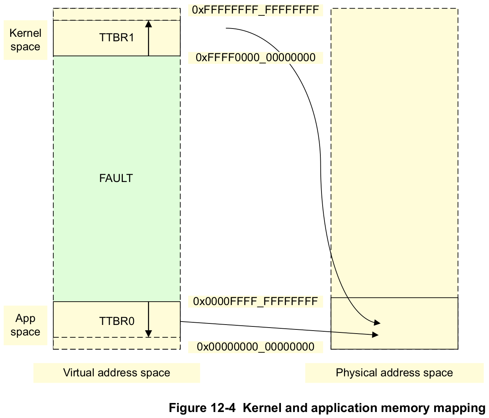

# Tutorial 15 - Virtual Memory Part 3: Precomputed Translation Tables

## tl;dr

- We are making the next baby-steps towards mapping the kernel to the most significant area of the
  virtual memory space.
- Instead of dynamically computing the kernel's translation tables during runtime while booting, we
  are precomputing them in advance just after kernel compilation, and patch them into the kernel's
  binary ahead of time.
- For now, we are still `identity-mapping` the kernel binary.
  - However, after this tutorial, we have all the infrastructure in place to easily map it
    elsewhere.

## Table of Contents

- [Introduction](#introduction)
- [When Load Address != Link Address, Funny Things Can Happen](#when-load-address--link-address-funny-things-can-happen)
  * [Interim Conclusion](#interim-conclusion)
  * [Doing the Same Thing - Expecting Different Results](#doing-the-same-thing---expecting-different-results)
- [Position-Independent Code (PIC)](#position-independent-code-pic)
  * [Using PIC during kernel startup](#using-pic-during-kernel-startup)
- [Precomputed Translation Tables](#precomputed-translation-tables)
- [Implementation](#implementation)
  * [Preparing the Kernel Tables](#preparing-the-kernel-tables)
  * [Turning on the MMU Before Switching to EL1](#turning-on-the-mmu-before-switching-to-el1)
  * [The Translation Table Tool](#the-translation-table-tool)
  * [Other changes](#other-changes)
- [Discussion](#discussion)
- [Test it](#test-it)
- [Diff to previous](#diff-to-previous)

## Introduction

This tutorial is another preparatory step for our overall goal of mapping the kernel to the most
significant area of the virtual memory space.

The reasoning of why we want to do this was given in the previous tutorial's introduction. But lets
for a quick moment think about what it actually means in practice: Currently, the kernel's binary is
loaded by the Raspberry's firmware at address `0x8_0000`.

In decimal, this address is at `512 KiB`, and therefore well within the _least significant part_ of
the address space. Let's have a look at the picture from the [ARM Cortex-A Series Programmer’s Guide
for ARMv8-A] again to understand in which virtual address space region the kernel would ideally be
mapped to:

<p align="center">
    
</p>

As we can see, the architecture proposes somewhere between addresses `0xffff_0000_0000_0000` and
`0xffff_ffff_ffff_ffff`. Once we succeed in mapping the kernel there, the whole lower range between
`0x0` and `0xffff_ffff_ffff` would be free for future applications to use.

[ARM Cortex-A Series Programmer’s Guide for ARMv8-A]: https://developer.arm.com/documentation/den0024/latest/

Now, how can we get there?

## When Load Address != Link Address, Funny Things Can Happen

Imagine that, using the linker script, we link the kernel so that its `_start()` function is located
at address `0xffff_0000_0000_0000`. What hasn't changed is that the Raspberry's firmware will still
load the kernel binary at address `0x8_0000`, and the kernel will still start executing from there
with the `MMU` disabled.

So one of the very first things the kernel must achieve during its boot to function correctly, is to
somehow enable the `MMU` together with `translation tables` that account for the address offset
(`0xffff_0000_0000_0000 -> 0x8_0000`). In previous tutorials, we already generated translation
tables during the kernel's boot, so lets quickly remember how we did that:

In `src/bsp/__board_name__/memory/mmu.rs` we have a static (or "global" in non-Rust speak) instance
of `struct KernelTranslationTable`:

```rust
static KERNEL_TABLES: InitStateLock<KernelTranslationTable> =
    InitStateLock::new(KernelTranslationTable::new());
```

In other parts of the kernel code, this instance would be referenced one way or the other, and its
member functions would be called, for example, when mapping a range of pages. At the end of the day,
after multiple layers of indirection, what happens at the most basic level is that a `piece of code`
manipulates some `global data`. So part of the job of the code is to retrieve the data's constant
address before it can manipulate it.

Let's simplify the address-retrieval to the most basic code example possible. The example will be
presented as `C` code. Don't ask yet why `C` is chosen. It will get clear as the tutorial develops.

```c
#include <stdint.h>

uint64_t global_data_word = 0x11223344;

uint64_t* get_address_of_global(void) {
     return &global_data_word;
}
```

Let's compile and link this using the following linker script:

```lds
SECTIONS
{
    . =  0x80000;

    .text : {
        QUAD(0); /* Intentional fill word */
        QUAD(0); /* Intentional fill word */
        KEEP(*(.text*))
    }
    .got    : ALIGN(8)   { *(.got) }
    .data   : ALIGN(64K) {
        QUAD(0); /* Intentional fill word */
        *(.data*)
    }
}
```

Here are the compilation steps and the corresponding `objdump` for `AArch64`:

```console
$ clang --target=aarch64-none-elf -Iinclude -Wall -c start.c -o start.o
$ ld.lld start.o -T link.ld -o example.elf
```

```c-objdump
Disassembly of section .text:

0000000000080010 get_address_of_global:
   80010: 80 00 00 90                  	adrp	x0, #0x10000
   80014: 00 20 00 91                  	add	x0, x0, #0x8
   80018: c0 03 5f d6                  	ret

Disassembly of section .data:

0000000000090008 global_data_word:
   90008: 44 33 22 11
   9000c: 00 00 00 00
```

As you can see, the address of function `get_address_of_global()` is `0x8_0010` and
`global_data_word` got address `0x9_0008`. In the function body, the compiler emitted an [`ADRP`]
and `ADD` instruction pair, which means that the global's address is calculated as a `PC-relative
offset`. `PC` means program counter, aka the current position of where the CPU core is currently
executing from.

Without going in too much detail, what the instruction basically does is: It retrieves the `4 KiB`
page address that belongs to the program counter's (PC) current position (PC is at `0x8_0010`, so
the page address is `0x8_0000`), and adds `0x1_0000`. So after the `ADRP` instruction, register `x0`
holds the value `0x9_0000`. To this value, `8` is added in the next instruction, resulting in the
overall address of `0x9_0008`, which is exactly where `global_data_word` is located. This works,
because after linking a `static executable binary` like we do since `tutorial 01`, relative
positions of code and data are fixed, and not supposed to change during runtime.

[`ADRP`]: https://developer.arm.com/documentation/dui0802/b/A64-General-Instructions/ADRP

If the Raspberry's firmware now loads this binary at address `0x8_0000`, as always, we can be sure
that our function returns the correct address of our global data word.

Now lets link this to the most significant area of memory:

```lds
SECTIONS
{
    . =  0xffff000000000000; <--- Only line changed in the linker script!

    .text : {

    /* omitted for brevity */
}
```

And compile again:

```c-objdump
Disassembly of section .text:

ffff000000000010 get_address_of_global:
ffff000000000010: 80 00 00 90          	adrp	x0, #0x10000
ffff000000000014: 00 20 00 91          	add	x0, x0, #0x8
ffff000000000018: c0 03 5f d6          	ret

Disassembly of section .data:

ffff000000010008 global_data_word:
ffff000000010008: 44 33 22 11
ffff00000001000c: 00 00 00 00
```

And let the Raspberry's firmware load the binary at address `0x8_0000` again (we couldn't load it to
`0xffff_0000_0000_0000` even if we wanted to. That address is `15 Exbibyte`. A Raspberry Pi with
that much RAM won't exist for some time to come 😉).

Let's try to answer the same question again: Would `get_address_of_global()` return the value for
`global_data_word` that we expect to see (`0xffff_0000_0001_0008` as shown in the objdump)? This
time, the answer is **no**. It would again return `0x9_0008`.

Why is that? Don't let yourself be distracted by the addresses the `objdump` above is showing. When
the Raspberry's firmware loads this binary at `0x8_0000`, then the Program Counter value when
`get_address_of_global()` executes is again `0x8_0010`. So **the PC-relative calculation** will not
result in the expected value, which would be the **absolute** (alternatively: **link-time**) address
of `global_data_word`.

### Interim Conclusion

What have we learned so far? We wrote a little piece of code in a high-level language that retrieves
an address, and we naively expected to retrieve an **absolute** address.

But compiler and linker conspired against us, and machine code was emitted that uses a PC-relative
addressing scheme, so our expectation is not matched when **load address != link address**. If you
compile for `AArch64`, you'll see relative addressing schemes a lot, because it is natural to the
architecture.

If you now say: Wait a second, how is this a problem? It actually helps! After all, since the code
is loaded at address `0x8_0000`, this relative addressing scheme will ensure that the processor
accesses the global data word at the correct address!

Yes, in this particular, constrained demo case, it worked out for us. But have a look at the
following.

### Doing the Same Thing - Expecting Different Results

Let's take a quick detour and see what happens if we compile **the exactly same code** for the
`x86_64` processor architecture. First when linked to `0x8_0000`:

```c-objdump
Disassembly of section .text:

0000000000080070 get_address_of_global:
   80070: 55                            push    rbp
   80071: 48 89 e5                      mov     rbp, rsp
   80074: 48 b8 08 00 09 00 00 00 00 00 movabs  rax, 0x90008
   8007e: 5d                            pop     rbp
   8007f: c3                            ret

Disassembly of section .data:

ffff000000010008 global_data_word:
ffff000000010008: 44 33 22 11
ffff00000001000c: 00 00 00 00
```

And now linked to `0xffff_0000_0000_0000`:

```c-objdump
Disassembly of section .text:

ffff000000000070 get_address_of_global:
ffff000000000070: 55                            push    rbp
ffff000000000071: 48 89 e5                      mov     rbp, rsp
ffff000000000074: 48 b8 08 00 01 00 00 00 ff ff movabs  rax, 0xffff000000010008
ffff00000000007e: 5d                            pop     rbp
ffff00000000007f: c3                            ret

Disassembly of section .data:

ffff000000010008 global_data_word:
ffff000000010008: 44 33 22 11
ffff00000001000c: 00 00 00 00
```

Both times, the `movabsq` instruction gets emitted. It means that the address is put into the target
register using hardcoded `immediate values`. PC-relative address calculation is not used here.
Hence, this code would return the `absolute` address in both cases. Which means in the second case,
even when the binary would be loaded at `0x8_0000`, the return value would be
`0xffff_0000_0001_0008`.

**In summary, we get a different result for the same piece of `C` code, depending on the target
processor architecture**. What do we learn from this little detour?

First, you cannot naively compile and run `Rust` or `C` statically linked binaries when there will
be a **load address != link address** situation. You'll run into undefined behavior very fast. It is
kinda expected and obvious, but hopefully it helped to see it fail in action.

Furthermore, it is important to understand that there are of course ways to load a symbol's absolute
address into `AArch64` registers using `immediate values` as well. Likewise, you can also do
PC-relative addressing in `x86`. We just looked at a tiny example. Maybe the next line of code would
be compiled into the opposite behavior on the two architectures, so that the `x86` code would do a
PC-relative calculation while the `AArch64` code goes for absolute.

At the end of the day, what is needed to solve our task at hand (bringup of virtual memory, while
being linked to one address and executing from another), is tight control over the machine
instructions that get emitted for **those pieces of code** that generate the `translation tables`
and enable the `MMU`.

What we need is called [position-independent code].

[position-independent code]: https://en.wikipedia.org/wiki/Position-independent_code

> Much low-level stuff in this tutorial, isn't it? This was a lot to digest already, but we're far
> from finished. So take a minute or two and clear your mind before we continue. 🧘

## Position-Independent Code (PIC)

As describend by Wikipedia, position-independent code

> is a body of machine code that, being placed somewhere in the primary memory, **executes
> properly** regardless of its absolute address.

Your safest bet is to write the pieces that need to be position-independent in `assembly`, because
this gives you full control over when relative or absolute addresses are being generated or used.
You will see this approach often in big projects like the Linux kernel, for example. The downside of
that approach is that the programmer needs good domain knowledge.

If you feel more adventurous and don't want to go completely without high-level code, you can try to
make use of suitable compiler flags such as `-fpic`, and only use `assembly` where absolutely
needed. Here is the [`-fpic` description for GCC]:

> -fpic
>
> Generate position-independent code (PIC) suitable for use in a shared library, if supported for
> the target machine. Such code accesses all constant addresses through a global offset table (GOT).
> The dynamic loader resolves the GOT entries when the program starts (the dynamic loader is not
> part of GCC; it is part of the operating system).

[`-fpic` description for GCC]: https://gcc.gnu.org/onlinedocs/gcc/Code-Gen-Options.html#Code-Gen-Options

However, it is very important to understand that this flag **is not** a ready-made solution for our
particular problem (and wasn't invented for that case either). There is a hint in the quoted text
above that gives it away: "_The dynamic loader resolves the GOT entries when the program starts (the
dynamic loader is not part of GCC; it is part of the operating system)_".

Well, we are a booting kernel, and not some (userspace) program running on top of an operating
system. Hence, there is no dynamic loader available. However, it is still possible to benefit from
`-fpic` even in our case. Lets have a look at what happens if we compile the earlier piece of `C`
code for `AArch64` using `-fpic`, still linking the output to the most signifcant part of the memory
space:

```console
$ clang --target=aarch64-none-elf -Iinclude -Wall -fpic -c start.c -o start.o
$ ld.lld start.o -T link.ld -o example.elf
```

```c-objdump
Disassembly of section .text:

ffff000000000010 get_address_of_global:
ffff000000000010: 00 00 00 90          	adrp	x0, #0x0
ffff000000000014: 00 28 40 f9          	ldr	x0, [x0, #0x50]
ffff000000000018: c0 03 5f d6          	ret

Disassembly of section .got:

ffff000000000050 .got:
ffff000000000050: 08 00 01 00
ffff000000000054: 00 00 ff ff

Disassembly of section .data:

ffff000000010008 global_data_word:
ffff000000010008: 44 33 22 11
ffff00000001000c: 00 00 00 00
```

What changed compared to earlier is that `rx_start_address()` now indirects through the `Global
Offset Table`, as has been promised by the compiler's documentation. Specifically,
`rx_start_address()` addresses the `GOT` using PC-relative addressing (distance from code to `GOT`
must always be fixed), and loads the first 64 bit word from the start of the `GOT`, which happens to
be `0xffff_0000_0001_0008`.

Okay okay okay... So when we use `-fpic`, we get the **absolute** address of `global_data_word` even
on `AArch64` now. How does this help when the code executes from `0x8_0000`?

Well, this is the part where the `dynamic loader` quoted above would come into picture if this was a
userspace program: "_The dynamic loader resolves the GOT entries when the program starts_". The
`-fpic` flag is normally used to compile _shared libraries_. Suppose we have a program that uses one
or more shared library. For various reasons, it happens that the shared library is loaded at a
different address than where the userspace program would initially expect it. In our example,
`global_data_word` could be supplied by such a shared library, and the userspace program is only
referencing it. The dynamic loader would know where the shared library was loaded into memory, and
therefore know the real address of `global_data_word`. So before the userspace program starts, the
loader would overwrite the `GOT` entry with the correct location. Et voilà, the compiled high-level
code would execute properly.

### Using PIC during kernel startup

If you think about it, our problem is a special case of what we just learned. We have a single
statically linked binary, where everything is dislocated by a fixed offset. In our case, it is
`0xffff_0000_0000_0000 - 0x8_0000 = 0x0fff_efff_ffff8_0000`. If we write some PIC-`assembly` code
which loops over the `GOT` and subtracts `0x0fff_efff_ffff8_0000` from every entry as the very first
thing when our kernel boots, any high-level code compiled with `-fpic` would work correctly
afterwards.

Moreover, this approach would be portable! Here's the output of our code compiled with `-fpic` for
`x86_64`:

```c-objdump
Disassembly of section .text:

ffff000000000070 get_address_of_global:
ffff000000000070: 55                    push    rbp
ffff000000000071: 48 89 e5              mov     rbp, rsp
ffff000000000074: 48 8b 05 2d 00 00 00  mov     rax, qword ptr [rip + 0x2d]
ffff00000000007b: 5d                    pop     rbp
ffff00000000007c: c3                    ret
ffff00000000007d: 0f 1f 00              nop     dword ptr [rax]

Disassembly of section .got:

ffff0000000000a8 .got:
ffff0000000000a8: 08 00 01 00
ffff0000000000ac: 00 00 ff ff

Disassembly of section .data:

ffff000000010008 global_data_word:
ffff000000010008: 44 33 22 11
ffff00000001000c: 00 00 00 00
```

As you can see, the `x86_64` code indirects through the `GOT` now same as the `AArch64` code.

Of course, indirecting through the `GOT` would be detrimental to performance, so you would restrict
`-fpic` compilation only to the code that is needed to enable the `MMU`. Everything else can be
compiled `non-relocatable` as always, because the translation tables naturally resolve the **load
address != link address** situation once they are live.

With `C/C++` compilers, this can be done rather easily. The compilers support compilation of
PIC-code on a per-[translation-unit] basis. Think of it as telling the compiler to compile this `.c`
file as `PIC`, but this other `.c` file not.

[translation-unit]: https://en.wikipedia.org/wiki/Translation_unit_(programming)

With `Rust`, unfortunately, the [relocation model] can only be set on a per-`crate` basis at the
moment (IINM), so that makes it difficult for us to put this approach to use.

[relocation model]: https://doc.rust-lang.org/rustc/codegen-options/index.html#relocation-model

## Precomputed Translation Tables

As we have just seen, going the `-fpic` way isn't a feasible solution at the time of writing this
text. On the other hand, writing the code to set up the initial page tables in `assembly` isn't that
attractive either, because writing larger pieces of assembly is an error-prone and delicate task.

Fortunately, there is a third way. We are writing an embedded kernel, and therefore the execution
environment is way more static and deterministic as compared to a general-purpose kernel that can be
deployed on a wide variety of targets. Specifically, for the Raspberrypi, we exactly know the **load
address** of the kernel in advance, and we know about the capabilities of the `MMU`. So there is
nothing stopping us from precomputing the kernel's translation tables ahead of time.

A disadvantage of this approach is an increased binary size, but this is not a deal breaker in our
case.

## Implementation

As stated in the initial `tl;dr`, we're not yet mapping the kernel to the most significant area of
virtual memory. This tutorial will keep the binary `identity-mapped`, and focuses only on the
infrastructure changes which enable the kernel to use `precomputed translation tables`. The actual
switch to high memory will happen in the next tutorial.

The changes needed are as follows:

1. Make preparations so that precomputed tables are supported by the kernel's memory subsystem code.
2. Change the boot code of the kernel so that the `MMU` is enabled with the precomputed tables as
   soon as possible.
3. Write a `translation table tool` that precomputes the translation tables from the generated
   `kernel.elf` file, and patches the tables back into the same.

### Preparing the Kernel Tables

The tables must be linked into the `.data` section now so that they become part of the final binary.
This is ensured using an attribute on the table's instance definition in
`bsp/__board_name__/memory/mmu.rs`:

```rust
#[link_section = ".data"]
static KERNEL_TABLES: InitStateLock<KernelTranslationTable> =
    InitStateLock::new(KernelTranslationTable::new_for_precompute());
```

The `new_for_precompute()` is a new constructor in the the respective `_arch` code that ensures some
struct members that are not the translation table entries themselves are initialized properly for
the precompute use-case.

In the `BSP` code, there is also a new file called `kernel_virt_addr_space_size.ld`, which contains
the kernel's virtual address space size. This file gets included in both, the `link.ld` linker
script and `mmu.rs`. We need this value both as a symbol in the kernel's ELF (for the `translation
table tool` to parse it later) and as a constant in the `Rust` code. This inclusion approach is just
a convenience hack that turned out working well.

One critical parameter that the kernel's boot code needs in order to enable the precomputed tables
is the `translation table base address` which must be programmed into the MMU's `TTBR` register. To
make it accessible easily, it is added to the `.text._start_arguments` section. The definition is
just below the definition of the kernel table instance in the `BSP` code:

```rust
/// This value is needed during early boot for MMU setup.
///
/// This will be patched to the correct value by the "translation table tool" after linking. This
/// given value here is just a dummy.
#[link_section = ".text._start_arguments"]
#[no_mangle]
static PHYS_KERNEL_TABLES_BASE_ADDR: u64 = 0xCCCCAAAAFFFFEEEE;
```

### Turning on the MMU Before Switching to EL1

Since the Raspberry Pi starts execution in the `EL2` privilege level, one of the first things we do
during boot since `tutorial 09` is to context-switch to the appropriate `EL1`. The `EL2` boot code
is a great place to set up virtual memory for `EL1`. It will allow execution in `EL1` to start with
virtual memory enabled since the very first instruction. The tweaks to `boot.s` are minimal:

```asm
// Load the base address of the kernel's translation tables.
ldr	x0, PHYS_KERNEL_TABLES_BASE_ADDR // provided by bsp/__board_name__/memory/mmu.rs

// Set the stack pointer. This ensures that any code in EL2 that needs the stack will work.
ADR_REL	x1, __boot_core_stack_end_exclusive
mov	sp, x1

// Jump to Rust code. x0 and x1 hold the function arguments provided to _start_rust().
b	_start_rust
```

In addition to the stack's address, we are now reading _the value_ of
`PHYS_KERNEL_TABLES_BASE_ADDR`. The `ldr` instruction addresses the value-to-be-read using a
PC-relative offset, so this is a `position-independent` operation and will therefore be future
proof. The retrieved value is supplied as an argument to function `_start_rust()`, which is defined
in `_arch/__arch_name__/cpu/boot.rs`:

```rust
#[no_mangle]
pub unsafe extern "C" fn _start_rust(
    phys_kernel_tables_base_addr: u64,
    phys_boot_core_stack_end_exclusive_addr: u64,
) -> ! {
    prepare_el2_to_el1_transition(phys_boot_core_stack_end_exclusive_addr);

    // Turn on the MMU for EL1.
    let addr = Address::new(phys_kernel_tables_base_addr as usize);
    if unlikely(memory::mmu::enable_mmu_and_caching(addr).is_err()) {
        cpu::wait_forever();
    }

    // Use `eret` to "return" to EL1. This results in execution of runtime_init() in EL1.
    asm::eret()
}
```

You can also see that we now turn on the `MMU` just before returning to `EL1`. That's basically it
already, the only missing piece that's left is the offline computation of the translation tables.

### The Translation Table Tool

The tool for translation table computation is located in the folder `translation_table_tool` in the
root directory. For ease of use, it is written in `Ruby` 💎. The code is organized into `BSP` and
`arch` parts just like the kernel's `Rust` code:

```console
$ tree translation_table_tool

translation_table_tool
├── arch.rb
├── bsp.rb
├── generic.rb
└── main.rb

0 directories, 4 files
```

Especially the `arch` part, which deals with compiling the translation table entries, will contain
some overlap with the `Rust` code present in `_arch/aarch64/memory/mmu/translation_table.rs`. It
might have been possible to write this tool in Rust as well, and borrow/share these pieces of code
with the kernel. But in the end, I found it not worth the effort for the few lines of code.

In the `Makefile`, the tool is invoked after compiling and linking the kernel, and before the
`objcopy`. It's command line arguments are the target `BSP` type and the path to the kernel's `ELF`
file:

```Makefile
all: $(KERNEL_BIN)

$(KERNEL_ELF):
	$(call colorecho, "\nCompiling kernel - $(BSP)")
	@RUSTFLAGS="$(RUSTFLAGS_PEDANTIC)" $(RUSTC_CMD)
	@$(DOCKER_TOOLS) ruby translation_table_tool/main.rb $(TARGET) $(BSP) $(KERNEL_ELF)

$(KERNEL_BIN): $(KERNEL_ELF)
	@$(OBJCOPY_CMD) $(KERNEL_ELF) $(KERNEL_BIN)
```

In `main.rb`, the `BSP`-part of the tool is executed first. This part is mostly concerned with
parsing symbols from the ELF file that are needed for the computation of the tables. Here is an
excerpt of the symbols in question:

```ruby
class RaspberryPi

    # omitted

    def initialize(kernel_elf)
        # omitted

        @virt_addresses = {
            boot_core_stack_start: /__boot_core_stack_start/,
            boot_core_stack_end_exclusive: /__boot_core_stack_end_exclusive/,

            rx_start: /__rx_start/,
            rx_end_exclusive: /__rx_end_exclusive/,

            rw_start: /__rw_start/,
            rw_end_exclusive: /__rw_end_exclusive/,

            table_struct_start_addr: /bsp::.*::memory::mmu::KERNEL_TABLES/,
            phys_tables_base_addr: /PHYS_KERNEL_TABLES_BASE_ADDR/
        }
```

Using those values, the `BSP` code goes on to create descriptors for each of the three sections that
whose mappings need to be computed:

- The RX section.
- The RW section.
- The boot-core's stack.

After the `BSP` setup, `main.rb` creates an instance of the translation tables and the kernel binary
is mapped using the same:

```ruby
TRANSLATION_TABLES = case TARGET
                     when :aarch64
                         Arch::ARMv8::TranslationTable.new
                     else
                         raise
                     end

BSP.kernel_map_binary
```

As initially said, the `arch` code works rather similar to the mapping code in the actual kernel's
driver. `BSP.kernel_map_binary` internally calls `map_pages_at` of the `TRANSLATION_TABLE` instance:

```ruby
def kernel_map_binary
    MappingDescriptor.print_header

    @descriptors.each do |i|
        print 'Generating'.rjust(12).green.bold
        print ' '
        puts i.to_s

        TRANSLATION_TABLES.map_pages_at(i.virt_pages, i.phys_pages, i.attributes)
    end

    MappingDescriptor.print_divider
end
```

For `map_pages_at()` to work, the `arch` code needs knowledge about **location** and **layout** of
the kernels table structure. Location will be queried from the `BSP` code, which itself retrieves it
during the symbol parsing. The layout, on the other hand, is hardcoded and as such must be kept in
sync with the structure definition in `translation_tables.rs`.

Finally, after the mappings have been created, it is time to _patch_ them back into the kernel ELF
file. This is initiated from `main.rb` again:

```ruby
kernel_patch_tables(kernel_elf)
kernel_patch_base_addr(kernel_elf)
```

The tool prints some information on the fly. Here's the console output of a successful run:

```console
$ make

Compiling kernel - rpi3
    Finished release [optimized] target(s) in 0.01s

Precomputing kernel translation tables and patching kernel ELF
             --------------------------------------------------
                 Section           Start Virt Addr       Size
             --------------------------------------------------
  Generating Code and RO data | 0x0000_0000_0008_0000 |  64 KiB
  Generating Data and bss     | 0x0000_0000_0009_0000 | 384 KiB
  Generating Boot-core stack  | 0x0000_0000_0010_0000 | 512 KiB
             --------------------------------------------------
    Patching Kernel table struct at physical 0x9_0000
    Patching Value of kernel table physical base address (0xd_0000) at physical 0x8_0040
    Finished in 0.03s
```

Please note how only the kernel's binary is precomputed! Thanks to the changes made in the last
tutorial, anything else, like `MMIO-remapping`, can and will happen lazily during runtime.

### Other changes

Two more things that changed in this tutorial, but won't be explained in detail:

- Since virtual memory in `EL1` is now active from the start, any attempt to convert from
  `Address<Virtual>` to `Address<Physical>` is now done through the `TryFrom` trait, which
  internally uses HW-supported address translation of the CPU. So either the translation succeeds
  because there is a valid virtual-to-physical mapping in the currently used translation tables, or
  an `Err()` is returned.
- The precomputed translation table mappings won't automatically have entries in the kernel's
  `mapping info record`, which is used to print mapping info during boot. Mapping record entries are
  not computed offline in order to reduce complexity. For this reason, the `BSP` code, which in
  earlier tutorials would have called `kernel_map_pages_at()` (which implicitly would have generated
  mapping record entries), now only calls `kernel_add_mapping_record()`, since the mappings are
  already in place.

## Discussion

It is understood that there is room for optimizations in the presented approach. For example, the
generated kernel binary contains the _complete_ array of translation tables for the whole kernel
virtual address space (`2 GiB`). However, most of the entries are empty initially, because the
kernel binary only occupies a small area in the tables. It would make sense to add some smarts so
that only the non-zero entries are packed into binary.

On the other hand, this would add complexity to the code. The increased size doesn't hurt too much
yet, so the reduced complexity in the code is a tradeoff made willingly to keep everything concise
and focused on the high-level concepts.

## Test it

```console
$ make chainboot
[...]

Precomputing kernel translation tables and patching kernel ELF
             --------------------------------------------------
                 Section           Start Virt Addr       Size
             --------------------------------------------------
  Generating Code and RO data | 0x0000_0000_0008_0000 |  64 KiB
  Generating Data and bss     | 0x0000_0000_0009_0000 | 384 KiB
  Generating Boot-core stack  | 0x0000_0000_0010_0000 | 512 KiB
             --------------------------------------------------
    Patching Kernel table struct at physical 0x9_0000
    Patching Value of kernel table physical base address (0xd_0000) at physical 0x8_0040
    Finished in 0.03s

Minipush 1.0

[MP] ⏳ Waiting for /dev/ttyUSB0
[MP] ✅ Serial connected
[MP] 🔌 Please power the target now
 __  __ _      _ _                 _
|  \/  (_)_ _ (_) |   ___  __ _ __| |
| |\/| | | ' \| | |__/ _ \/ _` / _` |
|_|  |_|_|_||_|_|____\___/\__,_\__,_|

           Raspberry Pi 3

[ML] Requesting binary
[MP] ⏩ Pushing 387 KiB =======================================🦀 100% 96 KiB/s Time: 00:00:04
[ML] Loaded! Executing the payload now

[    4.324361] mingo version 0.15.0
[    4.324568] Booting on: Raspberry Pi 3
[    4.325023] MMU online:
[    4.325316]       -------------------------------------------------------------------------------------------------------------------------------------------
[    4.327060]                         Virtual                                   Physical               Size       Attr                    Entity
[    4.328804]       -------------------------------------------------------------------------------------------------------------------------------------------
[    4.330551]       0x0000_0000_0008_0000..0x0000_0000_0008_ffff --> 0x00_0008_0000..0x00_0008_ffff |  64 KiB | C   RO X  | Kernel code and RO data
[    4.332164]       0x0000_0000_0009_0000..0x0000_0000_000e_ffff --> 0x00_0009_0000..0x00_000e_ffff | 384 KiB | C   RW XN | Kernel data and bss
[    4.333735]       0x0000_0000_0010_0000..0x0000_0000_0017_ffff --> 0x00_0010_0000..0x00_0017_ffff | 512 KiB | C   RW XN | Kernel boot-core stack
[    4.335338]       0x0000_0000_7000_0000..0x0000_0000_7000_ffff --> 0x00_3f20_0000..0x00_3f20_ffff |  64 KiB | Dev RW XN | BCM GPIO
[    4.336788]                                                                                                             | BCM PL011 UART
[    4.338306]       0x0000_0000_7001_0000..0x0000_0000_7001_ffff --> 0x00_3f00_0000..0x00_3f00_ffff |  64 KiB | Dev RW XN | BCM Peripheral Interrupt Controller
[    4.340050]       -------------------------------------------------------------------------------------------------------------------------------------------
```

## Diff to previous
```diff

diff -uNr 14_virtual_mem_part2_mmio_remap/Cargo.toml 15_virtual_mem_part3_precomputed_tables/Cargo.toml
--- 14_virtual_mem_part2_mmio_remap/Cargo.toml
+++ 15_virtual_mem_part3_precomputed_tables/Cargo.toml
@@ -1,6 +1,6 @@
 [package]
 name = "mingo"
-version = "0.14.0"
+version = "0.15.0"
 authors = ["Andre Richter <andre.o.richter@gmail.com>"]
 edition = "2018"


diff -uNr 14_virtual_mem_part2_mmio_remap/Makefile 15_virtual_mem_part3_precomputed_tables/Makefile
--- 14_virtual_mem_part2_mmio_remap/Makefile
+++ 15_virtual_mem_part3_precomputed_tables/Makefile
@@ -112,6 +112,7 @@
 $(KERNEL_ELF):
 	$(call colorecho, "\nCompiling kernel - $(BSP)")
 	@RUSTFLAGS="$(RUSTFLAGS_PEDANTIC)" $(RUSTC_CMD)
+	@$(DOCKER_TOOLS) ruby translation_table_tool/main.rb $(TARGET) $(BSP) $(KERNEL_ELF)

 $(KERNEL_BIN): $(KERNEL_ELF)
 	@$(OBJCOPY_CMD) $(KERNEL_ELF) $(KERNEL_BIN)
@@ -134,6 +135,7 @@
     TEST_ELF=$$(echo $$1 | sed -e 's/.*target/target/g')
     TEST_BINARY=$$(echo $$1.img | sed -e 's/.*target/target/g')

+    $(DOCKER_TOOLS) ruby translation_table_tool/main.rb $(TARGET) $(BSP) $$TEST_ELF > /dev/null
     $(OBJCOPY_CMD) $$TEST_ELF $$TEST_BINARY
     $(DOCKER_TEST) ruby tests/runner.rb $(EXEC_QEMU) $(QEMU_TEST_ARGS) -kernel $$TEST_BINARY
 endef

diff -uNr 14_virtual_mem_part2_mmio_remap/src/_arch/aarch64/cpu/boot.rs 15_virtual_mem_part3_precomputed_tables/src/_arch/aarch64/cpu/boot.rs
--- 14_virtual_mem_part2_mmio_remap/src/_arch/aarch64/cpu/boot.rs
+++ 15_virtual_mem_part3_precomputed_tables/src/_arch/aarch64/cpu/boot.rs
@@ -11,7 +11,8 @@
 //!
 //! crate::cpu::boot::arch_boot

-use crate::runtime_init;
+use crate::{cpu, memory, memory::Address, runtime_init};
+use core::intrinsics::unlikely;
 use cortex_a::{asm, regs::*};

 // Assembly counterpart to this file.
@@ -71,9 +72,18 @@
 /// - The `bss` section is not initialized yet. The code must not use or reference it in any way.
 /// - Exception return from EL2 must must continue execution in EL1 with `runtime_init()`.
 #[no_mangle]
-pub unsafe extern "C" fn _start_rust(phys_boot_core_stack_end_exclusive_addr: u64) -> ! {
+pub unsafe extern "C" fn _start_rust(
+    phys_kernel_tables_base_addr: u64,
+    phys_boot_core_stack_end_exclusive_addr: u64,
+) -> ! {
     prepare_el2_to_el1_transition(phys_boot_core_stack_end_exclusive_addr);

+    // Turn on the MMU for EL1.
+    let addr = Address::new(phys_kernel_tables_base_addr as usize);
+    if unlikely(memory::mmu::enable_mmu_and_caching(addr).is_err()) {
+        cpu::wait_forever();
+    }
+
     // Use `eret` to "return" to EL1. This results in execution of runtime_init() in EL1.
     asm::eret()
 }

diff -uNr 14_virtual_mem_part2_mmio_remap/src/_arch/aarch64/cpu/boot.s 15_virtual_mem_part3_precomputed_tables/src/_arch/aarch64/cpu/boot.s
--- 14_virtual_mem_part2_mmio_remap/src/_arch/aarch64/cpu/boot.s
+++ 15_virtual_mem_part3_precomputed_tables/src/_arch/aarch64/cpu/boot.s
@@ -44,11 +44,14 @@

 	// If execution reaches here, it is the boot core. Now, prepare the jump to Rust code.

+	// Load the base address of the kernel's translation tables.
+	ldr	x0, PHYS_KERNEL_TABLES_BASE_ADDR // provided by bsp/__board_name__/memory/mmu.rs
+
 	// Set the stack pointer. This ensures that any code in EL2 that needs the stack will work.
-	ADR_REL	x0, __boot_core_stack_end_exclusive
-	mov	sp, x0
+	ADR_REL	x1, __boot_core_stack_end_exclusive
+	mov	sp, x1

-	// Jump to Rust code. x0 holds the function argument provided to _start_rust().
+	// Jump to Rust code. x0 and x1 hold the function arguments provided to _start_rust().
 	b	_start_rust

 	// Infinitely wait for events (aka "park the core").

diff -uNr 14_virtual_mem_part2_mmio_remap/src/_arch/aarch64/memory/mmu/translation_table.rs 15_virtual_mem_part3_precomputed_tables/src/_arch/aarch64/memory/mmu/translation_table.rs
--- 14_virtual_mem_part2_mmio_remap/src/_arch/aarch64/memory/mmu/translation_table.rs
+++ 15_virtual_mem_part3_precomputed_tables/src/_arch/aarch64/memory/mmu/translation_table.rs
@@ -23,7 +23,7 @@
         Address, Physical, Virtual,
     },
 };
-use core::convert;
+use core::convert::{self, TryInto};
 use register::{register_bitfields, InMemoryRegister};

 //--------------------------------------------------------------------------------------------------
@@ -120,7 +120,7 @@
 }

 trait StartAddr {
-    fn phys_start_addr(&self) -> Address<Physical>;
+    fn virt_start_addr(&self) -> Address<Virtual>;
 }

 //--------------------------------------------------------------------------------------------------
@@ -149,9 +149,8 @@
 // Private Code
 //--------------------------------------------------------------------------------------------------

-// The binary is still identity mapped, so we don't need to convert here.
 impl<T, const N: usize> StartAddr for [T; N] {
-    fn phys_start_addr(&self) -> Address<Physical> {
+    fn virt_start_addr(&self) -> Address<Virtual> {
         Address::new(self as *const _ as usize)
     }
 }
@@ -269,7 +268,7 @@

     /// Create an instance.
     #[allow(clippy::assertions_on_constants)]
-    pub const fn new() -> Self {
+    const fn _new(for_precompute: bool) -> Self {
         assert!(bsp::memory::mmu::KernelGranule::SIZE == Granule64KiB::SIZE);

         // Can't have a zero-sized address space.
@@ -278,11 +277,20 @@
         Self {
             lvl3: [[PageDescriptor::new_zeroed(); 8192]; NUM_TABLES],
             lvl2: [TableDescriptor::new_zeroed(); NUM_TABLES],
-            cur_l3_mmio_index: 0,
-            initialized: false,
+            cur_l3_mmio_index: Self::L3_MMIO_START_INDEX,
+            initialized: for_precompute,
         }
     }

+    pub const fn new_for_precompute() -> Self {
+        Self::_new(true)
+    }
+
+    #[cfg(test)]
+    pub fn new_for_runtime() -> Self {
+        Self::_new(false)
+    }
+
     /// The start address of the table's MMIO range.
     #[inline(always)]
     fn mmio_start_addr(&self) -> Address<Virtual> {
@@ -338,24 +346,26 @@
 impl<const NUM_TABLES: usize> memory::mmu::translation_table::interface::TranslationTable
     for FixedSizeTranslationTable<NUM_TABLES>
 {
-    fn init(&mut self) {
+    fn init(&mut self) -> Result<(), &'static str> {
         if self.initialized {
-            return;
+            return Ok(());
         }

         // Populate the l2 entries.
         for (lvl2_nr, lvl2_entry) in self.lvl2.iter_mut().enumerate() {
-            let desc =
-                TableDescriptor::from_next_lvl_table_addr(self.lvl3[lvl2_nr].phys_start_addr());
+            let addr = self.lvl3[lvl2_nr]
+                .virt_start_addr()
+                .try_into()
+                .map_err(|_| "Translation error")?;
+
+            let desc = TableDescriptor::from_next_lvl_table_addr(addr);
             *lvl2_entry = desc;
         }

         self.cur_l3_mmio_index = Self::L3_MMIO_START_INDEX;
         self.initialized = true;
-    }

-    fn phys_base_address(&self) -> Address<Physical> {
-        self.lvl2.phys_start_addr()
+        Ok(())
     }

     unsafe fn map_pages_at(

diff -uNr 14_virtual_mem_part2_mmio_remap/src/_arch/aarch64/memory/mmu.rs 15_virtual_mem_part3_precomputed_tables/src/_arch/aarch64/memory/mmu.rs
--- 14_virtual_mem_part2_mmio_remap/src/_arch/aarch64/memory/mmu.rs
+++ 15_virtual_mem_part3_precomputed_tables/src/_arch/aarch64/memory/mmu.rs
@@ -15,7 +15,7 @@

 use crate::{
     bsp, memory,
-    memory::{mmu::TranslationGranule, Address, Physical},
+    memory::{mmu::TranslationGranule, Address, Physical, Virtual},
 };
 use core::intrinsics::unlikely;
 use cortex_a::{barrier, regs::*};
@@ -108,7 +108,7 @@
 //------------------------------------------------------------------------------
 // OS Interface Code
 //------------------------------------------------------------------------------
-use memory::mmu::MMUEnableError;
+use memory::mmu::{MMUEnableError, TranslationError};

 impl memory::mmu::interface::MMU for MemoryManagementUnit {
     unsafe fn enable_mmu_and_caching(
@@ -152,4 +152,31 @@
     fn is_enabled(&self) -> bool {
         SCTLR_EL1.matches_all(SCTLR_EL1::M::Enable)
     }
+
+    fn try_virt_to_phys(
+        &self,
+        virt: Address<Virtual>,
+    ) -> Result<Address<Physical>, TranslationError> {
+        if !self.is_enabled() {
+            return Err(TranslationError::MMUDisabled);
+        }
+
+        let addr = virt.into_usize() as u64;
+        unsafe {
+            asm!(
+            "AT S1E1R, {0}",
+            in(reg) addr,
+            options(readonly, nostack, preserves_flags)
+            );
+        }
+
+        let par_el1 = PAR_EL1.extract();
+        if par_el1.matches_all(PAR_EL1::F::TranslationAborted) {
+            return Err(TranslationError::Aborted);
+        }
+
+        let phys_addr = (par_el1.read(PAR_EL1::PA) << 12) | (addr & 0xFFF);
+
+        Ok(Address::new(phys_addr as usize))
+    }
 }

diff -uNr 14_virtual_mem_part2_mmio_remap/src/bsp/raspberrypi/console.rs 15_virtual_mem_part3_precomputed_tables/src/bsp/raspberrypi/console.rs
--- 14_virtual_mem_part2_mmio_remap/src/bsp/raspberrypi/console.rs
+++ 15_virtual_mem_part3_precomputed_tables/src/bsp/raspberrypi/console.rs
@@ -22,6 +22,7 @@
 /// # Safety
 ///
 /// - Use only for printing during a panic.
+#[cfg(not(feature = "test_build"))]
 pub unsafe fn panic_console_out() -> impl fmt::Write {
     use driver::interface::DeviceDriver;

@@ -45,6 +46,23 @@
     panic_uart
 }

+/// Reduced version for test builds.
+#[cfg(feature = "test_build")]
+pub unsafe fn panic_console_out() -> impl fmt::Write {
+    use driver::interface::DeviceDriver;
+
+    let mut panic_uart =
+        device_driver::PanicUart::new(memory::map::mmio::PL011_UART_START.into_usize());
+
+    let maybe_uart_mmio_start_addr = super::PL011_UART.virt_mmio_start_addr();
+
+    panic_uart
+        .init(maybe_uart_mmio_start_addr)
+        .unwrap_or_else(|_| cpu::qemu_exit_failure());
+
+    panic_uart
+}
+
 /// Return a reference to the console.
 pub fn console() -> &'static impl console::interface::All {
     &super::PL011_UART
@@ -56,7 +74,15 @@

 /// Minimal code needed to bring up the console in QEMU (for testing only). This is often less steps
 /// than on real hardware due to QEMU's abstractions.
-///
-/// For the RPi, nothing needs to be done.
 #[cfg(feature = "test_build")]
-pub fn qemu_bring_up_console() {}
+pub fn qemu_bring_up_console() {
+    use driver::interface::DeviceDriver;
+
+    // Calling the UART's init ensures that the BSP's instance of the UART does remap the MMIO
+    // addresses.
+    unsafe {
+        super::PL011_UART
+            .init()
+            .unwrap_or_else(|_| cpu::qemu_exit_failure());
+    }
+}

diff -uNr 14_virtual_mem_part2_mmio_remap/src/bsp/raspberrypi/kernel_virt_addr_space_size.ld 15_virtual_mem_part3_precomputed_tables/src/bsp/raspberrypi/kernel_virt_addr_space_size.ld
--- 14_virtual_mem_part2_mmio_remap/src/bsp/raspberrypi/kernel_virt_addr_space_size.ld
+++ 15_virtual_mem_part3_precomputed_tables/src/bsp/raspberrypi/kernel_virt_addr_space_size.ld
@@ -0,0 +1 @@
+__kernel_virt_addr_space_size = 2 * 1024 * 1024 * 1024

diff -uNr 14_virtual_mem_part2_mmio_remap/src/bsp/raspberrypi/link.ld 15_virtual_mem_part3_precomputed_tables/src/bsp/raspberrypi/link.ld
--- 14_virtual_mem_part2_mmio_remap/src/bsp/raspberrypi/link.ld
+++ 15_virtual_mem_part3_precomputed_tables/src/bsp/raspberrypi/link.ld
@@ -3,6 +3,9 @@
  * Copyright (c) 2018-2021 Andre Richter <andre.o.richter@gmail.com>
  */

+/* This file provides __kernel_virt_addr_space_size */
+INCLUDE src/bsp/raspberrypi/kernel_virt_addr_space_size.ld;
+
 /* The address at which the the kernel binary will be loaded by the Raspberry's firmware */
 __rpi_load_addr = 0x80000;


diff -uNr 14_virtual_mem_part2_mmio_remap/src/bsp/raspberrypi/memory/mmu.rs 15_virtual_mem_part3_precomputed_tables/src/bsp/raspberrypi/memory/mmu.rs
--- 14_virtual_mem_part2_mmio_remap/src/bsp/raspberrypi/memory/mmu.rs
+++ 15_virtual_mem_part3_precomputed_tables/src/bsp/raspberrypi/memory/mmu.rs
@@ -16,6 +16,7 @@
     },
     synchronization::InitStateLock,
 };
+use core::convert::TryInto;

 //--------------------------------------------------------------------------------------------------
 // Private Definitions
@@ -33,7 +34,7 @@
 pub type KernelGranule = TranslationGranule<{ 64 * 1024 }>;

 /// The kernel's virtual address space defined by this BSP.
-pub type KernelVirtAddrSpace = AddressSpace<{ 8 * 1024 * 1024 * 1024 }>;
+pub type KernelVirtAddrSpace = AddressSpace<{ get_virt_addr_space_size() }>;

 //--------------------------------------------------------------------------------------------------
 // Global instances
@@ -45,13 +46,33 @@
 ///
 /// That is, `size_of(InitStateLock<KernelTranslationTable>) == size_of(KernelTranslationTable)`.
 /// There is a unit tests that checks this porperty.
+#[link_section = ".data"]
 static KERNEL_TABLES: InitStateLock<KernelTranslationTable> =
-    InitStateLock::new(KernelTranslationTable::new());
+    InitStateLock::new(KernelTranslationTable::new_for_precompute());
+
+/// This value is needed during early boot for MMU setup.
+///
+/// This will be patched to the correct value by the "translation table tool" after linking. This
+/// given value here is just a dummy.
+#[link_section = ".text._start_arguments"]
+#[no_mangle]
+static PHYS_KERNEL_TABLES_BASE_ADDR: u64 = 0xCCCCAAAAFFFFEEEE;

 //--------------------------------------------------------------------------------------------------
 // Private Code
 //--------------------------------------------------------------------------------------------------

+/// This is a hack for retrieving the value for the kernel's virtual address space size as a
+/// constant from a common place, since it is needed as a compile-time/link-time constant in both,
+/// the linker script and the Rust sources.
+const fn get_virt_addr_space_size() -> usize {
+    let __kernel_virt_addr_space_size;
+
+    include!("../kernel_virt_addr_space_size.ld");
+
+    __kernel_virt_addr_space_size
+}
+
 /// Helper function for calculating the number of pages the given parameter spans.
 const fn size_to_num_pages(size: usize) -> usize {
     assert!(size > 0);
@@ -81,21 +102,22 @@
     PageSliceDescriptor::from_addr(super::virt_boot_core_stack_start(), num_pages)
 }

-// The binary is still identity mapped, so we don't need to convert in the following.
+// There is no reason to expect the following conversions to fail, since they were generated offline
+// by the `translation table tool`. If it doesn't work, a panic due to the unwrap is justified.

 /// The Read+Execute (RX) pages of the kernel binary.
 fn phys_rx_page_desc() -> PageSliceDescriptor<Physical> {
-    virt_rx_page_desc().into()
+    virt_rx_page_desc().try_into().unwrap()
 }

 /// The Read+Write (RW) pages of the kernel binary.
 fn phys_rw_page_desc() -> PageSliceDescriptor<Physical> {
-    virt_rw_page_desc().into()
+    virt_rw_page_desc().try_into().unwrap()
 }

 /// The boot core's stack.
 fn phys_boot_core_stack_page_desc() -> PageSliceDescriptor<Physical> {
-    virt_boot_core_stack_page_desc().into()
+    virt_boot_core_stack_page_desc().try_into().unwrap()
 }

 //--------------------------------------------------------------------------------------------------
@@ -122,13 +144,15 @@
     ) as *const Page<_>
 }

-/// Map the kernel binary.
+/// Add mapping records for the kernel binary.
 ///
-/// # Safety
+/// The actual translation table entries for the kernel binary are generated using the offline
+/// `translation table tool` and patched into the kernel binary. This function just adds the mapping
+/// record entries.
 ///
-/// - Any miscalculation or attribute error will likely be fatal. Needs careful manual checking.
-pub unsafe fn kernel_map_binary() -> Result<(), &'static str> {
-    generic_mmu::kernel_map_pages_at(
+/// It must be ensured that these entries are in sync with the offline tool.
+pub fn kernel_add_mapping_records_for_precomputed() {
+    generic_mmu::kernel_add_mapping_record(
         "Kernel code and RO data",
         &virt_rx_page_desc(),
         &phys_rx_page_desc(),
@@ -137,9 +161,9 @@
             acc_perms: AccessPermissions::ReadOnly,
             execute_never: false,
         },
-    )?;
+    );

-    generic_mmu::kernel_map_pages_at(
+    generic_mmu::kernel_add_mapping_record(
         "Kernel data and bss",
         &virt_rw_page_desc(),
         &phys_rw_page_desc(),
@@ -148,9 +172,9 @@
             acc_perms: AccessPermissions::ReadWrite,
             execute_never: true,
         },
-    )?;
+    );

-    generic_mmu::kernel_map_pages_at(
+    generic_mmu::kernel_add_mapping_record(
         "Kernel boot-core stack",
         &virt_boot_core_stack_page_desc(),
         &phys_boot_core_stack_page_desc(),
@@ -159,64 +183,5 @@
             acc_perms: AccessPermissions::ReadWrite,
             execute_never: true,
         },
-    )?;
-
-    Ok(())
-}
-
-//--------------------------------------------------------------------------------------------------
-// Testing
-//--------------------------------------------------------------------------------------------------
-
-#[cfg(test)]
-mod tests {
-    use super::*;
-    use test_macros::kernel_test;
-
-    /// Check alignment of the kernel's virtual memory layout sections.
-    #[kernel_test]
-    fn virt_mem_layout_sections_are_64KiB_aligned() {
-        for i in [
-            virt_rx_page_desc,
-            virt_rw_page_desc,
-            virt_boot_core_stack_page_desc,
-        ]
-        .iter()
-        {
-            let start: usize = i().start_addr().into_usize();
-            let end: usize = i().end_addr().into_usize();
-
-            assert_eq!(start modulo KernelGranule::SIZE, 0);
-            assert_eq!(end modulo KernelGranule::SIZE, 0);
-            assert!(end >= start);
-        }
-    }
-
-    /// Ensure the kernel's virtual memory layout is free of overlaps.
-    #[kernel_test]
-    fn virt_mem_layout_has_no_overlaps() {
-        let layout = [
-            virt_rx_page_desc(),
-            virt_rw_page_desc(),
-            virt_boot_core_stack_page_desc(),
-        ];
-
-        for (i, first_range) in layout.iter().enumerate() {
-            for second_range in layout.iter().skip(i + 1) {
-                assert!(!first_range.contains(second_range.start_addr()));
-                assert!(!first_range.contains(second_range.end_addr_inclusive()));
-                assert!(!second_range.contains(first_range.start_addr()));
-                assert!(!second_range.contains(first_range.end_addr_inclusive()));
-            }
-        }
-    }
-
-    /// Check if KERNEL_TABLES is in .bss.
-    #[kernel_test]
-    fn kernel_tables_in_bss() {
-        let bss_range = super::super::bss_range_inclusive();
-        let kernel_tables_addr = &KERNEL_TABLES as *const _ as usize as *mut u64;
-
-        assert!(bss_range.contains(&kernel_tables_addr));
-    }
+    );
 }

diff -uNr 14_virtual_mem_part2_mmio_remap/src/main.rs 15_virtual_mem_part3_precomputed_tables/src/main.rs
--- 14_virtual_mem_part2_mmio_remap/src/main.rs
+++ 15_virtual_mem_part3_precomputed_tables/src/main.rs
@@ -15,28 +15,21 @@

 /// Early init code.
 ///
+/// When this code runs, virtual memory is already enabled.
+///
 /// # Safety
 ///
 /// - Only a single core must be active and running this function.
-/// - The init calls in this function must appear in the correct order:
-///     - MMU + Data caching must be activated at the earliest. Without it, any atomic operations,
-///       e.g. the yet-to-be-introduced spinlocks in the device drivers (which currently employ
-///       IRQSafeNullLocks instead of spinlocks), will fail to work (properly) on the RPi SoCs.
+/// - Printing will not work until the respective driver's MMIO is remapped.
 #[no_mangle]
 unsafe fn kernel_init() -> ! {
     use driver::interface::DriverManager;

     exception::handling_init();

-    let phys_kernel_tables_base_addr = match memory::mmu::kernel_map_binary() {
-        Err(string) => panic!("Error mapping kernel binary: {}", string),
-        Ok(addr) => addr,
-    };
-
-    if let Err(e) = memory::mmu::enable_mmu_and_caching(phys_kernel_tables_base_addr) {
-        panic!("Enabling MMU failed: {}", e);
-    }
-    // Printing will silently fail from here on, because the driver's MMIO is not remapped yet.
+    // Add the mapping records for the precomputed entries first, so that they appear on the top of
+    // the list.
+    bsp::memory::mmu::kernel_add_mapping_records_for_precomputed();

     // Bring up the drivers needed for printing first.
     for i in bsp::driver::driver_manager()
@@ -47,7 +40,7 @@
         i.init().unwrap_or_else(|_| cpu::wait_forever());
     }
     bsp::driver::driver_manager().post_early_print_device_driver_init();
-    // Printing available again from here on.
+    // Printing available from here on.

     // Now bring up the remaining drivers.
     for i in bsp::driver::driver_manager()

diff -uNr 14_virtual_mem_part2_mmio_remap/src/memory/mmu/translation_table.rs 15_virtual_mem_part3_precomputed_tables/src/memory/mmu/translation_table.rs
--- 14_virtual_mem_part2_mmio_remap/src/memory/mmu/translation_table.rs
+++ 15_virtual_mem_part3_precomputed_tables/src/memory/mmu/translation_table.rs
@@ -10,7 +10,7 @@

 use crate::memory::{
     mmu::{AttributeFields, PageSliceDescriptor},
-    Address, Physical, Virtual,
+    Physical, Virtual,
 };

 //--------------------------------------------------------------------------------------------------
@@ -35,10 +35,7 @@
         ///
         /// - Implementor must ensure that this function can run only once or is harmless if invoked
         ///   multiple times.
-        fn init(&mut self);
-
-        /// The translation table's base address to be used for programming the MMU.
-        fn phys_base_address(&self) -> Address<Physical>;
+        fn init(&mut self) -> Result<(), &'static str>;

         /// Map the given virtual pages to the given physical pages.
         ///
@@ -80,7 +77,7 @@
 #[cfg(test)]
 mod tests {
     use super::*;
-    use crate::bsp;
+    use crate::{bsp, memory::Address};
     use arch_translation_table::MinSizeTranslationTable;
     use interface::TranslationTable;
     use test_macros::kernel_test;
@@ -89,9 +86,9 @@
     #[kernel_test]
     fn translationtable_implementation_sanity() {
         // This will occupy a lot of space on the stack.
-        let mut tables = MinSizeTranslationTable::new();
+        let mut tables = MinSizeTranslationTable::new_for_runtime();

-        tables.init();
+        assert!(tables.init().is_ok());

         let x = tables.next_mmio_virt_page_slice(0);
         assert!(x.is_err());

diff -uNr 14_virtual_mem_part2_mmio_remap/src/memory/mmu/types.rs 15_virtual_mem_part3_precomputed_tables/src/memory/mmu/types.rs
--- 14_virtual_mem_part2_mmio_remap/src/memory/mmu/types.rs
+++ 15_virtual_mem_part3_precomputed_tables/src/memory/mmu/types.rs
@@ -8,7 +8,10 @@
     bsp, common,
     memory::{Address, AddressType, Physical, Virtual},
 };
-use core::{convert::From, marker::PhantomData};
+use core::{
+    convert::{From, TryFrom},
+    marker::PhantomData,
+};

 //--------------------------------------------------------------------------------------------------
 // Public Definitions
@@ -136,12 +139,16 @@
     }
 }

-impl From<PageSliceDescriptor<Virtual>> for PageSliceDescriptor<Physical> {
-    fn from(desc: PageSliceDescriptor<Virtual>) -> Self {
-        Self {
-            start: Address::new(desc.start.into_usize()),
+impl TryFrom<PageSliceDescriptor<Virtual>> for PageSliceDescriptor<Physical> {
+    type Error = super::TranslationError;
+
+    fn try_from(desc: PageSliceDescriptor<Virtual>) -> Result<Self, Self::Error> {
+        let phys_start = super::try_virt_to_phys(desc.start)?;
+
+        Ok(Self {
+            start: phys_start,
             num_pages: desc.num_pages,
-        }
+        })
     }
 }


diff -uNr 14_virtual_mem_part2_mmio_remap/src/memory/mmu.rs 15_virtual_mem_part3_precomputed_tables/src/memory/mmu.rs
--- 14_virtual_mem_part2_mmio_remap/src/memory/mmu.rs
+++ 15_virtual_mem_part3_precomputed_tables/src/memory/mmu.rs
@@ -33,6 +33,14 @@
     Other(&'static str),
 }

+/// Translation error variants.
+#[allow(missing_docs)]
+#[derive(Debug)]
+pub enum TranslationError {
+    MMUDisabled,
+    Aborted,
+}
+
 /// Memory Management interfaces.
 pub mod interface {
     use super::*;
@@ -51,6 +59,14 @@

         /// Returns true if the MMU is enabled, false otherwise.
         fn is_enabled(&self) -> bool;
+
+        /// Try to translate a virtual address to a physical address.
+        ///
+        /// Will only succeed if there exists a valid mapping for the input VA.
+        fn try_virt_to_phys(
+            &self,
+            virt: Address<Virtual>,
+        ) -> Result<Address<Physical>, TranslationError>;
     }
 }

@@ -92,9 +108,7 @@
     bsp::memory::mmu::kernel_translation_tables()
         .write(|tables| tables.map_pages_at(virt_pages, phys_pages, attr))?;

-    if let Err(x) = mapping_record::kernel_add(name, virt_pages, phys_pages, attr) {
-        warn!("{}", x);
-    }
+    kernel_add_mapping_record(name, virt_pages, phys_pages, attr);

     Ok(())
 }
@@ -146,6 +160,18 @@
     }
 }

+/// Add an entry to the mapping info record.
+pub fn kernel_add_mapping_record(
+    name: &'static str,
+    virt_pages: &PageSliceDescriptor<Virtual>,
+    phys_pages: &PageSliceDescriptor<Physical>,
+    attr: &AttributeFields,
+) {
+    if let Err(x) = mapping_record::kernel_add(name, virt_pages, phys_pages, attr) {
+        warn!("{}", x);
+    }
+}
+
 /// Raw mapping of virtual to physical pages in the kernel translation tables.
 ///
 /// Prevents mapping into the MMIO range of the tables.
@@ -214,21 +240,11 @@
     Ok(virt_addr + offset_into_start_page)
 }

-/// Map the kernel's binary. Returns the translation table's base address.
-///
-/// # Safety
+/// Try to translate a virtual address to a physical address.
 ///
-/// - See [`bsp::memory::mmu::kernel_map_binary()`].
-pub unsafe fn kernel_map_binary() -> Result<Address<Physical>, &'static str> {
-    let phys_kernel_tables_base_addr =
-        bsp::memory::mmu::kernel_translation_tables().write(|tables| {
-            tables.init();
-            tables.phys_base_address()
-        });
-
-    bsp::memory::mmu::kernel_map_binary()?;
-
-    Ok(phys_kernel_tables_base_addr)
+/// Will only succeed if there exists a valid mapping for the input VA.
+pub fn try_virt_to_phys(virt: Address<Virtual>) -> Result<Address<Physical>, TranslationError> {
+    arch_mmu::mmu().try_virt_to_phys(virt)
 }

 /// Enable the MMU and data + instruction caching.
@@ -236,6 +252,7 @@
 /// # Safety
 ///
 /// - Crucial function during kernel init. Changes the the complete memory view of the processor.
+#[inline(always)]
 pub unsafe fn enable_mmu_and_caching(
     phys_tables_base_addr: Address<Physical>,
 ) -> Result<(), MMUEnableError> {

diff -uNr 14_virtual_mem_part2_mmio_remap/src/memory.rs 15_virtual_mem_part3_precomputed_tables/src/memory.rs
--- 14_virtual_mem_part2_mmio_remap/src/memory.rs
+++ 15_virtual_mem_part3_precomputed_tables/src/memory.rs
@@ -8,6 +8,7 @@

 use crate::common;
 use core::{
+    convert::TryFrom,
     fmt,
     marker::PhantomData,
     ops::{AddAssign, RangeInclusive, SubAssign},
@@ -67,6 +68,14 @@
     }
 }

+impl TryFrom<Address<Virtual>> for Address<Physical> {
+    type Error = mmu::TranslationError;
+
+    fn try_from(virt: Address<Virtual>) -> Result<Self, Self::Error> {
+        mmu::try_virt_to_phys(virt)
+    }
+}
+
 impl<ATYPE: AddressType> core::ops::Add<usize> for Address<ATYPE> {
     type Output = Self;


diff -uNr 14_virtual_mem_part2_mmio_remap/tests/02_exception_sync_page_fault.rs 15_virtual_mem_part3_precomputed_tables/tests/02_exception_sync_page_fault.rs
--- 14_virtual_mem_part2_mmio_remap/tests/02_exception_sync_page_fault.rs
+++ 15_virtual_mem_part3_precomputed_tables/tests/02_exception_sync_page_fault.rs
@@ -17,43 +17,16 @@
 /// or indirectly.
 mod panic_exit_success;

-use libkernel::{bsp, cpu, exception, memory, println};
+use libkernel::{bsp, cpu, exception, println};

 #[no_mangle]
 unsafe fn kernel_init() -> ! {
-    use libkernel::driver::interface::DriverManager;
-
     exception::handling_init();
     bsp::console::qemu_bring_up_console();

     println!("Testing synchronous exception handling by causing a page fault");
     println!("-------------------------------------------------------------------\n");

-    let phys_kernel_tables_base_addr = match memory::mmu::kernel_map_binary() {
-        Err(string) => {
-            println!("Error mapping kernel binary: {}", string);
-            cpu::qemu_exit_failure()
-        }
-        Ok(addr) => addr,
-    };
-
-    if let Err(e) = memory::mmu::enable_mmu_and_caching(phys_kernel_tables_base_addr) {
-        println!("Enabling MMU failed: {}", e);
-        cpu::qemu_exit_failure()
-    }
-    // Printing will silently fail from here on, because the driver's MMIO is not remapped yet.
-
-    // Bring up the drivers needed for printing first.
-    for i in bsp::driver::driver_manager()
-        .early_print_device_drivers()
-        .iter()
-    {
-        // Any encountered errors cannot be printed yet, obviously, so just safely park the CPU.
-        i.init().unwrap_or_else(|_| cpu::qemu_exit_failure());
-    }
-    bsp::driver::driver_manager().post_early_print_device_driver_init();
-    // Printing available again from here on.
-
     println!("Writing beyond mapped area to address 9 GiB...");
     let big_addr: u64 = 9 * 1024 * 1024 * 1024;
     core::ptr::read_volatile(big_addr as *mut u64);

diff -uNr 14_virtual_mem_part2_mmio_remap/translation_table_tool/arch.rb 15_virtual_mem_part3_precomputed_tables/translation_table_tool/arch.rb
--- 14_virtual_mem_part2_mmio_remap/translation_table_tool/arch.rb
+++ 15_virtual_mem_part3_precomputed_tables/translation_table_tool/arch.rb
@@ -0,0 +1,335 @@
+# frozen_string_literal: true
+
+# SPDX-License-Identifier: MIT OR Apache-2.0
+#
+# Copyright (c) 2021 Andre Richter <andre.o.richter@gmail.com>
+
+# Bitfield manipulation.
+class BitField
+    def initialize
+        @value = 0
+    end
+
+    def self.attr_bitfield(name, offset, num_bits)
+        define_method("#{name}=") do |bits|
+            mask = 2**num_bits - 1
+
+            raise "Input out of range: #{name} = 0x#{bits.to_s(16)}" if (bits & ~mask).positive?
+
+            # Clear bitfield
+            @value &= ~(mask << offset)
+
+            # Set it
+            @value |= (bits << offset)
+        end
+    end
+
+    def to_i
+        @value
+    end
+
+    def size_in_byte
+        8
+    end
+end
+
+# An array class that knows its memory location.
+class CArray < Array
+    attr_reader :phys_start_addr
+
+    def initialize(phys_start_addr, size, &block)
+        @phys_start_addr = phys_start_addr
+
+        super(size, &block)
+    end
+
+    def size_in_byte
+        inject(0) { |sum, n| sum + n.size_in_byte }
+    end
+end
+
+#---------------------------------------------------------------------------------------------------
+# Arch::
+#---------------------------------------------------------------------------------------------------
+module Arch
+#---------------------------------------------------------------------------------------------------
+# Arch::ARMv8
+#---------------------------------------------------------------------------------------------------
+module ARMv8
+# ARMv8 Table Descriptor.
+class Stage1TableDescriptor < BitField
+    module NextLevelTableAddr
+        OFFSET = 16
+        NUMBITS = 32
+    end
+
+    module Type
+        OFFSET = 1
+        NUMBITS = 1
+
+        BLOCK = 0
+        TABLE = 1
+    end
+
+    module Valid
+        OFFSET = 0
+        NUMBITS = 1
+
+        FALSE = 0
+        TRUE = 1
+    end
+
+    attr_bitfield(:__next_level_table_addr, NextLevelTableAddr::OFFSET, NextLevelTableAddr::NUMBITS)
+    attr_bitfield(:type, Type::OFFSET, Type::NUMBITS)
+    attr_bitfield(:valid, Valid::OFFSET, Valid::NUMBITS)
+
+    def next_level_table_addr=(addr)
+        addr = addr >> Granule64KiB::SHIFT
+
+        self.__next_level_table_addr = addr
+    end
+
+    private :__next_level_table_addr=
+end
+
+# ARMv8 level 3 page descriptor.
+class Stage1PageDescriptor < BitField
+    module UXN
+        OFFSET = 54
+        NUMBITS = 1
+
+        FALSE = 0
+        TRUE = 1
+    end
+
+    module PXN
+        OFFSET = 53
+        NUMBITS = 1
+
+        FALSE = 0
+        TRUE = 1
+    end
+
+    module OutputAddr
+        OFFSET = 16
+        NUMBITS = 32
+    end
+
+    module AF
+        OFFSET = 10
+        NUMBITS = 1
+
+        FALSE = 0
+        TRUE = 1
+    end
+
+    module SH
+        OFFSET = 8
+        NUMBITS = 2
+
+        INNER_SHAREABLE = 0b11
+    end
+
+    module AP
+        OFFSET = 6
+        NUMBITS = 2
+
+        RW_EL1 = 0b00
+        RO_EL1 = 0b10
+    end
+
+    module AttrIndx
+        OFFSET = 2
+        NUMBITS = 3
+    end
+
+    module Type
+        OFFSET = 1
+        NUMBITS = 1
+
+        RESERVED_INVALID = 0
+        PAGE = 1
+    end
+
+    module Valid
+        OFFSET = 0
+        NUMBITS = 1
+
+        FALSE = 0
+        TRUE = 1
+    end
+
+    attr_bitfield(:uxn, UXN::OFFSET, UXN::NUMBITS)
+    attr_bitfield(:pxn, PXN::OFFSET, PXN::NUMBITS)
+    attr_bitfield(:__output_addr, OutputAddr::OFFSET, OutputAddr::NUMBITS)
+    attr_bitfield(:af, AF::OFFSET, AF::NUMBITS)
+    attr_bitfield(:sh, SH::OFFSET, SH::NUMBITS)
+    attr_bitfield(:ap, AP::OFFSET, AP::NUMBITS)
+    attr_bitfield(:attr_indx, AttrIndx::OFFSET, AttrIndx::NUMBITS)
+    attr_bitfield(:type, Type::OFFSET, Type::NUMBITS)
+    attr_bitfield(:valid, Valid::OFFSET, Valid::NUMBITS)
+
+    def output_addr=(addr)
+        addr = addr >> Granule64KiB::SHIFT
+
+        self.__output_addr = addr
+    end
+
+    private :__output_addr=
+end
+
+# Translation table representing the structure defined in translation_table.rs.
+class TranslationTable
+    MMIO_APERTURE_MiB = 256 * 1024 * 1024
+
+    module MAIR
+        NORMAL = 1
+    end
+
+    def initialize
+        @virt_mmio_start_addr = (BSP.kernel_virt_addr_space_size - MMIO_APERTURE_MiB) +
+                                BSP.kernel_virt_start_addr
+
+        do_sanity_checks
+
+        num_lvl2_tables = BSP.kernel_virt_addr_space_size >> Granule512MiB::SHIFT
+
+        @lvl3 = new_lvl3(num_lvl2_tables, BSP.phys_table_struct_start_addr)
+
+        @lvl2_phys_start_addr = @lvl3.phys_start_addr + @lvl3.size_in_byte
+        @lvl2 = new_lvl2(num_lvl2_tables, @lvl2_phys_start_addr)
+
+        populate_lvl2_entries
+    end
+
+    def map_pages_at(virt_pages, phys_pages, attributes)
+        return if virt_pages.empty?
+
+        raise if virt_pages.size != phys_pages.size
+        raise if phys_pages.last > BSP.phys_addr_space_end_page
+
+        virt_pages.zip(phys_pages).each do |virt_page, phys_page|
+            desc = page_descriptor_from(virt_page)
+            set_lvl3_entry(desc, phys_page, attributes)
+        end
+    end
+
+    def to_binary
+        data = @lvl3.flatten.map(&:to_i) + @lvl2.map(&:to_i)
+        data.pack('Q<*') # "Q" == uint64_t, "<" == little endian
+    end
+
+    def phys_tables_base_addr_binary
+        [@lvl2_phys_start_addr].pack('Q<*') # "Q" == uint64_t, "<" == little endian
+    end
+
+    def phys_tables_base_addr
+        @lvl2_phys_start_addr
+    end
+
+    private
+
+    def binary_with_mmio_clash?
+        BSP.rw_end_exclusive >= @virt_mmio_start_addr
+    end
+
+    def do_sanity_checks
+        raise unless BSP.kernel_granule::SIZE == Granule64KiB::SIZE
+        raise unless (BSP.kernel_virt_addr_space_size modulo Granule512MiB::SIZE).zero?
+
+        # Need to ensure that that the kernel binary does not clash with the upmost 256 MiB of the
+        # virtual address space, which is reserved for runtime-remapping of MMIO.
+        return unless binary_with_mmio_clash?
+
+        puts format('__data_end_exclusive: 0xmodulo16x', BSP.data_end_exclusive)
+        puts format('MMIO start:           0xmodulo16x', @virt_mmio_start_addr)
+
+        raise 'Kernel virtual addresses clash with 256 MiB MMIO window'
+    end
+
+    def new_lvl3(num_lvl2_tables, start_addr)
+        CArray.new(start_addr, num_lvl2_tables) do
+            temp = CArray.new(start_addr, 8192) do
+                Stage1PageDescriptor.new
+            end
+            start_addr += temp.size_in_byte
+
+            temp
+        end
+    end
+
+    def new_lvl2(num_lvl2_tables, start_addr)
+        CArray.new(start_addr, num_lvl2_tables) do
+            Stage1TableDescriptor.new
+        end
+    end
+
+    def populate_lvl2_entries
+        @lvl2.each_with_index do |descriptor, i|
+            descriptor.next_level_table_addr = @lvl3[i].phys_start_addr
+            descriptor.type = Stage1TableDescriptor::Type::TABLE
+            descriptor.valid = Stage1TableDescriptor::Valid::TRUE
+        end
+    end
+
+    def lvl2_lvl3_index_from(addr)
+        addr -= BSP.kernel_virt_start_addr
+
+        lvl2_index = addr >> Granule512MiB::SHIFT
+        lvl3_index = (addr & Granule512MiB::MASK) >> Granule64KiB::SHIFT
+
+        raise unless lvl2_index < @lvl2.size
+
+        [lvl2_index, lvl3_index]
+    end
+
+    def page_descriptor_from(virt_addr)
+        lvl2_index, lvl3_index = lvl2_lvl3_index_from(virt_addr)
+
+        @lvl3[lvl2_index][lvl3_index]
+    end
+
+    # rubocop:disable Metrics/MethodLength
+    def set_attributes(desc, attributes)
+        case attributes.mem_attributes
+        when :CacheableDRAM
+            desc.sh = Stage1PageDescriptor::SH::INNER_SHAREABLE
+            desc.attr_indx = MAIR::NORMAL
+        else
+            raise 'Invalid input'
+        end
+
+        desc.ap = case attributes.acc_perms
+                  when :ReadOnly
+                      Stage1PageDescriptor::AP::RO_EL1
+                  when :ReadWrite
+                      Stage1PageDescriptor::AP::RW_EL1
+                  else
+                      raise 'Invalid input'
+
+                  end
+
+        desc.pxn = case attributes.execute_never
+                   when :XN
+                       Stage1PageDescriptor::PXN::TRUE
+                   when :X
+                       Stage1PageDescriptor::PXN::FALSE
+                   else
+                       raise 'Invalid input'
+                   end
+
+        desc.uxn = Stage1PageDescriptor::UXN::TRUE
+    end
+    # rubocop:enable Metrics/MethodLength
+
+    def set_lvl3_entry(desc, output_addr, attributes)
+        desc.output_addr = output_addr
+        desc.af = Stage1PageDescriptor::AF::TRUE
+        desc.type = Stage1PageDescriptor::Type::PAGE
+        desc.valid = Stage1PageDescriptor::Valid::TRUE
+
+        set_attributes(desc, attributes)
+    end
+end
+end
+end

diff -uNr 14_virtual_mem_part2_mmio_remap/translation_table_tool/bsp.rb 15_virtual_mem_part3_precomputed_tables/translation_table_tool/bsp.rb
--- 14_virtual_mem_part2_mmio_remap/translation_table_tool/bsp.rb
+++ 15_virtual_mem_part3_precomputed_tables/translation_table_tool/bsp.rb
@@ -0,0 +1,177 @@
+# frozen_string_literal: true
+
+# SPDX-License-Identifier: MIT OR Apache-2.0
+#
+# Copyright (c) 2021 Andre Richter <andre.o.richter@gmail.com>
+
+# Raspberry Pi 3 + 4
+class RaspberryPi
+    attr_reader :kernel_granule, :kernel_virt_addr_space_size, :kernel_virt_start_addr
+
+    NM_BINARY = 'aarch64-none-elf-nm'
+    READELF_BINARY = 'aarch64-none-elf-readelf'
+    MEMORY_SRC = File.read('src/bsp/raspberrypi/memory.rs').split("\n")
+
+    def initialize(kernel_elf)
+        @kernel_granule = Granule64KiB
+
+        @virt_addresses = {
+            boot_core_stack_start: /__boot_core_stack_start/,
+            boot_core_stack_end_exclusive: /__boot_core_stack_end_exclusive/,
+
+            rx_start: /__rx_start/,
+            rx_end_exclusive: /__rx_end_exclusive/,
+
+            rw_start: /__rw_start/,
+            rw_end_exclusive: /__rw_end_exclusive/,
+
+            table_struct_start_addr: /bsp::.*::memory::mmu::KERNEL_TABLES/,
+            phys_tables_base_addr: /PHYS_KERNEL_TABLES_BASE_ADDR/
+        }
+
+        symbols = `#{NM_BINARY} --demangle #{kernel_elf}`.split("\n")
+        @kernel_virt_addr_space_size = parse_from_symbols(symbols, /__kernel_virt_addr_space_size/)
+        @kernel_virt_start_addr = 0
+        @virt_addresses = parse_from_symbols(symbols, @virt_addresses)
+        @phys_addresses = virt_to_phys(@virt_addresses)
+
+        @descriptors = parse_descriptors
+        update_max_descriptor_name_length
+
+        @text_section_offset_in_elf = parse_text_section_offset_in_elf(kernel_elf)
+    end
+
+    def rw_end_exclusive
+        @virt_addresses[:rw_end_exclusive]
+    end
+
+    def phys_table_struct_start_addr
+        @phys_addresses[:table_struct_start_addr]
+    end
+
+    def table_struct_offset_in_kernel_elf
+        (@virt_addresses[:table_struct_start_addr] - @virt_addresses[:rx_start]) +
+            @text_section_offset_in_elf
+    end
+
+    def phys_tables_base_addr
+        @phys_addresses[:phys_tables_base_addr]
+    end
+
+    def phys_tables_base_addr_offset_in_kernel_elf
+        (@virt_addresses[:phys_tables_base_addr] - @virt_addresses[:rx_start]) +
+            @text_section_offset_in_elf
+    end
+
+    def phys_addr_space_end_page
+        x = MEMORY_SRC.grep(/pub const END/)
+        x = case BSP_TYPE
+            when :rpi3
+                x[0]
+            when :rpi4
+                x[1]
+            else
+                raise
+            end
+
+        x.scan(/\d+/).join.to_i(16)
+    end
+
+    def kernel_map_binary
+        MappingDescriptor.print_header
+
+        @descriptors.each do |i|
+            print 'Generating'.rjust(12).green.bold
+            print ' '
+            puts i.to_s
+
+            TRANSLATION_TABLES.map_pages_at(i.virt_pages, i.phys_pages, i.attributes)
+        end
+
+        MappingDescriptor.print_divider
+    end
+
+    private
+
+    def parse_from_symbols(symbols, input)
+        case input.class.to_s
+        when 'Regexp'
+            symbols.grep(input).first.split.first.to_i(16)
+        when 'Hash'
+            input.transform_values do |val|
+                symbols.grep(val).first.split.first.to_i(16)
+            end
+        else
+            raise
+        end
+    end
+
+    def parse_text_section_offset_in_elf(kernel_elf)
+        `#{READELF_BINARY} --sections #{kernel_elf}`.scan(/.text.*/).first.split.last.to_i(16)
+    end
+
+    def virt_to_phys(input)
+        case input.class.to_s
+        when 'Integer'
+            input - @kernel_virt_start_addr
+        when 'Hash'
+            input.transform_values do |val|
+                val - @kernel_virt_start_addr
+            end
+        else
+            raise
+        end
+    end
+
+    def descriptor_ro
+        name = 'Code and RO data'
+
+        ro_size = @virt_addresses[:rx_end_exclusive] -
+                  @virt_addresses[:rx_start]
+
+        virt_ro_pages = PageArray.new(@virt_addresses[:rx_start], ro_size, @kernel_granule::SIZE)
+        phys_ro_pages = PageArray.new(@phys_addresses[:rx_start], ro_size, @kernel_granule::SIZE)
+        ro_attribues = AttributeFields.new(:CacheableDRAM, :ReadOnly, :X)
+
+        MappingDescriptor.new(name, virt_ro_pages, phys_ro_pages, ro_attribues)
+    end
+
+    def descriptor_data
+        name = 'Data and bss'
+
+        data_size = @virt_addresses[:rw_end_exclusive] -
+                    @virt_addresses[:rw_start]
+
+        virt_data_pages = PageArray.new(@virt_addresses[:rw_start], data_size,
+                                        @kernel_granule::SIZE)
+        phys_data_pages = PageArray.new(@phys_addresses[:rw_start], data_size,
+                                        @kernel_granule::SIZE)
+        data_attribues = AttributeFields.new(:CacheableDRAM, :ReadWrite, :XN)
+
+        MappingDescriptor.new(name, virt_data_pages, phys_data_pages, data_attribues)
+    end
+
+    def descriptor_boot_core_stack
+        name = 'Boot-core stack'
+
+        boot_core_stack_size = @virt_addresses[:boot_core_stack_end_exclusive] -
+                               @virt_addresses[:boot_core_stack_start]
+
+        virt_boot_core_stack_pages = PageArray.new(@virt_addresses[:boot_core_stack_start],
+                                                   boot_core_stack_size, @kernel_granule::SIZE)
+        phys_boot_core_stack_pages = PageArray.new(@phys_addresses[:boot_core_stack_start],
+                                                   boot_core_stack_size, @kernel_granule::SIZE)
+        boot_core_stack_attribues = AttributeFields.new(:CacheableDRAM, :ReadWrite, :XN)
+
+        MappingDescriptor.new(name, virt_boot_core_stack_pages, phys_boot_core_stack_pages,
+                              boot_core_stack_attribues)
+    end
+
+    def parse_descriptors
+        [descriptor_ro, descriptor_data, descriptor_boot_core_stack]
+    end
+
+    def update_max_descriptor_name_length
+        MappingDescriptor.max_descriptor_name_length = @descriptors.map { |i| i.name.size }.max
+    end
+end

diff -uNr 14_virtual_mem_part2_mmio_remap/translation_table_tool/generic.rb 15_virtual_mem_part3_precomputed_tables/translation_table_tool/generic.rb
--- 14_virtual_mem_part2_mmio_remap/translation_table_tool/generic.rb
+++ 15_virtual_mem_part3_precomputed_tables/translation_table_tool/generic.rb
@@ -0,0 +1,125 @@
+# frozen_string_literal: true
+
+# SPDX-License-Identifier: MIT OR Apache-2.0
+#
+# Copyright (c) 2021 Andre Richter <andre.o.richter@gmail.com>
+
+module Granule64KiB
+    SIZE = 64 * 1024
+    SHIFT = Math.log2(SIZE).to_i
+end
+
+module Granule512MiB
+    SIZE = 512 * 1024 * 1024
+    SHIFT = Math.log2(SIZE).to_i
+    MASK = SIZE - 1
+end
+
+# Monkey-patch Integer with some helper functions.
+class Integer
+    def power_of_two?
+        self[0].zero?
+    end
+
+    def aligned?(alignment)
+        raise unless alignment.power_of_two?
+
+        (self & (alignment - 1)).zero?
+    end
+
+    def to_hex_underscore(with_leading_zeros: false)
+        fmt = with_leading_zeros ? 'modulo016x' : 'modulox'
+        value = format(fmt, self).to_s.reverse.scan(/.{4}|.+/).join('_').reverse
+
+        format('0xmodulos', value)
+    end
+end
+
+# An array where each value is the start address of a Page.
+class PageArray < Array
+    def initialize(start_addr, size, granule_size)
+        raise unless start_addr.aligned?(granule_size)
+        raise unless size.positive?
+        raise unless (size modulo granule_size).zero?
+
+        num_pages = size / granule_size
+        super(num_pages) do |i|
+            i * granule_size + start_addr
+        end
+    end
+end
+
+# Collection of memory attributes.
+class AttributeFields
+    attr_reader :mem_attributes, :acc_perms, :execute_never
+
+    def initialize(mem_attributes, acc_perms, execute_never)
+        @mem_attributes = mem_attributes
+        @acc_perms = acc_perms
+        @execute_never = execute_never
+    end
+end
+
+# A container that describes a one- or many-page virt-to-phys mapping.
+class MappingDescriptor
+    @max_descriptor_name_length = 0
+
+    class << self
+        attr_accessor :max_descriptor_name_length
+    end
+
+    attr_reader :name, :virt_pages, :phys_pages, :attributes
+
+    def initialize(name, virt_pages, phys_pages, attributes)
+        @name = name
+        @virt_pages = virt_pages
+        @phys_pages = phys_pages
+        @attributes = attributes
+    end
+
+    def to_s
+        name = @name.ljust(self.class.max_descriptor_name_length)
+        virt_start = @virt_pages.first.to_hex_underscore(with_leading_zeros: true)
+        size = ((@virt_pages.size * 65_536) / 1024).to_s.rjust(3)
+
+        "#{name} | #{virt_start} | #{size} KiB"
+    end
+
+    def self.print_divider
+        print '             '
+        print '-' * max_descriptor_name_length
+        puts '----------------------------------'
+    end
+
+    def self.print_header
+        print_divider
+        print '             '
+        print 'Section'.center(max_descriptor_name_length)
+        print '   '
+        print 'Start Virt Addr'.center(21)
+        print '   '
+        print 'Size'.center(7)
+        puts
+        print_divider
+    end
+end
+
+def kernel_patch_tables(kernel_binary)
+    print 'Patching'.rjust(12).green.bold
+    print ' Kernel table struct at physical '
+    puts BSP.phys_table_struct_start_addr.to_hex_underscore
+
+    IO.binwrite(kernel_binary, TRANSLATION_TABLES.to_binary,
+                BSP.table_struct_offset_in_kernel_elf)
+end
+
+def kernel_patch_base_addr(kernel_binary)
+    print 'Patching'.rjust(12).green.bold
+    print ' Value of kernel table physical base address ('
+    print TRANSLATION_TABLES.phys_tables_base_addr.to_hex_underscore
+    print ') at physical '
+    puts BSP.phys_tables_base_addr.to_hex_underscore
+
+    IO.binwrite(kernel_binary, TRANSLATION_TABLES.phys_tables_base_addr_binary,
+                BSP.phys_tables_base_addr_offset_in_kernel_elf)
+end

diff -uNr 14_virtual_mem_part2_mmio_remap/translation_table_tool/main.rb 15_virtual_mem_part3_precomputed_tables/translation_table_tool/main.rb
--- 14_virtual_mem_part2_mmio_remap/translation_table_tool/main.rb
+++ 15_virtual_mem_part3_precomputed_tables/translation_table_tool/main.rb
@@ -0,0 +1,47 @@
+#!/usr/bin/env ruby
+# frozen_string_literal: true
+
+# SPDX-License-Identifier: MIT OR Apache-2.0
+#
+# Copyright (c) 2021 Andre Richter <andre.o.richter@gmail.com>
+
+TARGET = ARGV[0].split('-').first.to_sym
+BSP_TYPE = ARGV[1].to_sym
+kernel_elf = ARGV[2]
+
+require 'rubygems'
+require 'bundler/setup'
+require 'colorize'
+
+require_relative 'generic'
+require_relative 'bsp'
+require_relative 'arch'
+
+puts
+puts 'Precomputing kernel translation tables and patching kernel ELF'.cyan
+
+start = Time.now
+
+BSP = case BSP_TYPE
+      when :rpi3, :rpi4
+          RaspberryPi.new(kernel_elf)
+      else
+          raise
+      end
+
+TRANSLATION_TABLES = case TARGET
+                     when :aarch64
+                         Arch::ARMv8::TranslationTable.new
+                     else
+                         raise
+                     end
+
+BSP.kernel_map_binary
+
+kernel_patch_tables(kernel_elf)
+kernel_patch_base_addr(kernel_elf)
+
+elapsed = Time.now - start
+
+print 'Finished'.rjust(12).green.bold
+puts " in #{elapsed.round(2)}s"

```
