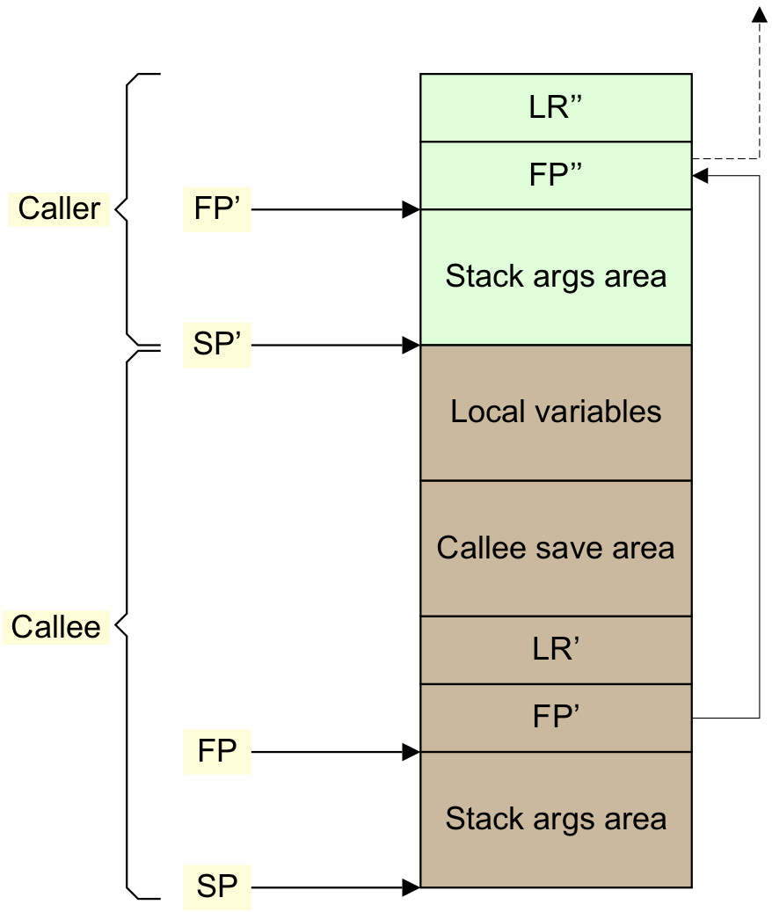

# Tutorial 18 - Backtracing

## tl;dr

- Support for [`backtracing`] is implemented into the kernel.

```console
[    0.002782] Writing to bottom of address space to address 1 GiB...
[    0.004623] Kernel panic!

Panic location:
      File 'kernel/src/_arch/aarch64/exception.rs', line 59, column 5

[...]

Backtrace:
      ----------------------------------------------------------------------------------------------
          Address            Function containing address
      ----------------------------------------------------------------------------------------------
       1. ffffffffc0005560 | libkernel::panic_wait::_panic_print
       2. ffffffffc00054a0 | rust_begin_unwind
       3. ffffffffc0002950 | core::panicking::panic_fmt
       4. ffffffffc0004898 | current_elx_synchronous
       5. ffffffffc0000a74 | __vector_current_elx_synchronous
       6. ffffffffc000111c | kernel_init
      ----------------------------------------------------------------------------------------------
```

[`backtracing`]: https://en.wikipedia.org/wiki/Stack_trace

## Table of Contents

- [Introduction](#introduction)
- [Implementation](#implementation)
  - [Chasing Frames](#chasing-frames)
  - [Compiler Changes](#compiler-changes)
  - [Supporting Changes](#supporting-changes)
- [Test it](#test-it)
- [Diff to previous](#diff-to-previous)

## Introduction

Since the kernel gained support for looking up `symbol names` in the previous tutorial, it is now
possible to implement support for printing meaningful backtraces (also called `stack traces`). The
primary use-case will be printing backtraces during a `panic`, which will ease debugging. This is a
good time to add this feature, since some of the upcoming tutorials will cover complex topics and
code changes, so that this will come in handy during development.

## Implementation

Since backtracing is a scheme that is usually defined in the [`calling-convention`], and therefore
tightly coupled to the `processor architecture `, the heart of the backtracing code will live in the
`_arch` folder. What can be shared between different architectures is the formatting and printing
part. Hence, the code will be organized as follows:

[`calling-convention`]: https://en.wikipedia.org/wiki/Calling_convention

- `src/backtrace.rs` makes a generic definition of a `BacktraceItem`. It also provides code that
  uses an `Iterator<Item = BacktraceItem>` to format and print the backtrace.
- `src/__arch_name__/backtrace.rs` contains the code that generates the actual iterator.

Here is the definition of `BacktraceItem`:

```rust
pub enum BacktraceItem {
    InvalidFramePointer(Address<Virtual>),
    InvalidLink(Address<Virtual>),
    Link(Address<Virtual>),
}
```

In summary, it has two error cases and one valid case. This will become clearer in a minute when we
look at what a `stack frame` and a `frame pointer` is.

### Chasing Frames

For `AArch64`, we need to consult the [Procedure Call Standard for the Arm® 64-bit Architecture]
(`AAPCS64`). It has the following to say:

> Conforming code shall construct a *linked list* of stack-frames. Each frame shall link to the
> frame of its caller by means of a frame record of two 64-bit values on the stack (independent of
> the data model). The frame record for the innermost frame (belonging to the most recent routine
> invocation) shall be pointed to by the frame pointer register (FP). The lowest addressed
> double-word shall point to the previous frame record and the highest addressed double-word shall
> contain the value passed in LR on entry to the current function [...]. The location of the frame
> record within a stack frame is not specified.

[Procedure Call Standard for the Arm® 64-bit Architecture]: https://github.com/ARM-software/abi-aa/blob/main/aapcs64/aapcs64.rst

The nature of the `linked list` becomes a bit clearer when we look into the corresponding section in
the [ARM Cortex-A Series Programmer’s Guide for ARMv8-A] as well. Here are text and picture
snippets:

> An AAPC64 stack frame shown in Figure 9-2. The frame pointer (X29) should point to the previous
> frame pointer saved on stack, with the saved LR (X30) stored after it. The final frame pointer in
> the chain should be set to 0. The Stack Pointer must always be aligned on a 16 byte boundary.

[ARM Cortex-A Series Programmer’s Guide for ARMv8-A]: https://developer.arm.com/documentation/den0024/latest/

<p align="center">
    
</p>

Hence, we can define the following struct in `src/__arch_name__/backtrace.rs` for the stack frame
record:

```rust
#[repr(C)]
struct StackFrameRecord<'a> {
    previous_record: Option<&'a StackFrameRecord<'a>>,
    link: Address<Virtual>,
}
```

The interesting part is the `previous_record` member. We learned from the two documents which we
inspected above that the lowest addressed double-word is either:

- Zero.
- Or pointing to the previous stack frame record.

Thanks to Rust's null pointer optimization [[1]][[2]], this allows us to conveniently type this as
an `Option<&StackFrameRecord>`. So whenever we inspect `previous_record` and observe it to be
`None`, we know that we've reached the end of the backtrace.

[1]: https://doc.rust-lang.org/std/option/#representation
[2]: https://stackoverflow.com/a/46557737

The start of the backtrace is trivially accessed through `x29` (aka the `Frame Pointer Register`).
This is used to generate a `StackFrameIterator`:

```rust
struct StackFrameRecordIterator<'a> {
    cur: &'a StackFrameRecord<'a>,
}

/// [...]

fn stack_frame_record_iterator<'a>() -> Option<StackFrameRecordIterator<'a>> {
    let fp = Address::<Virtual>::new(FP.get() as usize);
    if !fp.is_valid_stack_addr() {
        return None;
    }

    Some(StackFrameRecordIterator {
        cur: unsafe { &*(fp.as_usize() as *const _) },
    })
}
```

Although it should be guaranteed by the compiler (and any hand-written assembly) that `x29` points
to a valid stack address, it makes sense to double-check this before generating a reference. There
is always a chance that corruption happens. The implementation of the iterator itself does this
sanity check as well whenever the iterator is advanced. Additionally, it is also checked whether the
`link` address points to a valid `code` section in the kernel before the address is passed on to
the caller of the iterator:

```rust
impl<'a> Iterator for StackFrameRecordIterator<'a> {
    type Item = BacktraceItem;

    fn next(&mut self) -> Option<Self::Item> {
        static ABORT_FRAME: StackFrameRecord = StackFrameRecord {
            previous_record: None,
            link: Address::new(0),
        };

        // If previous is None, this is the root frame, so iteration will stop here.
        let previous = self.cur.previous_record?;

        // Need to abort if the pointer to the previous frame record is invalid.
        let prev_addr = Address::<Virtual>::new(previous as *const _ as usize);
        if !prev_addr.is_valid_stack_addr() {
            // This allows to return the error and then stop on the next iteration.
            self.cur = &ABORT_FRAME;
            return Some(BacktraceItem::InvalidFramePointer(prev_addr));
        }

        let ret = if !self.cur.link.is_valid_code_addr() {
            Some(BacktraceItem::InvalidLink(self.cur.link))
        } else {
            // The link points to the instruction to be executed _after_ returning from a branch.
            // However, we want to show the instruction that caused the branch, so subtract by one
            // instruction.
            //
            // This might be called from panic!, so it must not panic itself on the subtraction.
            let link = if self.cur.link >= Address::new(4) {
                self.cur.link - 4
            } else {
                self.cur.link
            };

            Some(BacktraceItem::Link(link))
        };

        // Advance the iterator.
        self.cur = previous;

        ret
    }
}
```

This already was the gist of the architectural part of the implementation! In the generic part,
where the backtrace is printed, the address returned in `BacktraceItem::Link` is additionally used
to look up the corresponding `symbol`, so that this is conveniently printed together:

```rust
match backtrace_res {

    // omitted

    BacktraceItem::Link(addr) => {
        fmt_res = writeln!(
            f,
            "      {:>2}. {:016x} | {:<50}",
            i + 1,
            addr.as_usize(),
            match symbols::lookup_symbol(addr) {
                Some(sym) => sym.name(),
                _ => "Symbol not found",
            }
        )
    }
};
```

Finally, we add printing of a backtrace to `panic!`:

```rust
println!(
    "[  {:>3}.{:06}] Kernel panic!\n\n\
    Panic location:\n      File '{}', line {}, column {}\n\n\
    {}\n\n\
    {}",
    timestamp.as_secs(),
    timestamp.subsec_micros(),
    location,
    line,
    column,
    info.message().unwrap_or(&format_args!("")),
    backtrace::Backtrace
);
```

### Compiler Changes

By default, the `aarch64-unknown-none*` targets *do not* guarantee that a stack frame record is
generated on each function call. Without, the backtracing code will not work. Fortunately,
generation can be forced by modifying the `rustc codegen options`. We add the following to the
`Makefile`:

```makefile
ifeq ($(BSP),rpi3)

    # omitted

    RUSTC_MISC_ARGS   = -C target-cpu=cortex-a53 -C force-frame-pointers
```

But there is more! Until now, when we compiled the kernel, cargo was using a **precompiled** version
of the `Rust core library` that comes with rustup whenever a target is added. This is usually very
beneficial in terms of speeding up compilation. Unfortunately, the precompiled version was not
compiled with `-C force-frame-pointers` either. This can be solved using cargo's [`build-std`
feature]. We set it in the Makefile so that cargo also compiles the core library using our compiler
settings, which means we get the frame records thanks to `-C force-frame-pointers` for any core
library functions as well.

```Makefile
# build-std can be skipped for helper commands that do not rely on correct stack frames and other
# custom compiler options. This results in a huge speedup.
RUSTC_CMD   = cargo rustc $(COMPILER_ARGS) -Z build-std=core --manifest-path $(KERNEL_MANIFEST)
DOC_CMD     = cargo doc $(COMPILER_ARGS)
CLIPPY_CMD  = cargo clippy $(COMPILER_ARGS)
TEST_CMD    = cargo test $(COMPILER_ARGS) -Z build-std=core --manifest-path $(KERNEL_MANIFEST)
```

[`build-std` feature]: https://doc.rust-lang.org/cargo/reference/unstable.html#build-std

### Supporting Changes

There's a couple of changes not covered in this tutorial text, but the reader should ideally skim
through them:

- [`src/_arch/aarch64/exception.s`](`kernel/src/_arch/aarch64/exception.s`) adds some tricky code to
  generate a stack frame record on exception entry. The file includes elaborate comments that can be
  inspected.
- [`src/_arch/aarch64/cpu/boot.rs`](`kernel/src/_arch/aarch64/cpu/boot.rs`) adds some code that
  ensures that `kernel_init()` becomes the root of the backtrace (meaning its is ensured that
  `previous_frame` will be zero for `kernel_init()`'s frame record).
- In `$ROOT/Cargo.toml`, `debug = true` has been set, which ensures that the kernel ELF includes the
  maximum amount of debug information. Please note that this does *not* change anything for the
  kernel at runtime. However, it will allow to dig even deeper on an address that has been reported
  by a kernel backtrace. For example, using the `addr2line` tool. The following two snippets show
  what `addr2line` reports when the debug flag is not or is set, respectively.

```console
$ # debug = false
$ addr2line -p -f -s -i -e target/aarch64-unknown-none-softfloat/release/kernel+ttables+symbols 0xffffffffc0001da8 | rustfilt
kernel::kernel_main at kernel.c562062a-cgu.1:?
```

```console
$ # debug = true
$ addr2line -p -f -s -i -e target/aarch64-unknown-none-softfloat/release/kernel+ttables+symbols 0xffffffffc0001da8 | rustfilt
libkernel::memory::mmu::mapping_record::MappingRecord::print at mapping_record.rs:136
 (inlined by) libkernel::memory::mmu::mapping_record::kernel_print::{{closure}} at mapping_record.rs:232
 (inlined by) <libkernel::synchronization::InitStateLock<T> as libkernel::synchronization::interface::ReadWriteEx>::read at synchronization.rs:139
 (inlined by) libkernel::memory::mmu::mapping_record::kernel_print at mapping_record.rs:232
 (inlined by) libkernel::memory::mmu::kernel_print_mappings at mmu.rs:269
 (inlined by) kernel::kernel_main at main.rs:84
```

## Test it

Three tests were added that check the sanity of the backtracing code. Also, any previous tests that
print a `panic` will now also include a backtrace. For example, `02_exception_sync_page_fault.rs`:

```console
$ TEST=02_exception_sync_page_fault make test_integration
[...]
         -------------------------------------------------------------------
         🦀 Testing synchronous exception handling by causing a page fault
         -------------------------------------------------------------------

         [    0.002782] Writing to bottom of address space to address 1 GiB...
         [    0.004623] Kernel panic!

         Panic location:
               File 'kernel/src/_arch/aarch64/exception.rs', line 59, column 5

         CPU Exception!

         ESR_EL1: 0x96000004
               Exception Class         (EC) : 0x25 - Data Abort, current EL
               Instr Specific Syndrome (ISS): 0x4
         FAR_EL1: 0x0000000040000000

         [...]

         Backtrace:
               ----------------------------------------------------------------------------------------------
                   Address            Function containing address
               ----------------------------------------------------------------------------------------------
                1. ffffffffc0005560 | libkernel::panic_wait::_panic_print
                2. ffffffffc00054a0 | rust_begin_unwind
                3. ffffffffc0002950 | core::panicking::panic_fmt
                4. ffffffffc0004898 | current_elx_synchronous
                5. ffffffffc0000a74 | __vector_current_elx_synchronous
                6. ffffffffc000111c | kernel_init
               ----------------------------------------------------------------------------------------------

         -------------------------------------------------------------------
         ✅ Success: 02_exception_sync_page_fault.rs
         -------------------------------------------------------------------
```

## Diff to previous
```diff

diff -uNr 17_kernel_symbols/Cargo.toml 18_backtrace/Cargo.toml
--- 17_kernel_symbols/Cargo.toml
+++ 18_backtrace/Cargo.toml
@@ -8,3 +8,4 @@

 [profile.release]
 lto = true
+debug = true

diff -uNr 17_kernel_symbols/kernel/Cargo.toml 18_backtrace/kernel/Cargo.toml
--- 17_kernel_symbols/kernel/Cargo.toml
+++ 18_backtrace/kernel/Cargo.toml
@@ -1,6 +1,6 @@
 [package]
 name = "mingo"
-version = "0.17.0"
+version = "0.18.0"
 authors = ["Andre Richter <andre.o.richter@gmail.com>"]
 edition = "2021"

@@ -56,3 +56,15 @@
 [[test]]
 name = "03_exception_restore_sanity"
 harness = false
+
+[[test]]
+name = "05_backtrace_sanity"
+harness = false
+
+[[test]]
+name = "06_backtrace_invalid_frame"
+harness = false
+
+[[test]]
+name = "07_backtrace_invalid_link"
+harness = false

diff -uNr 17_kernel_symbols/kernel/src/_arch/aarch64/backtrace.rs 18_backtrace/kernel/src/_arch/aarch64/backtrace.rs
--- 17_kernel_symbols/kernel/src/_arch/aarch64/backtrace.rs
+++ 18_backtrace/kernel/src/_arch/aarch64/backtrace.rs
@@ -0,0 +1,136 @@
+// SPDX-License-Identifier: MIT OR Apache-2.0
+//
+// Copyright (c) 2022-2023 Andre Richter <andre.o.richter@gmail.com>
+
+//! Architectural backtracing support.
+//!
+//! # Orientation
+//!
+//! Since arch modules are imported into generic modules using the path attribute, the path of this
+//! file is:
+//!
+//! crate::backtrace::arch_backtrace
+
+use crate::{
+    backtrace::BacktraceItem,
+    memory::{Address, Virtual},
+};
+use aarch64_cpu::registers::*;
+use tock_registers::interfaces::Readable;
+
+//--------------------------------------------------------------------------------------------------
+// Private Definitions
+//--------------------------------------------------------------------------------------------------
+
+/// A Stack frame record.
+///
+/// # Note
+///
+/// The convention is that `previous_record` is valid as long as it contains a non-null value.
+/// Therefore, it is possible to type the member as `Option<&StackFrameRecord>` because of Rust's
+/// `null-pointer optimization`.
+#[repr(C)]
+struct StackFrameRecord<'a> {
+    previous_record: Option<&'a StackFrameRecord<'a>>,
+    link: Address<Virtual>,
+}
+
+struct StackFrameRecordIterator<'a> {
+    cur: &'a StackFrameRecord<'a>,
+}
+
+//--------------------------------------------------------------------------------------------------
+// Private Code
+//--------------------------------------------------------------------------------------------------
+
+impl<'a> Iterator for StackFrameRecordIterator<'a> {
+    type Item = BacktraceItem;
+
+    fn next(&mut self) -> Option<Self::Item> {
+        static ABORT_FRAME: StackFrameRecord = StackFrameRecord {
+            previous_record: None,
+            link: Address::new(0),
+        };
+
+        // If previous is None, this is the root frame, so iteration will stop here.
+        let previous = self.cur.previous_record?;
+
+        // Need to abort if the pointer to the previous frame record is invalid.
+        let prev_addr = Address::<Virtual>::new(previous as *const _ as usize);
+        if !prev_addr.is_valid_stack_addr() {
+            // This allows to return the error and then stop on the next iteration.
+            self.cur = &ABORT_FRAME;
+            return Some(BacktraceItem::InvalidFramePointer(prev_addr));
+        }
+
+        let ret = if !self.cur.link.is_valid_code_addr() {
+            Some(BacktraceItem::InvalidLink(self.cur.link))
+        } else {
+            // The link points to the instruction to be executed _after_ returning from a branch.
+            // However, we want to show the instruction that caused the branch, so subtract by one
+            // instruction.
+            //
+            // This might be called from panic!, so it must not panic itself on the subtraction.
+            let link = if self.cur.link >= Address::new(4) {
+                self.cur.link - 4
+            } else {
+                self.cur.link
+            };
+
+            Some(BacktraceItem::Link(link))
+        };
+
+        // Advance the iterator.
+        self.cur = previous;
+
+        ret
+    }
+}
+
+fn stack_frame_record_iterator<'a>() -> Option<StackFrameRecordIterator<'a>> {
+    let fp = Address::<Virtual>::new(FP.get() as usize);
+    if !fp.is_valid_stack_addr() {
+        return None;
+    }
+
+    Some(StackFrameRecordIterator {
+        cur: unsafe { &*(fp.as_usize() as *const _) },
+    })
+}
+
+//--------------------------------------------------------------------------------------------------
+// Public Code
+//--------------------------------------------------------------------------------------------------
+
+/// Architectural implementation of the backtrace.
+pub fn backtrace(f: impl FnOnce(Option<&mut dyn Iterator<Item = BacktraceItem>>)) {
+    f(stack_frame_record_iterator().as_mut().map(|s| s as _))
+}
+
+//--------------------------------------------------------------------------------------------------
+// Testing
+//--------------------------------------------------------------------------------------------------
+
+#[cfg(feature = "test_build")]
+#[inline(always)]
+/// Hack for corrupting the previous frame address in the current stack frame.
+///
+/// # Safety
+///
+/// - To be used only by testing code.
+pub unsafe fn corrupt_previous_frame_addr() {
+    let sf = FP.get() as *mut usize;
+    *sf = 0x123;
+}
+
+#[cfg(feature = "test_build")]
+#[inline(always)]
+/// Hack for corrupting the link in the current stack frame.
+///
+/// # Safety
+///
+/// - To be used only by testing code.
+pub unsafe fn corrupt_link() {
+    let sf = FP.get() as *mut StackFrameRecord;
+    (*sf).link = Address::new(0x456);
+}

diff -uNr 17_kernel_symbols/kernel/src/_arch/aarch64/cpu/boot.rs 18_backtrace/kernel/src/_arch/aarch64/cpu/boot.rs
--- 17_kernel_symbols/kernel/src/_arch/aarch64/cpu/boot.rs
+++ 18_backtrace/kernel/src/_arch/aarch64/cpu/boot.rs
@@ -13,7 +13,10 @@

 use crate::{memory, memory::Address};
 use aarch64_cpu::{asm, registers::*};
-use core::arch::global_asm;
+use core::{
+    arch::global_asm,
+    sync::atomic::{compiler_fence, Ordering},
+};
 use tock_registers::interfaces::Writeable;

 // Assembly counterpart to this file.
@@ -67,6 +70,18 @@
     SP_EL1.set(virt_boot_core_stack_end_exclusive_addr);
 }

+/// Reset the backtrace by setting link register and frame pointer to zero.
+///
+/// # Safety
+///
+/// - This function must only be used immediately before entering EL1.
+#[inline(always)]
+unsafe fn prepare_backtrace_reset() {
+    compiler_fence(Ordering::SeqCst);
+    FP.set(0);
+    LR.set(0);
+}
+
 //--------------------------------------------------------------------------------------------------
 // Public Code
 //--------------------------------------------------------------------------------------------------
@@ -93,6 +108,9 @@
     let addr = Address::new(phys_kernel_tables_base_addr as usize);
     memory::mmu::enable_mmu_and_caching(addr).unwrap();

+    // Make the function we return to the root of a backtrace.
+    prepare_backtrace_reset();
+
     // Use `eret` to "return" to EL1. Since virtual memory will already be enabled, this results in
     // execution of kernel_init() in EL1 from its _virtual address_.
     asm::eret()

diff -uNr 17_kernel_symbols/kernel/src/_arch/aarch64/exception.rs 18_backtrace/kernel/src/_arch/aarch64/exception.rs
--- 17_kernel_symbols/kernel/src/_arch/aarch64/exception.rs
+++ 18_backtrace/kernel/src/_arch/aarch64/exception.rs
@@ -20,7 +20,11 @@
 };

 // Assembly counterpart to this file.
-global_asm!(include_str!("exception.s"));
+global_asm!(
+    include_str!("exception.s"),
+    CONST_ESR_EL1_EC_SHIFT = const 26,
+    CONST_ESR_EL1_EC_VALUE_SVC64 = const 0x15
+);

 //--------------------------------------------------------------------------------------------------
 // Private Definitions

diff -uNr 17_kernel_symbols/kernel/src/_arch/aarch64/exception.s 18_backtrace/kernel/src/_arch/aarch64/exception.s
--- 17_kernel_symbols/kernel/src/_arch/aarch64/exception.s
+++ 18_backtrace/kernel/src/_arch/aarch64/exception.s
@@ -8,10 +8,10 @@

 /// Call the function provided by parameter `\handler` after saving the exception context. Provide
 /// the context as the first parameter to '\handler'.
-.macro CALL_WITH_CONTEXT handler
+.macro CALL_WITH_CONTEXT handler is_lower_el is_sync
 __vector_\handler:
 	// Make room on the stack for the exception context.
-	sub	sp,  sp,  #16 * 17
+	sub	sp,  sp,  #16 * 18

 	// Store all general purpose registers on the stack.
 	stp	x0,  x1,  [sp, #16 * 0]
@@ -39,6 +39,42 @@
 	stp	lr,  x1,  [sp, #16 * 15]
 	stp	x2,  x3,  [sp, #16 * 16]

+	// Build a stack frame for backtracing.
+.if \is_lower_el == 1
+	// If we came from a lower EL, make it a root frame (by storing zero) so that the kernel
+	// does not attempt to trace into userspace.
+	stp	xzr, xzr, [sp, #16 * 17]
+.else
+	// For normal branches, the link address points to the instruction to be executed _after_
+	// returning from a branch. In a backtrace, we want to show the instruction that caused the
+	// branch, though. That is why code in backtrace.rs subtracts 4 (length of one instruction)
+	// from the link address.
+	//
+	// Here we have a special case, though, because ELR_EL1 is used instead of LR to build the
+	// stack frame, so that it becomes possible to trace beyond an exception. Hence, it must be
+	// considered that semantics for ELR_EL1 differ from case to case.
+	//
+	// Unless an "exception generating instruction" was executed, ELR_EL1 already points to the
+	// the correct instruction, and hence the subtraction by 4 in backtrace.rs would yield wrong
+	// results. To cover for this, 4 is added to ELR_EL1 below unless the cause of exception was
+	// an SVC instruction. BRK and HLT are "exception generating instructions" as well, but they
+	// are not expected and therefore left out for now.
+	//
+	// For reference: Search for "preferred exception return address" in the Architecture
+	// Reference Manual for ARMv8-A.
+.if \is_sync == 1
+	lsr	w3,  w3, {CONST_ESR_EL1_EC_SHIFT}   // w3 = ESR_EL1.EC
+	cmp	w3,  {CONST_ESR_EL1_EC_VALUE_SVC64} // w3 == SVC64 ?
+	b.eq	1f
+.endif
+	add	x1,  x1, #4
+1:
+	stp	x29, x1, [sp, #16 * 17]
+.endif
+
+	// Set the frame pointer to the stack frame record.
+	add	x29, sp, #16 * 17
+
 	// x0 is the first argument for the function called through `\handler`.
 	mov	x0,  sp

@@ -81,43 +117,43 @@
 //
 // - It must be ensured that `CALL_WITH_CONTEXT` <= 0x80 bytes.
 .org 0x000
-	CALL_WITH_CONTEXT current_el0_synchronous
+	CALL_WITH_CONTEXT current_el0_synchronous, 0, 1
 .org 0x080
-	CALL_WITH_CONTEXT current_el0_irq
+	CALL_WITH_CONTEXT current_el0_irq, 0, 0
 .org 0x100
 	FIQ_SUSPEND
 .org 0x180
-	CALL_WITH_CONTEXT current_el0_serror
+	CALL_WITH_CONTEXT current_el0_serror, 0, 0

 // Current exception level with SP_ELx, x > 0.
 .org 0x200
-	CALL_WITH_CONTEXT current_elx_synchronous
+	CALL_WITH_CONTEXT current_elx_synchronous, 0, 1
 .org 0x280
-	CALL_WITH_CONTEXT current_elx_irq
+	CALL_WITH_CONTEXT current_elx_irq, 0, 0
 .org 0x300
 	FIQ_SUSPEND
 .org 0x380
-	CALL_WITH_CONTEXT current_elx_serror
+	CALL_WITH_CONTEXT current_elx_serror, 0, 0

 // Lower exception level, AArch64
 .org 0x400
-	CALL_WITH_CONTEXT lower_aarch64_synchronous
+	CALL_WITH_CONTEXT lower_aarch64_synchronous, 1, 1
 .org 0x480
-	CALL_WITH_CONTEXT lower_aarch64_irq
+	CALL_WITH_CONTEXT lower_aarch64_irq, 1, 0
 .org 0x500
 	FIQ_SUSPEND
 .org 0x580
-	CALL_WITH_CONTEXT lower_aarch64_serror
+	CALL_WITH_CONTEXT lower_aarch64_serror, 1, 0

 // Lower exception level, AArch32
 .org 0x600
-	CALL_WITH_CONTEXT lower_aarch32_synchronous
+	CALL_WITH_CONTEXT lower_aarch32_synchronous, 1, 0
 .org 0x680
-	CALL_WITH_CONTEXT lower_aarch32_irq
+	CALL_WITH_CONTEXT lower_aarch32_irq, 1, 0
 .org 0x700
 	FIQ_SUSPEND
 .org 0x780
-	CALL_WITH_CONTEXT lower_aarch32_serror
+	CALL_WITH_CONTEXT lower_aarch32_serror, 1, 0
 .org 0x800

 //------------------------------------------------------------------------------
@@ -146,7 +182,7 @@
 	ldp	x26, x27, [sp, #16 * 13]
 	ldp	x28, x29, [sp, #16 * 14]

-	add	sp,  sp,  #16 * 17
+	add	sp,  sp,  #16 * 18

 	eret


diff -uNr 17_kernel_symbols/kernel/src/backtrace.rs 18_backtrace/kernel/src/backtrace.rs
--- 17_kernel_symbols/kernel/src/backtrace.rs
+++ 18_backtrace/kernel/src/backtrace.rs
@@ -0,0 +1,114 @@
+// SPDX-License-Identifier: MIT OR Apache-2.0
+//
+// Copyright (c) 2022-2023 Andre Richter <andre.o.richter@gmail.com>
+
+//! Backtracing support.
+
+#[cfg(target_arch = "aarch64")]
+#[path = "_arch/aarch64/backtrace.rs"]
+mod arch_backtrace;
+
+use crate::{
+    memory::{Address, Virtual},
+    symbols,
+};
+use core::fmt;
+
+//--------------------------------------------------------------------------------------------------
+// Architectural Public Reexports
+//--------------------------------------------------------------------------------------------------
+#[cfg(feature = "test_build")]
+pub use arch_backtrace::{corrupt_link, corrupt_previous_frame_addr};
+
+//--------------------------------------------------------------------------------------------------
+// Public Definitions
+//--------------------------------------------------------------------------------------------------
+
+/// A backtrace item.
+#[allow(missing_docs)]
+pub enum BacktraceItem {
+    InvalidFramePointer(Address<Virtual>),
+    InvalidLink(Address<Virtual>),
+    Link(Address<Virtual>),
+}
+
+/// Pseudo-struct for printing a backtrace using its fmt::Display implementation.
+pub struct Backtrace;
+
+//--------------------------------------------------------------------------------------------------
+// Public Code
+//--------------------------------------------------------------------------------------------------
+
+impl fmt::Display for Backtrace {
+    fn fmt(&self, f: &mut fmt::Formatter) -> fmt::Result {
+        writeln!(f, "Backtrace:")?;
+        writeln!(
+            f,
+            "      ----------------------------------------------------------------------------------------------"
+        )?;
+        writeln!(
+            f,
+            "          Address            Function containing address"
+        )?;
+        writeln!(
+            f,
+            "      ----------------------------------------------------------------------------------------------"
+        )?;
+
+        let mut fmt_res: fmt::Result = Ok(());
+        let trace_formatter =
+            |maybe_iter: Option<&mut dyn Iterator<Item = BacktraceItem>>| match maybe_iter {
+                None => fmt_res = writeln!(f, "ERROR! No valid stack frame found"),
+                Some(iter) => {
+                    // Since the backtrace is printed, the first function is always
+                    // core::fmt::write. Skip 1 so it is excluded and doesn't bloat the output.
+                    for (i, backtrace_res) in iter.skip(1).enumerate() {
+                        match backtrace_res {
+                            BacktraceItem::InvalidFramePointer(addr) => {
+                                fmt_res = writeln!(
+                                    f,
+                                    "      {:>2}. ERROR! \
+                                    Encountered invalid frame pointer ({}) during backtrace",
+                                    i + 1,
+                                    addr
+                                );
+                            }
+                            BacktraceItem::InvalidLink(addr) => {
+                                fmt_res = writeln!(
+                                    f,
+                                    "      {:>2}. ERROR! \
+                                    Link address ({}) is not contained in kernel .text section",
+                                    i + 1,
+                                    addr
+                                );
+                            }
+                            BacktraceItem::Link(addr) => {
+                                fmt_res = writeln!(
+                                    f,
+                                    "      {:>2}. {:016x} | {:<50}",
+                                    i + 1,
+                                    addr.as_usize(),
+                                    match symbols::lookup_symbol(addr) {
+                                        Some(sym) => sym.name(),
+                                        _ => "Symbol not found",
+                                    }
+                                )
+                            }
+                        };
+
+                        if fmt_res.is_err() {
+                            break;
+                        }
+                    }
+                }
+            };
+
+        arch_backtrace::backtrace(trace_formatter);
+        fmt_res?;
+
+        writeln!(
+            f,
+            "      ----------------------------------------------------------------------------------------------"
+        )
+    }
+}

diff -uNr 17_kernel_symbols/kernel/src/bsp/raspberrypi/memory/mmu.rs 18_backtrace/kernel/src/bsp/raspberrypi/memory/mmu.rs
--- 17_kernel_symbols/kernel/src/bsp/raspberrypi/memory/mmu.rs
+++ 18_backtrace/kernel/src/bsp/raspberrypi/memory/mmu.rs
@@ -80,16 +80,6 @@
     size >> KernelGranule::SHIFT
 }

-/// The code pages of the kernel binary.
-fn virt_code_region() -> MemoryRegion<Virtual> {
-    let num_pages = size_to_num_pages(super::code_size());
-
-    let start_page_addr = super::virt_code_start();
-    let end_exclusive_page_addr = start_page_addr.checked_offset(num_pages as isize).unwrap();
-
-    MemoryRegion::new(start_page_addr, end_exclusive_page_addr)
-}
-
 /// The data pages of the kernel binary.
 fn virt_data_region() -> MemoryRegion<Virtual> {
     let num_pages = size_to_num_pages(super::data_size());
@@ -100,16 +90,6 @@
     MemoryRegion::new(start_page_addr, end_exclusive_page_addr)
 }

-/// The boot core stack pages.
-fn virt_boot_core_stack_region() -> MemoryRegion<Virtual> {
-    let num_pages = size_to_num_pages(super::boot_core_stack_size());
-
-    let start_page_addr = super::virt_boot_core_stack_start();
-    let end_exclusive_page_addr = start_page_addr.checked_offset(num_pages as isize).unwrap();
-
-    MemoryRegion::new(start_page_addr, end_exclusive_page_addr)
-}
-
 // There is no reason to expect the following conversions to fail, since they were generated offline
 // by the `translation table tool`. If it doesn't work, a panic due to the unwraps is justified.
 fn kernel_virt_to_phys_region(virt_region: MemoryRegion<Virtual>) -> MemoryRegion<Physical> {
@@ -132,6 +112,26 @@
 // Public Code
 //--------------------------------------------------------------------------------------------------

+/// The code pages of the kernel binary.
+pub fn virt_code_region() -> MemoryRegion<Virtual> {
+    let num_pages = size_to_num_pages(super::code_size());
+
+    let start_page_addr = super::virt_code_start();
+    let end_exclusive_page_addr = start_page_addr.checked_offset(num_pages as isize).unwrap();
+
+    MemoryRegion::new(start_page_addr, end_exclusive_page_addr)
+}
+
+/// The boot core stack pages.
+pub fn virt_boot_core_stack_region() -> MemoryRegion<Virtual> {
+    let num_pages = size_to_num_pages(super::boot_core_stack_size());
+
+    let start_page_addr = super::virt_boot_core_stack_start();
+    let end_exclusive_page_addr = start_page_addr.checked_offset(num_pages as isize).unwrap();
+
+    MemoryRegion::new(start_page_addr, end_exclusive_page_addr)
+}
+
 /// Return a reference to the kernel's translation tables.
 pub fn kernel_translation_tables() -> &'static InitStateLock<KernelTranslationTable> {
     &KERNEL_TABLES

diff -uNr 17_kernel_symbols/kernel/src/lib.rs 18_backtrace/kernel/src/lib.rs
--- 17_kernel_symbols/kernel/src/lib.rs
+++ 18_backtrace/kernel/src/lib.rs
@@ -133,6 +133,7 @@
 mod panic_wait;
 mod synchronization;

+pub mod backtrace;
 pub mod bsp;
 pub mod common;
 pub mod console;

diff -uNr 17_kernel_symbols/kernel/src/memory.rs 18_backtrace/kernel/src/memory.rs
--- 17_kernel_symbols/kernel/src/memory.rs
+++ 18_backtrace/kernel/src/memory.rs
@@ -95,6 +95,18 @@
     }
 }

+impl<ATYPE: AddressType> Sub<usize> for Address<ATYPE> {
+    type Output = Self;
+
+    #[inline(always)]
+    fn sub(self, rhs: usize) -> Self::Output {
+        match self.value.checked_sub(rhs) {
+            None => panic!("Overflow on Address::sub"),
+            Some(x) => Self::new(x),
+        }
+    }
+}
+
 impl<ATYPE: AddressType> Sub<Address<ATYPE>> for Address<ATYPE> {
     type Output = Self;

@@ -107,6 +119,18 @@
     }
 }

+impl Address<Virtual> {
+    /// Checks if the address is part of the boot core stack region.
+    pub fn is_valid_stack_addr(&self) -> bool {
+        bsp::memory::mmu::virt_boot_core_stack_region().contains(*self)
+    }
+
+    /// Checks if the address is part of the kernel code region.
+    pub fn is_valid_code_addr(&self) -> bool {
+        bsp::memory::mmu::virt_code_region().contains(*self)
+    }
+}
+
 impl fmt::Display for Address<Physical> {
     // Don't expect to see physical addresses greater than 40 bit.
     fn fmt(&self, f: &mut fmt::Formatter) -> fmt::Result {

diff -uNr 17_kernel_symbols/kernel/src/panic_wait.rs 18_backtrace/kernel/src/panic_wait.rs
--- 17_kernel_symbols/kernel/src/panic_wait.rs
+++ 18_backtrace/kernel/src/panic_wait.rs
@@ -4,7 +4,7 @@

 //! A panic handler that infinitely waits.

-use crate::{cpu, exception, println};
+use crate::{backtrace, cpu, exception, println};
 use core::panic::PanicInfo;

 //--------------------------------------------------------------------------------------------------
@@ -73,6 +73,7 @@
     println!(
         "[  {:>3}.{:06}] Kernel panic!\n\n\
         Panic location:\n      File '{}', line {}, column {}\n\n\
+        {}\n\n\
         {}",
         timestamp.as_secs(),
         timestamp.subsec_micros(),
@@ -80,6 +81,7 @@
         line,
         column,
         info.message().unwrap_or(&format_args!("")),
+        backtrace::Backtrace
     );

     _panic_exit()

diff -uNr 17_kernel_symbols/kernel/src/state.rs 18_backtrace/kernel/src/state.rs
--- 17_kernel_symbols/kernel/src/state.rs
+++ 18_backtrace/kernel/src/state.rs
@@ -52,7 +52,7 @@
     const SINGLE_CORE_MAIN: u8 = 1;
     const MULTI_CORE_MAIN: u8 = 2;

-    /// Create a new instance.
+    /// Create an instance.
     pub const fn new() -> Self {
         Self(AtomicU8::new(Self::INIT))
     }

diff -uNr 17_kernel_symbols/kernel/tests/05_backtrace_sanity.rb 18_backtrace/kernel/tests/05_backtrace_sanity.rb
--- 17_kernel_symbols/kernel/tests/05_backtrace_sanity.rb
+++ 18_backtrace/kernel/tests/05_backtrace_sanity.rb
@@ -0,0 +1,39 @@
+# frozen_string_literal: true
+
+# SPDX-License-Identifier: MIT OR Apache-2.0
+#
+# Copyright (c) 2022-2023 Andre Richter <andre.o.richter@gmail.com>
+
+require 'console_io_test'
+
+# Verify that panic produces a backtrace.
+class PanicBacktraceTest < SubtestBase
+    def name
+        'Panic produces backtrace'
+    end
+
+    def run(qemu_out, _qemu_in)
+        expect_or_raise(qemu_out, 'Kernel panic!')
+        expect_or_raise(qemu_out, 'Backtrace:')
+    end
+end
+
+# Verify backtrace correctness.
+class BacktraceCorrectnessTest < SubtestBase
+    def name
+        'Backtrace is correct'
+    end
+
+    def run(qemu_out, _qemu_in)
+        expect_or_raise(qemu_out, '| core::panicking::panic')
+        expect_or_raise(qemu_out, '| _05_backtrace_sanity::nested')
+        expect_or_raise(qemu_out, '| kernel_init')
+    end
+end
+
+##--------------------------------------------------------------------------------------------------
+## Test registration
+##--------------------------------------------------------------------------------------------------
+def subtest_collection
+    [PanicBacktraceTest.new, BacktraceCorrectnessTest.new]
+end

diff -uNr 17_kernel_symbols/kernel/tests/05_backtrace_sanity.rs 18_backtrace/kernel/tests/05_backtrace_sanity.rs
--- 17_kernel_symbols/kernel/tests/05_backtrace_sanity.rs
+++ 18_backtrace/kernel/tests/05_backtrace_sanity.rs
@@ -0,0 +1,31 @@
+// SPDX-License-Identifier: MIT OR Apache-2.0
+//
+// Copyright (c) 2022-2023 Andre Richter <andre.o.richter@gmail.com>
+
+//! Test if backtracing code detects an invalid frame pointer.
+
+#![feature(format_args_nl)]
+#![no_main]
+#![no_std]
+
+/// Console tests should time out on the I/O harness in case of panic.
+mod panic_wait_forever;
+
+use libkernel::{bsp, cpu, exception, memory};
+
+#[inline(never)]
+fn nested() {
+    panic!()
+}
+
+#[no_mangle]
+unsafe fn kernel_init() -> ! {
+    exception::handling_init();
+    memory::init();
+    bsp::driver::qemu_bring_up_console();
+
+    nested();
+
+    // The QEMU process running this test will be closed by the I/O test harness.
+    cpu::wait_forever()
+}

diff -uNr 17_kernel_symbols/kernel/tests/06_backtrace_invalid_frame.rb 18_backtrace/kernel/tests/06_backtrace_invalid_frame.rb
--- 17_kernel_symbols/kernel/tests/06_backtrace_invalid_frame.rb
+++ 18_backtrace/kernel/tests/06_backtrace_invalid_frame.rb
@@ -0,0 +1,26 @@
+# frozen_string_literal: true
+
+# SPDX-License-Identifier: MIT OR Apache-2.0
+#
+# Copyright (c) 2022-2023 Andre Richter <andre.o.richter@gmail.com>
+
+require 'console_io_test'
+
+# Test detection of invalid frame pointers.
+class InvalidFramePointerTest < SubtestBase
+    def name
+        'Detect invalid frame pointer'
+    end
+
+    def run(qemu_out, _qemu_in)
+        expect_or_raise(qemu_out,
+                        /Encountered invalid frame pointer \(.*\) during backtrace/)
+    end
+end
+
+##--------------------------------------------------------------------------------------------------
+## Test registration
+##--------------------------------------------------------------------------------------------------
+def subtest_collection
+    [InvalidFramePointerTest.new]
+end

diff -uNr 17_kernel_symbols/kernel/tests/06_backtrace_invalid_frame.rs 18_backtrace/kernel/tests/06_backtrace_invalid_frame.rs
--- 17_kernel_symbols/kernel/tests/06_backtrace_invalid_frame.rs
+++ 18_backtrace/kernel/tests/06_backtrace_invalid_frame.rs
@@ -0,0 +1,33 @@
+// SPDX-License-Identifier: MIT OR Apache-2.0
+//
+// Copyright (c) 2022-2023 Andre Richter <andre.o.richter@gmail.com>
+
+//! Test if backtracing code detects an invalid frame pointer.
+
+#![feature(format_args_nl)]
+#![no_main]
+#![no_std]
+
+/// Console tests should time out on the I/O harness in case of panic.
+mod panic_wait_forever;
+
+use libkernel::{backtrace, bsp, cpu, exception, memory};
+
+#[inline(never)]
+fn nested() {
+    unsafe { backtrace::corrupt_previous_frame_addr() };
+
+    panic!()
+}
+
+#[no_mangle]
+unsafe fn kernel_init() -> ! {
+    exception::handling_init();
+    memory::init();
+    bsp::driver::qemu_bring_up_console();
+
+    nested();
+
+    // The QEMU process running this test will be closed by the I/O test harness.
+    cpu::wait_forever()
+}

diff -uNr 17_kernel_symbols/kernel/tests/07_backtrace_invalid_link.rb 18_backtrace/kernel/tests/07_backtrace_invalid_link.rb
--- 17_kernel_symbols/kernel/tests/07_backtrace_invalid_link.rb
+++ 18_backtrace/kernel/tests/07_backtrace_invalid_link.rb
@@ -0,0 +1,25 @@
+# frozen_string_literal: true
+
+# SPDX-License-Identifier: MIT OR Apache-2.0
+#
+# Copyright (c) 2022-2023 Andre Richter <andre.o.richter@gmail.com>
+
+require 'console_io_test'
+
+# Test detection of invalid link.
+class InvalidLinkTest < SubtestBase
+    def name
+        'Detect invalid link'
+    end
+
+    def run(qemu_out, _qemu_in)
+        expect_or_raise(qemu_out, /Link address \(.*\) is not contained in kernel .text section/)
+    end
+end
+
+##--------------------------------------------------------------------------------------------------
+## Test registration
+##--------------------------------------------------------------------------------------------------
+def subtest_collection
+    [InvalidLinkTest.new]
+end

diff -uNr 17_kernel_symbols/kernel/tests/07_backtrace_invalid_link.rs 18_backtrace/kernel/tests/07_backtrace_invalid_link.rs
--- 17_kernel_symbols/kernel/tests/07_backtrace_invalid_link.rs
+++ 18_backtrace/kernel/tests/07_backtrace_invalid_link.rs
@@ -0,0 +1,38 @@
+// SPDX-License-Identifier: MIT OR Apache-2.0
+//
+// Copyright (c) 2022-2023 Andre Richter <andre.o.richter@gmail.com>
+
+//! Test if backtracing code detects an invalid link.
+
+#![feature(format_args_nl)]
+#![no_main]
+#![no_std]
+
+/// Console tests should time out on the I/O harness in case of panic.
+mod panic_wait_forever;
+
+use libkernel::{backtrace, bsp, cpu, exception, memory};
+
+#[inline(never)]
+fn nested_2() -> &'static str {
+    unsafe { backtrace::corrupt_link() };
+    libkernel::println!("{}", libkernel::backtrace::Backtrace);
+    "foo"
+}
+
+#[inline(never)]
+fn nested_1() {
+    libkernel::println!("{}", nested_2())
+}
+
+#[no_mangle]
+unsafe fn kernel_init() -> ! {
+    exception::handling_init();
+    memory::init();
+    bsp::driver::qemu_bring_up_console();
+
+    nested_1();
+
+    // The QEMU process running this test will be closed by the I/O test harness.
+    cpu::wait_forever()
+}

diff -uNr 17_kernel_symbols/Makefile 18_backtrace/Makefile
--- 17_kernel_symbols/Makefile
+++ 18_backtrace/Makefile
@@ -43,7 +43,7 @@
     OPENOCD_ARG       = -f /openocd/tcl/interface/ftdi/olimex-arm-usb-tiny-h.cfg -f /openocd/rpi3.cfg
     JTAG_BOOT_IMAGE   = ../X1_JTAG_boot/jtag_boot_rpi3.img
     LD_SCRIPT_PATH    = $(shell pwd)/kernel/src/bsp/raspberrypi
-    RUSTC_MISC_ARGS   = -C target-cpu=cortex-a53
+    RUSTC_MISC_ARGS   = -C target-cpu=cortex-a53 -C force-frame-pointers
 else ifeq ($(BSP),rpi4)
     TARGET            = aarch64-unknown-none-softfloat
     KERNEL_BIN        = kernel8.img
@@ -57,7 +57,7 @@
     OPENOCD_ARG       = -f /openocd/tcl/interface/ftdi/olimex-arm-usb-tiny-h.cfg -f /openocd/rpi4.cfg
     JTAG_BOOT_IMAGE   = ../X1_JTAG_boot/jtag_boot_rpi4.img
     LD_SCRIPT_PATH    = $(shell pwd)/kernel/src/bsp/raspberrypi
-    RUSTC_MISC_ARGS   = -C target-cpu=cortex-a72
+    RUSTC_MISC_ARGS   = -C target-cpu=cortex-a72 -C force-frame-pointers
 endif

 # Export for build.rs.
@@ -122,10 +122,12 @@
     $(FEATURES)                    \
     --release

-RUSTC_CMD   = cargo rustc $(COMPILER_ARGS) --manifest-path $(KERNEL_MANIFEST)
+# build-std can be skipped for helper commands that do not rely on correct stack frames and other
+# custom compiler options. This results in a huge speedup.
+RUSTC_CMD   = cargo rustc $(COMPILER_ARGS) -Z build-std=core --manifest-path $(KERNEL_MANIFEST)
 DOC_CMD     = cargo doc $(COMPILER_ARGS)
 CLIPPY_CMD  = cargo clippy $(COMPILER_ARGS)
-TEST_CMD    = cargo test $(COMPILER_ARGS) --manifest-path $(KERNEL_MANIFEST)
+TEST_CMD    = cargo test $(COMPILER_ARGS) -Z build-std=core --manifest-path $(KERNEL_MANIFEST)
 OBJCOPY_CMD = rust-objcopy \
     --strip-all            \
     -O binary
@@ -302,8 +304,7 @@
 ##------------------------------------------------------------------------------
 ## Start GDB session
 ##------------------------------------------------------------------------------
-gdb: RUSTC_MISC_ARGS += -C debuginfo=2
-gdb-opt0: RUSTC_MISC_ARGS += -C debuginfo=2 -C opt-level=0
+gdb-opt0: RUSTC_MISC_ARGS += -C opt-level=0
 gdb gdb-opt0: $(KERNEL_ELF)
 	$(call color_header, "Launching GDB")
 	@$(DOCKER_GDB) gdb-multiarch -q $(KERNEL_ELF)

diff -uNr 17_kernel_symbols/tools/translation_table_tool/bsp.rb 18_backtrace/tools/translation_table_tool/bsp.rb
--- 17_kernel_symbols/tools/translation_table_tool/bsp.rb
+++ 18_backtrace/tools/translation_table_tool/bsp.rb
@@ -45,6 +45,10 @@
                 raise
             end

-        x.scan(/\d+/).join.to_i(16)
+        # Extract the hex literal with underscores like 0x0123_abcd.
+        x = x.scan(/0x[\h_]*/)[0]
+
+        # Further remove x and _ and convert to int.
+        x.scan(/\h+/).join.to_i(16)
     end
 end

diff -uNr 17_kernel_symbols/tools/translation_table_tool/generic.rb 18_backtrace/tools/translation_table_tool/generic.rb
--- 17_kernel_symbols/tools/translation_table_tool/generic.rb
+++ 18_backtrace/tools/translation_table_tool/generic.rb
@@ -109,13 +109,23 @@
         @attributes = attributes
     end

+    def size_human_readable(size)
+        if size >= (1024 * 1024)
+            "#{(size / (1024 * 1024)).to_s.rjust(3)} MiB"
+        elsif size >= 1024
+            "#{(size / 1024).to_s.rjust(3)} KiB"
+        else
+            raise
+        end
+    end
+
     def to_s
         name = @name.ljust(self.class.max_section_name_length)
         virt_start = @virt_region.first.to_hex_underscore(with_leading_zeros: true)
         phys_start = @phys_region.first.to_hex_underscore(with_leading_zeros: true)
-        size = ((@virt_region.size * 65_536) / 1024).to_s.rjust(3)
+        size = size_human_readable(@virt_region.size * 65_536)

-        "#{name} | #{virt_start} | #{phys_start} | #{size} KiB | #{@attributes}"
+        "#{name} | #{virt_start} | #{phys_start} | #{size} | #{@attributes}"
     end

     def self.print_divider

```
