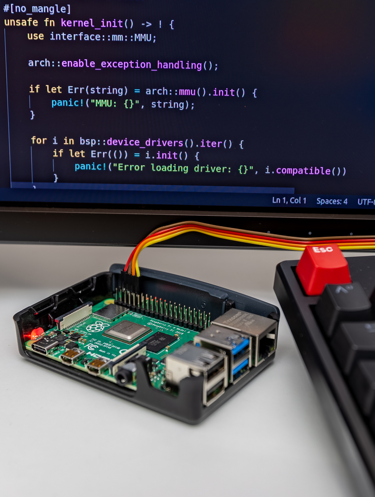
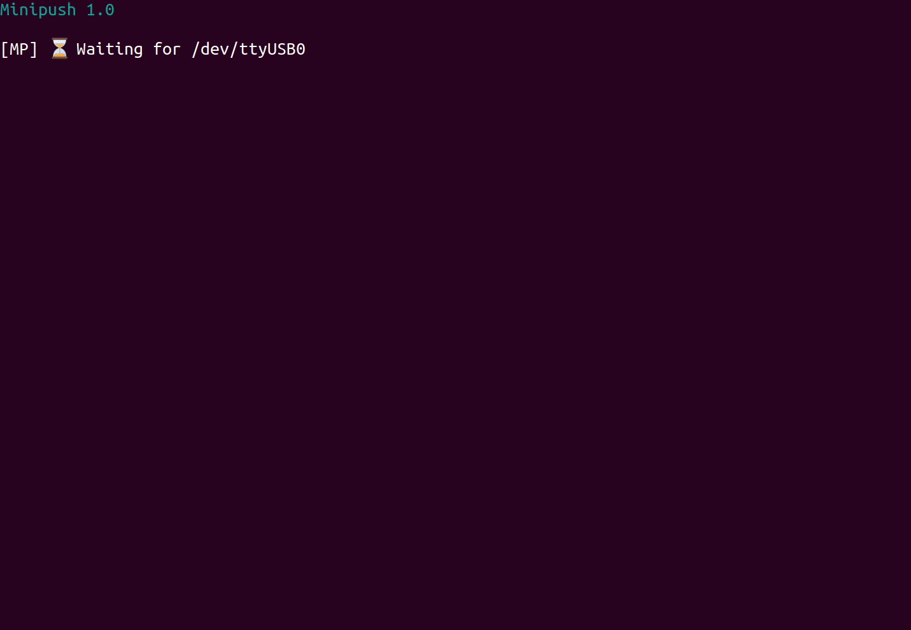
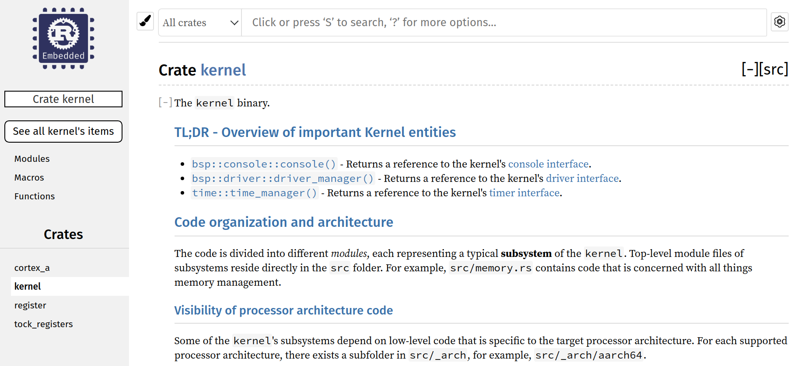
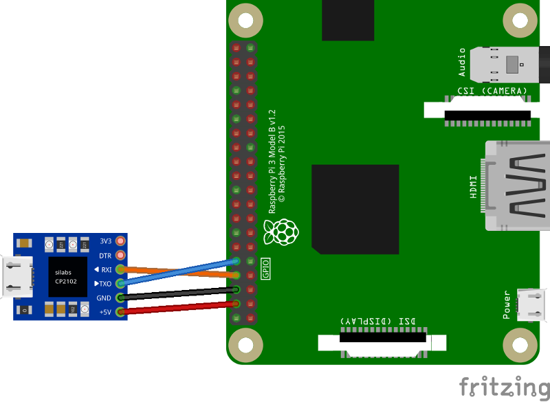

# Tutoriales de desarrollo de Sistemas Operativos en Rust con la Raspberry Pi

    

<br/>

 

## ℹ️ Introducción

Esto es una serie de tutoriales para los desarrolladores aficionados a los Sistemas Operativos (OS) 
que se están adentrando a la nueva arquitectura ARM de 64 bits [ARMv8-A
architecture]. Los tutoriales darán una guía paso a paso en cómo escribir un Sistema Operativo 
[monolítico] desde cero.
Estos tutoriales cubren la implementación común de diferentes tareas de Sistemas Operativos, como 
escribir en una terminal serie, configurar la memoria virtual y manejar excepciones de hardware (HW). 
Todo mientras usamos la seguridad y velocidad que `Rust` nos proporciona.

¡Divértanse!

_Atentamente, <br>Andre ([@andre-richter])_

P.S.: Para otros lenguajes, por favor busquen los diferentes archivos README. Por ejemplo, [`README.CN.md`](README.CN.md) o [`README.ES.md`](README.ES.md). Muchas gracias a nuestros
[traductores](#traducciones-de-este-repositorio) 🙌.

[ARMv8-A architecture]: https://developer.arm.com/products/architecture/cpu-architecture/a-profile/docs
[monolítico]: https://en.wikipedia.org/wiki/Monolithic_kernel
[@andre-richter]: https://github.com/andre-richter

## 📑 Estructura

- Cada tutorial contiene un solo binario arrancable correspondiente al núcleo.
- Cada tutorial nuevo extiende el tutorial anterior.
- Cada tutorial tendrá un `README` y cada `README` tendrá un pequeña sección de [`tl;dr`](https://es.wikipedia.org/wiki/TL;DR) en donde se dará una pequeña perspectiva general de los cambios y se mostrará el código fuente `diff` del tutorial anterior para que se puedan inspeccionar los cambios/adiciones que han ocurrido.
  - Algunos tutoriales además de tener un `tl;dr` también tendrán una sección en la que se dará una explicación con todo lujo de detalle.
     El plan a largo plazo es que cada tutorial tenga una buena explicación además del `tl;dr` y el `diff`; pero por el momento los únicos tutoriales
    que gozan de una son los tutoriales en los que creo que el `tl;dr` y el `diff` no son suficientes para comprender lo que está pasando.
- El código que se escribió en este tutorial soporta y corre en la **Raspberry Pi 3** y en la **Raspberry 4**
  - Del tutorial 1 hasta el 5 son tutoriales "preparatorios", por lo que este código solo tendrá sentido ejecutarlo en [`QEMU`](https://www.qemu.org/).
  - Cuando llegues al [tutorial 5](05_drivers_gpio_uart) podrás comenzar a cargar y a ejecutar el núcleo en una
    Raspeberry de verdad, y observar la salida serie (`UART`).
- Aunque la Raspberry Pi 3 y 4 son las principales placas este código está escrito en un estilo modular,
  lo que permite una fácil portabilidad a otras arquitecturas de CPU o/y placas.
  - Me encantaría si alguien intentase adaptar este código en una arquitectura **RISC-V**.
- Para la edición recomiendo [Visual Studio Code] con [Rust Analyzer].
- En adición al texto que aparece en los tutoriales también sería recomendable revisar 
  el comando `make doc` en cada tutorial. Este comando te deja navegar el código documentado de una manera cómoda.

### Salida del comando `make doc`



[Visual Studio Code]: https://code.visualstudio.com
[Rust Analyzer]: https://rust-analyzer.github.io

## 🛠 Requisitos del sistema

Estos tutoriales están dirigidos principalmente a distribuciones de **Linux**. 
Muchas de las cosas vistas aquí también funcionan en **macOS**, pero esto solo es _experimental_.

### 🚀 La versión tl;dr

1. [Instala Docker Desktop][install_docker].

2. (**Solo para Linux**) Asegúrate de que la cuenta de tu usuario está en el [grupo `docker`][docker group].

3. Prepara la `Rust` toolchain. La mayor parte se hará automáticamente durante el primer uso del archivo [rust-toolchain.toml](rust-toolchain.toml). 
   Todo lo que nos queda hacer a nosotros es: 
   
   i. Si ya tienes una versión de Rust instalada:
   
   ```bash
   cargo install cargo-binutils rustfilt
   ```
   
   ii. Si necesitas instalar Rust desde cero:
   
   ```bash
   curl --proto '=https' --tlsv1.2 -sSf https://sh.rustup.rs | sh
   
   source $HOME/.cargo/env
   cargo install cargo-binutils rustfilt
   ```

4. En caso de que uses `Visual Studio Code`, recomiendo que instales la extensión [Rust Analyzer extension].

5. (**Solo para macOS**) Instala algunas `Ruby` gems.
   
   Ejecuta esto en la carpeta root del repositorio:
   
   ```bash
   bundle install --path .vendor/bundle --without development
   ```

[docker group]: https://docs.docker.com/engine/install/linux-postinstall/
[Rust Analyzer extension]: https://marketplace.visualstudio.com/items?itemName=matklad.rust-analyzer

### 🧰 Más detalles: Eliminando Lios con Toolchains

Esta serie trata de enfocarse lo máximo posible en tener una experiencia agradable para el usuario.
Por lo tanto, se han dirigido muchos esfuerzos a eliminar la parte más difícil del desarrollo de
los sistemas incorporados (embedded) tanto como se pudo.

Rust por sí mismo ya ayuda mucho, porque tiene integrado el soporte para compilación cruzada.
Todo lo que necesitamos para compilar desde una máquina con una arquitectura `x86` a una Raspberry Pi
con arquitectura `AArch64` será automáticamente instalado por `rustup`. Sin embargo, además de usar
el compilador de Rust, también usaremos algunas otras herramientas, entre las cuales están:

- `QEMU` para emular nuestro núcleo en nuestra máquina principal.
- Una herramienta llamada `Minipush` para cargar el núcleo en una Raspberry Pi cuando queramos usando `UART`.
- `OpenOCD` y `GDB` para hacer depuración ("debugging") en la máquina a instalar.

Hay muchas cosas que pueden salir mal mientras instalamos y/o compilamos las versiones correctas de cada
herramienta en tu máquina. Por ejemplo, tu distribución de Linux tal vez podría no proporcionar las versiones más
recientes de paquetes que se necesiten. O tal vez te falten algunas dependencias para la compilar estas herramientas.

Esta es la razón por la cual usaremos [Docker][install_docker] mientras sea posible. Te
estamos proporcionando un contenedor que tiene todas las herramientas o dependencias preinstaladas.
Si quieres saber más acerca de Docker y revisar el contenedor proporcionado, por favor revisa la carpeta
[docker](docker) del repositorio.

[install_docker]: https://docs.docker.com/get-docker/

## 📟 Puerto Serie USB

Ya que el núcleo desarrollado en este tutorial se ejecuta en hardware real, se recomienda que tengas un adaptador de puerto serie USB cable para sentir la experiencia completa.

- Puedes encontrar estos cables que deberían funcionar sin ningún problema en [\[1\]] [\[2\]], pero
  hay muchos otros que pueden funcionar. Idealmente, tu cable estaría basado en el chip `CP2102`.
- Lo conectas a los pines `GND` y `GPIO` `14/15` como se muestra en la parte inferior.  
- [Tutorial 5](05_drivers_gpio_uart) es la primera vez en la que lo vas usar. Revisa las instrucciones
  sobre cómo preparar una tarjeta SD para arrancar en tu núcleo desde ahí.
- Empezando con el [tutorial 6](06_uart_chainloader), arrancar núcleos en tu Raspberry Pi comienza a ser
  más fácil. En este tutorial se desarrolla un `chainloader`, que será el último archivo que necesitarás
  copiar de manera manual a la tarjeta SD por el momento. Esto te permitirá cargar los núcleos de los tutoriales
  durante el arranque usando `UART`.



[\[1\]]: https://www.amazon.de/dp/B0757FQ5CX/ref=cm_sw_r_tw_dp_U_x_ozGRDbVTJAG4Q
[\[2\]]: https://www.adafruit.com/product/954

## 🙌 Agradecimientos

La versión original de estos tutoriales empezó como un fork de los increíbles 
[tutoriales de programación en hardware en la RPi3](https://github.com/bztsrc/raspi3-tutorial) en `C`
de [Zoltan Baldaszti](https://github.com/bztsrc). ¡Gracias por darme un punto de partida!

### Traducciones de este repositorio

- **Chino:**
  - [@colachg] y [@readlnh].
  - Necesitan actualizaciones.
- **Español:**
  - [@zanezhub].
  - En el futuro habrán tutoriales traducidos al español. 

[@colachg]: https://github.com/colachg
[@readlnh]: https://github.com/readlnh
[@zanezhub]: https://github.com/zanezhub

## Licencia

Este proyecto está licenciado por cualquiera de las siguientes licencias como alguna de tus dos opciones

- Apache License, Version 2.0, ([LICENSE-APACHE](LICENSE-APACHE) o http://www.apache.org/licenses/LICENSE-2.0)
- MIT license ([LICENSE-MIT](LICENSE-MIT) o http://opensource.org/licenses/MIT)

### Contribución

A menos de que lo menciones, cualquier contribución enviada por ti para su inclusión en este trabajo,
tal como se define en la licencia Apache-2.0, deberá tener doble licencia como se muestra en la parte superior, sin ningún
cambio de términos o condiciones.
